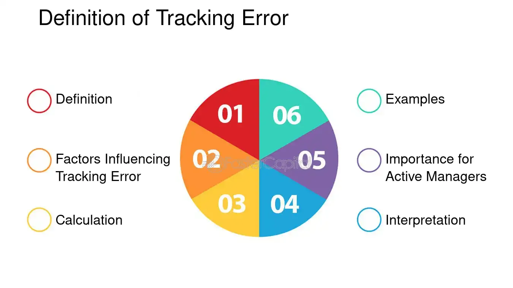

## Table of Contents

## What is tracking error in investment management?

Tracking error is a measure used in investment management to see how closely a portfolio follows its benchmark. It shows the difference between the returns of the portfolio and the returns of the benchmark. If a portfolio has a low tracking error, it means it is closely following its benchmark. A high tracking error means the portfolio is not following the benchmark very well.

This measure is important for investors who want their portfolio to perform similarly to a specific index or benchmark. For example, if you invest in an S&P 500 index fund, you expect it to have returns very close to the S&P 500. Tracking error helps investors understand how well the fund manager is doing in matching the benchmark's performance. It can also help in deciding if the costs of managing the portfolio are worth it, given how well it tracks the benchmark.

## How is tracking error calculated?

Tracking error is calculated by first finding the difference between the returns of the portfolio and the returns of the benchmark for each period, usually each month or each year. These differences are called the "active returns." Once you have the active returns for all the periods, you then calculate the standard deviation of these active returns. The standard deviation tells you how much the active returns vary from their average, and this standard deviation is what we call the tracking error.

For example, if a portfolio's returns are 5%, 6%, and 4% in three months, and the benchmark's returns are 4%, 5%, and 3% for the same months, the active returns would be 1%, 1%, and 1%. The average of these active returns is 1%, and the standard deviation of these active returns is 0%, meaning the tracking error is 0%. This shows the portfolio perfectly tracked the benchmark in this simple example. In real life, tracking errors are usually not zero because portfolios rarely match their benchmarks exactly every period.

## What does a high tracking error indicate?

A high tracking error means that a portfolio's returns are not following its benchmark very closely. It shows that the portfolio is doing something different from what the benchmark is doing. This can happen because the portfolio manager is choosing different investments or taking different risks than what the benchmark does.

If you see a high tracking error, it might mean the portfolio manager is trying to beat the benchmark by a lot. But it can also mean the portfolio is not doing what it's supposed to do if it's meant to closely follow the benchmark. So, a high tracking error can be good or bad, depending on what you want from your investment.

## What does a low tracking error indicate?

A low tracking error means that a portfolio is following its benchmark closely. This means the portfolio's returns are very similar to the benchmark's returns over time. If you're investing in something like an index fund that is supposed to mimic a specific index, like the S&P 500, a low tracking error is good because it shows the fund is doing what it's supposed to do.

For investors who want their investments to behave like the benchmark, a low tracking error is important. It shows that the portfolio manager is not making big changes or taking big risks that are different from the benchmark. This can be reassuring because it means the portfolio is likely to perform in a way that's predictable and in line with the benchmark's performance.

## What are the common factors that influence tracking error?

Several things can affect tracking error. One big thing is how the portfolio manager chooses investments. If they pick investments that are very different from the benchmark, the tracking error will be high. For example, if the benchmark is full of big company stocks but the portfolio has a lot of small company stocks, the returns will be different. Also, how often the portfolio is changed can affect tracking error. If the portfolio is changed a lot, it might not match the benchmark as well.

Another [factor](/wiki/factor-investing) is the costs of managing the portfolio. Fees and other costs can make the portfolio's returns lower than the benchmark's returns, which increases the tracking error. Also, how the market is doing can affect tracking error. If the market is going up and down a lot, it can be harder for the portfolio to follow the benchmark closely. So, things like how investments are picked, how often the portfolio changes, costs, and market conditions all play a role in tracking error.

## How does portfolio rebalancing affect tracking error?

Portfolio rebalancing means changing the investments in a portfolio to keep it in line with the original plan. When a portfolio is rebalanced, it can affect the tracking error. If the rebalancing makes the portfolio more like the benchmark, it can lower the tracking error. But if the rebalancing makes the portfolio less like the benchmark, it can increase the tracking error. So, how often and how much the portfolio is rebalanced can make a big difference in how closely it follows the benchmark.

Rebalancing can also cause the portfolio to have different returns than the benchmark, even if it's just for a short time. This is because buying and selling investments can lead to costs like trading fees, which can make the portfolio's returns different from the benchmark's returns. These costs can add up and make the tracking error higher. So, while rebalancing is important to keep the portfolio on track, it needs to be done carefully to keep the tracking error low.

## What role do transaction costs play in tracking error?

Transaction costs are the fees you pay when you buy or sell investments in a portfolio. These costs can make the portfolio's returns different from the benchmark's returns. When you have to pay these costs, it takes away from the money the portfolio could be making. This difference between the portfolio's returns and the benchmark's returns is what we call tracking error. So, if the transaction costs are high, they can make the tracking error higher because the portfolio is not able to match the benchmark as well.

It's important for portfolio managers to think about these costs when they are trying to keep the tracking error low. If they buy and sell investments a lot, the costs can add up and make it harder for the portfolio to follow the benchmark closely. This is why some funds that try to match a benchmark, like index funds, try to keep trading to a minimum. By doing this, they can keep the transaction costs low and help keep the tracking error low too.

## How can fund managers minimize tracking error?

Fund managers can minimize tracking error by choosing investments that are very similar to the ones in the benchmark. If the benchmark has a lot of big company stocks, the fund manager should also pick a lot of big company stocks. This helps the portfolio's returns match the benchmark's returns more closely. Also, they should not change the investments in the portfolio too often. Every time they buy or sell something, it costs money, and these costs can make the tracking error higher. So, keeping changes to a minimum can help keep the tracking error low.

Another way to minimize tracking error is by keeping the costs low. This means not only keeping transaction costs down but also keeping management fees low. If the portfolio has to pay a lot of fees, it will be harder for it to match the benchmark's returns. Fund managers can also use a technique called sampling, where they pick a smaller group of investments that act like the whole benchmark. This can be cheaper and easier to manage, which helps keep the tracking error low. By focusing on these things, fund managers can make sure their portfolio follows the benchmark as closely as possible.

## Can tracking error be used to assess the performance of passive investment strategies?

Yes, tracking error can be used to assess the performance of passive investment strategies. Passive strategies aim to match the performance of a benchmark, like an index, as closely as possible. Tracking error measures how well a portfolio does this by showing the difference between the portfolio's returns and the benchmark's returns. If a passive investment has a low tracking error, it means it's doing a good job of following the benchmark. This is important for investors who want their investments to behave like the index they are tracking.

However, a high tracking error in a passive strategy might mean something is wrong. It could be because of high costs, like fees for buying and selling investments, or because the portfolio manager is not choosing the right investments. A high tracking error can also happen if the portfolio is changed too often, which can make it hard to keep up with the benchmark. So, looking at the tracking error can help investors see if their passive investment is working the way it should.

## What are the implications of tracking error for investors in index funds?

Tracking error is really important for people who invest in index funds. These funds are supposed to copy the performance of a specific index, like the S&P 500. If the tracking error is low, it means the index fund is doing a good job of matching the index. This is what investors want because they are trying to get the same returns as the index. A low tracking error shows that the fund is working the way it should, and investors can feel confident that their money is being managed well.

On the other hand, a high tracking error can be a problem for index fund investors. It means the fund's returns are not following the index closely. This can happen because of costs like fees for buying and selling investments, or because the fund manager is [picking](/wiki/asset-class-picking) different investments than what's in the index. If the tracking error is high, investors might not get the returns they expect, and they might need to look for a different fund that does a better job of matching the index. So, keeping an eye on tracking error helps investors make sure their index fund is doing what it's supposed to do.

## How does tracking error vary across different asset classes?

Tracking error can be different for different types of investments, like stocks, bonds, or real estate. For stocks, tracking error can be lower because there are a lot of stock index funds that try to match big stock indexes like the S&P 500. These funds usually have a lot of the same stocks as the index, so they can follow it pretty closely. But if the fund manager picks different stocks or changes the fund a lot, the tracking error can go up.

For bonds, tracking error can be higher because the bond market is more complicated. Bond indexes can have a lot of different bonds, and it can be hard for a fund to buy all of them. So, bond funds might use something called sampling, where they pick a smaller group of bonds to try to match the index. This can make the tracking error higher because the fund's returns might not match the index as well. Also, the costs of buying and selling bonds can be higher, which can add to the tracking error.

For other asset classes like real estate or commodities, tracking error can be even higher. These markets can be less liquid, meaning it's harder to buy and sell investments quickly. This can make it harder for funds to match their benchmarks closely. Also, these markets can be more affected by things like economic changes or big events, which can make the tracking error go up. So, the type of investment can make a big difference in how much the tracking error might be.

## What advanced statistical methods are used to analyze tracking error in-depth?

To understand tracking error better, people use some advanced math methods. One common method is called regression analysis. This is where you look at how the portfolio's returns move compared to the benchmark's returns. By doing this, you can see if the portfolio is following the benchmark in a straight line or if it's doing something different. Another method is called time-series analysis. This helps you see how the tracking error changes over time. It can show if the tracking error is getting bigger or smaller and help you figure out why.

Another useful method is Monte Carlo simulation. This is where you use a computer to create a lot of different possible futures for the portfolio and the benchmark. By looking at all these different futures, you can get a better idea of how likely it is for the tracking error to be high or low. Lastly, there's something called factor analysis. This method helps you see what parts of the market, like different industries or sizes of companies, are causing the tracking error. By understanding these factors, you can make better choices about how to manage the portfolio to keep the tracking error low.

## What is Tracking Error?

Tracking error is a quantitative measure used in finance to assess the degree to which the performance of an investment portfolio differs from that of its benchmark index. Mathematically, tracking error is defined as the standard deviation of the difference between the portfolio's returns and the benchmark's returns. This measure serves as a critical indicator of active management performance within a portfolio.

### Definition and Formula

The mathematical formula for tracking error is expressed as follows:

$$
\text{Tracking Error} = \sqrt{\frac{1}{N-1} \sum_{i=1}^{N} (R_{p,i} - R_{b,i} - \overline{D})^2 }
$$

where:
- $R_{p,i}$ is the return of the portfolio at time $i$,
- $R_{b,i}$ is the return of the benchmark at time $i$,
- $\overline{D}$ is the average of the differences between the portfolio and benchmark returns over $N$ periods.

### Interpretation

A tracking error close to zero indicates that the portfolio closely aligns with the benchmark index, signifying relatively passive management. In contrast, a higher tracking error suggests a greater deviation from the benchmark, indicative of active management strategies being employed by the portfolio manager. Active fund managers may purposefully incur a higher tracking error in pursuit of outperforming the benchmark, indicating their strategy's aggressiveness or divergence from typical index-like performance.

### Evaluation of Performance

For investors and fund managers, understanding tracking error is essential for evaluating how effectively a portfolio is being managed relative to its benchmark. A low tracking error is not inherently favorable or unfavorable without context; it may be desired in passive strategies aiming to replicate the benchmark. Conversely, in actively managed portfolios, a higher tracking error might be pursued to achieve returns that exceed standard benchmark performance, albeit often with increased risk.

By analyzing the tracking error, stakeholders can form judgements on the consistency and predictability of a fund manager's strategies. Ultimately, tracking error complements other metrics to provide a nuanced view of investment performance, aiding in tactical decisions that align with investors' goals and risk tolerance levels.

## What is the difference between Ex-Post and Ex-Ante Tracking Error?

Ex-post tracking error, often referred to as realized tracking error, measures the historical deviations between a portfolio's returns and those of its benchmark index. It is calculated as the standard deviation of the differences in returns over a specified period. This metric provides tangible insights into how effectively a portfolio has mirrored the benchmark. By analyzing past performance, investors and portfolio managers can assess the accuracy and effectiveness of previous investment strategies and make informed decisions about maintaining or adjusting their current approach.

The formula to calculate ex-post tracking error is:

$$
\text{Ex-post Tracking Error} = \sqrt{\frac{1}{N-1} \sum_{i=1}^{N} (R_{p,i} - R_{b,i})^2}
$$

where $R_{p,i}$ represents the portfolio return for period $i$, $R_{b,i}$ represents the benchmark return for the same period, and $N$ is the number of periods.

Ex-ante tracking error, by contrast, is a predictive measure that estimates the potential deviation of a portfolio's returns from its benchmark in the future. It employs statistical models and assumptions about market conditions, asset correlations, and [volatility](/wiki/volatility-trading-strategies) to forecast the possible tracking error. This forward-looking approach aids in risk management and strategic planning, allowing investors to anticipate and mitigate potential discrepancies before they occur.

Calculating ex-ante tracking error often involves sophisticated risk models, incorporating variables such as expected returns, asset correlations, and volatility forecasts. Tools like Monte Carlo simulations or factor models are commonly used for these estimations.

Both ex-post and ex-ante tracking error are crucial for investment performance evaluation. Ex-post analysis validates the historical accuracy of portfolio management decisions, while ex-ante modeling helps strategize and prepare for future deviations, balancing past insights with future expectations. By leveraging both measures, portfolio managers can enhance decision-making processes and align portfolios more closely with investment objectives.

## What is the impact of tracking error on portfolio management?

Tracking error plays a crucial role in portfolio management, significantly influencing investment decisions and the construction of portfolios, particularly in passive management funds. These funds aim to mimic a benchmark index as closely as possible, thereby keeping tracking error at a minimum. The tracking error is calculated as the standard deviation of the difference in returns between the portfolio and its benchmark index:

$$

\text{Tracking Error} = \sqrt{\frac{1}{n-1} \sum_{i=1}^{n} (R_{p,i} - R_{b,i})^2} 
$$

Where $R_{p,i}$ represents the portfolio return and $R_{b,i}$ represents the benchmark return for time period $i$.

A high tracking error in a fund that purports to track an index may indicate that the portfolio requires adjustments or that the existing management strategy needs reevaluation. This discrepancy can arise due to active management decisions, such as altering the composition or weight of securities within the portfolio compared to the benchmark. Furthermore, factors such as management fees, transaction costs, and cash drag (excess cash holding reducing the overall portfolio return) can also contribute to increased tracking error.

Balancing tracking error is critical for aligning the portfolio with its investment goals and meeting investor expectations. This involves continuously monitoring and adjusting the portfolio to ensure that its performance remains consistent with the benchmark. By minimizing tracking error, fund managers can potentially deliver returns that more accurately reflect the indexed strategies, which is particularly important in passive investment approaches aimed at replicating market indices.

Fund managers strive to maintain an optimal level of tracking error that reflects their risk tolerance and return objectives. This involves a strategic assessment of how much deviation from the benchmark is acceptable, given the desired investment outcomes. Managing this balance effectively involves a trade-off between the cost of aligning a portfolio more closely with a benchmark and the potential benefits of active management that seeks to outperform the benchmark.

In conclusion, the management of tracking error is instrumental in ensuring that portfolio management strategies are both effective and aligned with their respective benchmarks' performance. It aids in the determination of whether a portfolio is succeeding in matching the benchmark returns or if strategic adjustments are necessary to better achieve the portfolio's investment objectives.

## What is Algorithmic Trading and how does it relate to Tracking Error?

In [algorithmic trading](/wiki/algorithmic-trading), tracking error plays a significant role in strategies designed to replicate indices accurately. This precision is crucial because even minute deviations from a benchmark can compound over time, affecting the overall portfolio performance. Algorithmic models are tailored to minimize tracking error through two main methodologies: effective trade execution and optimized portfolio rebalancing.

Effective trade execution is essential for reducing tracking error. Algorithms enable traders to execute orders at optimal prices and times, reducing slippage and market impact costs. By systematically processing large datasets, these algorithms can predict market movements and execute trades more efficiently than manual trading, maintaining closer alignment with the desired index.

Optimized portfolio rebalancing is another critical element in minimizing tracking error. Rebalancing involves realigning the portfolio's asset weights to match the index more precisely. This process often considers factors like changes in stock prices, index reconstitutions, and corporate actions. Algorithms can dynamically evaluate these factors and adjust the portfolio swiftly, ensuring minimal deviation from the benchmark.

Mathematically, tracking error ($TE$) is often calculated as the standard deviation of the difference between the portfolio returns ($R_p$) and the benchmark returns ($R_b$) over a given period:

$$
TE = \sqrt{\frac{1}{N-1} \sum_{i=1}^{N} (R_{p,i} - R_{b,i})^2 }
$$

Where $N$ represents the number of periods. This formula quantifies how consistently a portfolio tracks its benchmark, with lower values indicating closer alignment.

Reducing tracking error results in more reliable performance metrics, which provide better alignment with intended investment strategies. It is particularly significant for institutional investors who manage passive investment funds, as they need to demonstrate their ability to mirror the chosen benchmark accurately.

Integrating algorithmic solutions with tracking error analysis enhances trading efficiency and robustness. For instance, [machine learning](/wiki/machine-learning) algorithms can predict market trends, leading to better timing in trade executions and portfolio adjustments. Through continuous monitoring and automatic recalibration, these models adapt to market conditions, ensuring tracking error remains within acceptable limits.

Developers often implement these strategies using programming languages like Python due to its rich ecosystem for financial analysis and machine learning. A Python function to calculate tracking error, for example, might look like this:

```python
import numpy as np

def calculate_tracking_error(portfolio_returns, benchmark_returns):
    differences = portfolio_returns - benchmark_returns
    tracking_error = np.std(differences)
    return tracking_error

# Example usage:
portfolio_returns = np.array([0.02, 0.05, 0.03, 0.07])
benchmark_returns = np.array([0.01, 0.06, 0.02, 0.06])
print(calculate_tracking_error(portfolio_returns, benchmark_returns))
```

This function computes the standard deviation of the differences between portfolio and benchmark returns, offering a straightforward way to gauge tracking error. By incorporating such analysis into algorithmic trading frameworks, traders and fund managers can ensure that their strategies align closely with investment goals, fostering more predictable and optimal financial outcomes.

## References & Further Reading

[1]: De Prado, M. L. (2018). ["Advances in Financial Machine Learning"](https://www.amazon.com/Advances-Financial-Machine-Learning-Marcos/dp/1119482089). Wiley.

[2]: Chan, E. P. (2008). ["Quantitative Trading: How to Build Your Own Algorithmic Trading Business"](https://github.com/ftvision/quant_trading_echan_book). Wiley.

[3]: Aronson, D. R. (2007). ["Evidence-Based Technical Analysis: Applying the Scientific Method and Statistical Inference to Trading Signals"](https://onlinelibrary.wiley.com/doi/book/10.1002/9781118268315). Wiley.

[4]: Jansen, S. (2020). ["Machine Learning for Algorithmic Trading: Predictive Models to Extract Signals of Market Movements with Python"](https://www.nature.com/articles/s41598-024-77101-6). Packt.

[5]: Bergstra, J., Bardenet, R., Bengio, Y., & Kégl, B. (2011). ["Algorithms for Hyper-Parameter Optimization"](https://proceedings.neurips.cc/paper/2011/file/86e8f7ab32cfd12577bc2619bc635690-Paper.pdf). Advances in Neural Information Processing Systems.