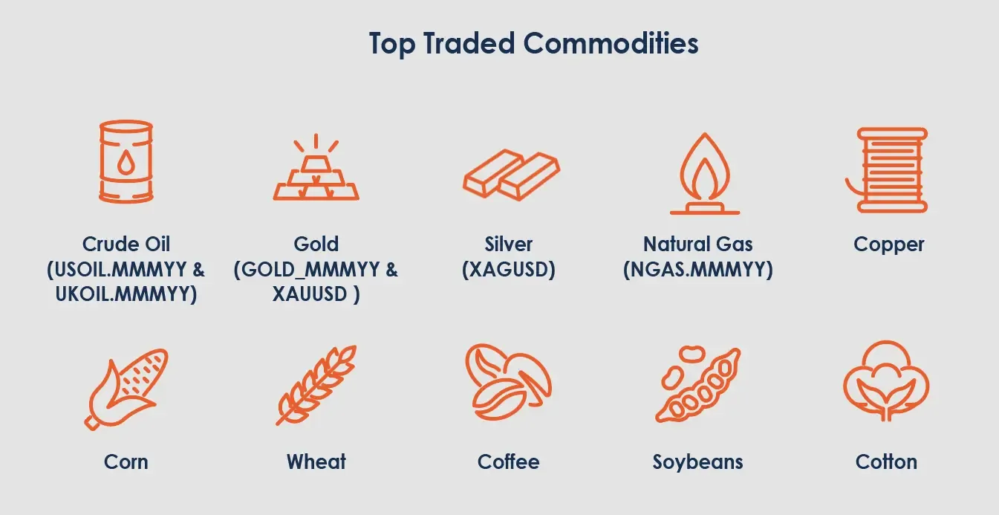

## Table of Contents

## What are tradable commodities?

Tradable commodities are goods that can be bought and sold on the market. These goods are usually raw materials or primary products that are used in making other goods. Examples include oil, gold, wheat, and coffee. People and companies trade these commodities because they need them for their businesses or because they think the price will go up and they can make money.

There are many places where commodities can be traded, like commodity exchanges. These are special markets where buyers and sellers come together to trade. The prices of commodities can change a lot because of things like weather, politics, or how much people want the commodity. Trading commodities can be risky, but it can also be a way for people to make money or get the things they need for their businesses.

## What are the main categories of commodities?

Commodities are divided into two main categories: hard commodities and soft commodities. Hard commodities are natural resources that are mined or extracted from the earth. Examples include oil, natural gas, gold, and copper. These commodities are often used in industries like energy and manufacturing. The prices of hard commodities can be affected by things like how much is available, the cost of getting them out of the ground, and what's happening in the world.

Soft commodities are agricultural products that are grown or raised. This category includes things like wheat, corn, cotton, and livestock. Soft commodities are influenced by factors such as weather, farming practices, and how much people want to buy them. Because they come from farming, the supply of soft commodities can change from year to year, which can make their prices go up and down a lot.

## How do commodities function within the global economy?

Commodities play a big role in the global economy. They are the basic things that countries need to make other products and keep their economies going. For example, oil is used to make gasoline, which people use to drive cars and move goods around the world. When the price of oil goes up, it can make the price of everything else go up too, because it costs more to move things. Countries that have a lot of commodities, like oil or gold, can sell them to other countries and make money. This can help their economies grow.

Commodities also help countries trade with each other. When one country has a lot of one commodity, like wheat, it can sell it to another country that doesn't have enough. This can help both countries. The country selling the wheat makes money, and the country buying it gets the food it needs. But, the prices of commodities can change a lot. If the price of a commodity goes up, it can be good for the country selling it, but bad for the country buying it. If the price goes down, it can be the opposite. So, commodities can affect the global economy in many ways.

## What are some examples of agricultural commodities?

Agricultural commodities are things that farmers grow or raise. Some examples are wheat, corn, and rice. These are grains that people all over the world eat. They are important because they can be turned into many different foods, like bread, tortillas, and noodles. Farmers also grow soybeans, which are used to make oil and animal feed. Cotton is another agricultural commodity; it's used to make clothes and other fabrics.

There are also fruits and vegetables that are considered agricultural commodities. For example, apples, oranges, and tomatoes are grown in many places and sold around the world. These can be eaten fresh or used to make other products like juice and sauce. Livestock, like cows, pigs, and chickens, are also agricultural commodities. They provide meat, milk, and eggs, which are important parts of many people's diets.

These commodities are traded on markets, and their prices can change because of things like weather, how much people want them, and how much is available. When there's a lot of a commodity, the price might go down. But if there's not enough, the price can go up. This can affect farmers and the people who buy these commodities.

## How are energy commodities different from other types of commodities?

Energy commodities are different from other types of commodities because they are mainly used to make energy. Examples of energy commodities are oil, natural gas, and coal. These are called hard commodities because they come from the earth. They are very important because they help run cars, heat homes, and power factories. Without energy commodities, many things in our daily lives would not work.

Other types of commodities, like agricultural commodities, are things that we eat or use to make clothes. These are called soft commodities because they are grown or raised. Examples include wheat, corn, and cotton. The big difference is that energy commodities are used to make energy, while soft commodities are used to make food and other products. Both types of commodities are important, but they serve different purposes in our lives and in the economy.

## What role do metal commodities play in industrial applications?

Metal commodities like copper, iron ore, and aluminum are very important in industry. They are used to make things like cars, buildings, and machines. Copper is used in wires because it is good at carrying electricity. Iron ore is turned into steel, which is strong and used in construction. Aluminum is light but strong, so it's used in airplanes and cars. These metals help industries make products that people use every day.

The prices of metal commodities can affect industries a lot. If the price of a metal goes up, it can cost more to make things, and this can make the price of the final product go up too. For example, if the price of copper goes up, it can make the price of electrical wires go up. Companies that use a lot of metal have to think about these prices when they plan how to make their products. Metal commodities are a big part of the economy because they help industries work and grow.

## How are commodity prices determined?

Commodity prices are determined by how much people want to buy a commodity and how much of it is available. If a lot of people want to buy a commodity but there isn't much of it, the price will go up. This is called demand and supply. For example, if there's a bad harvest and less wheat is available, the price of wheat might go up because people still need it for food. On the other hand, if there's a lot of a commodity and not many people want to buy it, the price will go down.

Other things can also affect commodity prices. Weather can change how much of a commodity is available. For example, too much rain can ruin crops, making less food available and pushing prices up. Politics and world events can also make prices change. If there's a war in a country that produces oil, it might be harder to get oil, so the price can go up. Traders and investors also play a role. They buy and sell commodities hoping to make money, and their actions can move prices up or down.

## What are commodity futures and how do they work?

Commodity futures are agreements to buy or sell a commodity at a set price on a future date. They are traded on special markets called futures exchanges. People use futures to protect themselves from big changes in commodity prices. For example, a farmer might sell wheat futures to make sure they get a good price for their wheat, even if the price goes down later. On the other hand, a company that needs wheat might buy futures to make sure they can get wheat at a good price, even if the price goes up later.

Futures work by locking in prices ahead of time. When someone buys a futures contract, they agree to buy the commodity at the price set in the contract, no matter what happens to the market price later. The same goes for the seller; they agree to sell at that price. This can be helpful for planning and budgeting, but it can also be risky. If the market price goes up a lot, the buyer of the futures contract gets the commodity cheaper than the market price, which is good for them. But if the market price goes down a lot, the seller of the futures contract has to sell at a higher price than the market, which can be bad for them.

## What are the risks associated with trading commodities?

Trading commodities can be risky because the prices can change a lot. Things like weather, politics, and how much people want a commodity can make the price go up or down quickly. For example, if there's a drought and less wheat is grown, the price of wheat might go up. But if a new oil field is found, the price of oil might go down. Traders need to watch these things carefully because big price changes can mean they lose money.

Another risk is using futures contracts. Futures are agreements to buy or sell a commodity at a set price in the future. They can help protect against price changes, but they can also be risky. If the market price goes up a lot, the person who bought the futures contract gets the commodity cheaper than the market price, which is good. But if the market price goes down a lot, the person who sold the futures contract has to sell at a higher price than the market, which can be bad. So, traders need to be careful and understand these risks before they start trading commodities.

## How can someone start trading commodities?

To start trading commodities, you first need to learn about the different types of commodities, like oil, gold, wheat, and coffee. You should also understand how their prices can change because of things like weather, politics, and how much people want them. Once you have a good understanding, you can open an account with a broker that lets you trade commodities. Some brokers have special platforms just for trading commodities, so you might want to look for one of those.

After you have an account, you can start trading. You can buy and sell commodities directly, or you can trade futures contracts, which are agreements to buy or sell a commodity at a set price in the future. Trading futures can help protect you from big price changes, but it can also be risky. It's a good idea to start small and learn as you go. You might also want to talk to someone who knows a lot about trading commodities to get some advice.

## What advanced strategies are used in commodity trading?

In commodity trading, one advanced strategy is called hedging. Hedging is when a trader uses futures contracts to protect against big price changes. For example, a farmer might sell wheat futures to make sure they get a good price for their wheat, even if the price goes down later. This way, they can plan better and not lose money if the market changes. But hedging can be tricky because if the market price goes up a lot, the farmer might miss out on making more money.

Another strategy is called spread trading. This is when a trader buys one futures contract and sells another at the same time. The idea is to make money from the difference in prices between the two contracts. For example, a trader might buy a futures contract for oil that will be delivered in one month and sell a contract for oil that will be delivered in three months. If the price difference between the two contracts changes in the right way, the trader can make money. Spread trading can be less risky than just buying or selling one contract, but it still needs a lot of understanding of the market.

Technical analysis is also a common strategy in commodity trading. This involves looking at past price data and using charts to try to predict future price movements. Traders might use tools like moving averages, support and resistance levels, and other indicators to help them decide when to buy or sell. While technical analysis can help traders make better decisions, it's not perfect and can still lead to losses if the market doesn't move the way the trader expects.

## How do geopolitical events influence commodity markets?

Geopolitical events can have a big impact on commodity markets. These events, like wars, trade disagreements, or new laws, can change how much of a commodity is available and how much it costs. For example, if there's a war in a country that makes a lot of oil, it might be harder to get oil from that country. This can make the price of oil go up because there's less of it to go around. Also, if two countries can't agree on trade and put up barriers, it can make it harder to move commodities from one place to another, which can also affect prices.

Another way geopolitical events can influence commodity markets is by changing how much people want certain commodities. For example, if a country puts new rules on using certain types of energy, like coal, it can make people want to use other types of energy instead, like natural gas. This can make the price of natural gas go up because more people want it. Also, if a big country like China decides to buy a lot more of a commodity like copper, it can make the price of copper go up because there's more demand for it. So, geopolitical events can change both how much of a commodity is available and how much people want it, which can move prices in big ways.

## References & Further Reading

[1]: ["Advances in Financial Machine Learning"](https://www.amazon.com/Advances-Financial-Machine-Learning-Marcos/dp/1119482089) by Marcos Lopez de Prado

[2]: ["Evidence-Based Technical Analysis: Applying the Scientific Method and Statistical Inference to Trading Signals"](https://www.amazon.com/Evidence-Based-Technical-Analysis-Scientific-Statistical/dp/0470008741) by David Aronson

[3]: ["Machine Learning for Algorithmic Trading"](https://github.com/PacktPublishing/Machine-Learning-for-Algorithmic-Trading-Second-Edition) by Stefan Jansen

[4]: ["Quantitative Trading: How to Build Your Own Algorithmic Trading Business"](https://www.amazon.com/Quantitative-Trading-Build-Algorithmic-Business/dp/1119800064) by Ernest P. Chan

[5]: Bergstra, J., Bardenet, R., Bengio, Y., & Kégl, B. (2011). ["Algorithms for Hyper-Parameter Optimization."](https://dl.acm.org/doi/10.5555/2986459.2986743) Advances in Neural Information Processing Systems 24.