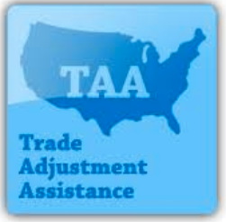

## Table of Contents

## What is the Trade Adjustment Assistance Program?

The Trade Adjustment Assistance Program, often called TAA, is a program run by the U.S. government to help workers who lose their jobs because of foreign trade. It provides money and support to help these workers find new jobs or learn new skills. The program helps people who worked in industries that are affected by imports or shifts in production to other countries.

TAA offers several types of help. It can pay for training in new careers, give money while workers look for new jobs, and even help with moving expenses if a worker needs to relocate for a new job. The goal is to make it easier for workers to adjust to changes in the economy caused by international trade. By offering these services, TAA aims to help workers get back on their feet and find stable employment.

## Who is eligible for the Trade Adjustment Assistance Program?

Workers can get help from the Trade Adjustment Assistance Program if they lost their jobs because of foreign trade. This means their company might have closed or moved jobs to another country, or their industry might be struggling because of imports. To be eligible, workers need to be part of a group that the U.S. Department of Labor says was affected by trade. This group usually includes people who worked in manufacturing or other industries hit hard by international competition.

Once a group is approved, individual workers in that group can apply for help. They need to show they were part of the affected group and lost their job because of it. The program can help with things like paying for job training, giving money while looking for a new job, and even helping with moving costs if a new job is far away. The goal is to help these workers find new jobs and adjust to changes in the economy caused by trade.

## How does one apply for the Trade Adjustment Assistance Program?

To apply for the Trade Adjustment Assistance Program, first find out if your group of workers has been approved by the U.S. Department of Labor. This happens when a company or industry is affected by foreign trade, like when jobs move to other countries or when imports hurt the business. If your group is approved, you can start the application process. You'll need to contact your state's TAA office or the Rapid Response team, who can help you with the paperwork and guide you through the steps.

Once you start the application, you'll need to show that you were part of the approved group and lost your job because of it. You'll fill out forms and provide documents like your job history and proof of your layoff. The TAA office will review your application and, if approved, you can start getting help. This help can include money while you look for a new job, paying for job training, and even help with moving costs if you need to relocate for a new job. The goal is to help you find new work and adjust to changes in the economy caused by trade.

## What benefits does the Trade Adjustment Assistance Program offer?

The Trade Adjustment Assistance Program, or TAA, helps workers who lost their jobs because of foreign trade. It gives them money while they look for new jobs. This money is called Trade Readjustment Allowances, and it can help pay bills while they are out of work. TAA also helps with health insurance costs, so workers can keep their health care even if they don't have a job.

Another big part of TAA is job training. The program pays for classes and training to help workers learn new skills for different jobs. This can be really important if their old job is gone because of trade. TAA can also help with moving costs if a worker needs to move to a new place for a job. The goal is to help workers find new, stable jobs and adjust to changes in the economy caused by trade.

## How is the Trade Adjustment Assistance Program funded?

The Trade Adjustment Assistance Program is funded by the U.S. government. The money comes from the federal budget, which is approved by Congress. This means that taxpayers help pay for the program through their taxes. The funding is part of a larger effort to help workers who lose their jobs because of foreign trade.

The program's budget is set each year, and it can change based on what Congress decides. The money is used to pay for things like job training, money while workers look for new jobs, and help with moving costs. The goal is to make sure there is enough money to help as many workers as possible who are affected by trade changes.

## What is the history behind the Trade Adjustment Assistance Program?

The Trade Adjustment Assistance Program, or TAA, started in the United States in 1962. It was created because people saw that trade with other countries was causing some workers to lose their jobs. The idea was to help these workers by giving them money and training to find new jobs. At first, TAA was mostly for workers in manufacturing, but over time, it grew to help more types of workers.

Over the years, the program has changed a lot. Congress has made it bigger and smaller at different times, depending on what was happening with trade and the economy. In 2002, TAA was expanded to help more workers, including those in the service industry. The program has always tried to help workers adjust to changes in the economy caused by trade, but how much help it gives and who it helps has changed over time.

## How does the Trade Adjustment Assistance Program impact the economy?

The Trade Adjustment Assistance Program helps the economy by supporting workers who lose their jobs because of trade. When these workers get help finding new jobs or learning new skills, they can start working again sooner. This means they can spend money and help the economy grow. If workers didn't get this help, they might stay out of work longer, which could slow down the economy.

The program also helps businesses by making sure there are trained workers ready for new jobs. When companies can find workers with the right skills, they can grow and create more jobs. This is good for the economy because more jobs mean more people working and spending money. Overall, the Trade Adjustment Assistance Program helps keep the economy strong by supporting workers and businesses during times of change.

## Can the Trade Adjustment Assistance Program be used in conjunction with other government programs?

Yes, the Trade Adjustment Assistance Program can be used with other government programs. This means that workers who lose their jobs because of trade can get help from TAA and also from other programs at the same time. For example, they might get help from unemployment benefits while they are also getting job training from TAA. This can make it easier for them to find new work and adjust to changes in the economy.

Using TAA with other programs can give workers more support. They might get money from different places to help them while they look for a new job. Or they might get health insurance help from one program and job training from TAA. This way, workers can use all the help they can get to find new, stable jobs and keep their lives on track.

## What are the success rates of participants in the Trade Adjustment Assistance Program?

The success of the Trade Adjustment Assistance Program varies, but overall, it has helped many workers find new jobs. Studies show that people who use TAA are more likely to get new jobs than those who don't. For example, one study found that about 60% to 70% of TAA participants found new work within a year. This is higher than the success rate for people who only used unemployment benefits.

The program's success can also be seen in how much money participants earn after finding new jobs. Many workers who go through TAA training end up making more money than before. This is because the training helps them learn new skills that are in demand. However, not everyone who joins TAA finds success. Some people struggle to finish the training or find jobs that match their new skills. Still, the program has made a big difference for many workers who needed help because of trade changes.

## How does the Trade Adjustment Assistance Program adapt to changes in trade policies?

The Trade Adjustment Assistance Program changes over time to match new trade policies. When trade laws change, like when countries make new trade deals or put up new trade barriers, TAA has to adjust. This means the program might help more or different kinds of workers. For example, if a new trade deal causes more factories to close, TAA might expand to help those workers find new jobs or learn new skills.

Congress decides how TAA changes. They look at what is happening with trade and the economy, then they might make the program bigger or smaller. Sometimes, they add new kinds of help, like more money for training or help with health insurance. This way, TAA can keep helping workers who lose their jobs because of trade, no matter how trade policies change.

## What are the criticisms and challenges faced by the Trade Adjustment Assistance Program?

Some people say the Trade Adjustment Assistance Program does not help enough. They think it is hard to get into the program because it takes a long time to get approved. Also, the training it offers might not always lead to good jobs. Some workers finish the training but still can't find work that pays well. Critics also say that the money given to workers while they look for jobs is not enough to live on, especially if it takes a long time to find a new job.

Another challenge is that the program can be hard to use with other help programs. Workers might get confused about which program to use or how to get help from more than one program at the same time. Also, the TAA program changes a lot, so it can be hard for workers to know what help they can get. Some people think the government should make the program easier to use and give more help to workers who need it.

## What future developments are expected for the Trade Adjustment Assistance Program?

The Trade Adjustment Assistance Program might change in the future to help more workers who lose their jobs because of trade. As trade deals and policies keep changing, TAA could get bigger or smaller. It might start helping more types of workers, not just those in manufacturing. The program could also offer new kinds of help, like more money for training or better support for finding jobs. Congress will decide these changes based on what is happening with trade and the economy.

One big hope for TAA is that it will become easier to use. Right now, it can be hard for workers to get into the program and get the help they need. In the future, the program might be simpler to join and use. It could also work better with other help programs, so workers can get all the support they need without getting confused. The goal is to make sure TAA keeps helping workers find new jobs and adjust to changes in the economy caused by trade.

## References & Further Reading

[1]: ["Advances in Financial Machine Learning"](https://www.amazon.com/Advances-Financial-Machine-Learning-Marcos/dp/1119482089) by Marcos Lopez de Prado

[2]: ["Evidence-Based Technical Analysis: Applying the Scientific Method and Statistical Inference to Trading Signals"](https://www.amazon.com/Evidence-Based-Technical-Analysis-Scientific-Statistical/dp/0470008741) by David Aronson

[3]: ["Machine Learning for Algorithmic Trading"](https://github.com/stefan-jansen/machine-learning-for-trading) by Stefan Jansen

[4]: ["Quantitative Trading: How to Build Your Own Algorithmic Trading Business"](https://www.amazon.com/Quantitative-Trading-Build-Algorithmic-Business/dp/1119800064) by Ernest P. Chan

[5]: Decker, P., Bailey, T., & Epstein, S. (2011). ["The Effects of Trade Adjustment Assistance on Displaced Workers: Evidence from the Midwest States."](https://pmc.ncbi.nlm.nih.gov/articles/PMC10560607/) National Bureau of Economic Research.