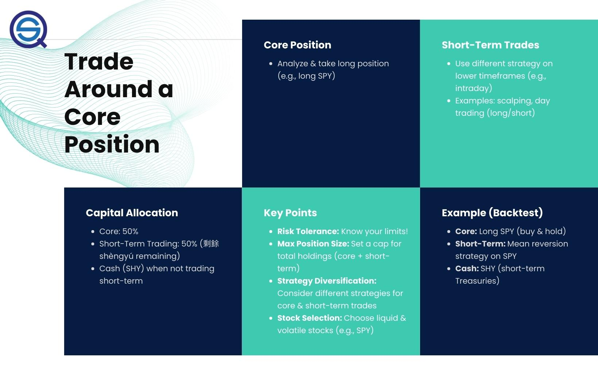

Trading around a core position is a strategic approach used in algorithmic trading that integrates both long-term and short-term trading elements to maximize returns. This method holds particular significance in today's volatile financial markets, where rapid changes often necessitate adaptive trading strategies.

Algorithmic trading has profoundly transformed modern trading practices by enabling high-frequency, data-driven decision-making processes. Through the use of sophisticated algorithms and computer programs, traders can execute strategies with speed and precision, mitigating the impact of human error and emotion. Notably, the development of software platforms and applications allows traders to analyze large datasets and identify patterns, offering a strategic edge over traditional trading methods.



The core position is a central component of this strategy, representing a long-term investment stake from which a trader can execute additional short-term trades. This approach not only provides stability but also allows traders to capitalize on market fluctuations around this stable position. By leveraging the inherent market cycles, traders can engage in buying or selling actions that enhance profitability while maintaining a consistent market presence.

Enhancing profitability through trading around a core position involves taking advantage of short-term price movements without comprising the overall long-term investment strategy. For instance, a trader could maintain a core holding in a promising tech stock while engaging in short-term trades, such as swing trading, to benefit from price volatility. This tactful maneuvering around core investments helps in managing risk and improving overall return profiles.

In essence, as financial markets continue to evolve at a rapid pace, the adoption of trading strategies that blend tactical and strategic elements, such as trading around a core position, becomes crucial. This not only allows traders to optimize their responses to market conditions but also lays the groundwork for improved risk management and sustained returns, supported extensively by the capabilities unleashed through algorithmic trading.

## Table of Contents

## What Does 'Trade Around a Core Position' Mean?

Trading around a core position is a nuanced strategy adopted by traders seeking to maximize returns by taking advantage of short-term market fluctuations while maintaining a fundamental, long-term investment posture. At its core, this strategy involves holding a primary investment, or core position, in a particular asset over an extended period. Concurrently, traders execute additional buy and sell transactions to capture gains from short-term price movements. This approach allows investors to benefit from both strategic long-term growth and tactical short-term profits.

### Application in Different Markets

The concept of trading around a core position is versatile and applicable across a variety of financial markets, such as stocks, futures, exchange-traded funds (ETFs), and cryptocurrencies. In the stock market, investors might hold a position in a fundamentally strong company and engage in short-term trades based on earnings reports or macroeconomic indicators. In futures markets, traders often hold a core position in commodities like oil or gold and exploit [volatility](/wiki/volatility-trading-strategies) caused by supply-demand imbalances or geopolitical developments. ETFs offer a diversified basket of securities, allowing traders to ride broader market trends while also engaging in sector rotation or rebalancing based on identified opportunities. In the [cryptocurrency](/wiki/cryptocurrency) space, traders can maintain a core position in major coins such as Bitcoin or Ethereum and trade around speculative news events or technical chart patterns.

### Balancing Long-term and Short-term Trading

The balance between long-term and short-term trading within this strategy is crucial for its success. Long-term positions are often selected based on [fundamental analysis](/wiki/fundamental-analysis), reflecting an investor’s belief in the underlying asset's sustainable growth potential. Conversely, short-term trades are typically informed by technical analysis, capitalizing on market sentiment and volatility. By maintaining this dual approach, traders can enhance the overall performance of their portfolio.

### Diversifying Across Time Frames

Diversifying across time frames is an essential component of trading around a core position. This strategy not only involves varying the duration of trades but also diversifying their execution across different time scales—from intraday swings to holding positions over several months. Such diversification aims to reduce risk by spreading exposure across multiple time periods, helping mitigate the impact of adverse price movements that may affect shorter time frames. For instance, a trader may execute day trades based on short-term price patterns while keeping the core position intact for targeted long-term growth.

In summary, the strategy of trading around a core position is deeply embedded in modern financial markets, offering a structured approach to synchronize long-term investment goals with short-term profit tactics. This blend of strategies, applicable across diverse market sectors, provides traders with flexibility and opportunities to improve their overall portfolio performance.

## The Strategy in Action

Trading around a core position involves a dynamic strategy where traders maintain a central investment or stock, while strategically buying and selling additional quantities to enhance overall profitability. This method integrates long-term investment stability with the flexibility of short-term trading, allowing traders to capitalize on market volatility across various timeframes.

### Step-by-Step Implementation

1. **Determine the Core Position**: The first step is selecting a core investment that aligns with long-term goals and market analysis. This usually involves a stock or asset with strong fundamentals and growth potential. For instance, a trader may choose a blue-chip stock or a leading cryptocurrency as the core position, intending to hold it for a prolonged period.

2. **Analyze Market Conditions**: Before engaging in trades around the core position, it is crucial to assess market conditions using both technical analysis (such as moving averages and MACD indicators) and fundamental analysis (like earnings reports and economic data). These insights guide the timing and size of trades.

3. **Identify Trading Opportunities**: Opportunities for additional trades arise when there are distinguishable trends or patterns. This can involve swing trading, where trades last from a few days to several weeks, or more rapid intraday trading, which entails executing trades within the same trading day to exploit short-term trends or news events.

4. **Execute Trades on Varying Timeframes**: 
   - **Swing Trading Example**: A trader holding a core position in a tech stock observes a breakout pattern and purchases additional shares as the breakout occurs, planning to sell once the stock reaches a predetermined resistance level.
   - **Intraday Trading Example**: On an earnings release day for the same tech stock, the trader might rapidly buy and sell shares multiple times to take advantage of heightened volatility and volume swings.

5. **Simultaneous Long and Short Plays**: This strategy allows for hedging against potential downturns. If the trader anticipates short-term market weakness but maintains long-term confidence in the core position, they might short the asset temporarily. Such an approach helps mitigate risks without liquidating the core position. This can be coded using a basic strategy in Python, for example:

   ```python
   import pandas as pd

   # Simulate trading signals
   data = {'Price': [105, 108, 107, 110, 115], 'Signal': ['Hold', 'Buy', 'Sell', 'Short', 'Cover']}
   df = pd.DataFrame(data)

   # Process trades
   core_position = 100  # Initial core position
   for index, row in df.iterrows():
       if row['Signal'] == 'Buy':
           core_position *= 1.1  # example logic for adding to position
       elif row['Signal'] == 'Sell':
           core_position *= 0.9  # example logic for reducing position
       elif row['Signal'] == 'Short':
           core_position *= 0.95  # example logic for shorting
       print(f"After {row['Signal']} at price {row['Price']}, position is now: {core_position}")
   ```

This framework demonstrates how a trader can maintain flexibility within the confines of a core portfolio, taking advantage of short-term price movements without disrupting long-term investment strategies. The simultaneous execution of long and short plays affords the trader the agility required to navigate volatile markets efficiently. Such strategic planning enhances the potential for realizing enhanced returns while maintaining disciplined control over the risk levels associated with the core investment.

## Core Position: Understanding and Setting Up

A core position represents a foundational investment holding around which additional trading activities are conducted. In trading strategies, particularly in [algorithmic trading](/wiki/algorithmic-trading), a core position serves as the stable element amidst various transient trades. Its importance lies in establishing a foundation that reflects the trader's long-term market view, on top of which dynamic trading actions can be executed to capitalize on market fluctuations.

### Criteria for Choosing a Core Position

Selecting a core position effectively requires a combination of fundamental and technical analysis to ensure stability and potential growth. Fundamentally, a core position should be established in assets with strong market fundamentals, such as solid earnings, consistent growth, and competitive advantages in their industry. Technical analysis is also crucial, where indicators like moving averages, trend lines, and support and resistance levels can guide the selection to ensure the core position lies within a favorable market trend.

Mathematically, a core position could be expressed in asset allocation by maintaining a fixed proportion $C$ of the total portfolio value $P$ in the core asset, while the remaining portion $(1-C)$ is allocated to shorter-term trades. This can be represented as:

$$
P_{\text{core}} = C \times P
$$

Where $P_{\text{core}}$ is the value allocated to the core position.

### Impact on Long-term Market Sentiment

Core positions can significantly influence long-term market sentiment, acting as a stabilizing force within an investment portfolio. They reflect investor confidence in specific sectors or assets, often providing a buffer against market volatility. As investors hold onto these positions over extended periods, they can contribute to a perception of market stability, potentially attracting further investment and reducing volatility.

### Managing Core Positions with Short-term Trades

Effective management of core positions alongside short-term trades involves a strategic approach to timing and risk management. Traders can hold the core position steady, while executing short-term trades to take advantage of market movements. These trades should ideally be smaller in size compared to the core position, to avoid excessive risk exposure. 

Short-term trades can be guided by fast-moving indicators like stochastic oscillators or MACD (Moving Average Convergence Divergence) signals, allowing for quick decision-making without altering the core position significantly. Proper logging and analysis of these trades using software tools or coding (e.g., in Python) can assist in maintaining the balance and identifying patterns. Here's a simple example of tracking trade performance:

```python
import pandas as pd

# Example of trade data
trade_data = {
    'Date': ['2023-01-01', '2023-02-01', '2023-03-01'],
    'Trade_Type': ['Buy', 'Sell', 'Buy'],
    'Price': [150, 155, 145],
    'Shares': [100, 100, 100]
}

# Create DataFrame
df = pd.DataFrame(trade_data)

# Calculate the gain/loss for each trade
df['Value'] = df['Price'] * df['Shares']
df['PnL'] = df['Value'].diff().fillna(0)

print(df)
```

Ultimately, the management of core positions with short-term trades allows traders to maintain a balance between the stability offered by long-term investments and the potential profitability from short-term market movements. This balance can help mitigate risk while maximizing opportunity, a strategy that becomes increasingly relevant in today's algorithm-driven markets.

## The Benefits of Trading Around a Core Position

Trading around a core position offers notable advantages in terms of profitability and diversification, which are crucial for active investors seeking steady growth with managed risks. This strategy integrates the benefits of both long-term stability and short-term agility, fostering an environment where traders can effectively respond to market dynamics.

Profitability is one of the primary appeals of trading around a core position. By maintaining a core holding in a security or asset and executing additional trades that exploit short-term market movements, traders can enhance their overall returns. This approach allows them to lock in gains from both the core position's long-term performance and the additional profits garnered from short-term trading opportunities. Essentially, this strategy can maximize potential income streams from a single investment, optimizing the utilization of capital.

Diversification is another significant advantage. By engaging in trades around a core position, investors inherently distribute their risk across multiple time frames and market conditions. This diversification helps to mitigate the impacts of adverse market events on the core position while allowing traders to participate in various market segments. Consequently, traders can experience the stabilizing effects of a diversified portfolio while retaining the potential for substantial returns.

Risk management is markedly improved through this strategy. A core position inherently provides a measure of security and ease of management, given its basis in a fundamentally strong asset or security. By adding trades that react to market fluctuations, traders can buffer against potential downturns impacting the core position, thereby reducing overall portfolio volatility. Moreover, the layered approach allows for adjustments and hedges against adverse movements, securing the core asset.

Capitalizing on market swings is one of the most compelling reasons to employ this strategy. Markets are inherently volatile, and trading around a core position empowers traders to profit from these fluctuations. By leveraging short-term trends or reversals while maintaining a secure long-term holding, traders can achieve a balance between stability and opportunity exploitation.

Ultimately, this strategy offers the potential to enhance returns while minimizing drawdowns. The dual focus on both core strength and adaptive trading reduces the probability of significant losses, providing a smoother equity curve. This stability is essential for maintaining capital over the long term while benefiting from periodic market opportunities.

Overall, trading around a core position aligns well with modern financial markets' dynamic nature, where adaptability and resilience often dictate success. It presents a balanced approach to investing by marrying the steadfastness of long-term holdings with the profit potential of strategic short-term trades.

## The Role of Algorithmic Trading

Algorithmic trading significantly enhances the implementation of trading around a core position by leveraging the precision and speed of technological solutions. Algorithms, which are essentially a set of programmed instructions, are employed to execute trades based on predefined criteria, thereby optimizing the overall strategy.

One of the central advantages of using algorithmic trading in this context is the efficiency in executing trades. Algorithms can process vast amounts of market data in real-time and respond almost instantaneously to changes in market conditions. This capability is crucial, especially when managing the balance between a long-term core position and short-term trades. For instance, an algorithm can be programmed to buy or sell around the core position once certain conditions are triggered, like reaching a predetermined price level or threshold of technical indicators.

Speed and precision are pivotal in algorithmic trading. Unlike manual trading, where the trader's reaction time can introduce delay, algorithms can execute trades in milliseconds. This speed ensures that traders can capitalize on fleeting market opportunities, minimizing the slippage, which is the difference between the expected price of a trade and the actual price. Precision is equally important as algorithms follow specific rules without deviation, effectively mitigating risks related to human error. For example, an algorithm could be set to maintain a constant dollar value in a core position while dynamically adjusting the satellite trades based on market volatility.

Moreover, algorithmic trading addresses the challenges associated with human emotions in trading. Emotional reactions such as fear and greed can lead to inconsistent decision-making, often resulting in premature selling or excessive buying. Algorithms, devoid of emotions, execute trades based purely on logic and data-driven conditions, ensuring that the trading plan is followed meticulously without the interference of psychological biases. This approach contributes to a disciplined trading strategy where rational decisions prevail over impulsive actions, fostering better risk management and consistent adherence to the planned strategy.

In conclusion, algorithmic trading offers a robust framework for optimizing the trading around a core position strategy. The combination of speed, precision, and emotionless execution helps traders efficiently manage their positions and enhance their overall profitability while reducing the risks inherent in human-driven trading practices.

## Challenges and Risks

Trading around a core position, while offering significant benefits, also presents several challenges and risks that need to be carefully managed. One of the primary risks associated with this strategy is overexposure, which occurs when a trader has a larger position size than what is prudent given the volatility and [liquidity](/wiki/liquidity-risk-premium) of the market. Overexposure can lead to significant losses, especially during periods of high volatility when market prices can change rapidly and unpredictably. It is crucial for traders to assess their risk tolerance and ensure that their total exposure aligns with their risk management strategy, which often involves setting stop-loss orders and position size limits.

Increased volatility itself is another inherent risk. Market conditions can shift quickly due to economic events, geopolitical tensions, or sudden market sentiment changes. Traders must be prepared to adjust their strategies dynamically to accommodate such fluctuations. A robust strategy formulation is essential to mitigate these risks, requiring traders to have a clear, flexible plan that outlines specific entry and [exit](/wiki/exit-strategy) points, risk management parameters, and contingency plans for unexpected developments. This plan should be regularly reviewed and modified to reflect the current market environment and personal trading experience.

Algorithmic trading, while optimizing the execution of trading around a core position, is not without its challenges. Slippage, which refers to the difference between the expected price of a trade and the actual price at which the trade is executed, can be a significant issue, particularly in fast-moving markets. To minimize slippage, algorithms must be finely tuned and capable of executing orders quickly and efficiently, potentially using techniques such as limit orders to control the execution price.

Technological failures represent another challenge in algorithmic trading. Faulty algorithms, server outages, or latency issues can result in erroneous trades or missed opportunities. Traders must ensure that they have robust technical infrastructure in place, including reliable internet connections, backup systems, and regular maintenance checks to prevent and quickly rectify any technical issues that may arise.

Regulatory concerns are paramount in trading, especially when leveraging algorithmic systems. Traders must adhere to the regulations set forth by financial authorities, which are designed to protect market integrity and investor interests. These regulations may include requirements for algorithm testing, transparency, and reporting. Non-compliance can result in legal penalties and reputational damage. Therefore, staying informed about current regulatory requirements and ensuring that trading practices are fully compliant is essential for any trader using algorithmic strategies.

In summary, managing the challenges and risks in trading around a core position necessitates careful planning, a robust technical infrastructure, and strict adherence to regulatory standards. By recognizing and mitigating these risks, traders can position themselves to capitalize on the potential advantages of this trading strategy while safeguarding their capital and market standing.

## Backtesting the Strategy

Backtesting is a critical component in evaluating the viability and effectiveness of trading strategies, including trading around a core position. It involves simulating a trading strategy using historical market data to assess how it would have performed in the past. This retrospective testing allows traders to optimize strategies by identifying strengths and weaknesses without risking actual capital.

For trading around a core position, [backtesting](/wiki/backtesting) can illuminate how maintaining a steady core investment while executing short-term trades could impact overall portfolio performance. Typically, the backtesting process involves several key steps: data selection, strategy coding, performance analysis, and iterative refinement based on results.

One vital metric evaluated during backtesting is the overall return on investment (ROI). For example, a backtested strategy that yields a 15% annual return with moderate volatility may be more desirable than a strategy yielding 25% but experiencing wild swings. Another important metric is drawdown, which measures the peak-to-trough decline during a specific period, representing the potential risk. Lower drawdowns indicate a more stable strategy. 

The Ulcer Index (UI), which measures downside volatility or the statistical pain of holding onto a losing investment, can be particularly insightful for this strategy. It is calculated as:

$$
UI = \sqrt{\frac{1}{n} \sum_{i=1}^{n} (R_i)^2}
$$

where $R_i$ represents the retracement or the percentage drop from the peak to the current asset value, and $n$ is the number of observations. A lower Ulcer Index indicates fewer severe drawdowns, thus contributing to a more psychologically comfortable strategy execution.

Backtesting the trading around a core position strategy may reveal that cyclic asset classes, such as commodities or certain equities, are suited for this approach due to their regular price oscillations. It might also suggest a winning combination of long-term core investments coupled with opportunistic short-term trades, effectively balancing between stability and opportunity.

The insights gained can guide adaptations, such as modifying stop-loss levels to better contain drawdowns or adjusting the size of ancillary trades relative to the core position to align with risk tolerance levels. As market conditions evolve, these backtesting adaptations help recalibrate strategies to maintain efficacy, ultimately enhancing returns while managing risks efficiently.

Through rigorous backtesting, traders can discern patterns and dynamics unseen in real-time trading, gaining confidence in a strategy's potential performance. By applying these insights, the trading around a core position strategy can be fine-tuned, aligning it more closely with both market conditions and trader objectives.

## Conclusion

Trading around a core position offers a strategic advantage by leveraging both long-term investments and short-term market opportunities. This approach is particularly effective across diverse market conditions as it allows traders to benefit from long-term trends while capitalizing on short-term price movements. By maintaining a core position, traders anchor their portfolio to a central asset or group of assets, which provides stability and can mitigate the impact of market volatility.

The implementation of algorithmic trading tools can greatly enhance the efficiency and precision of executing this strategy. Algorithms not only facilitate quick decision-making and reduce the risk of human error but also allow for the systematic execution of trades based on predefined criteria. This reduces emotional decision-making, a common pitfall in trading.

Moreover, backtesting remains crucial to the success of trading around a core position. By simulating this strategy using historical data, traders can evaluate its performance and make informed adjustments before committing real capital. Key metrics such as returns, drawdowns, and Ulcer Index can provide insights into the strategy's risk-return profile and help optimize its parameters.

It is essential to have a well-defined trading plan and strategy to guide the decision-making process. This includes setting clear criteria for establishing and adjusting core positions, as well as determining entry and exit points for short-term trades. By thoroughly planning and using advanced tools, traders can effectively navigate various market conditions, potentially enhancing returns while minimizing risks.

## References & Further Reading

[1]: Bergstra, J., Bardenet, R., Bengio, Y., & Kégl, B. (2011). ["Algorithms for Hyper-Parameter Optimization."](https://papers.nips.cc/paper/4443-algorithms-for-hyper-parameter-optimization) Advances in Neural Information Processing Systems 24.

[2]: ["Advances in Financial Machine Learning"](https://www.amazon.com/Advances-Financial-Machine-Learning-Marcos/dp/1119482089) by Marcos Lopez de Prado

[3]: ["Evidence-Based Technical Analysis: Applying the Scientific Method and Statistical Inference to Trading Signals"](https://www.amazon.com/Evidence-Based-Technical-Analysis-Scientific-Statistical/dp/0470008741) by David Aronson

[4]: ["Machine Learning for Algorithmic Trading"](https://github.com/stefan-jansen/machine-learning-for-trading) by Stefan Jansen

[5]: ["Quantitative Trading: How to Build Your Own Algorithmic Trading Business"](https://books.google.com/books/about/Quantitative_Trading.html?id=j70yEAAAQBAJ) by Ernest P. Chan