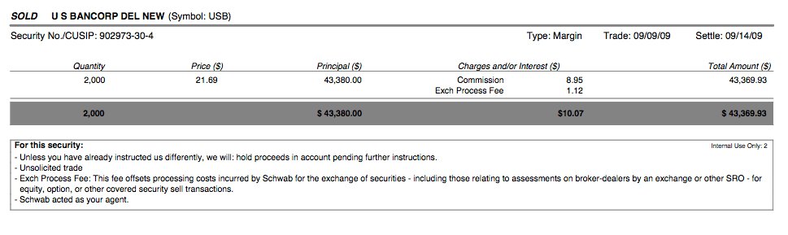

The trading process is inherently complex, comprising multiple critical stages that encompass the period before a trade is initiated, during its execution, and after it is completed. Each stage involves distinct activities and decisions that require careful consideration to ensure the success and accuracy of the trade.

Brokers are integral to this process as they facilitate the actual execution of trades while also ensuring that clients receive detailed confirmations of the transactions they have participated in. This confirmation process is essential, as it assures clients that their trade instructions have been followed precisely and that the details of the trade are recorded correctly.



In recent years, the popularity of algorithmic trading has surged. This development is largely due to its capability to automate significant portions of the trading process. Algorithmic trading utilizes advanced computer algorithms to conduct trades at high speeds based on pre-established criteria. This not only enhances efficiency but also minimizes the emotional biases of decision-making and allows the processing of substantial volumes of data.

This article aims to provide a comprehensive examination of the trading process, highlight the pivotal role brokers play in providing trade confirmation, and discuss the profound impact that algorithmic trading has had on the modern trading landscape.

## Table of Contents

## Understanding the Trading Process

The trading process is a structured sequence of steps that ensures efficient execution and settlement of securities in financial markets. At its core, the trading process can be divided into four main stages: order placement, execution, confirmation, and settlement.

1. **Order Placement**: This initial step involves the trader deciding to buy or sell securities and placing an order with specific instructions. The order could be a market order, which executes immediately at current market prices, or a limit order, which sets a specific price for execution. Limit orders provide price protection but may not execute if the market never reaches the specified price level.

2. **Execution**: Once an order is placed, it moves to the execution stage where it is matched with other orders in the market. Market orders are executed promptly, often at the current best available price. Conversely, limit orders are only executed if the market price satisfies the order's conditions. The efficiency of execution can be influenced by factors such as order size, market volatility, and trading volume.

3. **Confirmation**: After execution, trade confirmation involves notifying both buyer and seller of the trade's details. This typically includes the number of shares traded, the price, execution time, and trading fees. Confirmation is crucial for record-keeping and ensures that the trade was executed as intended.

4. **Settlement**: The final stage is settlement, where ownership of securities is transferred from seller to buyer. Settlement processes have evolved with technology, resulting in reduced timeframes. For instance, the U.S. market's transition from a T+2 (two days after the transaction) to a T+1 settlement cycle significantly enhances efficiency and reduces counterparty risk.

The trading process is highly sensitive to [liquidity](/wiki/liquidity-risk-premium) and overall market conditions. High liquidity generally facilitates quicker and more efficient trades, minimizing the market impact of large orders. Conversely, lower liquidity can lead to delays and higher transaction costs. Additionally, volatile market conditions can widen bid-ask spreads and lead to price slippage, affecting the final execution price of trades. Understanding these dynamics is crucial for traders to optimize their strategies and manage risks effectively.

## The Role of Brokers in Trade Confirmation

Brokers serve as essential intermediaries in the trading process by executing trades on behalf of their clients and ensuring accurate communication of trade details through trade confirmations. This confirmation process is integral to the trading workflow, as it validates that the trade has been executed according to the client's specific instructions and preferences. Trade confirmations typically contain vital information, including the type of security, the quantity traded, the price at which the trade was executed, and the date and time of the transaction. This information provides clients with an assurance of transparency and accuracy in their trading activities.

The mechanisms for trade confirmation have evolved significantly with technological advancements. Traditionally, confirmations were communicated via mail or telephone. However, the digital age has introduced diverse platforms for broker-client interactions, making trade confirmations more efficient and accessible. Most brokers now offer online interfaces and mobile applications where clients can view real-time updates on their trades. These platforms often feature customizable dashboards, allowing traders to track multiple assets and orders simultaneously.

Moreover, the choice of platform can influence client experience and satisfaction. Full-service brokers tend to offer comprehensive trading platforms, often coupled with additional research tools and analysis services. On the other hand, discount brokers may provide more basic platforms with fewer features but at a reduced cost, appealing to cost-conscious traders. Some cutting-edge interfaces integrate [algorithmic trading](/wiki/algorithmic-trading) capabilities, enabling users to set automated alerts and triggers for trade execution under specific market conditions.

Regardless of the platform used, consistent and clear communication between brokers and their clients is paramount. Errors in trade confirmation can lead to misunderstandings and potential financial losses. Thus, brokers are obligated to adhere to stringent compliance standards imposed by regulatory bodies, ensuring precise execution and reporting of trades.

In conclusion, brokers play a pivotal role in facilitating and confirming trades, with the confirmation process acting as a critical validator of trading accuracy and reliability. The evolution of digital platforms has enhanced the efficiency of trade confirmations, providing clients with flexible and immediate access to trading data, which is crucial for informed decision-making in dynamic markets.

## Impact of Algorithmic Trading

Algorithmic trading employs sophisticated computer algorithms to execute trades with high precision and rapidity, based on predefined strategies and criteria. This form of trading offers significant advantages by minimizing the emotional biases that often affect human traders. The algorithms can operate continuously, reacting to market conditions much faster than a human could. Consequently, trades can be executed in fractions of a second, optimizing the timing and efficiency of transactions.

The efficiency of algorithmic trading lies in its capability to process and analyze large volumes of data swiftly. Using complex mathematical models and real-time data feeds, these algorithms make trading decisions at speeds far beyond human capacity. For instance, quantitative models might use historical data to identify trends or patterns that signal trading opportunities, thus enabling the execution of buy or sell orders precisely when advantageous conditions are detected.

Retail traders can benefit vastly from algorithmic trading through platforms that offer robust [backtesting](/wiki/backtesting) tools and coding capabilities. Backtesting allows traders to simulate their trading strategies using historical data to evaluate their potential effectiveness without financial risk. This is crucial for assessing how a proposed algorithm would have performed under previous market conditions and enables the trader to refine the strategy before live execution.

Many retail platforms provide user-friendly interfaces where traders can write and test their strategies using popular programming languages such as Python. An example of a simple algorithmic trading strategy in Python, using libraries such as pandas and numpy, might look like this:

```python
import pandas as pd
import numpy as np

# Load historical data
data = pd.read_csv('historical_data.csv')

# Calculate moving averages
data['SMA_50'] = data['Close'].rolling(window=50).mean()
data['SMA_200'] = data['Close'].rolling(window=200).mean()

# Generate signals
data['Signal'] = np.where(data['SMA_50'] > data['SMA_200'], 1, 0)

# Calculate daily returns
data['Return'] = data['Close'].pct_change()

# Calculate strategy returns
data['Strategy_Return'] = data['Return'] * data['Signal'].shift(1)

# Plot the results
import matplotlib.pyplot as plt

plt.figure(figsize=(12, 6))
plt.plot(data['Close'], label='Price')
plt.plot(data['SMA_50'], label='SMA 50')
plt.plot(data['SMA_200'], label='SMA 200')
plt.legend()
plt.show()
```

This code performs a simple moving average crossover strategy, which generates buy signals when the 50-day moving average crosses above the 200-day moving average, suggesting an upward trend. By analyzing these signals, traders can automate decisions to enter or [exit](/wiki/exit-strategy) positions, possibly improving the strategy's performance.

The scope of algorithmic trading is continually expanding as advancements in technology and data analysis evolve. Traders, both institutional and retail, who adopt these tools can position themselves to take advantage of opportunities that manual trading simply cannot offer. As financial markets become more data-driven, the role of algorithmic trading is anticipated to grow, further shaping the landscape of modern trading.

## How Trade Settlement Works

After a trade is confirmed, it proceeds to the settlement process, a crucial stage where the transactional responsibilities of both parties—the buyer and the seller—are fulfilled. During this period, the buyer pays for the securities acquired, while the seller ensures delivery of those securities, effectively closing the transaction loop. 

Traditionally, settlement cycles have operated on a T+2 schedule, meaning the settlement occurs two business days after the trade date. However, technological advances and the push for greater efficiency have prompted certain markets, including the United States, to shift towards a T+1 settlement cycle. This transition reflects efforts to reduce counterparty risk and improve liquidity management. 

Managing the settlement process effectively is crucial for traders to ensure their accounts are accurately balanced and they retain sufficient liquidity for future trades. A streamlined settlement process minimizes operational risks and maximizes the potential for capital utilization, allowing traders to optimize their financial strategies.

Technology and automation play significant roles in transforming settlement processes. The implementation of blockchain technology and other distributed ledger technologies (DLTs) is being explored by financial institutions to enhance transparency, security, and efficiency in trade settlements. Such technologies offer the potential to eliminate certain intermediaries, thereby reducing time and costs associated with settlements.

Understanding these intricacies of trade settlement equips traders with the knowledge to navigate financial markets adeptly, ensuring they maintain optimal liquidity and capitalize on favorable market conditions.

## Conclusion

Navigating the trading process requires understanding the intricate roles that brokers and algorithmic trading play in modern markets. Brokers are essential in ensuring trades are executed according to client instructions and confirming those trades, providing a reliable touchpoint for traders. Their platforms often facilitate tracking and validating trade details, a service critical for both retail and institutional investors.

Algorithmic trading, on the other hand, offers a different dimension by automating the trading process. This technology harnesses the power of computer algorithms to execute trades swiftly and in accordance with predefined criteria. The advantages include not only the elimination of emotional biases but also the ability to handle complex data analyses rapidly, optimizing trading strategies. For novice traders, algorithmic trading platforms often provide backtesting tools, enabling them to refine strategies before deploying them in real-world scenarios.

As technological capabilities evolve, staying informed about innovations in trade execution and settlement processes becomes increasingly important. Understanding these changes can offer traders significant competitive advantages, allowing them to better manage their portfolios and liquidity. Consequently, adapting to the latest advancements can lead to more effective decision-making and improved overall trading performance.

In summary, both brokers and algorithmic trading tools are invaluable to executing and confirming trades, optimizing strategies, and navigating the complexities of modern financial markets. Remaining vigilant about these evolving aspects is imperative for maintaining a successful trading practice.

## References & Further Reading

[1]: Bergstra, J., Bardenet, R., Bengio, Y., & Kégl, B. (2011). ["Algorithms for Hyper-Parameter Optimization."](https://dl.acm.org/doi/10.5555/2986459.2986743) Advances in Neural Information Processing Systems 24.

[2]: ["Advances in Financial Machine Learning"](https://www.amazon.com/Advances-Financial-Machine-Learning-Marcos/dp/1119482089) by Marcos Lopez de Prado

[3]: ["Evidence-Based Technical Analysis: Applying the Scientific Method and Statistical Inference to Trading Signals"](https://www.amazon.com/Evidence-Based-Technical-Analysis-Scientific-Statistical/dp/0470008741) by David Aronson

[4]: ["Machine Learning for Algorithmic Trading"](https://github.com/stefan-jansen/machine-learning-for-trading) by Stefan Jansen

[5]: ["Quantitative Trading: How to Build Your Own Algorithmic Trading Business"](https://www.amazon.com/Quantitative-Trading-Build-Algorithmic-Business/dp/1119800064) by Ernest P. Chan