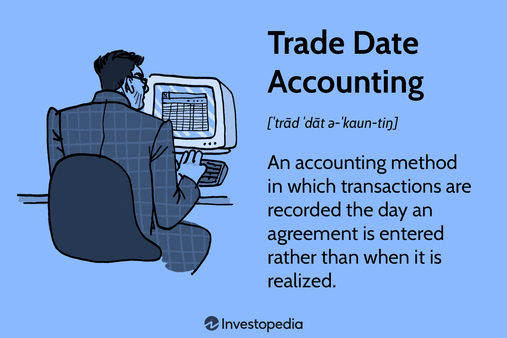

Trade date accounting is a fundamental aspect of financial reporting, essential for maintaining transparency and accuracy in financial statements. This accounting approach records financial transactions on the date when a trade is executed, rather than when the transactions are settled. Its importance has grown in modern financial markets, where timely and precise data capture is critical. As financial transactions become more complex and interconnected, trade date accounting helps ensure that financial records accurately reflect the market activities at the point of execution, providing a realistic view of a company's financial position.

One of the critical areas influenced by trade date accounting is its impact on the recording and analysis of financial transactions. By recognizing trades on the execution date, financial statements can capture market conditions more accurately, allowing stakeholders to make more informed decisions. This method also affects how companies assess their financial performance over time, as it ensures that profits and losses are recorded in the period in which they occur, rather than being delayed to a future settlement date.



Another vital intersection is between accounting principles and algorithmic trading, commonly known as algo trading. In these fast-paced, technology-driven environments, accurate data handling is of utmost importance. Algorithmic trading systems execute a high volume of trades within fractions of a second. Here, trade date accounting plays a crucial role in maintaining the integrity of financial records. It enables these systems to incorporate real-time data into their decision-making processes, ensuring that financial impacts of trades are immediately visible to traders and analysts.

Throughout this article, readers will explore the foundational concepts and applications of trade date accounting. The sections that follow will delve into the comparative analysis of trade date versus settlement date accounting, its implications for corporate financial statements, especially in year-end reporting, and the nuanced role it plays in algorithmic trading environments. We will also discuss the challenges and benefits of maintaining compliance with tax regulations, explore accounting software solutions, and examine future trends that could reshape the landscape of trade date accounting. This comprehensive examination aims to enhance the understanding of trade date accounting's vital role in modern finance, offering insights valuable to financial professionals and market participants alike.

## Table of Contents

## Understanding Trade Date Accounting

Trade date accounting is a fundamental concept in financial reporting that determines when a financial transaction is recognized and recorded in the accounts. This method contrasts primarily with settlement date accounting, with the key difference lying in the timing of transaction recognition. In trade date accounting, a transaction is recorded on the date the transaction is agreed upon, whereas, in settlement date accounting, it is recorded on the date the transaction is actually completed.

The distinction between trade date and settlement date accounting is critical due to its implications on financial records and statements. When a transaction is recorded on the trade date, it appears in the financial statements as soon as the agreement or order is made. This can affect the reporting of assets, liabilities, and related income or expenses immediately, thus influencing the financial position and performance of a firm at a specific time.

Consider a stock purchase executed on October 1st, but settling on October 5th. Under trade date accounting, this transaction will be recorded on the [books](/wiki/algo-trading-books) as of October 1st, affecting the financial statements in the reporting period that includes this date. The immediate impact is seen in asset accounts, as the purchased stock is considered part of the company's holdings from the trade date. Conversely, any financial obligation to pay for the transaction is also recognized on the trade date.

Practical applications of trade date accounting are widespread in various financial markets. In equity markets, for example, this method allows companies and investors to reflect transactions in their financial records promptly, leading to more timely decision-making and financial analysis. It enables fund managers and institutional investors to report their market value and exposure accurately on report dates.

Additionally, trade date accounting is extensively used in derivatives markets, where the timing of the transaction agreement plays a pivotal role in terms of risk management and margin requirements. The immediate recognition of derivatives positions from the trade date provides a clearer picture of exposure and compliance with regulatory capital requirements.

In the context of corporate finance, trade date accounting assists firms in achieving accuracy and transparency in their financial reporting. By recognizing transactions on the trade date, firms can provide a more immediate and clear picture of their current financial status to stakeholders, including shareholders, investors, and regulatory bodies. This practice supports enhanced transparency and potentially reduces the risk of financial discrepancies arising from delays in transaction reporting.

Overall, trade date accounting serves as a cornerstone of precise financial reporting practices, particularly in fast-paced financial markets where timely information is crucial for maintaining market confidence and strategic decision-making.

## The Role of Trade Date Accounting in Financial Reporting

Trade date accounting is a crucial aspect of corporate financial statements as it dictates the timing of when transactions are recorded. Unlike settlement date accounting, which records transactions on the actual settlement date, trade date accounting records the transaction on the date the trade is executed. This difference has significant implications on financial reporting, transparency, and accuracy.

**Impact on Corporate Financial Statements**

Trade date accounting affects the financial statements by ensuring that the economic reality of transactions is recognized promptly. For instance, trades executed towards the end of a financial period are recorded in that period rather than being deferred to the following period. This timely recognition can affect several financial statement elements such as revenue, expenses, and assets.

Consider a scenario where a company sells inventory on December 31st, but the settlement occurs on January 5th. Under trade date accounting, the revenue from this sale is recognized in the December quarter, impacting end-of-year financial statements. The direct effect is reflected in the income statement by recognizing the revenue and cost of goods sold, thus impacting the net income and ultimately the equity reported.

**Real-World Scenarios and Applications**

In the context of end-of-year reporting, trade date accounting becomes particularly significant. Companies often rush to finalize transactions before the year-end to ensure they are captured in the current year's financial results. This practice can lead to what's colloquially known as "window dressing", where firms attempt to present a more favorable financial position by executing trades just before financial periods end.

For example, a company trying to improve its [liquidity](/wiki/liquidity-risk-premium) ratios might execute several sales transactions in the last weeks of a financial year. Trade date accounting would allow these to be recorded in the outgoing year, thus presenting a stronger balance sheet position by reducing inventories and boosting cash or receivables at year-end.

**Implications for Transparency and Accuracy**

Trade date accounting enhances transparency and accuracy by aligning financial statements with the economic events they are meant to capture. By recording transactions at the time of trade, it provides a more accurate picture of a company's financial position and performance. This approach reduces the opportunity for companies to manipulate interim or annual reports since transactions are not left pending recognition at a future date.

The method also facilitates better financial analysis and forecasting. Analysts and investors can rely on the fact that financial statements accurately reflect all executed trades, which in turn, aids in the valuation, risk assessment, and decision-making processes. Additionally, trade date accounting helps auditors assess the appropriateness of revenue recognition and the timing of asset and liability recognition, thereby enhancing audit quality.

In conclusion, trade date accounting plays a pivotal role in financial reporting by ensuring the timely and accurate reflection of economic transactions in corporate financial statements. Its application is vital for maintaining transparency and integrity, particularly at critical junctures such as the end of financial periods.

## Impact on Algo Trading

Trade date accounting is integral to the efficient operation of [algorithmic trading](/wiki/algorithmic-trading) systems and platforms, which rely on the precise and prompt recording of financial transactions. This accounting practice ensures that transactions are recognized at the moment of trade execution, rather than upon settlement, thereby providing a more accurate reflection of a firm's financial position.

Algorithmic trading, by design, thrives on speed and precision. In high-frequency trading ([HFT](/wiki/high-frequency-trading-strategies)) environments, transactions occur at rates that are often measured in milliseconds. The integration of trade date accounting into these systems provides numerous benefits, including:

1. **Enhanced Accuracy**: By recording transactions at the trade date, firms ensure that their financial records reflect the most up-to-date positions. This significantly reduces discrepancies arising from market fluctuations occurring between the trade date and settlement date.

2. **Risk Management**: Proper implementation of trade date accounting assists in the effective assessment of risk exposure. Traders and risk managers can make informed decisions with accurate data that reflects current market conditions, thereby minimizing potential losses due to adverse market movements.

3. **Statistical Arbitrage Opportunities**: Algorithmic strategies often capitalize on tiny price inefficiencies that can only be detected with precise and timely data. Trade date accounting ensures that the information feeding into these algorithms is current, thus enhancing the probability of successful arbitrage.

However, the integration of trade date accounting within algorithmic trading systems does not come without challenges. Maintaining compliance with trade date accounting standards in such fast-paced environments presents unique obstacles:

- **Data Volume**: The large volume of transactions in algo trading requires robust data management systems capable of real-time processing and storage. This necessitates investments in advanced IT infrastructure to handle the computational demands.

- **System Synchronization**: Ensuring that all systems are synchronized to capture trade date transactions accurately is critical. Discrepancies between systems can lead to errors in financial reporting and compliance failures.

- **Regulatory Compliance**: Regulations can vary significantly across jurisdictions, making it difficult for global trading firms to adhere consistently to trade date accounting standards. Firms must develop flexible systems that can adjust to different regulatory requirements without compromising efficiency.

To address these challenges, continuous advancements in trading technology and accounting software are essential. Tools that seamlessly integrate trade date accounting practices with algorithmic trading platforms are increasingly being developed to ensure compliance and operational efficiency. Through the incorporation of such tools, firms can maintain the integrity of their financial records while capitalizing on the speed and precision offered by algorithmic trading.

## Tax Implications and Compliance

Trade date accounting is a critical component in financial reporting that affects how transactions are recognized for tax purposes. Understanding the tax implications associated with this accounting method is essential for individuals and institutions engaged in trading activities.

Trade date accounting involves recording transactions on the date when a trade is executed, rather than when it is settled. This distinction can have significant tax implications. For instance, the recognition of capital gains and losses for tax purposes can be accelerated, impacting the period in which these gains and losses are reported. This can influence an entity’s taxable income and its tax liability for that period.

Compliance with tax regulations under trade date accounting is managed through rigorous documentation and accurate tracking of all trades. Financial records must reflect transactions as of the trade date, ensuring that income and expenses are recorded in the correct period. This requires robust accounting systems capable of handling the complexity of multiple transactions occurring on different dates but being reported in the same financial period.

One notable tax-related challenge that arises with trade date accounting is the wash sale rule. A wash sale occurs when a security is sold at a loss, and a substantially identical security is purchased within 30 days before or after the sale. According to U.S. tax laws, the loss from the sale is not deductible if it's classified as a wash sale. Instead, the disallowed loss is added to the cost basis of the newly acquired securities. Trade date accounting can affect the identification and management of wash sales because the recognition of the transaction occurs sooner than it might under settlement date accounting.

Example:
```python
# Example of calculating adjusted cost basis due to wash sale

initial_purchase_price = 1000
sale_price = 900
wash_sale_loss = initial_purchase_price - sale_price  # Calculate loss

# If a substantially identical security is repurchased within 30 days,
# the loss is added to the cost basis of the new purchase.
repurchase_price = 950
adjusted_cost_basis = repurchase_price + wash_sale_loss

print(f"Adjusted Cost Basis: ${adjusted_cost_basis}")
```

In this example, if a trader repurchases a substantially identical security within the wash sale window, the loss from the original sale would be disallowed and added to the basis of the repurchased security, affecting future capital gains calculations.

Managing tax compliance in trade date accounting involves not only recognizing the potential for wash sales but also adhering to other specific regulatory requirements depending on the jurisdiction. This might entail employing sophisticated accounting software capable of flagging potential wash sales and ensuring that all taxable events are reported accurately and timely. Financial professionals must stay informed of any changes in tax legislation that could impact trade date accounting practices to ensure ongoing compliance and optimize tax efficiency.

## Accounting Software and Tools for Managing Trade Date Transactions

As trading and financial firms engage in complex market transactions, effective management of trade date transactions becomes crucial. Accounting software solutions have emerged as essential tools to support trade date accounting, facilitating precise transaction recording and ensuring compliance with financial regulations. These software systems offer integrated features that automate and streamline the trade date transaction process, thus enhancing operational efficiency and accuracy.

A critical feature to look for in accounting software is real-time processing capabilities. Real-time processing ensures that transaction data is captured and recorded as trades occur, allowing firms to maintain up-to-date financial records. This capability is particularly important in high-frequency trading environments where transaction volumes are substantial. Furthermore, robust data integration features enable seamless connectivity with trading platforms, ensuring that data flows efficiently between systems and reducing manual data entry errors.

Another vital attribute is comprehensive reporting and analytics functionality. This feature offers traders and financial analysts the ability to generate detailed reports on transaction histories, financial performance, and compliance status. Such reports are crucial for auditing purposes and for assessing the impact of trade date accounting on financial statements.

Security features are also paramount. Strong cybersecurity measures, including encryption and secure access protocols, protect sensitive financial data from unauthorized access and breaches. Additionally, user access controls allow firms to assign permissions to users based on their roles, ensuring that only authorized personnel have access to critical financial information.

When comparing popular accounting software tools, the industry offers several options, each with distinct advantages. For example, platforms like QuickBooks and Xero are renowned for their user-friendly interfaces and scalability, making them suitable for small to medium-sized enterprises. On the other hand, more comprehensive systems like SAP and Oracle offer extensive integration capabilities and are tailored for larger institutions with complex accounting needs.

When choosing an accounting tool, firms should consider their specific requirements, such as transaction [volume](/wiki/volume-trading-strategy), integration needs, and regulatory compliance obligations. The evolving landscape of financial technology means that these tools continue to develop, offering advanced features powered by technologies such as [artificial intelligence](/wiki/ai-artificial-intelligence) and [machine learning](/wiki/machine-learning). These advancements promise to further enhance the capability of accounting systems to manage trade date transactions efficiently and accurately.

## Future Trends and Developments

The landscape of trade date accounting is evolving, driven by technological advancements and shifting regulatory landscapes. As financial markets become more complex and integrated, these changes could significantly impact how financial transactions are recorded and reported.

Emerging technologies, such as artificial intelligence (AI) and machine learning, are set to revolutionize trade date accounting by enhancing data accuracy, reducing human error, and improving predictive analytics. AI tools can process vast amounts of transaction data, offering real-time insights and automating reconciliations. This automation not only increases efficiency but also ensures that trade date records are consistently accurate and compliant with accounting standards.

Regulatory developments are also a key [factor](/wiki/factor-investing) shaping the future of trade date accounting. Financial regulators in various jurisdictions are continually updating guidelines to enhance transparency and mitigate systemic risk. Potential reforms could mandate stricter adherence to trade date accounting principles, necessitating advanced data management solutions. Accountants and financial analysts may need to adapt to more stringent reporting requirements, relying on sophisticated software to meet these demands.

Algorithmic trading, characterized by the use of complex algorithms to execute trades at high speeds, presents both opportunities and challenges for trade date accounting. As algo trading grows, it demands robust systems capable of precisely recording trades at the moment of transaction. This need for precision underscores the importance of integrated accounting systems that can seamlessly handle vast amounts of trade data.

Emerging trends indicate that accountants and financial analysts will increasingly collaborate with IT specialists to harness these technologies effectively. This interdisciplinary approach is essential for navigating the complexities of modern financial markets. Professionals will need to upskill, embracing new tools and methodologies to maintain relevance in this dynamic field.

In conclusion, the future of trade date accounting will be shaped by technological advancements and regulatory shifts. The ability to integrate AI and manage compliance efficiently will be crucial for financial professionals aiming to maintain robust and transparent financial records. As these developments unfold, ongoing education and adaptation will be key for those involved in financial analysis and accounting.

## Conclusion

Trade date accounting serves as a cornerstone in financial reporting and analysis, offering a critical framework for recording financial transactions at their inception. Throughout the article, we have explored various dimensions of trade date accounting, from its basic definition contrasting with settlement date accounting, to its integral role in maintaining the accuracy and transparency of corporate financial statements. We've seen how this accounting method is indispensable in diverse financial contexts, including its application in high-stakes environments such as algorithmic trading and its influence on tax compliance.

The importance of trade date accounting cannot be overstated. By ensuring that financial transactions are recognized and recorded as they occur, this method supports the timely and precise reflection of an organization’s financial position. This accuracy is crucial for investors, regulators, and other stakeholders who rely on corporate financial reports to make informed decisions. Moreover, in the fast-paced world of algo trading, proper trade date accounting is essential for processing high volumes of transactions efficiently while adhering to compliance requirements.

As the financial markets continue to evolve, so too will the principles and practices surrounding trade date accounting. Technological advancements, including artificial intelligence, promise to further enhance the precision and efficiency of accounting practices. Financial professionals must stay abreast of these developments to maintain and improve financial integrity. For those interested in deepening their understanding, further research into emerging technologies and regulatory changes in trade date accounting will be invaluable. By continuously engaging with the latest trends and tools, financial professionals can ensure they remain at the forefront of this essential aspect of financial reporting.

## References & Further Reading

[1]: Blake, R. (2019). ["How Trade Date Accounting Benefits Automated Trading."](https://www.supermoney.com/encyclopedia/trade-date-accounting) Investopedia.

[2]: Fong, K. Y. L., Holden, C. W., & Trzcinka, C. (2017). ["What are the Best Liquidity Proxies for Global Research?"](https://host.kelley.iu.edu/cholden/Fong%20Holden%20and%20Trzcinka%20(2017).pdf) The Review of Financial Studies.

[3]: Fabozzi, F. J., & Markowitz, H. M. (Eds.). (2012). ["Theory and Practice of Investment Management: Asset Allocation, Valuation, Portfolio Construction, and Strategies."](https://onlinelibrary.wiley.com/doi/book/10.1002/9781118267028) Wiley.

[4]: Mankiw, N. G., & Taylor, M. P. (2017). ["Economics."](https://www.amazon.com/Economics-Gregory-Mankiw-Mark-Taylor/dp/9353501334) Cengage Learning.

[5]: Murphy, J. J. (1999). ["Technical Analysis of the Financial Markets: A Comprehensive Guide to Trading Methods and Applications."](https://archive.org/details/technicalanalysi0000murp) New York Institute of Finance.