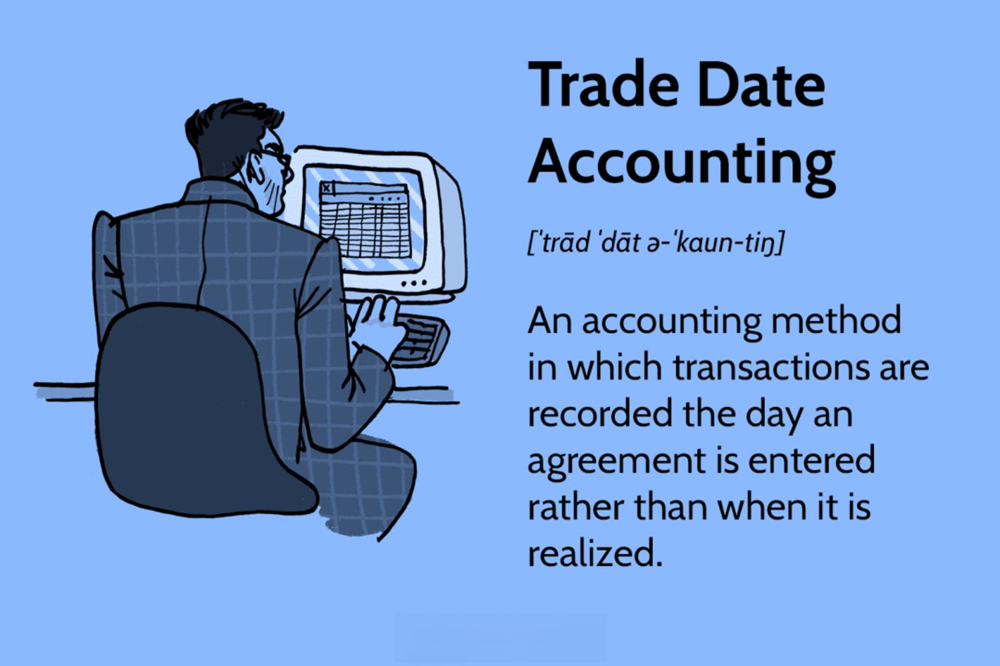

Understanding the dynamics of trade date investing is crucial for navigating the financial markets effectively. Trade date investing refers to the practice of recognizing and recording a trade on the date it is executed, rather than when it is settled. This approach holds significant importance as it aligns closely with market movements and investor strategies, providing timely insight into market positions. This method allows investors to make informed decisions based on the most current data available, optimizing their investment strategies accordingly.

In parallel, algorithmic trading has emerged as a revolutionary force in modern finance, utilizing computer algorithms to execute trades at high speeds and frequencies beyond human capability. This technology-driven approach leverages mathematical models and complex programming to determine the optimal timing for executing trades, based on predefined criteria. Algorithmic trading enhances the investment process by offering efficiency, precision, and the ability to process large volumes of data in real-time.

The synergy between trade date investing and algorithmic trading presents novel opportunities for investors. By combining these strategies, stakeholders can optimize trade execution and leverage real-time data analysis for immediate investment decisions, thus maximizing returns and mitigating risks.

The objective of this article is to provide comprehensive insights into both trade date investing and algorithmic trading. The synergy between these strategies contributes significantly to their growing prominence in today's financial markets, making it imperative for investors to understand and integrate them into their portfolios. With the rapid advancement of technology, these strategies are becoming increasingly important for optimizing investment decisions and staying competitive in the marketplace. Through this exploration, investors are encouraged to adopt adaptive strategies and embrace continuous learning to navigate the evolving financial landscape effectively.

## Table of Contents

## What is Trade Date Investing?

Trade date investing refers to the practice of recording and acting upon the date on which a trade is executed, rather than when the transaction is settled. This approach is integral in financial trading, as it dictates when a trade is recognized for accounting and reporting purposes, thereby impacting how portfolios are managed and evaluated. The trade date is the official date when the deal between the buyer and seller is finalized, whereas the settlement date is the day when the transfer of assets is completed, often occurring a few days after the trade date.

Key features of trade date investing include precision in recording trades, providing transparency and consistency in financial records. This practice is advantageous as it allows investors and firms to accurately track and report their activities based on when trades inherently occur, thus offering a more timely reflection of investment positions. Additionally, utilizing trade date information facilitates better risk management by allowing investors to make prompt adjustments to their portfolios in response to market changes.

One significant comparison in trade date investing is between the trade date and the settlement date. While the trade date records the day a trade is enacted, the settlement date marks the completion of the transfer of assets, resulting in the exchange of cash and securities. The implications of this difference are crucial for accounting and financial reporting. For example, profit and loss statements are often impacted based on trade date information, as firms recognize income or expenditures once the trade is enacted, thus influencing the financial outcomes reported within a specific period. In terms of portfolio management, the trade date enables investors to update their portfolio positions promptly, thereby reflecting current market conditions effectively.

Historically, the concept of trade date investing has evolved in response to advancements in technology and the need for more efficient financial systems. Prior to the digital era, manual systems and lengthy paper trails delayed the recognition of transactions. The modernization of electronic trading platforms and widespread adoption of digital financial technologies have streamlined the process, allowing trades to be recorded accurately on the trade date, thus enhancing the efficiency of financial markets. This evolution underscores how trade date practices have adapted to meet the demands of fast-paced trading environments, highlighting the significance of accurate and timely transaction recording in contemporary finance.

## Understanding Algorithmic Trading

Algorithmic trading refers to the use of computer programs and systems to execute financial transactions at rapid speeds, often many times faster than any human trader. These algorithms leverage mathematical models and algorithms to optimize the buying or selling of financial instruments. The role of [algorithmic trading](/wiki/algorithmic-trading) in the financial ecosystem is to increase efficiency, minimize human error, and capitalize on market trends by executing pre-programmed trading instructions accounting for variables like timing, price, and [volume](/wiki/volume-trading-strategy).

The evolution of algorithmic trading has been significant, beginning with the basic execution algorithms introduced in the late 1970s and early 1980s. These early models focused on automating simple tasks such as executing a large order gradually to minimize market impact. As technology advanced, so did the sophistication of these algorithms, incorporating techniques from AI and [machine learning](/wiki/machine-learning). Today, AI-driven strategies allow algorithms to learn from historical data, adapt to changing market conditions, and even make predictions about future price movements.

One of the primary advantages of algorithmic trading over traditional trading methods is its ability to process vast amounts of data and execute trades at speeds beyond human capability, thus seizing fleeting market opportunities. It also reduces the emotional and psychological biases that can affect human traders, and allows for [backtesting](/wiki/backtesting) strategies against historical data, which enhances the reliability of trading strategies.

Several common algorithms used in trading include:

- **Market Making Algorithms**: These are designed to provide liquidity by buying and selling a particular financial instrument simultaneously, aiming to profit from the spread between buy and sell prices.

- **Trend Following Strategies**: These identify opportunities by analyzing market trends and price movements, executing trades based on the sustained direction of an asset's price.

- **Arbitrage Algorithms**: These exploit price discrepancies between different markets or exchanges, buying low in one market and selling high in another.

- **Mean Reversion Algorithms**: These anticipate a security's price reverting to its historical average, risking trades on the temporary divergence from this average.

While algorithmic trading offers significant advantages, it is not without risks and challenges. One such challenge is the potential for systemic risk where large numbers of transactions are executed in fractions of a second, potentially leading to market flash crashes if the algorithms lack sufficient fail-safes. Additionally, algorithms based on historical data might fail to adapt to unforeseen changes in market conditions. 

Algorithms can be susceptible to flaws in programming or unexpected inputs, which can lead to substantial financial losses. Furthermore, the competitive nature of trading algorithms often involves high-frequency trading strategies that demand significant infrastructural investment and technological optimization, posing barriers to entry.

Overall, algorithmic trading represents a powerful tool within modern finance, characterized by its speed, precision, and reduced susceptibility to human error, but it also requires careful consideration of its inherent risks and the rapidly evolving financial landscape it operates within.

## The Intersection of Trade Date Investing and Algorithmic Trading

Trade date investing, when combined with algorithmic trading, offers a powerful approach to making timely and informed investment decisions. This combination leverages the strengths of both strategies, enhancing traditional methods with advanced computational techniques.

**Enhancement through Algorithmic Trading**

Trade date investing is inherently concerned with the timing of trades. Algorithmic trading enhances this by providing precise and rapid execution based on real-time data. Algorithms can process vast amounts of market data almost instantaneously, allowing traders to capitalize on market movements as they occur. This capability is particularly beneficial for trade date strategies, which are sensitive to the exact timing of transactions.

**Impact of Real-Time Data and Speed**

The integration of real-time data is crucial in this synergy. Algorithmic trading systems rely on live data feeds to make split-second decisions, thus the speed at which they operate is paramount. With high-frequency trading ([HFT](/wiki/high-frequency-trading-strategies)), algorithms can execute hundreds of trades in milliseconds, optimizing the effects of trade date investing by ensuring trades are made at the most advantageous moments. The latency in data transmission and processing is a critical [factor](/wiki/factor-investing), as even minor delays can affect performance outcomes significantly.

**Case Studies: Success of Algorithm-Driven Strategies**

Several case studies illustrate the efficacy of using algorithms in trade date investing. For example, hedge funds and financial institutions often utilize algorithmic models to improve trade execution and reduce slippage. A notable case is Renaissance Technologies, a firm famous for its Medallion Fund, which applies quantitative models to execute trades at optimal times, delivering consistent returns. These successes underscore the potential of algorithm-driven strategies in enhancing trade date performance.

**Role of Technology and Data Analytics**

Technology plays an integral role in merging trade date investing with algorithmic trading. Advanced computing technologies and sophisticated data analytics allow traders to develop models that predict market movements with increasing accuracy. Machine learning algorithms, for example, can identify patterns and correlations in historical and real-time data that are not apparent to human analysts. By continuously learning and adapting, these algorithms contribute to more refined and responsive investment strategies.

**Potential Pitfalls and Misconceptions**

Despite its advantages, the combination of trade date investing and algorithmic trading is not without challenges. One significant pitfall is the risk of over-reliance on technology. Algorithms require meticulous design and constant monitoring to ensure they function as intended without succumbing to market anomalies. Moreover, there is a misconception that algorithmic trading guarantees profits; in reality, it requires careful implementation and risk management. Market conditions can change swiftly, and algorithms designed for one scenario may fail in another. Additionally, high-frequency trading can lead to increased market [volatility](/wiki/volatility-trading-strategies), contributing to systemic risks.

In summary, the intersection of trade date investing and algorithmic trading represents a forward-thinking approach to modern finance, integrating precision timing with computational power. However, it's essential for investors to understand both the benefits and challenges to effectively leverage this synergy in their investment strategies.

## Practical Applications and Tools

Trade date investing and algorithmic trading are closely tied to the evolution of financial technology, offering numerous platforms and tools for practitioners to optimize their strategies. This section explores the practical implementation of these methodologies, detailing the tools available, best practices for investors, and the integration of advanced technologies like AI.

One major aspect of trade date investing is selecting the right set of tools and platforms for execution. Popular trading platforms such as MetaTrader, [Interactive Brokers](/wiki/interactive-brokers-api), and thinkorswim offer robust frameworks for implementing both trade date and algorithmic strategies. These platforms provide real-time data feeds, automated trading capabilities, and comprehensive reporting features that enable investors to track and optimize their trade decisions according to trade dates.

When choosing financial tools for algorithmic trading, investors should consider criteria such as data accessibility, execution speed, and backtesting capabilities. Effective algorithmic trading platforms allow users to perform high-frequency trades with minimal latency, a crucial factor given the speed at which financial markets operate. Python, with libraries like Pandas and NumPy for data manipulation, and PyAlgoTrade or Zipline for backtesting, is a popular language among algorithmic traders due to its versatility and ease of use.

Market scenarios where trade date investing is especially effective often involve volatile instruments or complex financial products. For example, in equity markets, understanding the trade date can offer insights into short-term price movements, influencing decisions in swing trading or [day trading](/wiki/day-trading-spy) strategies. Additionally, for derivatives and fixed-income securities, trade date consideration helps in managing cash flow timing and exposure risks.

Investors seeking to effectively harness algorithms in their trading must follow certain best practices. Risk management is paramount; incorporating stop-loss orders and diversification strategies can mitigate potential losses. Continuous monitoring and evaluation of algorithm performance are also critical to identify any malfunctions or inefficiencies. It is beneficial for investors to maintain a disciplined approach, regularly fine-tuning algorithms based on market conditions and past performance.

The integration of machine learning and AI into trading strategies is revolutionizing investment decision-making. Models like neural networks or decision trees can analyze vast amounts of historical data to identify patterns and make predictive models, which can then be applied to trade date strategies. Python's machine learning ecosystem, with libraries such as TensorFlow and scikit-learn, provides extensive tools for developing these models. For instance, an AI model might be trained to predict stock price movements based on historical trade date data, offering investors a statistical edge.

In conclusion, the practical application of trade date investing and algorithmic trading is significantly enhanced by advanced tools and technologies. As these strategies continue to evolve, staying well-informed about the latest platforms and techniques will remain crucial for investors looking to optimize their financial performance.

## The Future of Trade Date Investing and Algorithmic Trading

Predicted trends in trade date investing are expected to significantly reshape the financial landscape in the coming years. One of the primary developments is the increasing reliance on real-time data. As high-frequency trading becomes more prevalent, the prompt execution of trades based on the trade date rather than settlement date becomes crucial for optimizing financial decisions. This shift allows investors to respond more dynamically to market changes, capitalizing on short-term opportunities with enhanced precision.

Advancements in technology are further influencing the future of algorithmic trading. Machine learning and [artificial intelligence](/wiki/ai-artificial-intelligence) continue to play pivotal roles, facilitating the development of more sophisticated algorithms capable of learning from historical data to predict future price movements. Such advancements enable algorithms to adapt and improve over time, leading to more robust and reliable trading strategies. Future technologies, including quantum computing, are anticipated to accelerate these processes, allowing for even faster data processing and execution.

The regulatory environment is also pivotal in shaping the future of algorithmic finance. Regulators are increasingly focusing on ensuring that algorithmic trading practices are transparent, secure, and fair. This includes implementing measures to prevent market manipulation and reduce systemic risks associated with algorithmic systems. As regulatory frameworks evolve, they will likely promote more standardized and ethical trading practices, influencing how algorithms are designed and utilized.

With regard to accessibility and democratization, technological advancements and decreasing costs of computing power are making algorithmic trading tools more available to individual investors. Platforms offering algorithmic trading services are increasingly user-friendly, enabling non-experts to implement and benefit from sophisticated trading strategies. This democratization is expected to level the playing field, allowing more participants to engage in trading approaches previously reserved for institutional players.

In conclusion, the financial markets are undergoing a transformation driven by trade date investing and algorithmic trading. With continued advancements, these strategies are becoming integral to investment practices, offering greater opportunities and challenges. Investors are encouraged to stay informed and adaptable, ensuring they leverage the latest tools and strategies to optimize their performance in the ever-evolving landscape of finance.

## Conclusion

The concept of trade date investing is crucial for optimizing investment strategies in the financial markets. Understanding the trade date, which marks the moment a transaction is executed, helps investors accurately manage portfolio valuations and financial reporting. By acknowledging the precise timing of trades, investors can make more informed decisions, align with market trends, and efficiently manage [liquidity](/wiki/liquidity-risk-premium).

Algorithmic trading, a transformative force in modern finance, offers numerous benefits, including increased trading speed, minimized human error, and the ability to execute complex strategies quickly and systematically. Algorithms can analyze vast datasets in real time, enabling traders to act swiftly on market signals. However, challenges such as algorithmic malfunctions, market volatility, and regulatory scrutiny persist, necessitating a careful approach to strategy implementation.

Integrating trade date investing with algorithmic trading presents a strategic advantage by leveraging real-time data processing and execution efficiency. This fusion allows investors to capitalize on fleeting market opportunities and optimize trade execution strategies. Technology and data analytics play a pivotal role in enhancing these strategies, offering tools for improved decision-making and risk management.

Investors are encouraged to explore these evolving financial technologies, embracing the opportunities that trade date investing and algorithmic trading collectively offer. With advancements in machine learning and artificial intelligence, the potential for even greater precision and accessibility in trading strategies is significant.

As the financial landscape continues to evolve, it is imperative for investors to commit to continuous learning and adaptation. Staying informed about technological advancements and regulatory changes will empower investors to navigate the complexities of modern markets effectively. By remaining adaptable and open to innovation, investors can harness the full potential of trade date investing and algorithmic trading for optimized financial outcomes.

## References & Further Reading

[1]: ["Advances in Financial Machine Learning"](https://www.amazon.com/Advances-Financial-Machine-Learning-Marcos/dp/1119482089) by Marcos Lopez de Prado

[2]: ["Machine Learning for Algorithmic Trading"](https://github.com/stefan-jansen/machine-learning-for-trading) by Stefan Jansen

[3]: ["Quantitative Trading: How to Build Your Own Algorithmic Trading Business"](https://www.amazon.com/Quantitative-Trading-Build-Algorithmic-Business/dp/1119800064) by Ernest P. Chan

[4]: Bergstra, J., Bardenet, R., Bengio, Y., & Kégl, B. (2011). ["Algorithms for Hyper-Parameter Optimization."](https://dl.acm.org/doi/10.5555/2986459.2986743) Advances in Neural Information Processing Systems 24.

[5]: Aitken, M. (2010). ["Algorithmic Trading: Pros and Cons."](https://www.researchgate.net/profile/Michael-Aitken/publication/275099809_SSRN-id2587314/data/5532c9480cf27acb0ded9fcc/SSRN-id2587314.pdf) Financial Conduct Authority Occasional Paper.