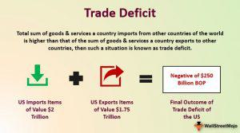

International trade significantly contributes to shaping the global economy by facilitating the exchange of goods, services, and capital across international borders. It allows countries to expand their markets, access resources that are not available domestically, and leverage comparative advantages. One of the critical aspects to consider in international trade is the trade balance, which is the difference between the value of a country's exports and imports. A trade deficit occurs when imports exceed exports, resulting in a negative balance of trade. This scenario can be indicative of various economic dynamics, including strong consumer demand, competitive currency valuations, or economic policy decisions. Trade deficits are a central topic in international economics, as they can have diverse and far-reaching implications for economic stability, currency valuation, and industrial growth.

Algorithmic trading, often referred to as algo trading, has emerged as a formidable tool in modern financial markets. It involves the use of complex algorithms to execute trades at speeds and efficiencies that surpass human capabilities. These algorithms are designed to analyze market data and execute orders based on pre-determined criteria, thus optimizing trading conditions. Algo trading has revolutionized how trades are conducted by providing significant advantages, such as reduced transaction costs, increased trading volumes, and enhanced market liquidity. Its emergence has added a new layer of complexity to the global trading environment, reshaping strategies and operations in financial markets.



The intersection of international trade, trade deficits, and algorithmic trading provides a nuanced perspective on the global economic landscape. Understanding how these elements interact is crucial for evaluating their impact on economic growth and policy decisions. This article will explore these interactions by examining how trade deficits influence economic indicators and how algorithmic trading systems are designed to respond to market conditions. As the global economy becomes increasingly interconnected, these factors play an essential role in shaping economic outcomes, making it imperative to appreciate their interplay for sustainable economic development.

## Table of Contents

## Understanding International Trade

International trade represents the exchange of goods and services between nations, serving as a cornerstone of the global economy. By facilitating access to a wider array of products and services, international trade enhances economic growth and development for participating countries. This cross-border exchange allows nations to specialize in the production of goods where they hold a comparative advantage, thereby optimizing resource allocation and efficiency at a global scale.

Trade policies, tariffs, and trade agreements are critical determinants of international trade dynamics. Trade policies, which include various regulations and standards implemented by governments, define how freely goods and services move across borders. Tariffs, or taxes imposed on imported goods, can either protect domestic industries by making foreign products more expensive or, conversely, restrict trade by imposing additional costs on imports. Trade agreements, such as multilateral agreements within the World Trade Organization (WTO) or regional deals like the North American Free Trade Agreement (NAFTA), aim to reduce or eliminate trade barriers, promoting smoother and more efficient trade flows.

The interaction of these components establishes the framework within which international trade operates. Trade policies can significantly influence a country's economic landscape by impacting factors such as employment, industrial growth, and the balance of payments. Tariffs, for instance, may lead to trade imbalances if retaliatory measures are enacted by trade partners, affecting the international competitiveness of domestic products. 

Understanding these elements is crucial for comprehending the economic foundations of trade deficits, which occur when a country's imports surpass its exports. A deeper insight into the mechanics of international trade can offer clarity on the broader implications of trade deficits, including their potential impact on currency valuation and economic policies. Policymakers and economists must consider these dynamics to navigate the complexities of global trade effectively, ensuring that trade contributes positively to national and international economic welfare.

## The Economics of Trade Deficits

A trade deficit arises when a country's imports of goods and services exceed its exports. This results in a net outflow of domestic currency to foreign markets. In the economic context, a trade deficit is traditionally viewed with concern, as it suggests that a nation is spending more on foreign products than it is [earning](/wiki/earning-announcement) through sales abroad. However, this perspective can be overly simplistic.

Trade deficits can also indicate strong domestic demand and economic vitality. When a country imports more, it is often because its consumers and businesses have the purchasing power and inclination to acquire foreign goods. This can signify a robust and growing economy. For example, during periods of economic expansion, consumer confidence and business investments typically rise, leading to increased demand for a broader range of goods, some of which are only available from other countries.

Currency valuation is closely tied to trade deficits. When a country has a trade deficit, it may lead to depreciation of its currency. A weaker domestic currency can increase the price of imports, potentially reducing demand for them. Conversely, it can make exports cheaper and more competitive internationally. The valuation of currency, therefore, acts as a natural stabilizer in international trade, adjusting the costs of imports and exports and impacting trade balances over time.

The underlying causes of trade deficits are multifaceted. One primary reason is strong consumer demand for imported goods. Consumers might prefer imported products due to factors like quality, price, or uniqueness, contributing to increased imports. Currency exchange rates also play a crucial role; fluctuations can make imports less expensive or exports more costly, affecting the trade balance. Additionally, economic policies, such as tariffs, trade agreements, and regulations, can influence trade deficits. For instance, lower tariffs can lead to increased imports by making foreign goods more affordable to domestic consumers.

Overall, understanding trade deficits requires consideration of diverse economic indicators and conditions, including domestic consumption patterns, currency fluctuations, and economic policy frameworks. Recognizing that trade deficits can coexist with economic growth challenges the one-dimensional narrative that they are inherently negative. Instead, they can reflect complex interactions in a globalized economy, where consumer preferences and international economic relationships are continuously evolving.

## The Impact of Trade Deficits on the Economy

Trade deficits, defined as the excess of a country's imports over its exports, have significant implications for economic stability and growth. These deficits can impact various economic metrics, including employment rates and industrial productivity. A nuanced understanding of these effects is essential for developing effective economic policies.

In the short term, trade deficits can stimulate economic growth by providing consumers and businesses access to a wider array of goods and services, potentially at lower prices due to comparative advantages. The influx of foreign capital required to finance these deficits can facilitate investment in domestic industries. However, when trade deficits persist over a long period, they may contribute to increasing national debt levels as countries borrow to finance the gap between imports and exports.

The relationship between trade deficits and currency valuation plays a critical role in determining a country's competitive edge in international markets. Persistent deficits can lead to depreciation of the domestic currency, making exports cheaper and imports more expensive. This currency fluctuation can have mixed effects: while it might boost export competitiveness, it can also increase inflationary pressures as the cost of imported goods rises.

Employment and industrial growth are other areas affected by trade deficits. Industries that face stiff competition from imported goods may see a decline in production, leading to job losses. The reallocation of resources towards more competitive sectors can, however, create new employment opportunities. Policymakers must navigate these dynamics carefully to mitigate adverse effects on the labor market.

The financial stability of a country is another key concern when analyzing trade deficits. Long-term deficits can lead to substantial external debt accumulation. This might destabilize financial markets, especially if creditors lose confidence in the country's ability to manage its economic policies effectively.

Understanding the multifaceted impact of trade deficits on economic health is essential for policymakers and economists as they design strategies to balance trade relationships. Sustainable management of trade deficits requires a comprehensive approach that includes enhancing domestic productivity, fostering competitive industries, and ensuring a stable macroeconomic environment. This complex interplay of factors demands continuous monitoring and adaptation to the ever-evolving global economic landscape.

## Algorithmic Trading in the Global Market

Algorithmic trading, often referred to as algo trading, employs the use of automated systems to execute trades based on predefined algorithms. These algorithms analyze various market data points, such as price, [volume](/wiki/volume-trading-strategy), and timing, to make trading decisions at speeds and frequencies that would be impossible for a human trader. In recent years, [algorithmic trading](/wiki/algorithmic-trading) has become an essential mechanism within global financial markets, enhancing both efficiency and execution accuracy.

The ascent of algorithmic trading has reshaped international financial market dynamics by transforming traditional trading methodologies. One of the primary advantages of algorithmic trading is its ability to drastically improve market efficiency. This is achieved by reducing transaction costs and tightening bid-ask spreads, ultimately providing [liquidity](/wiki/liquidity-risk-premium) to markets. The automation of trading orders allows for the quick response to market events and news, significantly reducing the latency in trade execution. For instance, high-frequency trading ([HFT](/wiki/high-frequency-trading-strategies)), a subset of algorithmic trading, can execute orders in fractions of a second, leveraging the slightest price differentials for profit.

In addition to enhancing market efficiency, algorithmic trading also optimizes trading strategies. Traders can design complex strategies that simultaneously manage large volumes of data and execute numerous trades across various markets and asset classes. This capability permits traders to hedge against risks and exploit [arbitrage](/wiki/arbitrage) opportunities more proficiently compared to manual trading. For example, [statistical arbitrage](/wiki/statistical-arbitrage), which involves the simultaneous purchase and sale of securities to exploit price inefficiencies, can be conducted efficiently through algorithms that process vast datasets and execute strategies at high speeds.

Automated trading systems also play a crucial role in risk management. By using sophisticated risk management algorithms, traders can systematically control exposure levels and make informed decisions on portfolio adjustments in real-time. This automated risk assessment helps traders navigate volatile markets by adjusting positions dynamically and enforcing trading disciplines, such as stop-loss and take-profit orders.

Python, with its extensive library support and robust ecosystem, is frequently used for developing algorithmic trading strategies. Libraries such as NumPy, pandas, and scikit-learn facilitate data manipulation and [machine learning](/wiki/machine-learning), which are integral to developing predictive models and trading signals. Below is a simple example of how Python can be used in the context of algorithmic trading:

```python
import numpy as np
import pandas as pd
from sklearn.linear_model import LinearRegression

# Sample historical price data for a security
data = pd.DataFrame({
    'Price': [100, 102, 101, 103, 105, 107, 106, 108, 110]
})

# Calculate returns
data['Returns'] = data['Price'].pct_change()

# Simple linear regression model to predict future price
X = np.array(range(len(data.dropna()))).reshape(-1, 1)
y = data.dropna()['Returns'].values

model = LinearRegression().fit(X, y)
predicted_returns = model.predict(X)

# Decision based on predicted returns
data.dropna()['Predicted Returns'] = predicted_returns
data['Signal'] = np.where(data['Predicted Returns'] > 0, 'Buy', 'Sell')

print(data)
```

This example illustrates a simple linear regression model used to predict trading signals based on historical price data. While this is a rudimentary illustration, real-world algorithmic trading systems are far more intricate, often integrating various models and approaches to adapt to ever-changing market conditions.

The growing prevalence of algorithmic trading is instrumental in accelerating the pace of trading activities globally. As the global financial ecosystem continues to evolve, the reliance on such automated systems is anticipated to increase, driven by technological advancements and the persistent quest for improved market performance and risk management.

## The Interplay Between Trade Deficits and Algo Trading

Algorithmic trading has revolutionized financial markets by offering efficiency and speed that surpass human capabilities. It plays a critical role in how trade deficits are managed by optimizing trading conditions and capital flows. Economic indicators, such as those influenced by trade deficits, can be integrated into algorithmic models to enhance trading decisions and strategies. This approach can have significant implications for both short-term trading profits and long-term economic indicators.

Trade deficits, being an integral part of a country's economic data, provide vital insights into the balance of imports and exports. This information can be crucial for algorithmic trading models, which may incorporate trade deficit data to predict currency fluctuations and influence trading strategies. For example, a persistent trade deficit could signal depreciation pressures on a country's currency, prompting algorithms to adjust currency positions accordingly. The adjustment can involve hedging against potential currency risks or taking advantage of anticipated exchange rate movements to maximize returns.

Data analytics and machine learning techniques are frequently employed in algorithmic trading to process and analyze vast sets of economic data, including trade deficits. Python, a popular programming language for quantitative finance, can be used to build models that integrate trade deficit data. Below is a simplified example of Python code demonstrating how trade deficit data might be used:

```python
import pandas as pd
import numpy as np
from sklearn.linear_model import LinearRegression

# Sample data for trade deficit and currency exchange rates
data = {
    'trade_deficit': [10, 15, 20, 25, 30],
    'currency_rate': [1.1, 1.15, 1.2, 1.25, 1.3]
}

# Create DataFrame
df = pd.DataFrame(data)

# Independent variable (feature)
X = df[['trade_deficit']]

# Dependent variable (target)
y = df['currency_rate']

# Initialize and fit the linear regression model
reg_model = LinearRegression()
reg_model.fit(X, y)

# Predict currency rate for a new trade deficit value
new_trade_deficit = np.array([[35]])
predicted_currency_rate = reg_model.predict(new_trade_deficit)

print(f"Predicted currency rate for trade deficit of 35: {predicted_currency_rate[0]:.2f}")
```

In this example, a linear regression model predicts currency exchange rates based on trade deficit data. While real-world models are more complex and involve a broader variety of factors, this simplification illustrates how such integration might operate.

The interplay between trade deficits and algorithmic trading extends beyond currency markets. It also influences commodity trading and equity markets by affecting the performance expectations of companies involved in international trade. For instance, a trading algorithm could adjust its strategy based on anticipated changes in import-export dynamics caused by shifting trade deficits.

By integrating economic indicators like trade deficits into algorithmic models, traders and institutions can make more informed decisions, ultimately enhancing capital flows and market stability. As algorithmic trading continues to evolve, its ability to incorporate comprehensive economic data sets will be essential for navigating the complexities of global trade disparities and their impact on financial markets.

## Trade Policies and Their Influence on Trade Deficits and Algorithmic Trading

Trade policies are a fundamental aspect of international economics, shaping the competitive landscape in which trade deficits and algorithmic trading operate. These policies include tariffs, quotas, trade agreements, and regulatory frameworks that govern cross-border transactions. By influencing the conditions under which goods and services are exchanged, trade policies can impact market stability and competitiveness.

Regulatory changes, particularly those affecting algorithmic trading, are crucial in today’s digitized trade environment. Algorithmic trading, which relies on sophisticated algorithms to make rapid trading decisions, can be significantly affected by changes in cross-border regulations. For instance, regulations that impose strict data privacy measures or financial transaction limits can alter the efficiency and effectiveness of algorithmic trading systems. This has a knock-on effect on trade deficits, as the flow of capital and goods between countries can be influenced by the speed and precision of trading practices.

Policymakers face the challenge of designing trade policies that sustain economic growth while effectively managing trade deficits. This involves balancing the need to protect domestic industries with the advantages of participating in a global market. Trade policies that are too protectionist may limit market access and reduce competitiveness, whereas overly liberal policies might exacerbate trade deficits and strain domestic industries.

Supporting innovative trading practices, such as algorithmic trading, requires a nuanced approach. Policymakers must ensure that regulatory frameworks are flexible enough to accommodate technological advances while maintaining market integrity. This may include investing in infrastructure to support high-frequency trading systems, ensuring robust market surveillance to prevent manipulation, and fostering international cooperation to harmonize regulations across borders.

Ultimately, trade policies should aim to enhance the benefits of globalization. By creating an environment conducive to both traditional and modern trading practices, such as algorithmic trading, countries can optimize their trade balances. The key lies in crafting policies that are adaptable to the changing economic landscape, promoting sustainable growth without compromising financial stability.

## Conclusion

Understanding the relationship between international trade, trade deficits, and algorithmic trading is crucial for comprehending the intricacies of global economics. These elements are deeply interconnected and significantly influence economic stability and growth. International trade, through the exchange of goods and services across borders, drives economic development and market expansion. However, a trade deficit, when imports surpass exports, presents complex challenges and opportunities. While often perceived negatively, trade deficits can also reflect a country's strong domestic demand or strategic economic positioning.

Algorithmic trading, with its reliance on pre-set algorithms to execute trades, provides a competitive edge by increasing market efficiency and optimizing trading conditions. As globalization continues, algorithmic trading's role in reshaping trade dynamics is poised to grow, influencing everything from capital flows to economic indicators like trade deficits. Through advanced data analysis and machine learning techniques, algorithmic trading systems can incorporate economic data to enhance decision-making processes in trading environments.

In this rapidly evolving landscape, informed policy decisions are imperative to harness the benefits of international trade while managing trade deficits sustainably. Policymakers must balance fostering competitive market conditions with addressing potential vulnerabilities associated with trade deficits and the complexities introduced by algorithmic trading. As these elements converge, a nuanced approach to economic policy is essential to maximize benefits and ensure long-term economic stability in an increasingly interconnected world.

## References & Further Reading

[1]: Krugman, P. R., & Obstfeld, M. (2008). ["International Economics: Theory and Policy."](https://www.pearson.com/se/Nordics-Higher-Education/subject-catalogue/economics/International-Economics-Theory-and-Policy-Krugman.html) 9th Edition. Pearson.

[2]: Donaldson, R., & Kim, Y. (2001). ["Price Discovery and the Price Effects of S&P 500 Index Additions and Deletions: Evidence from the Foreign Exchange Futures Market."](https://journals.sagepub.com/doi/10.1177/1470595820971011?icid=int.sj-full-text.citing-articles.27) The Journal of Financial and Quantitative Analysis, 36(4), 555-564.

[3]: Lopez de Prado, M. (2018). ["Advances in Financial Machine Learning."](https://www.amazon.com/Advances-Financial-Machine-Learning-Marcos/dp/1119482089) Wiley.

[4]: Jansen, S. (2020). ["Machine Learning for Algorithmic Trading: Predictive models to extract signals from market and alternative data for systematic trading strategies with Python."](https://github.com/stefan-jansen/machine-learning-for-trading) 2nd Edition.

[5]: Obstfeld, M., & Rogoff, K. (1996). ["Foundations of International Macroeconomics."](https://archive.org/details/foundationsofint0000obst) The MIT Press.

[6]: Chan, E. P. (2009). ["Quantitative Trading: How to Build Your Own Algorithmic Trading Business."](https://github.com/ftvision/quant_trading_echan_book) Wiley.

[7]: Aronson, D. R. (2006). ["Evidence-Based Technical Analysis: Applying the Scientific Method and Statistical Inference to Trading Signals."](https://www.amazon.com/Evidence-Based-Technical-Analysis-Scientific-Statistical/dp/0470008741) Wiley.