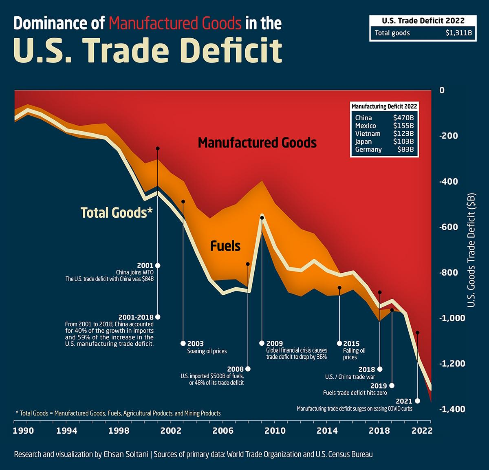

In the complex world of global finance and economics, trade deficits and algorithmic trading represent two critical elements that influence market dynamics. Trade deficits occur when a country's imports exceed its exports, leading to various economic implications. These include effects on national savings, employment, currency valuation, and foreign debt levels. Over the long term, persistent trade deficits can alter a country's economic health by increasing reliance on foreign capital to finance these deficits, affecting domestic economic stability.

Conversely, algorithmic trading employs advanced computer systems and algorithms to execute trades at high speeds and frequencies, significantly impacting market stability and efficiency. By automating trading processes, algorithmic trading facilitates rapid responses to market conditions, potentially enhancing liquidity and enabling tighter bid-ask spreads. Despite these benefits, there are concerns related to market volatility and the risk of technological failures, which necessitate stringent regulatory frameworks to ensure fairness and stability in financial markets.



This article explores the interplay between trade deficits and algorithmic trading, examining their economic impacts and potential interactions. It is essential to understand how these two phenomena can influence each other and shape the broader economic framework. By analyzing their roles and implications, we aim to provide a comprehensive understanding of how they collectively contribute to the dynamics of global economics.

## Table of Contents

## Understanding Trade Deficits

A trade deficit occurs when a nation's import expenditures exceed its export revenues. This scenario is a critical element in international trade dynamics, offering both potential benefits and drawbacks, contingent on the specific economic circumstances and how effectively it is managed. 

From one perspective, a trade deficit can signify a vibrant economy where consumers have substantial purchasing power, indicative of national wealth and economic health. Such a condition might reflect high domestic demand for imported goods, which could range from essential commodities to luxury items. However, a persistent trade deficit can result in increased reliance on foreign capital to finance these purchases, leading to a mounting external debt. This dependency can weaken a country's economic sovereignty and expose its financial system to external shocks and currency fluctuations.

Research has extensively examined how trade deficits impact various economic variables, including employment, national savings, and GDP growth. For instance, while an influx of imported goods can drive consumer choice and price competition, it may also threaten domestic industries, potentially leading to job losses in sectors unable to compete with foreign entities. Furthermore, persistent trade deficits can undermine national savings, as the financial flow meant for domestic investment is directed towards settling international accounts. Lower national savings can restrict a country's ability to invest in its growth, impeding long-term economic progress.

Economic policies play a pivotal role in managing the effects of trade deficits. Governments can implement strategic interventions to mitigate adverse impacts while enhancing benefits. This could involve promoting exports through subsidies or tax incentives, adjusting tariffs on imports, or negotiating more favorable trade agreements. Additionally, policies might focus on strengthening domestic industries to compete more effectively on a global stage, thus balancing trade disparities and fostering sustainable industrial growth.

To conclude, understanding the dual nature of trade deficits and their wide-ranging implications is essential for crafting balanced economic policies that enhance a country's economic resilience and sustainability.

## Economic Impact of Trade Deficits

Trade deficits have a multifaceted impact on a country's economy, primarily driven by the imbalance between imports and exports. One of the immediate effects of a trade deficit is the attraction of foreign capital. When a country imports more than it exports, it often needs to finance this gap, typically by borrowing from abroad. This foreign capital influx can spur economic growth by funding investments in infrastructure, job creation, and technological advancements. For instance, the availability of foreign funds can lead to the development of new transportation networks, manufacturing plants, and innovation hubs, potentially boosting the nation's productivity and employment rates.

However, trade deficits can also lead to currency depreciation. As demand for foreign currencies increases to pay for imports, the domestic currency may depreciate. This depreciation can make imports more expensive, further exacerbating the trade deficit. It can create a vicious cycle where the country continuously needs more foreign currency, weakening its currency further in global markets.

Additionally, sustained trade deficits contribute to increasing national debt. Countries need to borrow to finance deficits, which can lead to a mounting debt burden. Over time, high levels of debt can restrict a government's ability to plan for future economic initiatives as more resources are diverted to service debt obligations. This scenario can be particularly concerning if a country's debt levels approach unsustainable thresholds, potentially leading to a loss of investor confidence and increased borrowing costs.

Domestic industries may also struggle under the pressure of a trade deficit as cheaper imports flood the market, increasing competition. Local manufacturers might find it challenging to compete on price, which could lead to a reduction in market share, lower profits, and even business closures. This increased competition can suppress innovation and investment within domestic industries, leading to a decline in industrial growth.

For a country to maintain economic stability amidst a trade deficit, a balanced and strategic approach is essential. Policymakers must consider measures such as implementing tariffs or quotas to protect domestic industries, promoting exports through subsidies, or encouraging local consumption to reduce reliance on imports. Fiscal and monetary policies need to be carefully designed to manage currency [volatility](/wiki/volatility-trading-strategies) and control debt levels. Moreover, fostering an environment conducive to innovation and investment from both domestic and international sources can help mitigate some negative aspects of trade deficits, ensuring long-term economic resilience.

## Understanding Algorithmic Trading

Algorithmic trading refers to the use of computer algorithms to execute trades with high speed and precision, leveraging small changes in the market for advantage. This approach to trading relies on complex algorithms designed to analyze market conditions and identify opportunities, often executing multiple trades simultaneously across various exchanges. The automation inherent in [algorithmic trading](/wiki/algorithmic-trading) significantly enhances market [liquidity](/wiki/liquidity-risk-premium) and efficiency, as it allows for the rapid processing of vast quantities of financial data. This enables traders to capitalize on [arbitrage](/wiki/arbitrage) opportunities, manage large portfolios, and reduce transaction costs due to lower bid-ask spreads.

Python is a leading programming language in this field, due to its robust suite of financial libraries, such as NumPy, pandas, and scikit-learn. These libraries facilitate the development of sophisticated models and trading strategies by providing powerful tools for data analysis and [machine learning](/wiki/machine-learning). A basic example of a moving average crossover strategy in Python might look like this:

```python
import pandas as pd
import numpy as np

def moving_average_strategy(prices, short_window=40, long_window=100):
    signals = pd.DataFrame(index=prices.index)
    signals['signal'] = 0.0

    # Create short simple moving average
    signals['short_mavg'] = prices['Close'].rolling(window=short_window, min_periods=1, center=False).mean()

    # Create long simple moving average
    signals['long_mavg'] = prices['Close'].rolling(window=long_window, min_periods=1, center=False).mean()

    # Create signals
    signals['signal'][short_window:] = np.where(signals['short_mavg'][short_window:] > signals['long_mavg'][short_window:], 1.0, 0.0) 

    # Generate trading orders
    signals['positions'] = signals['signal'].diff()

    return signals
```

This strategy executes buy orders whenever the short-term moving average rises above the long-term average, indicating positive [momentum](/wiki/momentum).

Despite its numerous advantages, algorithmic trading is not without challenges. Market volatility can be exacerbated by the [high frequency](/wiki/high-frequency-trading) and [volume](/wiki/volume-trading-strategy) of automated trades, leading to events like the Flash Crash of 2010. Such incidents highlight the potential for technological failures, where complex systems may behave unexpectedly under stress. Additionally, there are ethical concerns over the fairness of markets heavily influenced by algorithmic traders who possess access to better technology and data. 

As a result, regulatory bodies worldwide impose scrutiny and regulations to ensure market stability and integrity. These measures include ensuring transparency, monitoring trade behaviors, and establishing safeguards against manipulative practices. The balance between allowing innovation and maintaining a fair trading environment remains a key focus for regulators, aiming to protect all market participants while fostering an efficient and dynamic trading ecosystem.

## Economic Impact of Algorithmic Trading

Algorithmic trading significantly influences financial markets by increasing liquidity and tightening bid-ask spreads. These benefits accrue as algorithms execute trades at high speeds, rapidly matching buy and sell orders. This enhanced liquidity benefits all market participants by reducing transaction costs and improving the ability to enter and [exit](/wiki/exit-strategy) positions swiftly.

A critical impact of algorithmic trading is its enhancement of price discovery. As algorithms can process vast amounts of market data in real-time, they incorporate information into asset prices more efficiently than human traders. This rapid assimilation of information contributes to more accurate pricing in markets, reflecting the latest available data.

However, the prevalent reliance on technology in algorithmic trading introduces potential risks. One notable example was the Flash Crash of May 6, 2010, during which the U.S. stock market experienced a dramatic drop then almost fully recovered within minutes. Investigations suggested that high-frequency trading and algorithmic interactions exacerbated the volatility during this event, underscoring the potential for technology-induced disruptions.

Systemic risk is another concern associated with algorithmic trading. The interconnectedness of trading algorithms means that failures or malfunctions in one system can propagate quickly across markets. Such incidents can lead to large-scale market disruptions, demonstrating the need for effective risk management strategies.

To mitigate these risks, rigorous oversight and risk management practices are essential. Market regulators must ensure that trading systems adhere to stringent standards and that there are safeguards against technological failures. Implementing circuit breakers and other safety mechanisms can help prevent extraordinary market volatility caused by algorithmic interactions. Additionally, regular stress testing and monitoring of algorithms can help identify potential vulnerabilities before they result in significant financial impacts.

Overall, while algorithmic trading offers considerable advantages in terms of market efficiency and liquidity, it is crucial that these benefits are balanced with careful management of the associated risks to maintain market integrity and stability.

## Advantages and Disadvantages of Trade Deficits

Trade deficits have a multifaceted impact on an economy, offering both opportunities and challenges. On the positive side, they facilitate access to a broader range of goods and services at potentially lower prices, thereby enhancing consumer purchasing power and improving living standards. This accessibility to cheaper imports benefits consumers by providing more choices and fostering competitive markets, which can lead to innovations and better-quality products over time.

Moreover, trade deficits can attract foreign investments. When a country runs a trade deficit, it often signifies higher consumption capability and potential market growth, appealing to international investors. This influx of foreign capital can stimulate economic growth, create jobs, and support technological advancements and infrastructure development. For example, foreign investments might help to fund new ventures or improve existing facilities, thereby boosting productivity and economic output.

On the downside, persistent trade deficits can pose several risks. One notable concern is the potential for increased national debt. As a country imports more than it exports, it may need to borrow from foreign entities to finance the gap, thereby accumulating debt over time. This rising debt level can lead to higher interest payments and constrain future fiscal policy options, posing challenges to sustainable economic management.

Additionally, economies with large trade deficits can become vulnerable to fluctuations in global markets. A sudden change in foreign exchange rates, for instance, can exacerbate the cost of imports, thereby worsening the trade deficit. This exposure to external economic shocks necessitates careful policy management to mitigate adverse impacts on national economic stability.

To ensure long-term sustainability, it is crucial for countries to balance the benefits and drawbacks of trade deficits. Economic policies must aim to harness the advantages of consumer choice and foreign investment while implementing strategies to reduce vulnerabilities such as accumulating national debt and sensitivity to market fluctuations. This balanced approach can help maintain economic resilience in an interconnected global economy.

## Advantages and Disadvantages of Algorithmic Trading

Algorithmic trading, which leverages complex algorithms to execute trades at optimal speeds, offers numerous benefits and challenges within modern financial markets. One of the primary advantages of algorithmic trading is its ability to significantly increase market participation. By providing a platform that accommodates a broad range of traders, from individual investors to large financial institutions, algorithmic trading democratizes access to markets. This inclusivity fosters greater liquidity, enabling easier buying and selling of securities without causing substantial price fluctuations.

Moreover, algorithmic trading substantially reduces transaction costs. Automated systems can execute thousands of trades concurrently, minimizing the human errors and delays associated with manual trading. This rapid execution allows traders to capitalize on short-lived market inefficiencies and price discrepancies, potentially yielding higher profits.

However, the adoption of algorithmic trading is not without its potential drawbacks. Market instability is a central concern, as the sheer speed and volume of transactions can exacerbate volatility. Events such as the Flash Crash of 2010 exemplify how algorithmic trades can amplify market swings, leading to significant financial consequences within short timespans. The reliance on technology introduces another layer of risk; system failures or glitches can lead to substantial financial losses and disrupt market operations.

Ethical concerns also arise regarding the fairness of algorithmic trading. Sophisticated strategies can confer advantages to those with access to cutting-edge technology and high-frequency trading capabilities, which may contribute to uneven playing fields. This raises questions about the fairness of market dynamics and whether all participants have an equal opportunity to succeed.

In conclusion, while algorithmic trading significantly enhances market efficiency and reduces operational costs, it also necessitates rigorous oversight to manage associated risks. Balancing the benefits and drawbacks requires a nuanced approach, ensuring that the technological advantages do not undermine market fairness and stability.

## Interplay Between Trade Deficits and Algorithmic Trading

Algorithmic trading increasingly plays a vital role in the foreign exchange markets, where national trade balances are closely monitored. By leveraging advanced algorithms, traders improve market efficiency, which can aid countries in managing trade deficits. The typical algorithmic systems process vast amounts of trade data far more swiftly than human traders, allowing for effective price discovery and enhanced liquidity. This heightened efficiency can be particularly advantageous for countries experiencing trade deficits, as it supports a more stable exchange rate environment, making imports and exports more predictable.

These algorithmic systems are also instrumental in providing policymakers with invaluable insights for informed decision-making. They sift through extensive datasets to identify trends and potential disparities, offering comprehensive analyses that can shape economic policies in response to trade imbalances. For example, through the use of machine learning, algorithms can predict future currency movements influenced by trade deficits, enabling governments to take preemptive and appropriate fiscal actions.

However, while algorithmic trading systems contribute to market stabilization, their high-speed nature presents a double-edged sword. The rapid execution of trades can lead to increased volatility, particularly in investment flows. This is evident during periods of market stress, where automated systems might exacerbate swings due to their speed and volume of trades. An illustrative example is the "Flash Crash" of 2010, where algorithm-driven trading resulted in a swift and significant drop in stock prices, highlighting the potential for such systems to induce volatility under certain conditions.

Understanding the interaction between trade deficits and algorithmic trading is crucial for navigating the market stability and economic management challenges. A balanced approach, integrating robust regulatory frameworks and advanced technological oversight, can mitigate the risks posed by algorithmic trading while harnessing its benefits for addressing trade deficits. This interplay reflects a broader trend in global finance, where technology increasingly influences economic phenomena and requires sophisticated strategies to manage its implications effectively.

## Conclusion

Trade deficits and algorithmic trading significantly influence the global economic landscape by presenting both challenges and opportunities to economies worldwide. The intricate nature of these elements underscores the importance of strategic policy design and management, which are essential for leveraging their benefits while mitigating associated risks. Effective policies can guide economies towards enhancing their overall economic health, ensuring that they can capitalize on the potential positive effects of trade deficits and algorithmic trading, such as increased market liquidity and investment inflows, while addressing the drawbacks like increased national debt and potential market instability.

A comprehensive understanding of trade deficits and algorithmic trading aids in informed decision-making and fosters sustainable growth. Policymakers, financial analysts, and economists must continuously analyze data and trends associated with these phenomena to develop strategies that promote robust economic outcomes. Incorporating insights from technological advancements in data analysis and trading systems can further refine this process. For instance, algorithmic trading systems can be programmed to assess trade data and provide predictive analytics, thus aiding policymakers in devising effective economic strategies. 

Policymakers must navigate these complexities with foresight to ensure economic stability in a dynamic global market. This involves continuously adapting policy frameworks to address evolving economic conditions and technological advancements. As global markets are increasingly interconnected, an understanding of the interplay between trade deficits and algorithmic trading becomes crucial. This foresight not only supports economic stability but also positions economies to thrive amidst global economic shifts, securing a sustainable and prosperous future.

## References & Further Reading

Krugman, P., Obstfeld, M., & Melitz, M. J. (2015). *International Economics: Theory and Policy*. Pearson Education.

Chordia, T., Roll, R., & Subrahmanyam, A. (2008). Liquidity and Market Efficiency. *Journal of Financial Economics, 87*(2), 249-268.

Gomber, P., Arndt, B., Lutat, M., & Uhle, T. (2011). High-Frequency Trading. *SSRN Electronic Journal*.

Aitken, M., & Cook, R. (2009). An Analysis of Trading Algorithms in the Market. *The Financial Review, 44*(3), 379-406.

Summers, L. H. (2013). U.S. Economic Prospects: Secular Stagnation, Hysteresis, and the Zero Lower Bound. *Brookings Papers on Economic Activity*.

