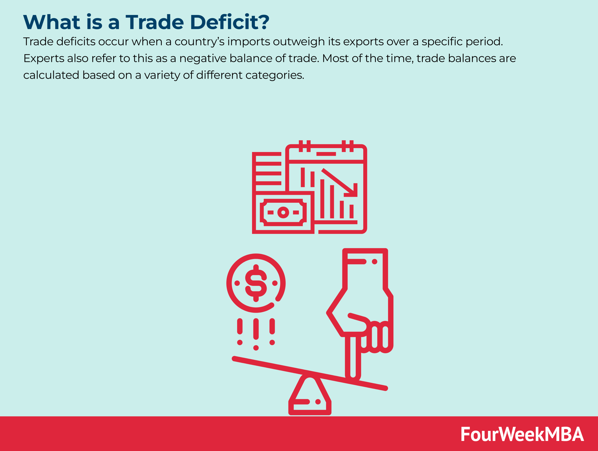

## Table of Contents

## What is a trade deficit?

A trade deficit happens when a country buys more things from other countries than it sells to them. This means the country is importing more than it is exporting. Imagine if you bought more toys from your friends than you sold to them; you would have a toy deficit. Countries measure this in terms of goods like cars and electronics, and services like tourism and banking.

Having a trade deficit isn't always bad. It can mean people in the country can enjoy more products from around the world. But if the deficit is very large, it might cause problems. The country might need to borrow money from other countries to pay for all the imports. Over time, this could lead to owing a lot of money, which can be tough to manage.

## How is a trade deficit calculated?

A trade deficit is calculated by looking at the difference between what a country exports and what it imports. If a country exports less than it imports, it has a trade deficit. For example, if a country exports $100 worth of goods and services but imports $150 worth, the trade deficit is $50.

The calculation involves adding up the total value of all exports and subtracting the total value of all imports. This can be done monthly, quarterly, or yearly. Economists use data from customs, shipping records, and other sources to figure out these numbers. The final number tells us whether the country is buying more from the world than it is selling to the world.

## What are the main causes of a trade deficit?

A trade deficit can happen because a country's people and businesses want to buy more things from other countries than they want to sell. This could be because the things they want to buy are cheaper or better quality from other places. For example, if cars from another country are less expensive or have features that local cars don't have, people might choose to buy those instead. Also, if a country's own businesses can't make enough of what people want, they will need to import more, which can lead to a trade deficit.

Another reason for a trade deficit is when a country's currency is strong compared to other countries. A strong currency makes things from other countries cheaper for people in the country, so they buy more imports. At the same time, it makes the country's own products more expensive for people in other countries, so they buy less of the country's exports. This imbalance can cause a trade deficit. Governments and central banks can influence currency value, but it's not always easy to control.

## Can a trade deficit affect a country's currency value?

Yes, a trade deficit can affect a country's currency value. When a country has a trade deficit, it means it's buying more from other countries than it's selling. To pay for all these imports, the country needs to use its own currency. If it keeps buying more and more, there can be a lot of the country's currency floating around in the world. This can make the currency less valuable because there's too much of it compared to other currencies.

This situation can lead to the currency's value going down. When the currency is worth less, it can help fix the trade deficit a bit because imports become more expensive and exports become cheaper. But if the trade deficit is very big and lasts a long time, it can make people worried about the country's economy. This worry can make the currency's value drop even more, creating a cycle that's hard to stop.

## What are the immediate economic impacts of a trade deficit?

When a country has a trade deficit, it means it's spending more money on imports than it's [earning](/wiki/earning-announcement) from exports. This can lead to less money being available in the country because the money is going to other countries to pay for the imports. Businesses might struggle to get the money they need to grow or hire more people. Also, the government might need to borrow more money, which can lead to higher interest rates. This makes it more expensive for everyone to borrow money, like for buying a house or starting a business.

A big trade deficit can also affect the value of the country's currency. If there's a lot of the country's money being used to buy things from other places, the currency might become less valuable. This can make imports more expensive, which might help reduce the trade deficit over time. But in the short term, it can make things people need, like food or fuel, more expensive. This can lead to higher prices and less money in people's pockets, which can slow down the whole economy.

## How does a trade deficit influence domestic industries?

A trade deficit can make things harder for businesses in the country. When people buy more from other countries, they might not buy as much from local businesses. This can make it tough for these businesses to make money and grow. If local businesses can't sell enough, they might have to let workers go or even close down. This means fewer jobs for people in the country, which can be bad for the economy.

Also, a trade deficit can make it harder for local businesses to compete. If things from other countries are cheaper or better, people might choose those instead of buying local. This can push local businesses to lower their prices or try to make better products, which can be hard and expensive. If they can't keep up, more businesses might struggle, leading to even more job losses and less money flowing in the country.

## What are the long-term effects of sustained trade deficits on an economy?

Over time, if a country keeps having a trade deficit, it can lead to big problems. The country might need to borrow more and more money to pay for all the things it's buying from other places. This can make the country owe a lot of money, which can be hard to pay back. If people start to worry about the country not being able to pay its debts, they might not want to lend money anymore or might ask for higher interest rates. This can make borrowing even more expensive and slow down the whole economy.

Also, a long-lasting trade deficit can hurt the country's industries. If people keep buying more from other countries, local businesses might not be able to sell enough to stay open. This can lead to fewer jobs and less money being made in the country. Over time, this can make the country weaker because it's not making as much on its own. If the currency loses value because of the trade deficit, it can make things even harder for local businesses trying to compete with cheaper imports.

## Are there any benefits to having a trade deficit?

Yes, there can be benefits to having a trade deficit. One big benefit is that people in the country can buy more things from around the world. This means they can enjoy products that might not be available or are more expensive at home. For example, if a country doesn't make a certain type of car, people can still buy that car from another country. This gives people more choices and can make life better.

Another benefit is that a trade deficit can help businesses in the country grow. When a country buys more from other places, it's like borrowing money from them. This borrowed money can be used to invest in new businesses or to help existing businesses get bigger. This can create jobs and make the economy stronger in the long run. So, even though a trade deficit means spending more than earning from trade, it can still have good effects if managed well.

## How do trade deficits impact employment within a country?

When a country has a trade deficit, it can affect jobs in a big way. If people in the country are buying more things from other countries, they might not buy as much from local businesses. This means local businesses might not make as much money. If they don't make enough money, they might have to let some workers go or even close down. This can lead to fewer jobs for people in the country, which can make it harder for people to find work.

On the other hand, a trade deficit can sometimes help create jobs, too. When a country buys more from other places, it's like borrowing money. This borrowed money can be used to start new businesses or help existing ones grow. If businesses grow, they might need to hire more people. So, even though a trade deficit can lead to fewer jobs in some industries, it can also help create jobs in others if the money is used wisely.

## What policy measures can a government implement to address a trade deficit?

A government can take several steps to fix a trade deficit. One way is to make things from other countries more expensive by adding taxes called tariffs. This can make people buy more things made at home instead of buying from other places. Another way is to help local businesses grow by giving them money or loans. This can help them make better products or sell more, which can lead to selling more things to other countries and bringing in more money.

Another thing a government can do is to make its own currency less valuable compared to other countries' money. This makes things from other places more expensive and things from home cheaper for people in other countries to buy. This can help sell more things to other countries and reduce the trade deficit. Governments can also try to make deals with other countries to buy more things from home, which can help balance out the trade.

These steps can help fix a trade deficit, but they need to be used carefully. If a government adds too many taxes or changes the value of its money too much, it can cause other problems. It's important for the government to find the right balance to help the economy without making things worse.

## How do trade deficits relate to national debt and borrowing?

A trade deficit means a country is spending more money on things from other countries than it's making from selling its own things. To pay for all these imports, the country might need to borrow money. This borrowing can add to the country's national debt. The more a country borrows to cover its trade deficit, the bigger its national debt can grow. If the trade deficit keeps going on for a long time, the national debt can get really big.

If a country's national debt gets too big, it can be hard to pay back. People and other countries might start to worry about whether the country can pay its debts. This worry can make it harder for the country to borrow more money, or it might have to pay higher interest rates. Higher interest rates mean it costs more to borrow money, which can slow down the economy. So, a big trade deficit can lead to a bigger national debt, which can cause problems if it gets out of control.

## What are the global economic implications of a major economy running a persistent trade deficit?

When a big economy like the United States or China keeps running a trade deficit for a long time, it can affect the whole world's economy. If this big economy is buying more from other countries than it's selling, it means other countries are making more money from their exports. This can help those countries grow and create jobs. But if the big economy's currency loses value because of the trade deficit, it can make things more expensive for everyone around the world who uses that currency. This can cause prices to go up in other countries, which can slow down their economies.

Also, if a major economy keeps borrowing money to pay for its trade deficit, it can make the world's financial system less stable. If people start to worry about whether this big economy can pay back its debts, it can cause problems for banks and investors everywhere. This worry can lead to less lending and investing, which can make the global economy slow down. So, a big economy's trade deficit can have a lot of effects on other countries, making the world's economy more complicated and sometimes more risky.

## What is the understanding of trade deficits?

A trade deficit occurs when the value of a country's imports surpasses that of its exports. This economic condition is often seen as a double-edged sword, with both potential benefits and drawbacks, depending on the specific economic context and how it is managed.

Trade deficits are not intrinsically negative. They might indicate a robust economy under certain circumstances. For instance, a country might run a trade deficit because its consumers and businesses have strong purchasing power, allowing them to buy more goods and services than the country produces. This can be a sign of a well-performing economy where inhabitants have higher income levels and consumption patterns. Additionally, trade deficits may signal foreign confidence in a country's economic prospects, attracting foreign investment that can be used to fuel further growth.

Nonetheless, persistent or significant trade deficits can place pressure on an economy by increasing its foreign debt dependency. Over-reliance on external financing might lead to vulnerabilities, especially if foreign investors lose confidence and withdraw their investments. This could lead to currency depreciation, increasing the cost of imports and causing inflationary pressures.

Research on trade deficits explores their multifaceted implications on various economic factors such as employment, national savings, and economic growth. Economists study whether trade deficits contribute to job losses in specific sectors, particularly manufacturing, due to increased competition from imported goods. However, some argue that trade deficits could boost employment in other areas like service industries, which may thrive when an economy imports goods and resources.

The effect on national savings is another critical aspect. A trade deficit is directly associated with a lower level of national savings relative to investment. According to the national income identity:

$$
S - I = NX
$$

where $S$ represents national savings, $I$ is investment, and $NX$ denotes net exports. A negative $NX$ (trade deficit) implies lower savings relative to investment, influencing capital flows and potentially affecting long-term economic sustainability.

Economic growth is also debated within the context of trade deficits. While some view trade deficits as a potential detractor from growth due to debt accumulation, others see them as an opportunity for countries to import capital goods, which can enhance productive capacity and future economic performance.

Overall, the implications of trade deficits are complex and subject to numerous influencing factors, necessitating continuous analysis and strategic policy interventions by governments and scholars alike.

## References & Further Reading

[1]: Krugman, P., Obstfeld, M., & Melitz, M. J. (2015). ["International Economics: Theory and Policy"](https://elibrary.pearson.de/book/99.150005/9781292409795). Pearson Education.

[2]: Chordia, T., Roll, R., & Subrahmanyam, A. (2008). ["Liquidity and Market Efficiency."](https://www.sciencedirect.com/science/article/pii/S0304405X07001833) Journal of Financial Economics, 87(2), 249-268.

[3]: Gomber, P., Arndt, B., Lutat, M., & Uhle, T. (2011). ["High-Frequency Trading."](https://papers.ssrn.com/sol3/papers.cfm?abstract_id=1858626) SSRN Electronic Journal.

[4]: Aitken, M., & Cook, R. (2009). ["An Analysis of Trading Algorithms in the Market."](https://www.sciencedirect.com/science/article/pii/S0378426623000687) The Financial Review, 44(3), 379-406.

[5]: Summers, L. H. (2013). ["U.S. Economic Prospects: Secular Stagnation, Hysteresis, and the Zero Lower Bound."](https://larrysummers.com/wp-content/uploads/2014/06/NABE-speech-Lawrence-H.-Summers1.pdf) Brookings Papers on Economic Activity.