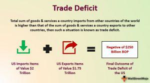

In the complex landscape of global economics and finance, two topics frequently spark debate: trade deficits and algorithmic trading. Trade deficits occur when a country's imports surpass its exports. This situation can present both benefits and drawbacks based on varying circumstances, influencing factors such as employment, currency value, and economic growth. While a trade deficit may sometimes reflect a robust economy that attracts foreign capital, persistent deficits can lead to increased foreign debt and vulnerabilities.

Algorithmic trading, in contrast, involves the employment of computer programs to execute trades automatically, typically characterized by high speed and frequency. This advanced trading method has garnered attention due to its potential to exploit market opportunities that traditional human traders might miss. However, it also raises concerns about market volatility and systemic risks, particularly during technological failures or anomalies.



This article explores trade deficits and algorithmic trading, examining their economic impacts, advantages, and disadvantages. By analyzing these elements, we aim to provide readers with a comprehensive understanding of their roles within the economic framework and their potential interactions.

## Table of Contents

## Understanding Trade Deficits

A trade deficit occurs when the value of a country's imports surpasses that of its exports. This economic condition is often seen as a double-edged sword, with both potential benefits and drawbacks, depending on the specific economic context and how it is managed.

Trade deficits are not intrinsically negative. They might indicate a robust economy under certain circumstances. For instance, a country might run a trade deficit because its consumers and businesses have strong purchasing power, allowing them to buy more goods and services than the country produces. This can be a sign of a well-performing economy where inhabitants have higher income levels and consumption patterns. Additionally, trade deficits may signal foreign confidence in a country's economic prospects, attracting foreign investment that can be used to fuel further growth.

Nonetheless, persistent or significant trade deficits can place pressure on an economy by increasing its foreign debt dependency. Over-reliance on external financing might lead to vulnerabilities, especially if foreign investors lose confidence and withdraw their investments. This could lead to currency depreciation, increasing the cost of imports and causing inflationary pressures.

Research on trade deficits explores their multifaceted implications on various economic factors such as employment, national savings, and economic growth. Economists study whether trade deficits contribute to job losses in specific sectors, particularly manufacturing, due to increased competition from imported goods. However, some argue that trade deficits could boost employment in other areas like service industries, which may thrive when an economy imports goods and resources.

The effect on national savings is another critical aspect. A trade deficit is directly associated with a lower level of national savings relative to investment. According to the national income identity:

$$
S - I = NX
$$

where $S$ represents national savings, $I$ is investment, and $NX$ denotes net exports. A negative $NX$ (trade deficit) implies lower savings relative to investment, influencing capital flows and potentially affecting long-term economic sustainability.

Economic growth is also debated within the context of trade deficits. While some view trade deficits as a potential detractor from growth due to debt accumulation, others see them as an opportunity for countries to import capital goods, which can enhance productive capacity and future economic performance.

Overall, the implications of trade deficits are complex and subject to numerous influencing factors, necessitating continuous analysis and strategic policy interventions by governments and scholars alike.

## Economic Impact of Trade Deficits

Trade deficits occur when a country imports more goods and services than it exports, potentially resulting in several significant economic impacts. One of the primary effects is on foreign investments. A trade deficit may attract foreign capital, as other countries may see an opportunity to invest in the deficit-ridden nation's industries, real estate, or government securities. For example, a consistent trade deficit might signal robust consumer demand, encouraging foreign investors to provide the capital to meet this demand, thereby fueling economic growth. This influx of foreign investments can bolster infrastructure, create jobs, and stimulate technological advancement if strategically managed.

Conversely, prolonged trade deficits can lead to currency depreciation. When a country imports more than it exports, it demands more foreign currency to pay for these imports while lessening the demand for its own currency. This imbalance may cause the domestic currency to devalue against others. A weaker currency can increase the cost of imports, thereby exacerbating the deficit in a feedback loop. Additionally, currency depreciation can lead to inflationary pressures as the prices of imported goods rise.

Another critical impact is the potential increase in national debt. Financing a trade deficit often involves borrowing from foreign lenders or selling off national assets. Over time, this can lead to a mounting national debt, placing economic strain on future generations and potentially reducing the country's credit ratings. As debt accumulates, the resources required to service this debt—interest payments, for example—divert funds from essential domestic investments like education, healthcare, and infrastructure.

Trade deficits can also substantially impact domestic industries and labor markets, particularly in the manufacturing sector. Increased imports can create competitive pressure on domestic industries, leading to reduced market share, profits, and even business closures if local companies cannot compete on price or quality. The downstream effect can be significant job losses in affected sectors, increasing unemployment rates and potentially leading to social unrest.

The debate among economists about the impacts of trade deficits is ongoing. Some argue that trade deficits reflect a strong domestic economy with high consumer demand, asserting that focusing solely on the negative aspects ignores potential long-term benefits like foreign investments and improved consumer choice. Others caution that growing deficits can lead to increased economic vulnerability, highlighting the need for balanced trade practices that protect domestic industries while fostering growth through strategic globalization. Understanding these dynamics is crucial for policymakers to devise strategic interventions that harness the benefits while mitigating risks associated with trade deficits.

## Advantages and Disadvantages of Trade Deficits

Trade deficits, while often perceived negatively, have their share of advantages. One significant benefit is the access to cheaper foreign goods. This access allows consumers to enjoy a wider variety of products at lower prices. For instance, countries with trade deficits often import goods that would be more expensive to produce domestically, thereby enhancing consumer purchasing power and increasing the standard of living.

Moreover, trade deficits can invite foreign investment influx. When a country imports more than it exports, it usually means that foreign producers are receiving the importing country's currency. This surplus of currency with foreign producers can often be reinvested in the importing country's assets, like real estate, bonds, or other forms of investment. Such investment can stimulate economic growth by creating jobs and increasing capital availability.

Despite these advantages, trade deficits can lead to increased indebtedness. Persistent trade deficits imply a country is spending beyond its means and accumulating debt. This situation can give rise to a dependence on foreign lenders, bringing about pressure to repay and potentially leading to higher interest rates as global investors demand better returns for the perceived financial risk.

Furthermore, trade deficits expose countries to global market fluctuations. Economies heavily reliant on foreign capital may face instability if investors lose confidence or if there are adverse global events. A sudden withdrawal of foreign investment could lead to economic disturbances, including currency depreciation and inflationary pressures. 

Overall, while trade deficits offer advantages in terms of consumer benefits and investment opportunities, they also pose significant economic risks that must be managed carefully.

## Understanding Algorithmic Trading

Algorithmic trading, commonly referred to as algo trading, involves the use of computer systems programmed to follow pre-defined parameters for executing trades in financial markets. These parameters can include timing, price, quantity, or any other mathematical model. The primary goal of [algorithmic trading](/wiki/algorithmic-trading) is to leverage the speed and computational power of computers to make trading decisions at a scale and scope that is unfeasible for human traders.

One of the defining features of algorithmic trading is its ability to execute orders at high speed, often within milliseconds or microseconds. This attribute allows traders to capitalize on small price movements in the market that may occur over short time frames, a practice often referred to as high-frequency trading ([HFT](/wiki/high-frequency-trading-strategies)). The ability to trade at such speeds is facilitated by advanced technologies, including high-speed data feeds, co-location services, which allow trading systems to be physically closer to exchange servers, and cutting-edge communication networks.

Python, a popular programming language in the finance industry, is widely used for developing algorithmic trading systems due to its simplicity and the abundance of libraries specifically tailored for financial applications. For example, the `pandas` library is often used for data manipulation and analysis, while `NumPy` is employed for handling large arrays and mathematical operations. A simple illustrative example of how Python can be used for basic algo trading might involve calculating a moving average crossover strategy:

```python
import pandas as pd
import numpy as np

# Sample data: closing prices
data = {'Date': ['2023-01-01', '2023-01-02', '2023-01-03', '2023-01-04'],
        'Close': [100, 102, 101, 105]}
df = pd.DataFrame(data)

# Calculate moving averages
df['Short_MA'] = df['Close'].rolling(window=1).mean()
df['Long_MA'] = df['Close'].rolling(window=2).mean()

# Generate signals
df['Signal'] = np.where(df['Short_MA'] > df['Long_MA'], 1, 0)

print(df)
```

In this example, we calculate a short-term and a long-term moving average of stock prices and define a simple trading signal: when the short-term average crosses above the long-term average, an algorithm would trigger a buy signal.

The advantages of algorithmic trading are its speed, accuracy, and ability to handle massive volumes of data and transactions simultaneously. This can lead to reduced transaction costs and increased market efficiency. Moreover, algorithmic trading minimizes the impact of human emotions and biases in trading decisions, potentially leading to more disciplined and consistent trading outcomes.

Despite its benefits, algorithmic trading is not without challenges. The reliance on technology means that system failures or glitches can lead to significant financial losses. Additionally, the high-speed nature of algorithmic trading can contribute to market [volatility](/wiki/volatility-trading-strategies), as evidenced during events like the "Flash Crash" of May 6, 2010, when the U.S. stock market experienced a rapid and deep crash within minutes. Regulatory bodies continue to scrutinize algo trading to ensure market stability and fairness.

Overall, understanding algorithmic trading involves recognizing its ability to transform how trades are executed, providing unprecedented speed and efficiency, while also appreciating the technological and ethical considerations it introduces into the financial markets.

## Economic Impact of Algorithmic Trading

Algorithmic trading significantly enhances market [liquidity](/wiki/liquidity-risk-premium) by facilitating rapid execution of trades and enabling a substantial [volume](/wiki/volume-trading-strategy) of transactions. This liquidity supports tighter bid-ask spreads, making it more efficient for traders to buy and sell securities. Additionally, algorithmic trading improves the process of price discovery by swiftly incorporating market information into security prices, thus reflecting the intrinsic value accurately and promptly.

To understand the impact of algorithmic trading on markets, consider the following Python snippet that simulates price changes influenced by algorithmic trades:

```python
import numpy as np

# Simulate price changes with and without algorithmic trading
np.random.seed(42)

# Parameters
days = 252  # simulate for one trading year
base_price = 100  # initial stock price
volatility = 0.01  # daily volatility

# Simulate price changes without algorithmic trading
prices_without_algo = [base_price]
for _ in range(days):
    change = np.random.normal(0, volatility)
    prices_without_algo.append(prices_without_algo[-1] * (1 + change))

# Simulate price changes with algorithmic trading
prices_with_algo = [base_price]
for _ in range(days):
    change = np.random.normal(0, volatility / 2)  # Assumed reduced volatility
    prices_with_algo.append(prices_with_algo[-1] * (1 + change))

# Visualize the results
import matplotlib.pyplot as plt

plt.plot(prices_without_algo, label='Without Algorithmic Trading')
plt.plot(prices_with_algo, label='With Algorithmic Trading')
plt.xlabel('Days')
plt.ylabel('Price')
plt.legend()
plt.title('Simulated Stock Prices with and without Algorithmic Trading')
plt.show()
```

The above code simulates how algorithmic trading can reduce volatility, leading to more stable prices over time. Although algorithmic trading contributes positively to market liquidity and price efficiency, its reliance on sophisticated technology and complex algorithms introduces certain risks.

One primary concern is the potential for increased market volatility and systemic risk, particularly when computer-driven trades exacerbate market swings during anomalies or technology failures. Events such as the 2010 Flash Crash highlight how algorithmic trading systems can inadvertently create liquidity vacuums, causing rapid and severe price declines due to cascading sell orders. During such events, the speed and volume that these systems operate at can outpace human intervention, leading to unintended consequences for market stability.

Moreover, algorithmic trading systems' interconnectivity can lead to systemic risk, where failures in a single system can propagate throughout the financial markets, potentially triggering widespread disruptions. Thus, while algorithmic trading provides heightened liquidity and enhances price discovery, it also necessitates rigorous risk management and oversight to prevent and mitigate potential negative impacts on market stability.

## Advantages and Disadvantages of Algorithmic Trading

Algorithmic trading presents several advantages that have transformed the dynamics of financial markets. One of the primary benefits is increased market participation. By enabling the participation of a broader range of traders, including institutional and retail investors, algorithmic trading has democratized access to financial markets. This broader participation contributes to market depth, where the availability of buy and sell orders at varied price levels enhances liquidity and can create a more efficient trading environment.

Another advantage is the reduction in transaction costs. Algorithmic trading minimizes human intervention, thereby reducing the overhead costs associated with manual trade execution. Automated systems efficiently handle trade executions across multiple markets and securities, optimizing the trade execution process to minimize costs such as bid-ask spreads and market impact costs. This cost efficiency can lead to improved profitability for traders and investors.

Moreover, faster trade execution is a hallmark of algorithmic trading. Through the use of sophisticated algorithms, trades are executed in fractions of a second, taking advantage of even the smallest market inefficiencies. The rapid execution speed allows traders to capitalize on fleeting opportunities and manage risks more effectively, which is particularly beneficial in high-frequency trading strategies.

However, algorithmic trading is not without its disadvantages. One significant risk is its potential contribution to market instability. The practice of high-frequency trading, where algorithms execute vast numbers of orders in quick succession, can amplify volatility during periods of market stress. Events such as the "Flash Crash" of 2010 highlighted how algorithmic trading can exacerbate market fluctuations, where rapid selling triggered by algorithms drove the market to plummet abruptly before recovering just as quickly.

The potential for technology malfunctions also poses a risk. Algorithmic systems rely heavily on complex software and hardware, making them susceptible to technical glitches. Any malfunction can lead to significant financial losses within a short period, necessitating robust risk management strategies and system redundancies to mitigate such risks.

Furthermore, ethical considerations arise concerning unfair trading practices. Algorithmic trading, particularly when employed in high-frequency trading, raises concerns over market fairness. Techniques such as "quote stuffing," where large volumes of fake orders are placed and quickly canceled to manipulate market prices, undermine the integrity of financial markets. As a result, regulatory bodies continue to scrutinize algorithmic trading practices to ensure market equity.

In conclusion, while algorithmic trading enhances market efficiency and reduces costs, it also introduces new complexities and risks. Balancing technological advantages with ethical and systemic considerations remains critical for the sustainable integration of algorithmic trading within global financial markets.

## Interplay Between Trade Deficits and Algorithmic Trading

The interplay between trade deficits and algorithmic trading reflects how technological advancements in financial markets influence traditional economic concepts. Algorithmic trading, driven by sophisticated algorithms that analyze vast datasets in real-time, offers new perspectives on the management and perception of trade deficits. By enabling high-speed and high-frequency trading, algorithmic systems can monitor and react to changes in global trade dynamics with greater precision.

One of the primary ways algorithmic trading impacts trade deficits is by enhancing the efficiency of foreign exchange markets. Through rapid processing of economic indicators, market news, and geopolitical events, algorithms can predict currency fluctuations, which are critical for countries dealing with trade deficits. For example, a nation experiencing a trade deficit may see its currency depreciate due to an imbalance in the supply and demand for foreign exchange. Algorithmic trading can respond to these currency movements and provide liquidity, potentially stabilizing markets and mitigating volatile swings.

Furthermore, algorithmic trading systems can analyze complex trade data to offer insights into trade patterns and discrepancies. By evaluating exports, imports, and economic indicators, these systems can identify trends that human traders might overlook. Policymakers can use these insights to make informed decisions on trade policies, tariffs, and agreements, addressing the root causes of trade deficits.

Additionally, algorithmic trading's role in global financial markets means that it can influence the flow of foreign capital. A large trade deficit might typically attract foreign investment to balance the deficit, but the speed and efficiency of algorithmic trading can accelerate this process. The infusion of foreign capital can be beneficial, stimulating economic growth and potentially reducing the burden of the deficit.

However, there are also risks associated with this interplay. The high-speed nature of algorithmic trading can lead to increased market volatility, which might exacerbate economic imbalances caused by trade deficits. Rapid changes in investment flows can lead to sudden currency appreciations or depreciations, complicating economic management for countries dealing with persistent deficits.

In conclusion, the rise of algorithmic trading significantly impacts the perception and management of trade deficits by providing deeper, real-time insights into global trade dynamics. These capabilities can inform strategic policy decisions, although they also introduce new challenges related to market stability and economic management. Understanding these interactions is crucial for policymakers aiming to navigate the complexities of modern global economics effectively.

## Conclusion

Both trade deficits and algorithmic trading wield substantial influence on the global economy. Each holds the potential to drive significant economic transformations, albeit accompanied by various challenges and risks. Understanding and managing these economic phenomena can thus be pivotal in designing effective economic policies and ensuring sustainable growth.

Trade deficits, characterized by a nation importing more than it exports, can lead to economic challenges such as increased national debt and potential currency depreciation. However, they can also signal a robust economy when they attract foreign investment and facilitate access to a broader range of goods and services. The capacity to harness these potential benefits while managing the drawbacks depends on strategic economic policies and a nuanced understanding of global trade dynamics.

Algorithmic trading has reshaped financial markets with its technological advancements. This method enhances market efficiency through improved liquidity and accelerated trade execution. Nonetheless, it introduces new risks, such as market volatility and systemic risk, especially during technology malfunctions or unforeseen market anomalies. The ethical considerations surrounding algorithmic trading practices also demand attention to ensure a fair and stable trading environment.

Both trade deficits and algorithmic trading require a deep comprehension of their economic impacts to devise policies that maximize their benefits while mitigating associated risks. Improved insights into these areas can lead to more informed decision-making and strategic planning in managing global market dynamics. By acknowledging and understanding the complexity of these phenomena, policymakers and stakeholders can better navigate the international economic landscape, fostering growth while safeguarding economic stability.

## References & Further Reading

[1]: Krugman, P., Obstfeld, M., & Melitz, M. J. (2015). ["International Economics: Theory and Policy"](https://elibrary.pearson.de/book/99.150005/9781292409795). Pearson Education.

[2]: Chordia, T., Roll, R., & Subrahmanyam, A. (2008). ["Liquidity and Market Efficiency."](https://www.sciencedirect.com/science/article/pii/S0304405X07001833) Journal of Financial Economics, 87(2), 249-268.

[3]: Gomber, P., Arndt, B., Lutat, M., & Uhle, T. (2011). ["High-Frequency Trading."](https://papers.ssrn.com/sol3/papers.cfm?abstract_id=1858626) SSRN Electronic Journal.

[4]: Aitken, M., & Cook, R. (2009). ["An Analysis of Trading Algorithms in the Market."](https://www.sciencedirect.com/science/article/pii/S0378426623000687) The Financial Review, 44(3), 379-406.

[5]: Summers, L. H. (2013). ["U.S. Economic Prospects: Secular Stagnation, Hysteresis, and the Zero Lower Bound."](https://larrysummers.com/wp-content/uploads/2014/06/NABE-speech-Lawrence-H.-Summers1.pdf) Brookings Papers on Economic Activity.