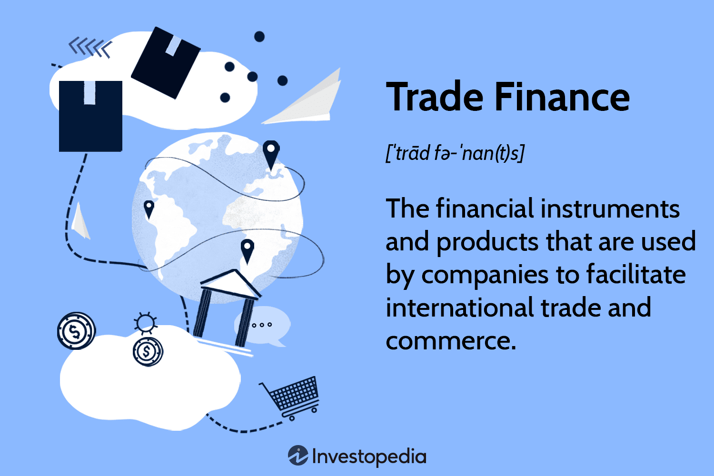

The financial trading landscape is consistently reshaped by rapid technological advancements, with algorithmic trading standing out as a pivotal development. Algorithmic trading, often referred to as algo trading, leverages sophisticated computer programs to automate trading activities. These systems execute trades based on predetermined criteria such as price, volume, and timing, aiming to maximize efficiency and accuracy. The automation inherent in algorithmic trading not only reduces human errors but also allows for the seamless execution of high-frequency trades that are otherwise untenable manually.

The intersection of finance, trade, and algorithmic trading not only enhances trading effectiveness but also fundamentally alters market dynamics. Algorithmic trading contributes to greater market liquidity and increased trade volumes, providing a competitive edge to participants. The automation ensures consistent strategy application, devoid of emotional biases, which is crucial for maintaining discipline in volatile markets. Furthermore, traders can backtest their algorithmic strategies on historical data, allowing for robust strategy validation before employing them in real-time scenarios, thus mitigating potential financial risks.



By integrating algorithmic trading, financial markets witness improvements in operational efficiency and competitive advantage. This technological innovation has transformed trading practices, enabling market participants to execute complex strategies with precision and at unprecedented speeds. As trading becomes increasingly complex, algo trading's role in facilitating enhanced decision-making and market participation is undeniable. The technological landscape of trading is constantly evolving, driven by the relentless pursuit of improved efficiency, greater accuracy, and sustained competitive advantage.

## Table of Contents

## Understanding Algorithmic Trading

Algorithmic trading, often referred to as algo trading, leverages computer algorithms to automate the process of trading in financial markets. These algorithms are designed to execute trades based on a set of predefined criteria, such as price, timing, and volume. By using these criteria, algorithmic trading seeks to execute trades more efficiently and with greater precision than manual trading.

At its core, algorithmic trading utilizes technological advancements to reduce human intervention and minimize the potential for human error. By relying on sophisticated algorithms, traders can automate the decision-making process, ensuring that trades are executed at the most opportune moments and under optimal conditions. This method not only enhances the speed and accuracy of trade executions but also improves the consistency of the trading strategy, as it eliminates the unpredictable influence of human emotions.

Common algorithms used in algorithmic trading include the Volume Weighted Average Price (VWAP), Time Weighted Average Price (TWAP), and percentage of volume strategies. The VWAP is a trading benchmark that calculates the average price a security has traded at throughout the day, based on both volume and price. The formula for VWAP is:

$$
\text{VWAP} = \frac{\sum (P_i \times Q_i)}{\sum Q_i}
$$

Where:
- $P_i$ is the price of the trade
- $Q_i$ is the quantity of the trade

TWAP, on the other hand, is a strategy that breaks up a large order and releases smaller portions of the order to the market at regular intervals, ensuring that trades are executed evenly over a specified time period. This method helps in minimizing market impact and achieving an average price close to the trade's [volume](/wiki/volume-trading-strategy)-weighted price.

Another common strategy is the percentage of volume algorithm, which dynamically adjusts the size of a trading order based on a set percentage of the market volume. This helps traders to manage large orders without significantly affecting the market.

To implement [algorithmic trading](/wiki/algorithmic-trading) strategies, traders often choose programming languages like Python due to its simplicity, robust libraries, and active community support. Sample Python code for a basic VWAP calculation might look like this:

```python
def calculate_vwap(prices, volumes):
    total_volume_price = sum(p * v for p, v in zip(prices, volumes))
    total_volume = sum(volumes)
    return total_volume_price / total_volume if total_volume > 0 else 0

# Example usage
prices = [100, 101, 102]
volumes = [200, 150, 100]
vwap = calculate_vwap(prices, volumes)
print(f"VWAP: {vwap}")
```

Algorithmic trading has transformed the landscape of financial markets by introducing greater efficiency, precision, and consistency. As technology continues to advance, the role of algorithmic trading is likely to expand, offering new opportunities for traders to enhance their strategies and outcomes.

## Financial Benefits of Algorithmic Trading

Algorithmic trading offers considerable financial benefits by harnessing the power of technology to optimize trading processes. One of the most significant advantages is the improved speed and efficiency with which trades can be executed. By utilizing advanced algorithms, these systems can initiate and complete trades within milliseconds, a feat impossible for human traders to achieve manually. This rapid execution ensures that traders can capitalize on market opportunities as they arise, often securing better price points than those attainable through human efforts.

In addition to speed, algorithmic trading enhances accuracy by relying on precise calculations to analyze vast amounts of data and execute trades accordingly. The algorithmic approach significantly reduces human errors, such as miscalculations and poor judgment, by methodically processing data and executing trades based on predefined criteria. Consequently, the trades are more consistent, precise, and less prone to error compared to manual trading methods.

Another critical benefit of algorithmic trading is the consistency and discipline it introduces into trading strategies. Human traders are often influenced by emotions such as fear and greed, leading to inconsistent decision-making. Algorithms, devoid of emotional influences, follow strict trading rules and parameters, ensuring that the strategy is applied uniformly across all trades. This discipline aids in maintaining the integrity of trading strategies over time.

Algorithmic trading also provides robust [backtesting](/wiki/backtesting) capabilities, a feature that allows traders to evaluate their strategies against historical data. This process involves simulating the trading strategy on past market data to determine its viability and effectiveness before applying it in real-time markets. By identifying patterns, potential weaknesses, and areas for improvement, backtesting helps refine strategies, enhancing their performance in live trading environments. Here’s a basic example of how backtesting might be set up using Python:

```python
import pandas as pd
import numpy as np
import matplotlib.pyplot as plt

# Sample historical data
data = pd.DataFrame({
    'Date': pd.date_range(start='1/1/2022', periods=100, freq='D'),
    'Price': np.random.rand(100) * 100
})

# Simple moving average strategy
def sma_strategy(data, window=5):
    data['SMA'] = data['Price'].rolling(window=window).mean()
    data['Signal'] = 0
    data.loc[data['Price'] > data['SMA'], 'Signal'] = 1  # Buy signal
    data.loc[data['Price'] < data['SMA'], 'Signal'] = -1 # Sell signal
    return data

# Backtesting the strategy
def backtest(data):
    data['Returns'] = data['Price'].pct_change()
    data['Strategy_Returns'] = data['Signal'].shift(1) * data['Returns']
    cumulative_returns = (1 + data['Strategy_Returns']).cumprod()
    return cumulative_returns

data = sma_strategy(data)
cumulative_returns = backtest(data)

# Visualize the results
plt.figure(figsize=(10,6))
plt.plot(data['Date'], cumulative_returns, label='Strategy Returns')
plt.legend()
plt.show()
```

In conclusion, the financial benefits of algorithmic trading, including heightened speed, enhanced accuracy, consistent strategy execution, and effective backtesting, collectively offer a compelling case for its widespread adoption in financial markets. By automating trading processes, these algorithms not only improve efficiency and precision but also provide traders with valuable insights and strategic confidence, thereby transforming modern trading paradigms.

## Impact on Financial Trade and Markets

Algorithmic trading has revolutionized the way financial markets operate, significantly increasing trade volumes and enhancing [liquidity](/wiki/liquidity-risk-premium). By automating the trading process, algorithms can handle a vast number of transactions quickly, resulting in higher overall trade volumes. This efficiency in execution reduces the time between order placement and execution, allowing traders to capitalize on more opportunities across different market conditions.

One of the primary advantages of algorithmic trading is its ability to execute large volumes of trades with minimal market impact. Algorithms can break large orders into smaller pieces and execute them gradually over time to avoid disrupting the market balance. This process is often achieved through strategies such as the Volume Weighted Average Price (VWAP) or Time Weighted Average Price (TWAP). By dispersing the order execution, these strategies help in maintaining the market stability and prevent sudden price movements that could arise from large trades.

Additionally, algorithmic trading is highly adaptable, capable of functioning efficiently in various market environments. Whether in high-frequency trading environments or longer-term strategic investment contexts, algorithms can be customized to meet different trading needs, providing traders with the flexibility to respond to changing market dynamics. This adaptability is crucial for traders seeking to optimize performance and manage risk effectively.

However, while the benefits are substantial, algorithmic trading also brings forth certain challenges. One notable issue is the potential for increased [volatility](/wiki/volatility-trading-strategies), particularly during market events known as flash crashes. These are rapid, deep, and volatile market movements that occur within an extremely short period, often triggered or exacerbated by algorithmic trading. The speed and volume of trades executed automatically can inadvertently lead to cascading effects, intensifying market instability during such events. 

Therefore, while algorithmic trading enhances market liquidity and facilitates efficient trade execution, it requires robust risk management strategies to mitigate adverse effects, such as those caused by flash crashes. Balancing the technical advantages with potential risks ensures the sustained positive impact of algorithmic trading on financial markets.

## Challenges and Criticisms

Algorithmic trading systems, despite their advantages, face several challenges and criticisms. The reliance on technology creates vulnerabilities, particularly concerning system failures or connectivity issues. When technological disruptions occur, they can lead to significant financial losses, as trades may not execute as intended or at all. These disruptions underline the importance of robust infrastructure, including fail-safes and contingency plans.

Another challenge is the over-reliance on automated systems, which can lead to complacency and insufficient human oversight. Traders and institutions might become heavily dependent on these systems, potentially ignoring the need for regular monitoring and critical assessment. This dependency could result in missed opportunities or exacerbated errors, particularly in volatile markets or during unexpected events.

Moreover, concerns about market manipulation persist, as algorithmic trading systems can be misused. High-frequency trading, for instance, raises issues about fairness and equity, where sophisticated algorithms might create asymmetries that disadvantage less technologically advanced participants. These concerns highlight the importance of stringent regulatory oversight and ethical considerations to protect market integrity.

Algorithmic trading strategies often have short lifespans, partly due to the rapidly changing market conditions and the competitive nature of financial markets. As markets evolve, algorithms that once performed well may lose their effectiveness, necessitating continual updates and revisions. This demand for constant adaptation requires ongoing research and development, as well as access to updated data and computational resources.

In sum, while algorithmic trading systems confer notable advantages, they also present challenges linked to technological dependency, oversight, market integrity, and the need for continual adaptation. These challenges require stakeholders to balance automation benefits with prudent management and regulatory compliance to safeguard market stability.

## Getting Started with Algorithmic Trading

Understanding and defining a solid trading strategy is the first step in embarking on algorithmic trading. This involves a thorough analysis of market conditions, asset behaviors, and risk management principles. At the core of any effective algorithmic strategy is the identification of specific market inefficiencies or patterns that can be exploited for profit. Traders often rely on techniques such as statistical [arbitrage](/wiki/arbitrage), mean reversion, and [momentum](/wiki/momentum) trading, among others, to devise their strategies.

The next step is selecting a programming language for coding and implementing these algorithms, with Python being a popular choice due to its simplicity and robust libraries, such as pandas for data manipulation, NumPy for numerical computations, and Matplotlib for plotting graphs. Here's a simple example of a mean reversion strategy using Python:

```python
import numpy as np
import pandas as pd
import matplotlib.pyplot as plt

# Sample stock price data
prices = pd.Series([101, 102, 100, 99, 98, 97, 98, 99, 101, 102])
mean_price = prices.rolling(window=5).mean()

# Plot
plt.plot(prices, label='Price')
plt.plot(mean_price, label='Moving Average', linestyle='--')
plt.xlabel('Time')
plt.ylabel('Price')
plt.title('Mean Reversion Strategy Example')
plt.legend()
plt.show()
```

Conducting rigorous backtesting is crucial in refining trading strategies. Backtesting involves testing the algorithm on historical data to validate its potential profitability and risk in a live market environment. Tools such as QuantConnect or Backtrader provide platforms specifically designed for backtesting trading strategies with realistic simulations.

The selection of a reliable broker and trading platform that supports algorithmic trading is essential for deploying algorithms into the market. Key factors to consider in choosing a broker include transaction fees, programming support, server reliability, and execution speed. Platforms like [Interactive Brokers](/wiki/interactive-brokers-api) and MetaTrader provide comprehensive algorithmic trading support, offering APIs for seamless strategy implementation.

Each step in getting started with algorithmic trading requires careful planning and execution. With a well-defined strategy, the right technological tools, and rigorous testing, traders are well-positioned to take advantage of the efficiencies and opportunities offered by algorithmic trading in today's financial markets.

## Conclusion

Algorithmic trading has undeniably reshaped finance and trade, bringing forth transformative changes in market dynamics. By enabling faster and more accurate execution of trades, it streamlines operations and minimizes human error. This increased efficiency is not only beneficial for individual traders but also enhances the overall functioning of financial markets. Automated systems reduce emotional biases, leading to more disciplined trading strategies that align consistently with predefined criteria.

Despite these advantages, algorithmic trading comes with its own set of challenges. It's crucial to acknowledge and manage these risks diligently. Technological failures, system malfunctions, and connectivity issues can lead to significant financial setbacks. Therefore, maintaining robust infrastructure and continuous monitoring is essential to mitigate these risks. Over-reliance on algorithms can also foster complacency, underscoring the need for human oversight to ensure the integrity and reliability of automated systems.

As technology progresses, it becomes increasingly important for traders and financial institutions to keep abreast of these developments. New tools and methodologies continue to emerge, necessitating ongoing adaptation and refinement of trading strategies. By doing so, market participants can fully harness the potential of algorithmic trading, staying competitive and responsive to market changes.

In conclusion, while algorithmic trading presents certain challenges, its benefits—such as improved efficiency, precision, and strategic discipline—undoubtedly outweigh the drawbacks. This revolutionary approach has the capacity to redefine the financial industry, promising a future where technology and finance are intricately intertwined to achieve optimal trading outcomes.

## References & Further Reading

[1]: Aldridge, I. (2013). ["High-Frequency Trading: A Practical Guide to Algorithmic Strategies and Trading Systems."](https://www.amazon.com/High-Frequency-Trading-Practical-Algorithmic-Strategies/dp/1118343506) Wiley.

[2]: Narang, R. K. (2013). ["Inside the Black Box: A Simple Guide to Quantitative and High-Frequency Trading."](https://onlinelibrary.wiley.com/doi/book/10.1002/9781118662717) Wiley.

[3]: De Prado, M. L. (2018). ["Advances in Financial Machine Learning."](https://www.amazon.com/Advances-Financial-Machine-Learning-Marcos/dp/1119482089) Wiley.

[4]: Chan, E. P. (2009). ["Quantitative Trading: How to Build Your Own Algorithmic Trading Business."](https://github.com/ftvision/quant_trading_echan_book) Wiley.

[5]: Kissell, R. (2013). ["The Science of Algorithmic Trading and Portfolio Management."](https://www.sciencedirect.com/book/9780124016897/the-science-of-algorithmic-trading-and-portfolio-management) Academic Press.

[6]: Aronson, D. R. (2006). ["Evidence-Based Technical Analysis: Applying the Scientific Method and Statistical Inference to Trading Signals."](https://www.amazon.com/Evidence-Based-Technical-Analysis-Scientific-Statistical/dp/0470008741) Wiley.