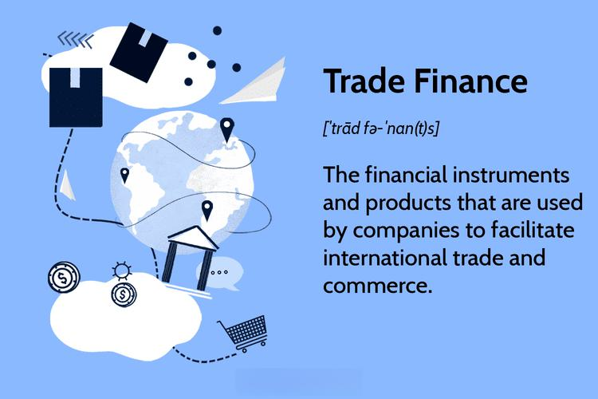

Trade finance and algorithmic trading play crucial roles in the global trading landscape by offering unique yet interconnected benefits to traders and financial institutions. Trade finance encompasses a range of financial tools designed to support international trade. It enables importers and exporters to mitigate risks associated with cross-border transactions, such as currency fluctuations, political instability, and creditworthiness of trading partners. Through financial instruments like letters of credit, trade finance provides the necessary assurance and liquidity that facilitate smooth international trade operations.

Algorithmic trading, in contrast, leverages cutting-edge technology to optimize trading decisions by minimizing human error and biases. By using sophisticated algorithms, this approach increases the speed and efficiency of trade execution and enhances market response times. Algorithms, defined by precise, predefined criteria, empower traders to execute complex trading strategies virtually instantaneously, ensuring that trades are completed at optimal prices and that market opportunities are swiftly capitalized upon.



This article examines the financial advantages of trade finance and algorithmic trading, highlighting how these mechanisms collectively streamline trading operations. By ensuring secure transactions and reducing the risks inherent in global trade, trade finance contributes significantly to the stability and growth of international markets. Simultaneously, algorithmic trading improves the accuracy and efficiency of trading activities, offering significant benefits in terms of execution speed, cost reduction, and the ability to analyze vast datasets for more informed decision-making. These tools, while distinct, are integral to the future progression and competitiveness of financial markets worldwide.

## Table of Contents

## Understanding Trade Finance

Trade finance is a crucial component in global trade operations, providing the necessary financial tools to facilitate international transactions between importers and exporters. This mechanism addresses the various risks and challenges inherent in cross-border trade, such as payment risks and liquidity concerns, thereby ensuring the smooth flow of goods and capital across the globe.

Central to trade finance are financial instruments such as letters of credit, documentary collections, and guarantees, which play essential roles in bridging the trust gap between trading partners. A letter of credit, for example, serves as a guarantee from a bank that a buyer's payment to a seller will be received on time and for the correct amount. Should the buyer fail to make a payment on the purchase, the bank is required to cover the full or remaining amount of the purchase. This instrument helps mitigate the risk of non-payment and builds trust between parties who may not have prior dealings with each other.

Export credit agencies (ECAs) also make significant contributions to trade finance by providing guarantees, insurance, and sometimes direct loans to exporters. These agencies, typically government-backed, help domestic companies minimize the risks associated with international trade, such as political or commercial risks in foreign markets. By underwriting these risks, ECAs enable exporters to extend credit terms to foreign buyers, thus enhancing their competitiveness in the international market.

Trade finance smoothly reconciles the diverse needs and expectations of trade stakeholders. By ensuring that payments and goods can move without significant delays, it helps maintain the equilibrium in international supply chains. Without trade finance, businesses would face increased uncertainties regarding payment settlement and currency conversion, potentially halting or complicating cross-border trade operations.

Overall, trade finance acts as the backbone of international trade, providing the necessary financial stability and confidence that encourages global economic activity. By minimizing payment risks and ensuring that credit and [liquidity](/wiki/liquidity-risk-premium) are available to traders, it sustains the essential flow of goods, services, and payments worldwide, facilitating a dynamic and interconnected global market.

## Financial Benefits of Trade Finance

Trade finance plays a critical role in reducing the inherent risks of international trade by providing financial backing through various instruments such as letters of credit, guarantees, and insurance. These instruments are designed to ensure trust and mitigate risks between trading partners who may not have prior relationships.

One of the primary financial benefits of trade finance is the enhancement of cash flow for businesses. Trade finance allows transactions to occur smoothly by providing the necessary capital to cover the time gap between shipment and payment. This reduces the risk of non-payment and shipment delays, which are common concerns in international trade. For instance, a letter of credit from a reputable financial institution assures the exporter that payment will be made, thus reducing payment risk and ensuring that products are shipped on time.

By ensuring the availability of working capital, trade finance enables companies to increase their revenue and efficiently meet demand. Access to immediate funding allows businesses to capitalize on trading opportunities without the bottleneck of insufficient cash reserves. This financial cushion helps businesses to maintain their supply chain dynamics and respond timely to market demands.

Trade finance mechanisms also enhance operational efficiency by securing the necessary resources for businesses to fulfill their trade commitments. This financial support promotes economic growth as companies can focus on expanding their market reach and scale operations without being constrained by liquidity concerns. The assurance provided by these financial products not only allows businesses to operate more efficiently but also fosters confidence among international trading partners, facilitating smoother and more frequent transactions.

In summary, trade finance reduces transactional risks, improves cash flow, and optimizes operational efficiency, thereby supporting the financial growth of businesses engaged in international trade. This system of financial tools and instruments not only solidifies global trading relationships but also enhances the overall stability and predictability of international trade markets.

## Exploring Algorithmic Trading

Algorithmic trading employs sophisticated computer algorithms to execute trades based on predefined parameters set forth by traders. This method significantly enhances both the speed and consistency of trade execution, setting it apart from traditional manual trading. By minimizing human intervention and associated emotional biases, [algorithmic trading](/wiki/algorithmic-trading) ensures that trading decisions are based on objective, systematic analysis rather than subjective judgment.

The core strength of algorithmic trading lies in its capability to analyze vast datasets at remarkable speeds. This computational power facilitates the optimization of trading strategies and quick adaptation to market dynamics. Various strategies are employed within algorithmic trading, tailored to specific trading objectives. For instance, [trend following](/wiki/trend-following) is a strategy that identifies and capitalizes on patterns in price movements over time. Arbitrage exploits price discrepancies of the same asset across different markets, allowing traders to secure profits with minimal risk. Mean reversion, another widely used strategy, is based on the principle that asset prices will often revert back to their historic mean.

The programming of these algorithms typically involves setting criteria based on parameters like timing, price, quantity, or any mathematical model. Python, due to its extensive libraries and ease of use, is frequently utilized in developing algorithmic trading models. Here's an example of a simple Python script that might be used to implement an algorithmic trading strategy:

```python
import numpy as np
import pandas as pd
import matplotlib.pyplot as plt
from datetime import datetime
from backtrader import Cerebro, Strategy, SignalStrategy

# Sample class for Moving Average Crossover trading strategy
class MovingAverageCrossover(Strategy):
    params = (('short_period', 50), ('long_period', 200),)

    def __init__(self):
        self.short_moving_avg = SimpleMovingAverage(self.data.close, period=self.params.short_period)
        self.long_moving_avg = SimpleMovingAverage(self.data.close, period=self.params.long_period)
        self.crossover = self.short_moving_avg - self.long_moving_avg

    def next(self):
        if self.crossover[0] > 0:
            self.buy()
        elif self.crossover[0] < 0:
            self.sell()

cerebro = Cerebro()
cerebro.addstrategy(MovingAverageCrossover)
cerebro.run()
```

The above code demonstrates a basic Moving Average Crossover strategy implemented with the Backtrader library in Python. This script evaluates two moving averages of differing periods and executes buy orders when the shorter-term moving average crosses above the longer-term moving average and sell orders when the reverse occurs.

Algorithmic trading not only speeds up transaction processes but also allows for executing large volumes with precision, reducing transaction costs and enhancing market liquidity. The technology has revolutionized trading by providing a refined approach to market engagement, aligning with various trading goals through its diverse strategy options.

## Benefits of Algorithmic Trading

Algorithmic trading presents significant advantages to market participants through its advanced use of technology to enhance trading operations. One of the primary benefits is the increased speed and precision of trade execution. By utilizing computer algorithms, traders can execute orders in milliseconds, substantially faster than a human could. This rapid execution is crucial in taking advantage of fleeting price discrepancies in the market, which can lead to more profitable trading opportunities.

Moreover, algorithmic trading significantly reduces transaction costs. The automation of trading processes eliminates the need for manual intervention and associated costs, allowing trades to be executed at the most optimal prices. The increased efficiency also contributes to improved market liquidity, as the ability to process a high [volume](/wiki/volume-trading-strategy) of transactions quickly ensures that markets remain fluid and responsive to demand and supply dynamics.

Backtesting is another critical advantage of algorithmic trading. Through [backtesting](/wiki/backtesting), traders can test and validate their trading strategies against historical data. This process helps to identify potential weaknesses and strengths in strategies before they are implemented in live trading environments, thereby optimizing the potential for success. Python is commonly used for such backtesting processes due to its robust data analysis libraries like pandas and NumPy. For instance, a simple backtest could involve iterating over historical data to simulate hypothetical trades:

```python
import pandas as pd

# Load historical market data
data = pd.read_csv('historical_prices.csv')

# Hypothetical trading strategy: buy if price decreases by 1%
for i in range(1, len(data)):
    if data['Close'][i] < data['Close'][i-1] * 0.99:
        # Simulate a buy action
        print(f"Buy at {data['Close'][i]} on {data['Date'][i]}")
```

The automation inherent in algorithmic trading also minimizes the risk of human error and emotional bias in the decision-making process. By relying on predefined, objective criteria, algorithmic systems ensure consistent trading behavior, free from the fluctuations caused by human psychology, such as fear or overconfidence, which can adversely affect trading outcomes.

Furthermore, automated trading facilitates operations across different time zones without the need for constant human monitoring. This global reach supports continuous trading activities in markets that operate beyond traditional trading hours, supporting strategies that capitalize on international market movements and opportunities.

In summary, algorithmic trading empowers traders with tools that enhance speed, accuracy, and efficiency while minimizing costs and human error, making it an indispensable element in modern financial markets.

## Synergy Between Trade Finance and Algorithmic Trading

Trade finance and algorithmic trading offer distinct advantages, yet their integration yields powerful synergies within the financial ecosystem. Trade finance ensures secure and viable transactions by providing essential financial instruments such as letters of credit, which mitigate the risk of non-payment and enable smooth cross-border transactions. It supports the liquidity and continuity of international trade by ensuring that exporters receive payment and importers obtain goods.

In contrast, algorithmic trading enhances the efficiency of market operations through automated trade execution. By leveraging computer algorithms to analyze vast amounts of market data and execute trades at high speeds, it reduces the dependence on human intervention and minimizes errors. The precision and rapid response capabilities of algorithmic trading ensure that trades are executed at optimal prices, improving the liquidity and depth of markets.

The synergy between trade finance and algorithmic trading becomes evident when considering the entire lifecycle of a trade transaction. Trade finance offers the framework for secure and reliable transactions, which is crucial for maintaining trust between parties in international trade. Simultaneously, algorithmic trading optimizes the timing and execution of financial trades, ensuring that financial institutions can respond swiftly to market changes and maintain competitive pricing.

Together, these mechanisms offer a comprehensive strategy for mitigating risk and enhancing profitability in international trade. Trade finance reduces the inherent risks of international transactions, such as currency fluctuations and political instability, while algorithmic trading maximizes returns by optimizing trade execution based on real-time market analysis.

This integration fosters innovation, driving financial institutions to adopt new technologies and approaches that enhance their competitiveness in global markets. The seamless collaboration between these mechanisms not only streamlines operations but also paves the way for more robust and transparent financial markets. As businesses increasingly rely on these advanced tools, they are better equipped to navigate the complexities of global trade and capitalize on emerging opportunities.

## Conclusion

The convergence of trade finance and algorithmic trading marks a significant shift in the way modern trade mechanisms operate, setting the stage for a future where financial transactions are more seamless, secure, and efficient. Both trade finance and algorithmic trading contribute to enhancing the robustness, transparency, and efficiency of the financial market landscape. Trade finance supports international trade by providing essential credit and liquidity, which help in mitigating common risks such as non-payment and shipment delays. Its integration with algorithmic trading, which leverages technology for swift and precise trade execution, creates an ecosystem that can handle high volumes of transactions with improved accuracy and reduced costs.

By embracing these tools, businesses and financial institutions are better equipped to streamline their operations, thereby minimizing risks and maximizing their potential reach in global markets. This adoption facilitates expanded market access and scalability, enabling more competitive and diversified trading opportunities across borders. As financial markets undergo continuous transformation driven by technological innovation, the synergistic collaboration and further enhancement of trade finance and algorithmic trading promise to drive the next wave of advancements. This evolution will likely bring about more sophisticated trading models and mechanisms, further solidifying their role in the ever-growing global trading environment.

## References & Further Reading

[1]: ["Trade Finance: Principles, Practices, and Procedures"](https://flow.db.com/trade-finance/trade-finance-a-practitioner-s-guide) by Rajesh Kumar

[2]: ["International Trade and Finance: Overview and Current Issues"](https://crsreports.congress.gov/product/pdf/R/R46669) by Congressional Research Service

[3]: ["Algorithmic Trading: Winning Strategies and Their Rationale"](https://www.amazon.com/Algorithmic-Trading-Winning-Strategies-Rationale-ebook/dp/B00CY5HC0U) by Ernest P. Chan

[4]: ["Python for Finance: Mastering Data-Driven Finance"](https://www.amazon.com/Python-Finance-Mastering-Data-Driven/dp/1492024333) by Yves Hilpisch

[5]: ["Algorithmic Trading and DMA: An Introduction to Direct Access Trading Strategies"](https://archive.org/details/algorithmictradi0000john) by Barry Johnson