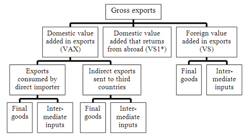

## Table of Contents

## What is Trade in Value Added (TiVA)?

Trade in Value Added (TiVA) is a way to measure how much value a country adds to the products and services it trades with other countries. Instead of just looking at the total value of what is imported and exported, TiVA looks at the value added at each step of the production process. For example, if a country imports parts, adds some value by assembling them into a product, and then exports the finished product, TiVA helps to show how much value was added by that country.

This method is useful because it gives a clearer picture of global trade and economic relationships. Traditional trade statistics can be misleading because they count the full value of a product each time it crosses a border, even if it's just a part of a larger product. By using TiVA, policymakers and businesses can better understand where value is being created and how interconnected global supply chains are. This helps in making more informed decisions about trade policies and economic strategies.

## How does TiVA differ from traditional trade statistics?

TiVA, or Trade in Value Added, is different from traditional trade statistics because it focuses on the value that a country adds to a product, not just the total value of the product when it is imported or exported. Traditional trade statistics count the full value of a product every time it crosses a border. For example, if a car part is made in one country, sent to another country to be put into a car, and then the car is exported to a third country, traditional statistics would count the full value of the car part and the car each time they cross a border. This can make it seem like more trade is happening than there really is.

On the other hand, TiVA looks at how much value each country adds at each step of making the product. Using the same car example, TiVA would only count the value added by the country that makes the car part and the value added by the country that assembles the car. This gives a clearer picture of where the real economic activity is happening and how countries are connected through global supply chains. By using TiVA, we can see which countries are adding the most value and how trade policies might affect different parts of the production process.

## Why is understanding TiVA important for global trade analysis?

Understanding TiVA is important for global trade analysis because it shows us where the real value is being added in the production of goods and services. Traditional trade [statistics](/wiki/bayesian-statistics) can be misleading because they count the full value of a product every time it crosses a border. This can make it seem like there is more trade happening than there really is. With TiVA, we get a clearer picture of which countries are actually contributing to the value of a product. This helps us understand how interconnected global supply chains are and which countries are adding the most value.

This information is crucial for policymakers and businesses when making decisions about trade policies and economic strategies. For example, if a country knows that it adds a lot of value to a certain product, it might want to focus on improving that part of its production process or protecting it with trade policies. Also, understanding TiVA helps countries see how they fit into global trade networks and how changes in one part of the world can affect them. This can lead to better cooperation and more effective trade agreements that benefit everyone involved.

## What are the key components of TiVA?

TiVA, or Trade in Value Added, is made up of several important parts. The main part is the value added by each country in the production process. This means looking at how much a country contributes to the final product, not just the total value of what is imported or exported. For example, if a country makes a car part and another country assembles it into a car, TiVA looks at the value added by each country, not just the full value of the car.

Another key component is understanding global supply chains. TiVA helps us see how different countries are connected through these chains. It shows how products move from one country to another, with each country adding a bit of value along the way. This helps us understand the flow of goods and services and how countries depend on each other.

Lastly, TiVA includes data on trade in services, not just goods. Many services, like transportation or design, are part of making a product. TiVA takes these services into account to give a complete picture of how value is added. This is important because services can be a big part of the value added in many products.

## How is TiVA calculated?

To calculate TiVA, economists use a special method called input-output analysis. They start by looking at all the goods and services that a country produces and uses. This includes everything from raw materials to finished products and services. They then track how these goods and services move between different countries and industries. By doing this, they can see how much value each country adds to the final product. For example, if a country makes a car part and another country assembles it into a car, the economists would figure out how much value each country added to the car.

This process involves using a lot of data from different sources, like trade statistics and economic surveys. The data is put into big tables that show how goods and services flow through the economy. These tables help economists see the whole picture of global trade and how value is added at each step. By understanding TiVA, we can see which countries are really contributing to the value of products and how global supply chains work. This helps make better decisions about trade and economic policies.

## What data sources are used to compile TiVA statistics?

To compile TiVA statistics, economists use data from many places. They look at trade statistics, which tell them how much goods and services are imported and exported. They also use economic surveys that show how much different industries produce and use. Sometimes, they get information from national accounts, which give a big picture of a country's economy. All this data helps them understand how goods and services move between countries and industries.

This data is put into big tables called input-output tables. These tables show how goods and services flow through the economy. By looking at these tables, economists can see how much value each country adds to a product at each step of the production process. This helps them calculate TiVA and understand global supply chains better.

## Can you explain the role of global value chains in TiVA?

Global value chains are very important for understanding Trade in Value Added (TiVA). These chains show how products are made in different countries, with each country adding a bit of value to the final product. For example, a smartphone might have parts made in one country, put together in another, and then sold all over the world. TiVA helps us see how much value each country adds along the way. This gives us a better picture of how countries work together to make things.

Understanding global value chains through TiVA is useful for making smart decisions about trade and business. If we know which countries add the most value to a product, we can see where the real economic activity is happening. This helps countries decide where to focus their efforts to improve their part of the production process. It also shows how changes in one country can affect others, helping everyone work together better in the global economy.

## How does TiVA impact national economic policies?

TiVA, or Trade in Value Added, helps countries make better economic policies by showing where the real value is added in making things. Instead of just looking at the total value of what a country imports and exports, TiVA looks at the value added at each step. This helps countries see which parts of their economy are doing well and where they can do better. For example, if a country adds a lot of value by making car parts, it might want to focus on making those parts even better or protecting that part of the economy with special trade rules.

Knowing about TiVA also helps countries work together better. When countries understand how they fit into global supply chains, they can make trade agreements that help everyone. For example, if one country is good at making parts and another is good at putting them together, they can work together to make the best products. This can lead to more jobs and a stronger economy for both countries. By using TiVA, countries can make smarter choices about trade and help their economies grow.

## What are the challenges in measuring and interpreting TiVA?

Measuring and interpreting TiVA can be tricky because it needs a lot of detailed data from many different places. Countries have to share information about how much they produce, what they import and export, and how these goods and services move between industries. Sometimes, this data is not easy to get or it might not be the same in every country. This can make it hard to put all the pieces together to see the whole picture of global trade.

Another challenge is understanding how to use the TiVA data correctly. Even if we have all the data, it can be hard to figure out what it means for trade and economic policies. For example, if a country adds a lot of value to a product, it might seem like a good idea to protect that part of the economy. But if other countries are also important in the global supply chain, changing trade rules could affect them too. So, it's important to look at the big picture and think about how changes in one place can affect the whole world.

## How can TiVA be used to assess the competitiveness of industries?

TiVA can help us see which industries in a country are doing well by showing how much value they add to products. If an industry adds a lot of value, it means that industry is good at what it does and can compete well with other countries. For example, if a country's car parts industry adds a lot of value, it shows that the country is good at making car parts and can sell them around the world.

Looking at TiVA also helps us understand how different industries work together in global supply chains. If an industry is adding a lot of value, it might be because it works well with other industries in other countries. This can show that the industry is not just good on its own, but also good at working with others. By understanding this, countries can focus on making their industries even better and more competitive.

## What are some case studies that illustrate the application of TiVA?

One good example of using TiVA is in the electronics industry. Let's say a smartphone is made with parts from many countries. The screen might come from South Korea, the processor from Taiwan, and it's put together in China. By using TiVA, we can see how much value each country adds to the smartphone. This helps us understand that even though the phone is made in China, other countries like South Korea and Taiwan are also important because they add a lot of value. This can help these countries work together to make better trade rules and improve their parts of the production process.

Another example is the car industry. Imagine a car that has parts made in Germany, assembled in Mexico, and sold in the United States. Traditional trade numbers might show that Mexico exports a lot of cars, but TiVA shows us that Germany adds a lot of value by making the car parts. This helps us see that Germany is also very important in the car supply chain. By understanding this, Germany and Mexico can work together to make the car industry stronger. They can focus on what they do best and make trade rules that help both countries.

## How might future trends affect the relevance and methodology of TiVA?

As global trade keeps changing, TiVA might need to change too. More countries are working together to make things, so we'll need even more detailed data to understand how value is added. Also, new technology like AI and automation might change how things are made. This could mean we need to update our TiVA methods to keep up with these changes. For example, if robots start making more things, we'll need to figure out how to measure the value they add.

Even though it might be harder to get all the data we need, TiVA will still be important for understanding global trade. It helps countries see where they fit in the big picture and make smart choices about trade and business. As the world keeps getting more connected, TiVA can help us understand how changes in one place can affect the whole world. This makes it a useful tool for the future, even if we need to keep updating how we use it.

## References & Further Reading

[1]: Baldwin, R. (2012). ["Global Supply Chains: Why They Emerged, Why They Matter, and Where They are Going."](https://www.asiaglobalinstitute.hku.hk/storage/app/media/pdf/richard-baldwin.pdf) National Bureau of Economic Research Working Paper No. 17716.

[2]: Johnson, R. C., & Noguera, G. (2012). ["Fragmentation and Trade in Value Added over Four Decades."](https://www.nber.org/papers/w18186) National Bureau of Economic Research Working Paper No. 18186.

[3]: Koopman, R., Wang, Z., & Wei, S. J. (2014). ["Tracing Value-Added and Double Counting in Gross Exports."](https://www.nber.org/papers/w18579) American Economic Review, 104(2), 459-494.

[4]: De Backer, K., & Miroudot, S. (2013). ["Mapping Global Value Chains."](https://www.oecd-ilibrary.org/mapping-global-value-chains_5k3v1trgnbr4.pdf) OECD Trade Policy Papers, No. 159.

[5]: WTO and OECD. (2013). ["Measuring Trade in Value Added: An OECD-WTO Joint Initiative."](https://www.oecd.org/en/tiva.html) Paris: OECD Publishing. 

[6]: OECD. (2021). ["TiVA Database: Trade in Value Added."](https://www.oecd.org/en/tiva.html) OECD Publishing.

[7]: Dedrick, J., Kraemer, K. L., & Linden, G. (2010). ["Who Profits from Innovation in Global Value Chains? A Study of the iPod and Notebook PCs."](http://web.mit.edu/is08/pdf/Dedrick_Kraemer_Linden.pdf) Industrial Marketing Management, 39(5), 793-804.