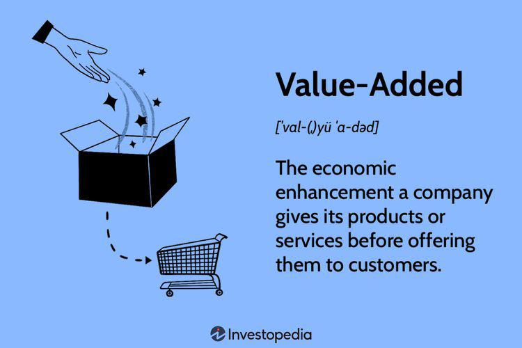

The landscape of global trade is undergoing a rapid transformation propelled by technological innovations and intricate economic interactions. As international supply chains become more interconnected, understanding the nuances of trade patterns is increasingly vital. Trade in Value Added (TiVA) represents a groundbreaking statistical approach that sheds light on the value-added components in the global trade network. This method departs from traditional trade statistics by focusing on the value derived from each stage of production across borders, rather than merely tracking the gross exports and imports.

TiVA plays a crucial role in offering businesses and policymakers the insights necessary to navigate the ever-evolving complexities of international commerce. By highlighting the origins and flows of value added throughout different countries, TiVA helps to eliminate the issue of double-counting in standard trade statistics. This creates a more accurate depiction of economic contributions from various nations involved in global supply chains.



Understanding the intricacies of TiVA is not only important for developing informed trade policies but also for identifying competitive advantages in the global marketplace. Moreover, the application of TiVA principles extends beyond traditional trade analysis. Its insights hold significant implications for algorithmic trading, enabling the fine-tuning of predictive trading strategies that are more reflective of real-world economic environments. 

This article explores the concept of TiVA, elucidating its importance in global trade, and the potential benefits it offers to algorithmic trading frameworks. As economies continue to globalize, the ability to leverage TiVA's insights will be essential for maintaining economic competitiveness and enhancing trade efficiency.

## Table of Contents

## What is Trade in Value Added (TiVA)?

Trade in Value Added (TiVA) represents a significant advancement in how we understand international trade dynamics. Unlike conventional trade statistics that typically measure gross trade flows—considering the entire value of goods and services as they pass through national boundaries—TiVA provides a nuanced perspective by focusing on the actual value added by each country in the production process. This approach is essential for accurately depicting the global supply chain's intricacies, as it reduces the issue of double-counting often found in traditional trade measurements.

In traditional trade accounting, a product exported and then re-exported involves counting its entire value multiple times, leading to inflated trade statistics. TiVA methodology, however, breaks down the production process, noting the specific value additions at each stage. Thus, it tracks where value is genuinely added to a product, offering a more accurate reflection of economic contributions across borders.

Consequently, TiVA enables a detailed view of the value creation process in international trade. When a product is manufactured, components and services might originate from multiple countries. By isolating the value added by each country, TiVA highlights the specific contributions and roles of different economies in global production networks. This approach aids in understanding which countries contribute significant value and can inform strategies related to trade negotiations, tariffs, and economic policy.

For example, consider the assembly of a smartphone, which involves sourcing raw materials, manufacturing components, assembling the product, and marketing. Traditional [statistics](/wiki/bayesian-statistics) would count the smartphone's full value each time it crosses a border, whereas TiVA would track the added value at each step—for instance, the design work in the United States, chip manufacturing in South Korea, final assembly in China, and marketing in Europe. TiVA's detailed analysis allows policymakers and businesses to identify where significant value is added and make informed decisions based on specific contributions, rather than merely gross trade volumes. 

Overall, the TiVA approach offers a refined analytical tool for interpreting the complexities of global trade, reflecting the distributed nature of modern production and the interconnectedness of national economies.

## Importance of TiVA in Global Trade

Trade in Value Added (TiVA) serves as a crucial framework for policymakers to analyze the intricate web of economic relations that connect nations worldwide. Traditional trade statistics tend to overstate the contribution of certain nations to global trade by counting the gross value of goods and services multiple times as they cross borders. TiVA, on the other hand, addresses this by mapping out the actual value added by each country in the production process. This level of detail provides a more precise understanding of trade dynamics and international economic dependency.

One of the primary advantages of TiVA is its ability to unveil the true functioning of global supply chains. By highlighting the input contributions from various economies into final goods and services, it reveals the complex interdependencies that characterize modern international trade. For example, many countries might contribute components or raw materials for a single product, each adding a portion of the final value. TiVA provides an invaluable view of these contributions, allowing for a comprehensive evaluation of global supply network efficiency.

Informed by TiVA data, nations can craft more strategic trade policies, recognizing their strengths and vulnerabilities within global value chains. For instance, understanding the precise value added by a country enables it to make informed decisions on whether to invest in certain sectors or industries. Furthermore, TiVA aids in identifying competitive advantages, helping countries optimize their role in the global market. This strategic positioning can lead to more robust economic performance by aligning national strengths with global demand and supply trends.

Overall, TiVA empowers countries to enhance their economic strategies, offering an advanced level of analysis that was not previously possible. As global trade continues to evolve, the insights derived from TiVA stand as essential tools for maintaining and strengthening economic competitiveness on the international stage.

## TiVA and Algorithmic Trading

Algorithmic trading, which relies on executing orders using automated strategies, stands to gain significantly from the integration of Trade in Value Added (TiVA) data. Traditional trading strategies often depend on price movements, technical indicators, and market sentiment. However, by incorporating TiVA insights into these algorithms, traders can enhance their understanding of underlying economic drivers, specifically those concerning global supply chain dynamics.

TiVA provides critical data regarding how value is added at each stage of production as goods and services cross international borders. This data can be integrated into [algorithmic trading](/wiki/algorithmic-trading) models to account for fluctuations in global value chains, thus providing a more comprehensive foundation for predictive trading strategies. Such integration helps in aligning trading decisions with the actual economic environment, potentially offering a competitive advantage to traders by enabling more informed and accurate market forecasting.

For instance, consider an algorithm designed to trade equities of companies involved in complex supply chains. By plugging in TiVA data, the algorithm could discern the impact of changing trade relations or tariffs on a particular sector or company. This would refine the existing models to better predict stock price movements under different global trade conditions.

Incorporating TiVA data into trading algorithms can be implemented through various methodologies. An example in Python could involve using regression models to analyze the impact of value-added shifts on certain financial instruments:

```python
import pandas as pd
from sklearn.linear_model import LinearRegression

# Sample Data: TiVA data impacting a specific stock price
tiva_data = pd.DataFrame({'value_added': [100, 150, 200], 'stock_price': [110, 145, 190]})

# Defining linear regression model
model = LinearRegression()

# Train the model using TiVA data as feature
model.fit(tiva_data[['value_added']], tiva_data['stock_price'])

# Predicting future stock price based on TiVA insights
predicted_price = model.predict([[250]])
print(f"Predicted stock price with new value-added metric: {predicted_price[0]}")
```

In conclusion, algorithmic traders can leverage TiVA insights to fine-tune their strategies, enhancing their predictive capabilities and aligning them more closely with global economic realities. As the algorithmic trading landscape evolves, the inclusion of comprehensive data sources like TiVA is likely to become increasingly crucial, fostering strategies that are both robust and adaptive to the intricacies of global trade dynamics.

## Role of OECD and Data Availability

The Organization for Economic Cooperation and Development (OECD) plays a crucial role in developing and enhancing the Trade in Value Added (TiVA) methodology. As a leading international organization, the OECD has been instrumental in providing the statistical framework and conceptual guidelines essential for the calculation and interpretation of TiVA. The data and analytical tools provided by the OECD are indispensable for the widespread use and understanding of TiVA across various sectors.

The OECD's TiVA database is a comprehensive repository that offers detailed insights into the value-added components of cross-border trade. It helps stakeholders move beyond traditional trade statistics, which often involve double counting in the global value chain. By offering extensive and systematically organized data, the OECD supports governments, economists, and industry leaders in better understanding how value is added along the global production chain.

Moreover, the OECD's commitment to increasing TiVA's accessibility is reflected in its collaborative efforts with other international organizations like the World Trade Organization (WTO). These partnerships aim to refine data collection methodologies and expand the database's scope, thus ensuring that TiVA remains a dynamic tool for analyzing global trade patterns. This collaboration guarantees that TiVA data can be accessed and utilized by countries and corporations, fostering a better-informed approach to global economic policy and business strategy.

Through its continuous updates and methodological advancements, the OECD ensures that TiVA remains a pertinent and reliable resource in the contemporary economic landscape. By addressing data consistency challenges and adapting to new technological advancements, the OECD helps maintain the relevance and accuracy of TiVA, thereby supporting the efficient navigation of the complex global trade environment.

## Case Study: Apple's Global Value Chain

Apple Inc. represents a paradigm of a globally integrated value chain, illustrating the principles of Trade in Value Added (TiVA). Primarily, Apple's business model exemplifies how design and innovation are centralized, while manufacturing and assembly are dispersed internationally. The company's products, such as the iPhone, are conceived and designed in the United States, underscoring the high value-added segment of the global value chain. However, the components that constitute the final product are sourced from an elaborate network of suppliers across multiple countries, highlighting the distributed nature of modern manufacturing.

For instance, key components like processors, memory, and displays are manufactured by specialized firms in countries such as South Korea, Japan, and the United States. These components are then shipped to China, where Apple's contract manufacturers, such as Foxconn, handle product assembly. This model underscores the minimal role of China in value creation relative to the entire production process, despite its significance as the assembly hub.

TiVA offers critical insights into these processes by quantifying the value added at each stage of production, enabling a more nuanced analysis of Apple’s supply chain. Through TiVA, stakeholders can dissect the percentage of the value originating from each country involved in the production process. This is particularly pertinent for policymaking and trade analysis, as it challenges traditional trade metrics that often misrepresent the economic contributions of the countries involved.

For example, traditional trade statistics might attribute the total export value of an iPhone entirely to China. In contrast, TiVA metrics allocate value based on actual contributions—such as the significant value of design and technology development concentrated in the United States and advanced component production spread across Asia and Europe. Such insights not only reflect the economic interdependencies characteristic of modern supply chains but also reveal strategic leverage points for nations and corporations.

Overall, Apple’s global value chain operates as an intricate network requiring an enhanced understanding of international trade flows provided by TiVA. Greater awareness of value-added contributions enriches strategic decisions and reinforces the importance of international collaboration in technology-driven industries.

## Challenges and Future Directions

Trade in Value Added (TiVA) emerges as a robust statistical methodology aimed at refining our understanding of international trade by addressing the double-counting present in traditional trade statistics. However, its application is not without challenges. One significant issue is data consistency, primarily because countries might use different accounting standards and classifications, leading to discrepancies in reported data. This inconsistency complicates efforts to draw precise comparisons and derive actionable insights from TiVA analyses.

Geopolitical factors further exacerbate these challenges. Political tensions can disrupt trade flows and impact how value is added across global supply chains, resulting in fluctuating data that can misrepresent underlying economic realities. These political dynamics make it challenging for countries and companies to rely solely on historical TiVA data for decision-making, as rapid changes can render previous models obsolete.

Looking forward, the integration of TiVA with advanced digital technologies presents promising opportunities for enhancement. Blockchain technology, known for its transparency and immutable ledger capabilities, could significantly improve TiVA data reliability. By logging each step of the value addition process onto a blockchain, stakeholders could ensure greater accuracy and traceability of trade data. Such integration would help mitigate issues of data manipulation and provide a verifiable, tamper-proof record of transactions.

Moreover, integrating [artificial intelligence](/wiki/ai-artificial-intelligence) (AI) and [machine learning](/wiki/machine-learning) (ML) with TiVA analytics could prove beneficial. AI algorithms equipped to process vast datasets can help identify patterns and correlations that traditional analyses might miss. They can aid in updating TiVA models in real-time to reflect current market dynamics, thereby making predictions more accurate and relevant.

Methodological advancements are also imperative for TiVA to evolve alongside global trade developments. Regular updates to the TiVA framework, incorporating feedback from international trade analysts and policymakers, will help maintain its relevance. Collaboration among countries to standardize reporting processes and classifications is crucial for enhancing data consistency.

In conclusion, while Trade in Value Added provides significant insights into global trade, addressing its current limitations through technology integration and methodological rigor is crucial. As global trade continues to evolve, these enhancements will ensure that TiVA remains a pivotal tool for understanding economic interdependencies and aiding strategic decision-making in international trade.

## Conclusion

Trade in Value Added (TiVA) stands as a transformative statistical approach reshaping our understanding of global trade. By focusing on the value added by each country in the production of goods and services, TiVA provides an unclouded view of international economic interactions, free from the distortions of double-counting inherent in traditional trade statistics. This clarity proves indispensable for policymakers who must design and implement informed trade policies that can bolster national competitiveness and foster sustainable economic growth.

The application of TiVA extends beyond policy-making to areas such as algorithmic trading. As trading systems grow more sophisticated with the integration of complex data analytics, the insights provided by TiVA enable traders to refine their strategies, aligning them more closely with the nuanced realities of global value chains. By incorporating TiVA data, algorithmic models can better anticipate market movements influenced by shifts in global supply chains, enhancing the predictive accuracy and efficiency of trade executions.

As globalization continues to weave countries into a tighter economic fabric, leveraging the insights offered by TiVA will be essential. Only by understanding the true origins and flows of value within global trade can countries maintain their economic competitiveness and adapt to the dynamic challenges of international markets. Embracing TiVA is not merely an option but a necessity for those seeking to thrive in an increasingly interconnected world.

## References & Further Reading

[1]: Baldwin, R. (2012). ["Global Supply Chains: Why They Emerged, Why They Matter, and Where They are Going."](https://www.asiaglobalinstitute.hku.hk/storage/app/media/pdf/richard-baldwin.pdf) National Bureau of Economic Research Working Paper No. 17716.

[2]: Johnson, R. C., & Noguera, G. (2012). ["Fragmentation and Trade in Value Added over Four Decades."](https://www.nber.org/papers/w18186) National Bureau of Economic Research Working Paper No. 18186.

[3]: Koopman, R., Wang, Z., & Wei, S. J. (2014). ["Tracing Value-Added and Double Counting in Gross Exports."](https://www.nber.org/papers/w18579) American Economic Review, 104(2), 459-494.

[4]: De Backer, K., & Miroudot, S. (2013). ["Mapping Global Value Chains."](https://www.oecd-ilibrary.org/mapping-global-value-chains_5k3v1trgnbr4.pdf) OECD Trade Policy Papers, No. 159.

[5]: WTO and OECD. (2013). ["Measuring Trade in Value Added: An OECD-WTO Joint Initiative."](https://www.oecd.org/en/tiva.html) Paris: OECD Publishing. 

[6]: OECD. (2021). ["TiVA Database: Trade in Value Added."](https://www.oecd.org/en/tiva.html) OECD Publishing.

[7]: Dedrick, J., Kraemer, K. L., & Linden, G. (2010). ["Who Profits from Innovation in Global Value Chains? A Study of the iPod and Notebook PCs."](http://web.mit.edu/is08/pdf/Dedrick_Kraemer_Linden.pdf) Industrial Marketing Management, 39(5), 793-804.