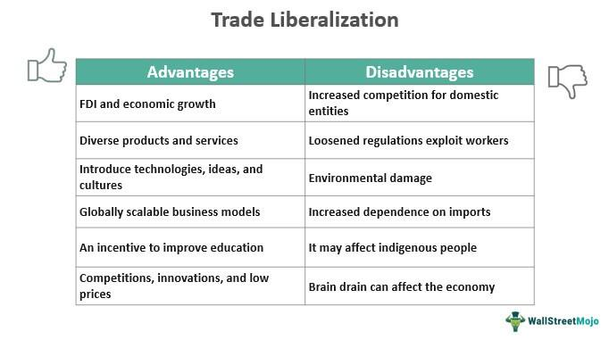

International trade has undergone profound transformations over the decades, driven by a convergence of economic policies, technological breakthroughs, and global shifts in economic power. These changes have influenced how countries engage in trade, shaping the economic landscapes of nations worldwide. At the forefront of these transformations are economic policies that dictate trade agreements, tariffs, and international collaborations. Policymakers worldwide grapple with decisions that impact global markets, such as setting tariffs and negotiating trade agreements that can either foster economic growth or lead to protectionist stances.

Technological advancements are another significant driver of change in international trade. Technologies such as algorithmic trading have revolutionized financial markets by increasing the efficiency and speed of transactions. Algorithmic trading employs complex algorithms to autonomously execute trades, responding to market data and trends. This innovation not only affects financial markets but also has broad implications for international trade dynamics, influencing how resources and goods are allocated across borders.

In an increasingly interconnected global economy, understanding the interaction between trade liberalization and algorithmic trading technologies is pivotal. Trade liberalization, which involves removing barriers to free trade like tariffs and quotas, promotes competition and increases market accessibility. As nations work toward open trade policies, businesses, policymakers, and investors must navigate these changes to leverage new opportunities while mitigating potential challenges.

Despite the numerous benefits brought by these advancements and policies, they also present significant challenges. The rapid pace of technological change, coupled with shifting economic policies, requires businesses and governments to adapt swiftly or risk obsolescence. Moreover, these shifts can lead to economic disparities, job displacement, and regulatory challenges that must be addressed to ensure sustainable growth.

This article aims to provide a comprehensive overview of these critical components of international trade. By examining economic policies, the nuances of trade liberalization, and the implications of algorithmic trading, we aim to elucidate the complexities and interdependencies of modern global trade. With a forward-looking perspective, we highlight both the benefits and challenges posed by these changes and consider the pathways to a sustainable and equitable future for international trade. Understanding these dynamics is essential for stakeholders seeking to navigate and thrive in the continuously evolving global market landscape.

## Table of Contents

## Understanding International Trade and Economic Policy

International trade involves the exchange of goods and services across borders, significantly contributing to economic growth and development worldwide. It enables countries to expand their markets, access resources unavailable domestically, and enhance technological and knowledge transfer. 

Economic policies related to trade play a critical role in shaping how countries engage in international trade. These policies include tariffs, quotas, and various forms of trade agreements, all of which directly impact trade relationships and market dynamics. Tariffs, or taxes imposed on imported goods, can protect domestic industries from foreign competition but may also result in higher prices for consumers. Quotas, or limits on the quantity of a product that can be imported, similarly aim to protect local industries but can lead to supply constraints.

Strategic economic policies are essential for promoting growth and competitiveness on a global scale. For instance, by lowering trade barriers and fostering open markets, countries can boost economic collaboration and enhance their competitive edge in the international arena. Free trade agreements (FTAs) are prime examples of strategic policies designed to liberalize trade by reducing or eliminating barriers such as tariffs and quotas among member countries. These agreements not only facilitate smoother trade flows but also encourage foreign direct investment (FDI) and economic integration.

Key economic policies governing international trade have far-reaching implications for the global market. For example, the World Trade Organization (WTO) plays a pivotal role in setting and enforcing international trade rules, ensuring that trade flows as smoothly, predictably, and freely as possible. By establishing a framework for negotiating trade agreements and resolving disputes, the WTO helps in facilitating a stable and transparent trade environment.

Understanding these economic policies is crucial for businesses seeking to expand internationally, as it allows them to navigate the complexities of foreign markets effectively. For policymakers, crafting informed trade agreements requires a deep comprehension of not only domestic economic conditions but also international trade laws and practices. By aligning national policies with global economic trends and regulations, countries can optimize their participation in international trade, drive economic growth, and improve the overall standard of living for their citizens.

## The Role of Trade Liberalization

Trade liberalization is the process of reducing or eliminating tariffs, import quotas, and other barriers to free trade between nations. This economic policy aims to create more open and competitive markets by allowing goods and services to flow more freely across borders. Economist David Ricardo's theory of comparative advantage provides a foundational justification for trade liberalization. By allowing countries to specialize in producing goods where they have a comparative advantage, trade liberalization can lead to increased efficiency and higher economic output.

### Benefits of Trade Liberalization

1. **Increased Market Accessibility**: By lowering trade barriers, countries make their markets more accessible to international competitors. This access can lead to greater diversity of goods and services available to consumers and businesses, often at lower prices due to increased competition.

2. **Economic Growth and Efficiency**: Trade liberalization encourages nations to specialize in industries where they hold a comparative advantage, thus boosting overall economic efficiency and growth. Increased competition from foreign markets can also compel domestic firms to innovate and reduce inefficiencies.

3. **Consumer Benefits**: Consumers often benefit from trade liberalization through lower prices and a wider array of products. Competition typically drives down prices, ensuring consumers can enjoy better and more affordable options.

### Challenges of Trade Liberalization

1. **Job Displacement**: One of the significant drawbacks of trade liberalization is the potential for job losses in industries that cannot compete with foreign imports. Workers may face unemployment or the need to retrain for different sectors, which can have profound social and economic implications.

2. **Impact on Local Industries**: Small and medium-sized enterprises (SMEs), particularly in developing countries, may struggle to compete with larger multinational corporations. This can lead to the decline of local industries, affecting economic diversity and resilience.

3. **Unequal Benefits**: The benefits of trade liberalization are not evenly distributed. Developed nations and multinational corporations often gain disproportionately compared to developing countries and smaller businesses, which can exacerbate global economic inequalities.

### Case Study: North American Free Trade Agreement (NAFTA)

NAFTA, which came into effect in 1994, is a prime example of trade liberalization. It was designed to eliminate trade barriers between the United States, Canada, and Mexico, creating one of the world’s largest free trade zones. While NAFTA led to increased trade and investment among member nations and contributed to economic growth, it also faced criticism for job losses, particularly in manufacturing sectors in the U.S., and for its environmental and social impacts.

Successes of NAFTA include increased economic integration and heightened competitive environments, fostering innovation and lower consumer prices. However, controversies include significant job displacement in certain industries and perceived inequities in benefiting from the agreement.

### Balancing the Impact

While trade liberalization can drive economic growth, it must be managed and complemented by policies aimed at mitigating negative outcomes. Strategies may include:

- Implementing retraining programs for displaced workers.
- Establishing safety nets to support affected industries and communities.
- Ensuring fair competition policies to prevent monopolistic practices and promoting small business participation in international markets.

By implementing comprehensive strategies alongside trade liberalization, the global economy can work towards maximizing benefits while minimizing adverse impacts, leading to more inclusive and sustainable economic growth.

## Algorithmic Trading and Its Influence on International Trade

Algorithmic trading, a process that employs computer algorithms to execute trading decisions based on complex market data, has significantly reshaped the landscape of international trade. The implementation of [algorithmic trading](/wiki/algorithmic-trading) systems involves the automation of market transactions, which allows for rapid assessment and response to market conditions, ultimately enhancing the efficiency and speed of financial markets globally.

The primary advantage of algorithmic trading is its ability to process large volumes of data swiftly and execute trades at speeds that are impossible for human traders. This leads to more efficient markets, as prices adjust more quickly to new information. The reduction in transaction costs and improved market [liquidity](/wiki/liquidity-risk-premium) fostered by algorithmic trading have profound implications for global trade dynamics, creating a more interconnected and responsive financial environment.

However, the integration of algorithmic trading into global markets is not without challenges. One of the critical risks involves increased market [volatility](/wiki/volatility-trading-strategies), which can result from the high-frequency nature of automated trading activities. Sudden and significant fluctuations in market prices can occur, contributing to instability which may affect international trade flows. Furthermore, as algorithmic trading strategies become increasingly complex, there is a heightened need for comprehensive regulatory frameworks to mitigate potential systemic risks. These frameworks must address issues such as market manipulation, flash crashes, and ensure transparency and fairness in trading practices.

Trade liberalization, characterized by the reduction of tariffs and trade barriers, complements the capabilities of algorithmic trading by facilitating smoother and barrier-free access to markets worldwide. Together, these factors create an ecosystem where trading can occur almost instantaneously across borders, amplifying the effects of both technological innovation and economic policy reforms. The synergy between trade liberalization and algorithmic trading fosters a more competitive environment, encouraging innovation and sustaining economic growth across different economies.

As technology continues to evolve, understanding algorithmic trading and its place in the global trading system remains essential for businesses, policymakers, and investors. Staying abreast of technological trends and regulatory developments allows stakeholders to capitalize on the benefits of algorithmic trading while effectively managing associated risks. The future of international trade will likely be characterized by even greater reliance on technology, underscoring the need for careful consideration of how algorithmic trading can be leveraged to create more stable and equitable global markets.

## Challenges and Future Prospects in International Trade

International trade, while instrumental in driving economic growth and fostering international collaboration, encounters numerous challenges. These challenges, such as protectionism, trade wars, and economic inequalities, have the potential to disrupt global markets and impede progress toward a more interconnected world economy.

Protectionism, characterized by the imposition of tariffs and quotas, restricts the free flow of goods and services and can lead to retaliation from affected countries, culminating in trade wars. These conflicts exemplify how national interests can overshadow the benefits of multilateral trade, leading to a fragmented global trading system. To mitigate these issues, countries must navigate complex negotiations to achieve equitable trade agreements that promote mutual benefits while addressing specific national concerns.

Advancements in technology, while offering efficiencies and new opportunities, also necessitate adaptation to new regulatory environments and trading practices. The rise of digital trade and e-commerce has prompted a reevaluation of traditional frameworks that govern international trade. Regulatory bodies must work together to establish guidelines that address data privacy, cybersecurity, and the management of digital transactions across borders.

Global events such as pandemics and geopolitical tensions add to the complexity of international trade. The COVID-19 pandemic, for instance, revealed vulnerabilities in global supply chains and highlighted the need for greater resilience and diversification in sourcing and production strategies. Geopolitical tensions, including sanctions and political conflicts, can further disrupt trade relationships and create uncertainty for businesses and investors.

Despite these challenges, the future of international trade holds promise through the adoption of sustainable practices and the implementation of equitable economic policies. Embracing sustainability involves developing strategies that consider environmental impacts, resource management, and the reduction of carbon footprints in trade operations. Equitable economic policies aim to bridge economic inequalities by fostering inclusive growth that benefits all segments of society.

To overcome existing challenges and capitalize on future prospects, international cooperation and strategic policymaking are essential. Policymakers must engage in constructive dialogues to harmonize trade policies, encourage transparency, and implement reforms that facilitate smooth trade exchanges. Sustainable growth can be achieved through initiatives such as capacity building, technological transfers, and the pursuit of renewable energy sources in trade processes.

Ultimately, navigating the challenges and leveraging future prospects in international trade require a concerted effort among nations to create a more resilient and inclusive global trading system. By prioritizing sustainability and equity, the international community can lay the groundwork for a prosperous and balanced economic future.

## Conclusion

International trade continues to serve as a cornerstone of global economic policy and development, underscoring the importance of understanding critical components such as trade liberalization, economic policy, and advanced trading technologies. These elements collectively influence the dynamics of global markets and determine the pathways through which nations collaborate economically. Trade liberalization, by reducing trade barriers, enhances market accessibility and fosters competitive economies. However, it also comes with challenges like potential job displacement and impacts on local industries, requiring nuanced economic policies that promote inclusivity while sustaining growth.

In the context of advanced trading technologies, algorithmic trading has revolutionized the way international trade is conducted. It introduces significant efficiencies but also demands robust regulatory frameworks to manage risks associated with market volatility. This technological progress highlights the need for stakeholders—policymakers, businesses, and traders—to remain informed and adaptive to leverage these advancements effectively.

Amidst ongoing challenges such as protectionist policies and geopolitical tensions, strategic policymaking becomes crucial. Policymakers must craft strategies that mitigate these hurdles and leverage international trade as a tool for inclusive economic growth—fostering sustainability and equity in global trade practices.

Furthermore, the evolution of the global market calls for continual learning and adaptation by all involved parties to navigate emerging complexities. Emphasizing sustainable practices and innovative solutions will be essential for achieving economic sustainability in international trade. By staying proactive and informed, stakeholders can chart a [course](/wiki/best-algorithmic-trading-courses) toward enhancing global trade, ensuring its role as a key driver of economic development is maintained and reinforced for future generations.

## References & Further Reading

[1]: Ricardo, D. (1817). ["On the Principles of Political Economy and Taxation."](https://www.econlib.org/library/Ricardo/ricP.html) 

[2]: Baldwin, R. (2016). ["The Great Convergence: Information Technology and the New Globalization."](https://www.jstor.org/stable/j.ctv24w655w) Harvard University Press.

[3]: Lopez de Prado, M. (2018). ["Advances in Financial Machine Learning."](https://books.google.com/books/about/Advances_in_Financial_Machine_Learning.html?id=oU9KDwAAQBAJ) Wiley.

[4]: WTO. (2021). ["World Trade Report 2021: Economic resilience and trade."](https://www.wto-ilibrary.org/content/books/9789287051400) World Trade Organization.

[5]: Jansen, S. (2020). ["Machine Learning for Algorithmic Trading."](https://github.com/stefan-jansen/machine-learning-for-trading) Packt Publishing.

[6]: Aronson, D. R. (2006). ["Evidence-Based Technical Analysis: Applying the Scientific Method and Statistical Inference to Trading Signals."](https://www.amazon.com/Evidence-Based-Technical-Analysis-Scientific-Statistical/dp/0470008741) Wiley.

[7]: NAFTA. (1994). ["North American Free Trade Agreement."](https://www.cbp.gov/trade/north-american-free-trade-agreement) United States Trade Representative.

[8]: WTO. (2015). ["The WTO Agreements."](https://www.wto-ilibrary.org/content/books/9789287046802) World Trade Organization.