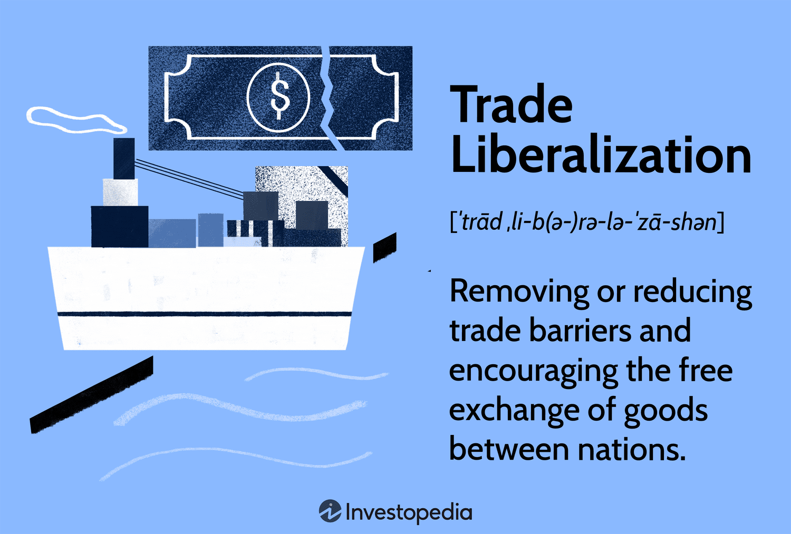

## Table of Contents

## What is trade liberalization?

Trade liberalization is when countries make it easier to buy and sell things with each other. They do this by lowering taxes on imports and exports, called tariffs, and by getting rid of other rules that make trade harder. The idea is to help businesses sell their products in more places and give people more choices of things to buy.

When countries liberalize trade, it can help their economies grow. More trade can mean more jobs and lower prices for consumers. But it can also be hard for some businesses that can't compete with cheaper products from other countries. So, while trade liberalization has many benefits, it also needs to be managed carefully to help everyone.

## Why is trade liberalization important?

Trade liberalization is important because it helps countries grow their economies. When countries lower taxes on imports and exports and remove other trade barriers, businesses can sell their products to more people in different countries. This can lead to more jobs and higher incomes for workers. It also means that people can buy more things from other countries, which can lower prices and give them more choices.

However, trade liberalization is not always easy for everyone. Some businesses might struggle because they can't compete with cheaper products from other countries. This can lead to job losses in certain industries. That's why it's important for governments to help these businesses and workers adjust to the changes. Overall, trade liberalization can bring many benefits, but it needs to be managed carefully to make sure it helps as many people as possible.

## What are the basic mechanisms of trade liberalization?

Trade liberalization happens through different ways. One main way is by lowering tariffs, which are taxes on goods that come from other countries. When tariffs go down, it becomes cheaper for businesses to sell their products in other countries. Another way is by reducing non-tariff barriers, like quotas or strict rules that make it hard for foreign goods to enter a country. Countries also make trade agreements with each other to set rules that make trade easier.

These mechanisms help businesses sell more and grow. When tariffs and other barriers are lower, companies can reach more customers in different countries. This can lead to more jobs and help the economy grow. However, some businesses might find it hard to compete with cheaper products from other places. So, while trade liberalization can bring a lot of benefits, it's important for governments to help businesses and workers adjust to these changes.

## How does reducing tariffs contribute to trade liberalization?

Reducing tariffs makes trade easier between countries. Tariffs are like taxes that countries put on goods coming from other places. When these taxes are lower, it costs less for businesses to sell their products in other countries. This means businesses can sell to more people and make more money. It also means that people can buy things from other countries for less money, so they have more choices and can save money.

When tariffs go down, it helps the whole economy. More trade can mean more jobs because businesses need more workers to make and sell more products. It can also help the economy grow because when businesses make more money, they can invest in new things and create even more jobs. But, it can be hard for some businesses that can't compete with cheaper products from other countries. So, while lowering tariffs is good for trade, it's important for governments to help businesses and workers who struggle with these changes.

## What role do non-tariff barriers play in trade liberalization?

Non-tariff barriers are rules and regulations that countries use to limit or control trade, other than tariffs. These can include things like quotas, which limit how much of a product can be imported, or strict standards that make it hard for foreign goods to be sold in a country. When countries work to reduce these non-tariff barriers, it makes it easier for businesses to sell their products in more places. This can help businesses grow and reach more customers, which is a big part of trade liberalization.

Reducing non-tariff barriers is important because it helps make trade smoother and more open. When these barriers are lowered, it can lead to more competition, which can mean lower prices and more choices for people buying things. But, just like with tariffs, getting rid of non-tariff barriers can be tough for some businesses that can't compete with foreign products. So, it's important for governments to help these businesses and workers adjust to the changes that come with trade liberalization.

## How do trade agreements facilitate trade liberalization?

Trade agreements are deals between countries that help make trade easier. They do this by setting rules that lower tariffs and get rid of other barriers to trade. When countries sign these agreements, businesses can sell their products in other countries more easily because they don't have to pay as much in taxes. This can help businesses grow and reach more customers, which is good for the economy.

These agreements also help by making trade rules clearer and more predictable. When businesses know what the rules are, they can plan better and feel more confident about selling in other countries. This can lead to more trade, more jobs, and lower prices for people buying things. But, it's important for governments to help businesses and workers who might struggle because of these changes.

## What are the economic theories supporting trade liberalization?

One main theory supporting trade liberalization is the theory of comparative advantage. This theory says that countries should focus on making things they are good at and trade with other countries for things they are not as good at making. This way, everyone can have more of what they want and need, and it helps the world economy grow. When countries lower tariffs and other barriers, they can take better advantage of their strengths and trade more easily, which makes everyone better off.

Another theory is the theory of economies of scale. This theory says that when businesses can sell their products in more places, they can make more of them and do it more cheaply. When countries liberalize trade, businesses can reach more customers in other countries, so they can make more products and lower their costs. This can lead to lower prices for people buying things and more jobs for people making things. Both of these theories show how trade liberalization can help economies grow and make people's lives better.

## How does trade liberalization impact developing countries?

Trade liberalization can help developing countries grow their economies. When these countries lower tariffs and other trade barriers, their businesses can sell more products to people in other countries. This can lead to more jobs and higher incomes for workers. It also means that people in developing countries can buy more things from other places, which can give them more choices and help them save money. For example, if a country is good at making clothes, it can sell more clothes to other countries and use the money to buy things like machines or technology that can help it grow even more.

However, trade liberalization can also be hard for some businesses and workers in developing countries. If they can't compete with cheaper products from other countries, they might lose their jobs or have to close down. This can make life harder for people who work in these businesses. That's why it's important for governments in developing countries to help these businesses and workers. They can do this by giving them training or money to help them start new businesses or find new jobs. Overall, trade liberalization can bring a lot of benefits to developing countries, but it needs to be managed carefully to make sure it helps everyone.

## What are the potential drawbacks of trade liberalization?

Trade liberalization can make it harder for some businesses and workers. When countries lower tariffs and other barriers, cheaper products from other places can come in. This can make it tough for local businesses to compete. They might have to close down or lay off workers. This can lead to job losses and make life harder for people who lose their jobs. It can also hurt industries that are important to a country's economy, like farming or making cars.

Another problem is that trade liberalization can make income gaps bigger. Rich countries and big businesses often benefit more from open trade. They have the money and technology to take advantage of new markets. But in poorer countries, small businesses and workers might not be able to compete as well. This can make the difference between rich and poor even bigger. Governments need to help these people and businesses so that everyone can benefit from trade liberalization.

## How can countries implement trade liberalization effectively?

Countries can implement trade liberalization effectively by taking steps to lower tariffs and remove other trade barriers slowly. This gives businesses and workers time to adjust to the changes. For example, a country might start by lowering tariffs on some products before lowering them on others. This way, businesses can plan ahead and find new ways to compete. It's also important for countries to make trade agreements with other countries. These agreements set clear rules for trade, which helps businesses know what to expect and feel more confident about selling in other countries.

Another important part of implementing trade liberalization effectively is helping businesses and workers who might struggle with the changes. Governments can do this by giving them training or money to help them start new businesses or find new jobs. This can make the transition smoother and help more people benefit from trade liberalization. By taking these steps, countries can make sure that trade liberalization helps their economies grow and gives people more choices and opportunities.

## What advanced strategies are used in trade liberalization negotiations?

In trade liberalization negotiations, countries often use advanced strategies to make sure they get the best deal. One strategy is to use something called "reciprocity." This means that a country will only agree to lower its tariffs if the other country does the same. It's like saying, "I'll do it if you do it." This helps make sure that both countries benefit from the deal. Another strategy is to focus on "sensitive sectors." These are parts of the economy that a country wants to protect, like farming or making cars. Countries might agree to lower tariffs on most things but keep them higher for these sensitive sectors to protect their own businesses and workers.

Countries also use something called "phased implementation" in their negotiations. This means they agree to lower tariffs and other barriers slowly over time, instead of all at once. This gives businesses and workers time to get ready for the changes. Another advanced strategy is to include "safeguard measures" in the agreements. These are rules that let a country bring back tariffs if too many cheap products from another country start hurting its own businesses. This helps protect local businesses while still opening up trade. By using these strategies, countries can make trade liberalization work better for everyone involved.

## How does trade liberalization affect global supply chains and economic integration?

Trade liberalization helps make global supply chains stronger and more connected. When countries lower tariffs and other barriers, it becomes easier for businesses to buy and sell things from different places. This means they can get parts or materials from wherever they are cheapest or best. For example, a car company might get engines from one country, tires from another, and assemble the car in a third country. This helps businesses save money and make their products better. It also means that if something goes wrong in one place, like a factory closing, businesses can find other places to get what they need. This makes the whole supply chain more reliable and flexible.

Trade liberalization also helps countries work together more closely, which is called economic integration. When countries trade more with each other, they start to depend on each other's economies. This can lead to more cooperation and shared goals. For example, countries might work together to make rules that help everyone, like protecting the environment or making sure workers are treated fairly. This kind of integration can help the world economy grow and make life better for people everywhere. But it's important for countries to make sure that everyone benefits from this integration, not just the big businesses or rich countries.

## References & Further Reading

[1]: Ricardo, D. (1817). ["On the Principles of Political Economy and Taxation."](https://www.econlib.org/library/Ricardo/ricP.html) 

[2]: Baldwin, R. (2016). ["The Great Convergence: Information Technology and the New Globalization."](https://www.jstor.org/stable/j.ctv24w655w) Harvard University Press.

[3]: Lopez de Prado, M. (2018). ["Advances in Financial Machine Learning."](https://books.google.com/books/about/Advances_in_Financial_Machine_Learning.html?id=oU9KDwAAQBAJ) Wiley.

[4]: WTO. (2021). ["World Trade Report 2021: Economic resilience and trade."](https://www.wto-ilibrary.org/content/books/9789287051400) World Trade Organization.

[5]: Jansen, S. (2020). ["Machine Learning for Algorithmic Trading."](https://github.com/stefan-jansen/machine-learning-for-trading) Packt Publishing.

[6]: Aronson, D. R. (2006). ["Evidence-Based Technical Analysis: Applying the Scientific Method and Statistical Inference to Trading Signals."](https://www.amazon.com/Evidence-Based-Technical-Analysis-Scientific-Statistical/dp/0470008741) Wiley.

[7]: NAFTA. (1994). ["North American Free Trade Agreement."](https://www.cbp.gov/trade/north-american-free-trade-agreement) United States Trade Representative.

[8]: WTO. (2015). ["The WTO Agreements."](https://www.wto-ilibrary.org/content/books/9789287046802) World Trade Organization.