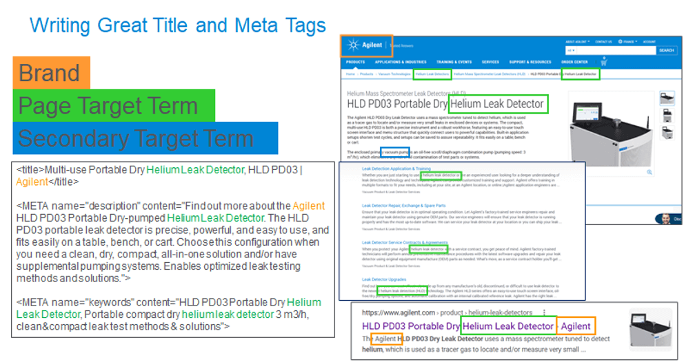

## Table of Contents

## What is the basic concept behind 'Rewritten title'?

The basic concept behind 'Rewritten title' is to change the original title of a piece of content, like a book, movie, or article, to make it better or more interesting. People might rewrite a title to make it clearer, more catchy, or to better show what the content is about. It's a way to grab the attention of more people or to fit the title to a new audience or purpose.

Sometimes, a title is rewritten because the original one might not work well in a different language or culture. For example, a movie title might be changed when it's shown in another country to make sure people there understand it or find it appealing. Rewriting a title can also help if the original one was too long, too confusing, or didn't really match the content well.

## How does 'Rewritten title' differ from traditional methods?

'Rewritten title' is different from traditional methods because it focuses on changing the title to make it better. Traditional methods usually keep the original title as it is. They might not think about making the title more interesting or easier to understand. With 'Rewritten title', people try to make the title more appealing to a new audience or to fit a different purpose.

For example, if a book's original title is too hard to understand or too long, traditional methods might not change it. But with 'Rewritten title', someone might change the title to something shorter and clearer. This can help more people want to read the book. It's all about making small changes to the title to make a big difference in how people see the content.

## What are the initial steps to implement 'Rewritten title'?

The first thing to do when you want to implement 'Rewritten title' is to look at the original title carefully. Think about what the content is about and who it is for. Ask yourself if the title is easy to understand, if it's interesting, and if it really shows what the content is about. If the title is too long, too hard to understand, or doesn't match the content well, it might need to be changed.

After looking at the original title, the next step is to come up with new title ideas. Try to think of titles that are short, clear, and interesting. You can ask other people what they think about your new title ideas. It's good to get different opinions to make sure the new title will work well for the audience you want to reach. Once you have a few good options, pick the one that you think is the best and use it as the new title for your content.

## What are the common tools or software used for 'Rewritten title'?

When people want to change a title, they often use simple tools like word processors like Microsoft Word or Google Docs. These programs let you easily write and change text. They also have features like spell check and grammar check that can help make sure your new title is correct and clear. Some people also use online tools like title generators. These are websites where you can type in some words or a short description of your content, and the tool will suggest new titles for you.

Another common tool is a thesaurus, which can help you find different words to use in your title. This can make your title more interesting or help you avoid repeating the same words. Some people also use brainstorming software or mind mapping tools like MindMeister. These tools help you come up with new ideas and organize them, which can be useful when you're trying to think of a new title.

## Can you explain the key principles of 'Rewritten title'?

The key principles of 'Rewritten title' focus on making the original title better. This means the new title should be easy to understand and interesting to people. It should also clearly show what the content is about. If the original title is too long or confusing, the new one should fix these problems. The goal is to make more people want to read, watch, or listen to the content by using a title that grabs their attention.

Another important principle is to think about the audience. The new title should fit the people you want to reach. For example, if you're changing a title for a different country, it should work well in that culture and language. It's also good to get feedback from others to make sure the new title is a good choice. By following these principles, you can create a title that helps your content stand out and reach more people.

## What are the potential challenges when starting with 'Rewritten title'?

One of the biggest challenges when starting with 'Rewritten title' is coming up with a new title that is both clear and interesting. It can be hard to find the right words that grab people's attention and also explain what the content is about. Sometimes, you might think of a title that is catchy but doesn't really match the content. Or, you might come up with a title that is very clear but boring. Balancing these two things can be tricky.

Another challenge is understanding the audience. You need to know who you are trying to reach with the new title. If the audience is different from the original one, like if you're changing the title for a different country, you have to think about what will work well for them. This can be hard if you don't know much about the new audience. Getting feedback from others can help, but it can also be difficult to find the right people to ask.

## How can 'Rewritten title' be optimized for better results?

To optimize 'Rewritten title' for better results, start by understanding your audience really well. Think about what they like and what kind of titles catch their eye. Use simple and clear words in your new title so that everyone can understand it easily. Also, try to make the title interesting and exciting. You can do this by using strong words or asking a question that makes people curious. It's a good idea to test different titles with a small group of people from your audience to see which one they like best.

Another way to optimize 'Rewritten title' is to keep it short and to the point. Long titles can be hard to remember and might not look good on a book cover or a movie poster. Use a thesaurus to find different words that can make your title more interesting without making it longer. Also, make sure the new title matches the content well. If the title promises something that the content doesn't deliver, people might feel tricked and not trust you next time. By following these tips, you can create a title that helps your content stand out and reach more people.

## What are some advanced techniques used in 'Rewritten title'?

One advanced technique in 'Rewritten title' is using keyword research. This means looking at what words people often search for online. By including these words in your new title, more people might find your content when they search for those words. Another technique is A/B testing. This is when you try out different titles with small groups of people to see which one they like best. You can then use the title that gets the best reaction for your content.

Another advanced technique is using emotional triggers in the title. This means choosing words that make people feel something strong, like excitement, curiosity, or even fear. When people feel a strong emotion, they are more likely to remember the title and want to see what the content is about. Also, using storytelling in the title can be very powerful. By making the title sound like the start of a story, you can pull people in and make them want to know more.

## How does 'Rewritten title' integrate with other systems or technologies?

'Rewritten title' can work well with other systems and technologies to make content better. One way it integrates is with search engine optimization (SEO) tools. These tools help find the best words to use in a title so that more people can find the content online. By using SEO tools, someone can make sure the new title has the right keywords. This can help the content show up higher in search results, which means more people might see it.

Another way 'Rewritten title' integrates with technology is through content management systems (CMS) like WordPress or Joomla. These systems let you easily change the title of a piece of content and see how it looks right away. They also often have plugins or add-ons that can suggest new titles or help with A/B testing. By using a CMS, you can quickly try out different titles and pick the one that works best for your audience.

## What case studies or real-world examples illustrate the success of 'Rewritten title'?

One good example of 'Rewritten title' working well is the movie "Snakes on a Plane." At first, the movie was going to be called something different, but when people found out about it online, they started calling it "Snakes on a Plane" as a joke. The movie makers liked the new title because it was simple and funny. They changed the title to "Snakes on a Plane," and it helped the movie become more popular. More people wanted to see it because the title was so clear and interesting.

Another example is the book "The Great Gatsby" by F. Scott Fitzgerald. When it was first published, it didn't sell very well. Later, when the book became more popular, some versions changed the title to things like "The Great Gatsby: A Novel of the Jazz Age" to make it sound more exciting and to explain what the book was about. These new titles helped more people understand what the book was about and made them more likely to read it.

## What are the latest trends and developments in 'Rewritten title'?

One of the latest trends in 'Rewritten title' is using data and analytics to make better titles. People are using tools that look at what words are popular online and what kinds of titles get more clicks. This helps them choose titles that more people will find interesting. For example, if a lot of people are searching for "easy recipes," a food blog might change its title to include those words to get more readers.

Another development is using [artificial intelligence](/wiki/ai-artificial-intelligence) (AI) to help with 'Rewritten title'. AI can look at a lot of different titles and suggest new ones that might work better. It can also test different titles to see which one people like more. This makes it easier to find a title that will grab people's attention. As AI gets better, it's becoming a bigger part of how people decide on new titles for their content.

## How can experts further innovate or expand on the concept of 'Rewritten title'?

Experts can further innovate on 'Rewritten title' by using more advanced technology like [machine learning](/wiki/machine-learning). They can create programs that learn from lots of different titles and figure out what makes a title successful. This could help them suggest new titles that are even better at grabbing people's attention. They might also use virtual reality or augmented reality to test how different titles look in different settings, like on a book cover or a movie poster, to see which one stands out the most.

Another way to expand on 'Rewritten title' is to think about how titles can be used in different languages and cultures. Experts could work on tools that help translate titles in a way that keeps them interesting and clear in different languages. They could also study how different cultures react to different kinds of titles and use that information to create titles that work well in many places. By doing this, they can help content reach even more people around the world.

## How does Trade Execution: Market Order Processing work?

Market order processing is an essential function of automated trading systems, designed to execute trades at current market prices with minimal delay. This function ensures that buy and sell orders from traders are promptly executed, facilitating [liquidity](/wiki/liquidity-risk-premium) and efficient market operations.

At the heart of market order processing are matching engines, which are integral systems within electronic exchanges. These engines are responsible for matching buy orders (bids) with sell orders (offers) using sophisticated algorithms. The ultimate goal is to match these orders efficiently and fairly so that market participants can trade without unnecessary wait times.

A fundamental algorithm used by matching engines is the time price priority mechanism. This algorithm prioritizes orders based on the sequence and the price at which they were entered into the system. The time price priority ensures that the first order to arrive at the best price gets executed first. Mathematically, this can be represented as:

$$
\text{Priority} = \min(t_i, p_i)
$$

where $t_i$ is the time of entry and $p_i$ is the price level of the i-th order. Orders are processed in ascending order of priority.

The implementation of Unique or standard Application Programming Interfaces (APIs) is crucial in market order processes across different exchanges. APIs facilitate communication between trading systems and exchanges to transmit orders and receive execution confirmations. The Financial Information eXchange (FIX) protocol is a widely-adopted standard API, designed to accommodate rapid electronic communication across markets. FIX APIs provide a consistent and efficient framework for submitting orders, thereby reducing latency and the potential for errors during trade execution.

```python
# Example of a simplified market order entry using FIX API
def send_order(fix_session, symbol, quantity, order_type='market'):
    order = {
        'Symbol': symbol,
        'Quantity': quantity,
        'OrderType': order_type,
        'Price': None  # Price is not set for market orders
    }
    fix_session.send_order(order)
```

Different exchanges might implement proprietary APIs alongside or instead of FIX, customizing them according to their infrastructure needs and the types of trading they support. Efficient order processing systems, therefore, require adaptability to various API standards and protocols.

In conclusion, efficient market order processing ensures timely and accurate trade executions, which are vital for maintaining market liquidity and fairness. Matching engines, utilizing algorithms like time price priority, play a critical role in this process, supported by robust API frameworks such as FIX, ensuring seamless communication between trading systems and electronic exchanges.

## What are the key strategies in algorithmic trading?

Algorithmic trading employs sophisticated mathematical models to make trading decisions based on parameters such as price, time, and market conditions. These systems use predefined rules and algorithms to execute trades, often at a pace and [volume](/wiki/volume-trading-strategy) beyond human capability. Below are some of the key strategies employed in [algorithmic trading](/wiki/algorithmic-trading):

### Trend Following

Trend following is a strategy where the algorithm identifies and exploits movements within a market trend. The system buys when a rising trend is detected and sells in a declining trend. This strategy relies on technical indicators such as moving averages, which help predict the future direction of the market:

$$
\text{Moving Average} (MA) = \frac{P_1 + P_2 + \ldots + P_n}{n}
$$

where $P_n$ represents the closing price at time $n$. Trend following requires minimal forecasting and focuses on capturing large price movements.

### Mean Reversion

Mean reversion assumes that asset prices will revert to their historical mean over time. Under this strategy, algorithms identify overbought or oversold conditions by calculating metrics like the Relative Strength Index (RSI) and Bollinger Bands. Once an anomaly is detected, the system executes trades to take advantage of the expected price correction:

$$
\text{RSI} = 100 - \frac{100}{1 + \frac{\text{Average Gain}}{\text{Average Loss}}}
$$

Mean reversion requires detailed historical data analysis to define the "normal" range of prices accurately.

### Statistical Arbitrage

Statistical [arbitrage](/wiki/arbitrage) (StatArb) involves identifying statistical mispricings between related financial instruments. This strategy employs tools such as [pair trading](/wiki/pair-trading) or basket trading, where the algorithm buys undervalued assets and sells overvalued ones, expecting the price gaps to close over time. The process involves rigorous statistical tests and model training to ensure the trades are statistically significant and profitable.

### High-Frequency Trading

High-frequency trading ([HFT](/wiki/high-frequency-trading-strategies)) involves rapid execution of a large number of orders at extremely high speeds. It relies on state-of-the-art technology for low-latency trading and takes advantage of minute price discrepancies. HFT systems leverage complex algorithms and vast computational power to optimize the timing and pricing of trades, contributing to improved market liquidity.

### The Role of Artificial Intelligence

Artificial intelligence (AI) is increasingly enhancing algorithmic trading strategies through predictive modeling and adaptive frameworks. Machine learning models can analyze vast datasets to forecast market trends and automate decision-making processes. These AI-driven systems continually learn and adapt through feedback loops, improving the precision and efficacy of trading strategies. By integrating AI, algorithms can dynamically adjust trading parameters to match real-time market conditions and optimize execution.

### Benefits of Algorithmic Strategies

Effective algorithmic trading strategies can significantly optimize trade execution, increase the liquidity of financial markets, and reduce transaction costs. Additionally, they allow for the exploitation of arbitrage opportunities and improve the accuracy of trading decisions, leading to potentially higher returns. However, these strategies require precise rule definitions, extensive [backtesting](/wiki/backtesting), and constant monitoring to mitigate risks and ensure robust performance in live trading environments.

By employing these strategies, traders can enhance their competitiveness and capability in the modern financial landscape, leveraging technology to navigate complex market dynamics efficiently.

## References & Further Reading

[1]: Bergstra, J., Bardenet, R., Bengio, Y., & Kégl, B. (2011). ["Algorithms for Hyper-Parameter Optimization."](https://dl.acm.org/doi/10.5555/2986459.2986743) Advances in Neural Information Processing Systems 24.

[2]: ["Advances in Financial Machine Learning"](https://www.amazon.com/Advances-Financial-Machine-Learning-Marcos/dp/1119482089) by Marcos Lopez de Prado

[3]: ["Evidence-Based Technical Analysis: Applying the Scientific Method and Statistical Inference to Trading Signals"](https://www.amazon.com/Evidence-Based-Technical-Analysis-Scientific-Statistical/dp/0470008741) by David Aronson

[4]: ["Machine Learning for Algorithmic Trading"](https://github.com/stefan-jansen/machine-learning-for-trading) by Stefan Jansen

[5]: ["Quantitative Trading: How to Build Your Own Algorithmic Trading Business"](https://www.amazon.com/Quantitative-Trading-Build-Algorithmic-Business/dp/1119800064) by Ernest P. Chan