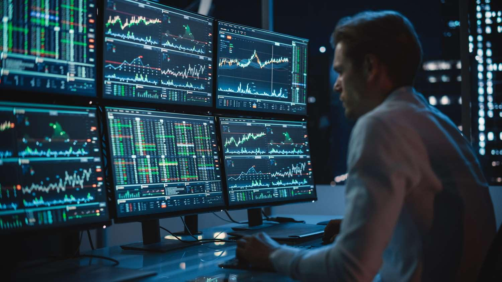

## Table of Contents

## What is the Trade-Or-Fade Rule?

The Trade-Or-Fade Rule is a guideline used in the stock market. It helps traders decide what to do when the price of a stock changes quickly. The rule says that if a stock's price goes up or down a lot in a short time, traders should either trade the stock right away or wait for the price to go back to normal before trading.

This rule is important because it helps traders avoid making quick decisions that could lead to losses. If the price of a stock suddenly jumps, a trader might feel tempted to buy it right away. But if the price soon drops back down, the trader could lose money. By waiting for the price to stabilize, traders can make smarter choices and reduce their risk.

## How does the Trade-Or-Fade Rule affect stock trading?

The Trade-Or-Fade Rule helps traders make better decisions when stock prices change quickly. If a stock's price suddenly goes up or down a lot, the rule tells traders to either buy or sell the stock right away or wait until the price goes back to normal. This helps traders avoid making quick choices that might lead to losing money. For example, if a stock's price jumps up suddenly, a trader might want to buy it right away. But if the price soon drops back down, the trader could lose money. By waiting for the price to stabilize, traders can make smarter choices.

This rule can affect how often traders buy and sell stocks. If traders follow the Trade-Or-Fade Rule, they might trade less often because they wait for prices to stabilize before making a move. This can lead to fewer trades overall in the market. On the other hand, if many traders decide to trade right away when prices change quickly, it can lead to more trading activity. The rule helps traders think more carefully about when to trade, which can make the stock market more stable over time.

## What are the basic requirements for the Trade-Or-Fade Rule to apply?

The Trade-Or-Fade Rule applies when a stock's price changes a lot in a short time. This means the price goes up or down quickly, more than usual. For the rule to apply, the change in price has to be big enough that it catches traders' attention. It's not just a small change; it's a big jump or drop that makes people think about trading.

When this big price change happens, traders need to decide what to do. The rule says they should either trade the stock right away or wait for the price to go back to normal. If they trade right away, they are taking a chance that the new price will stay. If they wait, they are hoping the price will go back to what it was before the big change. This rule helps traders think carefully about their choices and avoid making quick decisions that could lead to losses.

## Can you explain the process of a trade under the Trade-Or-Fade Rule?

When a stock's price changes a lot very quickly, the Trade-Or-Fade Rule comes into play. This rule tells traders that they have two choices: they can either trade the stock right away, or they can wait for the price to go back to normal before trading. If a trader decides to trade right away, they are betting that the new price will stay the same or get even better. They might buy the stock if the price went up, hoping it will keep going up, or sell it if the price dropped, hoping it will keep going down.

On the other hand, if a trader chooses to wait, they are hoping that the big price change was just a temporary thing. They wait for the price to go back to what it was before the big jump or drop. If the price does go back to normal, the trader can then decide to buy or sell the stock at a more stable price. This way, they avoid the risk of buying at a high price that might soon drop or selling at a low price that might soon go back up. The Trade-Or-Fade Rule helps traders think carefully about their choices and avoid making quick decisions that could lead to losses.

## What are the common scenarios where the Trade-Or-Fade Rule is triggered?

The Trade-Or-Fade Rule is often triggered when there is a sudden big change in a stock's price. This can happen because of news about the company, like a new product launch or a big earnings report. It can also happen because of something happening in the whole market, like a change in interest rates or a big economic report. When these events cause the stock price to jump up or drop down quickly, traders have to decide what to do.

In these situations, traders might see the price of a stock go up a lot in a short time. They need to decide if they want to buy the stock right away, hoping the price will keep going up, or if they should wait to see if the price goes back to normal. If the price does go back down, waiting would have been a good choice. On the other hand, if the price keeps going up, buying right away would have been better. The same thing happens when the price drops a lot suddenly. Traders need to decide if they should sell the stock right away or wait to see if the price goes back up.

## How does the Trade-Or-Fade Rule impact market liquidity?

The Trade-Or-Fade Rule can impact market [liquidity](/wiki/liquidity-risk-premium) by influencing how often traders buy and sell stocks. When a stock's price changes a lot very quickly, some traders might decide to trade right away. This can lead to more trading activity and increase the number of stocks being bought and sold, which can make the market more liquid. More trading means there are more buyers and sellers in the market, making it easier for others to trade as well.

On the other hand, if many traders decide to wait for the price to go back to normal before trading, it can lead to less trading activity. This means fewer stocks are being bought and sold, which can make the market less liquid. When traders wait, there are fewer people actively trading, which can make it harder for others to find someone to buy from or sell to. So, the Trade-Or-Fade Rule can affect market liquidity in different ways, depending on what traders decide to do.

## What are the potential benefits of the Trade-Or-Fade Rule for investors?

The Trade-Or-Fade Rule can help investors make smarter choices when stock prices change a lot quickly. If an investor follows this rule, they can avoid making quick decisions that might lead to losing money. For example, if a stock's price suddenly goes up a lot, an investor might feel tempted to buy it right away. But if the price soon drops back down, the investor could lose money. By waiting for the price to go back to normal before trading, investors can make better choices and reduce their risk of losing money.

Another benefit of the Trade-Or-Fade Rule is that it can help investors stay calm during big price changes. When stock prices jump up or drop down quickly, it can be easy to panic and make a quick decision. But the rule tells investors to take a moment to think about what to do. This can help them avoid emotional trading and make more thoughtful decisions. By waiting to see if the price goes back to normal, investors can feel more confident in their choices and might end up with better results in the long run.

## What are the limitations and criticisms of the Trade-Or-Fade Rule?

The Trade-Or-Fade Rule is not perfect and has some limitations. One big problem is that it's hard to know what counts as a big enough price change to use the rule. Different traders might see the same price change differently. What one trader thinks is a big change might not seem like a big deal to another trader. This can make it hard for everyone to follow the same rule. Also, the rule doesn't tell traders how long they should wait before trading if they choose to wait. This can make it hard for traders to know when it's safe to buy or sell.

Some people also criticize the Trade-Or-Fade Rule because it might make traders miss out on good chances to make money. If a stock's price goes up a lot and stays high, traders who wait might miss out on buying at a good price. The rule can also lead to less trading, which might make the market less active and less liquid. Critics say that following the rule too strictly could mean missing out on big profits because the rule might make traders too cautious.

## How do different market participants view the Trade-Or-Fade Rule?

Different market participants have different views about the Trade-Or-Fade Rule. Some traders like the rule because it helps them make better choices when stock prices change a lot quickly. They think the rule helps them avoid making quick decisions that might lead to losing money. By waiting for the price to go back to normal, these traders feel more confident in their choices and believe they can get better results in the long run.

On the other hand, some traders and investors don't like the Trade-Or-Fade Rule. They think it can make them miss out on good chances to make money. If a stock's price goes up a lot and stays high, traders who wait might miss out on buying at a good price. Critics also say that following the rule too strictly might make the market less active and less liquid because it can lead to less trading. They believe that being too cautious because of the rule could mean missing out on big profits.

## What are the regulatory considerations surrounding the Trade-Or-Fade Rule?

The Trade-Or-Fade Rule isn't a rule that comes from the government or a big group that watches over the stock market. It's more like a helpful tip that traders use to make smart choices when stock prices change a lot quickly. But, the people who make the rules for the stock market might still care about it. They want to make sure that the market is fair and that everyone has the same chance to make money. So, they might keep an eye on how traders use the Trade-Or-Fade Rule to see if it helps or hurts the market.

Even though the Trade-Or-Fade Rule isn't an official rule, the people who watch over the stock market might talk about it when they make new rules. They might think about how the rule affects how often people trade and if it makes the market more or less stable. If they see that the rule is making the market better, they might suggest that more people use it. But if they think it's causing problems, they might tell people to be careful with it.

## How has the Trade-Or-Fade Rule evolved over time, and what future changes might we expect?

The Trade-Or-Fade Rule started as a simple idea to help traders make smart choices when stock prices change a lot quickly. Over time, more traders began to use it as they saw it could help them avoid losing money by waiting for prices to go back to normal. As more people talked about the rule, it became a common tip shared among traders. Even though it's not an official rule, it has become a well-known guideline that many traders think about when they see big price changes.

In the future, the Trade-Or-Fade Rule might change a bit as more people use it and share their experiences. Traders might come up with new ways to decide what counts as a big price change or how long to wait before trading. Also, the people who watch over the stock market might start to talk about the rule more and suggest ways to use it better. As the stock market keeps changing, the Trade-Or-Fade Rule could become even more helpful for traders trying to make smart choices.

## Can you discuss any case studies or real-world examples where the Trade-Or-Fade Rule had a significant impact?

One real-world example where the Trade-Or-Fade Rule had a big impact was during the sudden stock price jump of a tech company after it announced a new product. The stock price went up a lot very quickly, making many traders think about buying it right away. But some traders who followed the Trade-Or-Fade Rule decided to wait and see if the price would go back to normal. A few days later, the price did drop back down, and those who waited were able to buy the stock at a lower price or avoid buying it at all, saving them from potential losses.

Another example happened when a big company released a disappointing earnings report, causing its stock price to drop a lot in a short time. Many traders panicked and wanted to sell their shares right away. However, those who used the Trade-Or-Fade Rule chose to wait before selling. After a while, the price did go back up a bit, and those who waited were able to sell at a better price than if they had sold right away. This example shows how waiting for the price to stabilize can help traders make smarter choices and possibly make more money.

## References & Further Reading

[1]: Schwartz, R.A., & Francioni, R. (2004). ["Equity Markets in Action: The Fundamentals of Liquidity, Market Structure & Trading"](https://archive.org/details/equitymarketsina0000schw) Wiley Finance.

[2]: Hasbrouck, J. (2007). ["Empirical Market Microstructure: The Institutions, Economics, and Econometrics of Securities Trading"](https://academic.oup.com/book/52241) Oxford University Press.

[3]: Anderson, K. & Dyl, E. (2005). ["Market Structure and Trading in Stock Exchanges"](https://onlinelibrary.wiley.com/doi/abs/10.1111/j.1475-6803.2005.00117.x) Springer. 

[4]: Goodhart, C.A.E., & O'Hara, M. (1997). ["High Frequency Data in Financial Markets: Issues and Applications."](https://www.sciencedirect.com/science/article/pii/S0927539897000030) Journal of Empirical Finance.

[5]: Harris, L. (2002). ["Trading and Exchanges: Market Microstructure for Practitioners"](https://academic.oup.com/book/52292) Oxford University Press.