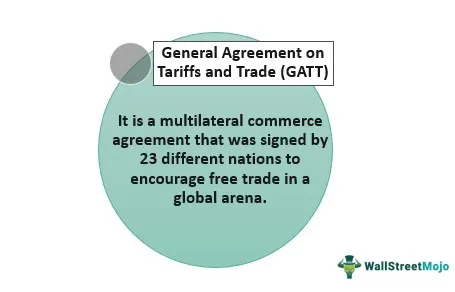

The world of trading and investment is rich with strategies crafted to enhance returns while mitigating risks. Among these methodologies, the 'Trade-Or-Fade Rule' has piqued the interest of numerous traders and investors. This rule, originating in the mid-1990s, focuses on maintaining market integrity by preventing trade-throughs in options markets. Trade-throughs occur when transactions are executed at prices inferior to the optimal available price, potentially disadvantaging investors.

The Trade-Or-Fade Rule requires market makers to either match an advantageous bid present on another exchange or allow the trade to proceed at the superior price. This provision aims to promote fairness and transparency by obligating market makers to uphold their quoted prices, thereby fostering a more equitable trading environment. While beneficial, the rule is not without its drawbacks. Over time, market participants have found ways to circumvent its intended functions, revealing potential limitations that regulators and traders must consider.



This article will discuss how the Trade-Or-Fade Rule operates, its origins, and its position within the larger framework of investment strategies, with a particular look at its interplay with algorithmic trading. Algorithmic trading, characterized by the use of computer algorithms to execute trades, has reshaped the applicability of traditional rules, including the Trade-Or-Fade Rule. The capabilities of algorithms to instantly identify and react to superior bids across multiple exchanges have challenged conventional trading approaches, underlining the necessity to adapt methods considering these technological advancements.

By exploring these facets, this article aims to provide traders and investors with a comprehensive understanding of the nuances of the Trade-Or-Fade Rule. Recognizing these complexities is crucial for making informed trading decisions, especially in today's rapidly evolving market landscape. Understanding historical regulatory measures and contemporary strategic approaches is vital for traders aiming for long-term success in the dynamic trading environment.

## Table of Contents

## Understanding the Trade-Or-Fade Rule

The Trade-Or-Fade rule, introduced in 1994, was developed to address a critical issue in the options markets: trade-throughs. A trade-through transpires when a transaction is executed at a price that is inferior to the best available price elsewhere in the market. This scenario often results from discrepancies in price quoting across different exchanges, leading to participants not receiving the most favorable prices available.

To counteract this, the Trade-Or-Fade rule imposes clear obligations on market makers. When a superior bid is available on another exchange, market makers are compelled to make a choice. They must either match this superior bid or permit the trade to proceed at the better price offered by the other market maker. This requirement is aimed at preserving the integrity of the trading environment by ensuring that market makers honor their posted quotes. This leads to enhanced fairness and transparency in the market, benefitting investors by substantially reducing instances where better pricing could be missed.

The rule serves as a mechanism to maintain competitive quotes across exchanges, creating an environment where investors can consistently access optimal trade prices. By holding market makers accountable for their quoted prices, the Trade-Or-Fade rule plays an integral role in promoting trust and efficiency within the trading system.

## How the Rule Works

When a superior bid is identified on an alternative exchange, market makers face a critical decision: they must either match the bid to retain the trade or opt to execute the trade with the competing market maker offering the better bid. This decision process is central to the functionality of the Trade-Or-Fade rule. By enforcing this rule, market makers are compelled to maintain competitive quotes, which inevitably leads to the provision of optimal market prices for investors.

The essence of the Trade-Or-Fade rule is in protecting investors from non-optimal pricing scenarios where advantageous deals might otherwise be overlooked. By ensuring that market trades occur at the best available prices, the rule enhances market fairness and transparency. Market makers, aware of the potential to lose trades to exchanges offering better bids, are incentivized to provide quotes that are competitive. This aspect of the rule thus protects investors, ensuring they do not miss out on better deals that may be available across various exchanges.

Essentially, the rule acts as a regulatory framework aimed at reducing the occurrence of trade-throughs—instances where trades are executed at a suboptimal price relative to the best available quotations. This enforcement of price competition among market makers ensures that investors benefit from the most favorable market conditions. By demanding accountability from market makers for their quoted prices, the Trade-Or-Fade rule not only seeks to uphold market integrity but also works to build investor confidence in the fairness of market operations.

## Shortfalls of the Trade-Or-Fade Rule

The Trade-Or-Fade rule, while pivotal in shaping fair trading practices, has not been without its shortcomings. One significant limitation stems from the emergence of phantom quotes, where market participants post quotes that they do not intend to trade at, effectively circumventing the rule's intent. These phantom quotes create an illusion of market depth and competitive pricing, which can mislead other traders and result in less efficient market outcomes.

Moreover, the rule has been criticized for potentially impeding market efficiency. By mandating that market makers match the best available bids across different exchanges, the Trade-Or-Fade rule can limit the fluid access to optimal prices. This constraint can hinder the ability of traders to capitalize on diverse market opportunities, thereby reducing the overall efficiency of trade execution.

In response to these challenges, the Securities and Exchange Commission (SEC) revised the rule in 2001, transitioning it into the firm quote rule. This change sought to address the deficiencies by enforcing stricter adherence to quoted prices, thereby attempting to ameliorate the shortcomings associated with phantom quoting and restricted pricing options. However, even with these adjustments, the trade-off between regulatory oversight and market fluidity remains a topic of debate among market participants.

## Contrasting with the Fade Strategy

The 'Fade' strategy serves as a stark contrast to the Trade-Or-Fade rule. Unlike the rule's focus on ensuring market fairness by compelling market makers to adhere to optimal pricing, the Fade strategy is inherently contrarian. It involves making trades that go against the prevailing market trend, a tactic that often carries significant risk due to its counterintuitive nature.

In practice, a trader employing the Fade strategy acts on the assumption that a current market trend might soon reverse. For instance, if a stock is steadily rising in price, a trader using this strategy might sell the stock in anticipation of a downturn. Conversely, if the stock is dropping, the trader might buy, expecting a recovery. This approach plays against typical market [momentum](/wiki/momentum), betting on the conclusion of a trend rather than its continuation.

Understanding the dynamics between trade or fade decisions is crucial for traders developing their strategies. While the Trade-Or-Fade rule is about enforcing structured pricing practices, the Fade strategy relies on a nuanced understanding of market signals and investor psychology. Traders must weigh these against their risk tolerance and market conditions. The decision to apply the Fade strategy should consider factors like market [volatility](/wiki/volatility-trading-strategies), [liquidity](/wiki/liquidity-risk-premium), and even investor sentiment.

Ultimately, contrasting these tactics highlights the diverse approaches traders can take. By recognizing the situational advantages and potential drawbacks of each strategy, traders are better equipped to choose methodologies that align with their market outlook and risk appetite.

## The Role of Algorithmic Trading

Algorithmic trading has significantly impacted the functionality of rules such as the Trade-Or-Fade rule within financial markets. With the rise of sophisticated trading algorithms, the process of identifying and responding to more favorable bids across different exchanges has been accelerated. Traditional manual trading approaches are challenged by these advancements, as algorithms bring the capability to process vast amounts of data at high speed and execute trades promptly based on pre-defined criteria.

A key advantage of [algorithmic trading](/wiki/algorithmic-trading) is its ability to systematically scan multiple exchanges, detect price discrepancies, and capitalize on [arbitrage](/wiki/arbitrage) opportunities. For instance, if an algorithm identifies a bid on one exchange that is superior to its current offer, it can instantly execute a trade to match that quote, thus aligning with the goals of the Trade-Or-Fade rule, which aims to ensure investors benefit from the best possible market prices.

The integration of algorithmic trading underscores the importance of developing strategies that are compatible with automated systems. Traders and investors must adapt by incorporating algorithms into their processes to remain competitive. These systems can be optimized continuously through [machine learning](/wiki/machine-learning) techniques, allowing them to evolve with market conditions. 

For example, consider the Python pseudo-code for a simple arbitrage detection algorithm:

```python
def find_arbitrage_opportunities(quotes):
    opportunities = []
    for quote in quotes:
        if quote['price'] < best_available_price:
            opportunities.append(quote)
    return opportunities

quotes = fetch_market_data()  # Assume this function fetches the latest quotes
best_available_price = min(quote['price'] for quote in quotes)
arbitrage_opportunities = find_arbitrage_opportunities(quotes)
```

This simple algorithm illustrates how automated systems can efficiently identify price advantages across exchanges, facilitating compliance with rules like Trade-Or-Fade while outperforming manual trade execution. As algorithmic trading continues to evolve, its role in the market emphasizes the need for traders to integrate these technologies into their strategic frameworks to effectively navigate the modern trading environment.

## Conclusion

The Trade-Or-Fade rule illustrates the intricate interactions within financial markets and the regulatory frameworks governing them. This rule highlights both the necessity and challenges of maintaining a fair trading environment, where optimal pricing is available to all market participants. Although the rule has faced criticism and needed revisions, its existence underscores the ongoing effort to ensure transparency and accountability in trading activities.

Understanding the Trade-Or-Fade rule is instrumental in grasping the principles of market fairness and optimal pricing. It serves as a crucial example of how regulations are designed to protect investors and sustain market integrity. By critically analyzing such rules, traders can gain insights into the mechanisms that drive market dynamics and influence trading outcomes.

For traders, it is essential to reflect on historical trading rules and adapt to innovative strategies that modern markets demand. The rapid development of technology, especially algorithmic trading, necessitates a continuous evolution of trading approaches to harness new opportunities and mitigate potential risks. The integration of these sophisticated systems requires traders to rethink traditional methods, ensuring that they remain competitive and responsive to market changes.

Long-term success in trading is heavily dependent on continuous education and staying informed about market developments. This requires a proactive approach to learning and adaptation, embracing both the lessons of the past and the advancements of the present. By doing so, traders can develop robust strategies that not only respond to current market conditions but also anticipate future trends.

## References & Further Reading

[1]: Schwartz, R.A., & Francioni, R. (2004). ["Equity Markets in Action: The Fundamentals of Liquidity, Market Structure & Trading"](https://archive.org/details/equitymarketsina0000schw) Wiley Finance.

[2]: Hasbrouck, J. (2007). ["Empirical Market Microstructure: The Institutions, Economics, and Econometrics of Securities Trading"](https://academic.oup.com/book/52241) Oxford University Press.

[3]: Anderson, K. & Dyl, E. (2005). ["Market Structure and Trading in Stock Exchanges"](https://onlinelibrary.wiley.com/doi/abs/10.1111/j.1475-6803.2005.00117.x) Springer. 

[4]: Goodhart, C.A.E., & O'Hara, M. (1997). ["High Frequency Data in Financial Markets: Issues and Applications."](https://www.sciencedirect.com/science/article/pii/S0927539897000030) Journal of Empirical Finance.

[5]: Harris, L. (2002). ["Trading and Exchanges: Market Microstructure for Practitioners"](https://academic.oup.com/book/52292) Oxford University Press.