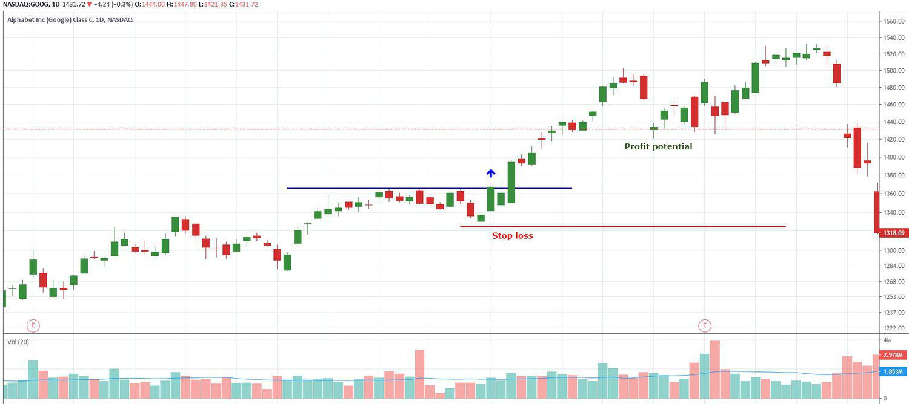

In the rapidly evolving world of finance, grasping the concept of trade price and its components is vital for market participants aiming to enhance their trading performance. Trade price, essentially the value at which a security is bought or sold, plays a fundamental role in the trading ecosystem. Its components, such as bid price, ask price, and spread, are instrumental in determining trading outcomes, reflecting the dynamic nature of supply and demand forces in financial markets.

As trading strategies become more sophisticated, market response price, the variation in trade price following market events, becomes a crucial metric. This concept is pivotal in evaluating market efficiency and gauging investor sentiment, thereby influencing trading decisions.



In recent years, the emergence of algorithmic trading has significantly transformed market dynamics. By utilizing intricate computer programs to execute trades at high speed and volume, algorithmic trading enhances market efficiency, liquidity, and precision. This high-frequency trading mechanism is integral to understanding modern trading environments, as it interacts dynamically with trade price components to shape market behavior.

The intricate relationship between trade price components, market response price, and algorithmic trading forms the foundation of contemporary trading strategies. Mastering these interconnected elements is essential for traders seeking to optimize their results in today’s fast-paced financial landscape. This article seeks to offer a comprehensive overview of these concepts, emphasizing their impact on effective trading practices and strategic decision-making.

## Table of Contents

## Understanding Trade Price and its Components

Trade price is the specific price at which a security is either bought or sold on the market. Understanding the components that determine the trade price is essential for anyone involved in trading or analyzing financial markets. 

One of the fundamental aspects of trade price is its determination through bid price, ask price, and the spread. The bid price is the highest price a buyer is willing to pay for a security, while the ask price is the lowest price at which a seller is willing to sell. The spread is the difference between the bid and ask prices and is a critical measure of market liquidity and transaction cost. In simpler terms, the spread can be expressed as:

$$
\text{Spread} = \text{Ask Price} - \text{Bid Price}
$$

For example, if a security has a bid price of $100 and an ask price of $102, the spread is $2. The size of this spread can indicate the [liquidity](/wiki/liquidity-risk-premium) of the security; tighter spreads often suggest a more liquid and competitive market.

Several factors influence the determination of the trade price. Market demand plays a significant role; higher demand typically drives prices up, while a lack of demand can lead to lower prices. Liquidity is another crucial [factor](/wiki/factor-investing)—markets with higher liquidity tend to have smaller spreads and more stable prices. Volatility, or the extent of price fluctuations over a given period, affects both the spread and the level of risk associated with trading a particular security.

News events are also pivotal in influencing trade prices. Announcements related to economic indicators, corporate earnings, or geopolitical events can cause abrupt changes in prices as traders reassess their positions based on the new information. For instance, a positive earnings report may lead to a surge in demand for a company's stock, raising its trade price, whereas negative news might result in a sell-off, decreasing its value.

Each component in the trade price mechanism works in tandem to reflect the current state of the market. The bid and ask prices encapsulate the expectations and intentions of market participants, while the spread provides insight into market efficiency and liquidity. By understanding how these elements interact, traders can gain valuable insights into market movements and make more informed trading decisions.

## Market Response Price: What It Means

Market response price, often a critical indicator in financial markets, refers to the modification of trade prices following specific market events. This concept is significant as it reflects the market's overall efficiency and the underlying investor sentiment. When a market is considered efficient, it quickly absorbs new information, resulting in immediate adjustments to trade prices. Consequently, market response price becomes a vital metric for traders seeking to anticipate potential price shifts.

Various external factors influence market response prices, primarily economic data releases and geopolitical occurrences. Economic indicators such as employment reports, inflation rates, and gross domestic product (GDP) figures can lead to substantial shifts in market prices. For instance, a better-than-expected jobs report might drive stock prices higher, while an unexpected rise in inflation could lead to declines. Similarly, geopolitical events, like elections, wars, or trade negotiations, can create significant [volatility](/wiki/volatility-trading-strategies), prompting market price adjustments.

Understanding market response prices enables traders to predict price movements more accurately, allowing them to refine their strategies accordingly. By analyzing historical data and current market conditions, traders can identify patterns in how prices respond to specific events. This predictive capability is crucial for making well-informed trading decisions.

The process of analyzing market response prices often requires advanced analytical techniques. Traders and financial analysts may employ statistical models or [machine learning](/wiki/machine-learning) algorithms to evaluate historical price data and correlate it with past market events. These models can highlight recurrent behavioral patterns, allowing traders to develop strategies that capitalize on anticipated market responses.

Incorporating market response price analysis into trading strategies is essential for achieving effective trade execution. By recognizing how prices react to different factors, traders can position themselves advantageously, either by mitigating potential losses or by capitalizing on forecasted gains. Understanding and analyzing market response prices remains a key component for traders looking to develop robust and adaptive trading strategies in an ever-evolving financial landscape.

## The Role of Algorithmic Trading

Algorithmic trading, commonly referred to as algo trading, employs computer algorithms to execute trades with remarkable speed and [volume](/wiki/volume-trading-strategy), often beyond the capacity of human traders. This method leverages sophisticated mathematical models and formulas to identify trading opportunities, enabling quick decision-making and execution in response to market changes.

1. **Identifying Trading Opportunities**: Algorithms analyze market data to detect potential trading opportunities. These algorithms utilize complex mathematical models, often involving statistical analysis, machine learning, or quantitative analysis. For instance, a simple moving average crossover strategy can be implemented using Python:

   ```python
   import pandas as pd

   def moving_average_crossover(data, short_window, long_window):
       data['short_mavg'] = data['Close'].rolling(window=short_window, min_periods=1).mean()
       data['long_mavg'] = data['Close'].rolling(window=long_window, min_periods=1).mean()
       signals = pd.DataFrame(index=data.index)
       signals['signal'] = 0.0
       signals['signal'][short_window:] = np.where(
           data['short_mavg'][short_window:] > data['long_mavg'][short_window:], 1.0, 0.0
       )
       signals['positions'] = signals['signal'].diff()
       return signals
   ```

2. **Revolutionizing Market Efficiency and Liquidity**: Algo trading has significantly enhanced market efficiency by enabling quicker price discovery and reducing transaction costs. It has also improved market liquidity by facilitating a higher volume of trades, thus narrowing bid-ask spreads. According to the report published by the Bank for International Settlements, algo trading accounted for about 70-80% of trades in U.S. equity markets, highlighting its impact on liquidity and efficiency.

3. **Influencing Trade Prices**: The ability of algorithms to execute thousands of trades within seconds contributes to rapid shifts in supply and demand dynamics, known as liquidity imbalances. These imbalances can influence trade prices by exerting buying or selling pressures, potentially leading to price movements. Algorithms can react to new information and execute trades before human counterparts can respond.

4. **Understanding Algorithm Operations**: For traders and market participants, comprehending how algorithms function is critical. Algos operate based on parameters set by developers, which determine their response to market conditions. This understanding necessitates knowledge of programming languages, statistical methods, and financial markets. Continuous monitoring and adjustment ensure algorithms adapt to market evolution, preventing them from operating on outdated assumptions.

In conclusion, [algorithmic trading](/wiki/algorithmic-trading) has transformed modern financial markets by making high-speed, data-driven trading possible. Its influence on trade prices, market efficiency, and liquidity underscores the importance of understanding and utilizing this technology for effective market strategies.

## Integrating Trade Price Analysis and Algo Trading

Traders often leverage algorithmic trading to optimize trade price outcomes by meticulously integrating trade price analysis with algorithmic strategies. This integration involves parsing through vast amounts of data to identify patterns and designing algorithms capable of adapting to dynamic market conditions. By doing so, traders can enhance their decision-making processes, ensuring that trades are executed with precision and efficiency.

One foundational aspect of this integration is the ability of algorithms to react immediately to market response prices. These prices, which shift rapidly due to market events, require swift and accurate decision-making that often surpasses human ability. Algorithms equipped with advanced machine learning techniques can be programmed to recognize and respond to these changes effectively. For instance, a machine learning algorithm could be trained to analyze market data and predict short-term price movements. A simple Python implementation for setting up a trading bot making decisions based on moving averages could look like this:

```python
import pandas as pd
import numpy as np

# Sample Data
data = {'price': [101, 102, 100, 103, 105, 104, 106]}
df = pd.DataFrame(data)

# Calculate the moving averages
df['short_ma'] = df['price'].rolling(window=2).mean()
df['long_ma'] = df['price'].rolling(window=3).mean()

# Generate buy/sell signals
def generate_signals(data):
    signals = []
    for i in range(len(data)):
        if data['short_ma'][i] > data['long_ma'][i]:
            signals.append('buy')
        elif data['short_ma'][i] < data['long_ma'][i]:
            signals.append('sell')
        else:
            signals.append('hold')
    return signals

df['signal'] = generate_signals(df)

print(df)
```

The implementation of such algorithms requires a comprehensive understanding of market patterns, allowing them to react in real time, achieving better trade execution through enhanced timing and accuracy.

The synergy between human insight and algorithmic precision forms the cornerstone of successful trading. While algorithms offer speed and efficiency, human intuition and strategic oversight are vital in guiding these technological tools. Traders provide the contextual understanding necessary to navigate complex financial markets, assessing the broader economic, political, and social factors that might influence algorithmic outcomes. Therefore, efficient trading strategies often emerge from a harmonious balance between human expertise and the computational might of algorithmic systems. 

As financial markets continue to evolve, the integration of trade price analysis with algorithmic strategies will remain crucial, helping traders navigate the intricacies of modern trading environments.

## Challenges and Considerations

Algorithmic trading, despite its numerous advantages, presents several challenges and considerations that traders must address to ensure success. One of the primary risks associated with algorithmic trading is over-optimization. This occurs when an algorithm is overly fine-tuned to the past market data, resulting in a strategy that may not perform well under future market conditions. Overfitting in the context of machine learning can be mathematically expressed as:

$$
\text{Model Error} = \text{Bias}^2 + \text{Variance} + \text{Irreducible Error}
$$

Here, a model with high variance typically captures the noise in the data, leading to overfitting. To mitigate this, regularization techniques are often employed to balance bias and variance.

There is also a continuous need to monitor algorithms to ensure they function as intended. Algorithms can malfunction due to bugs in the code, unexpected inputs, or changes in market conditions. As such, robust testing, including back-testing over a range of scenarios and conditions, is essential for reliable performance. Continuous monitoring systems can alert traders to potential issues, enabling timely intervention.

Market anomalies and unexpected events pose significant risks to algorithmic trading systems. These events, often termed 'black swan' events, can cause market conditions to deviate dramatically from historical patterns. Such disruptions require algorithms that can adapt or have pre-defined fail-safes to minimize losses. 

Traders engaged in algorithmic trading must also be cognizant of the regulatory implications. Markets around the world have implemented various guidelines and rules to govern algo trading, aiming to prevent practices that could lead to unfair advantages or financial instability. For instance, measures such as circuit breakers and restrictions on high-frequency trading practices have been introduced in numerous jurisdictions. Traders should ensure that their algorithms comply with these regulations to avoid legal and financial penalties.

Finally, continuous education and adaptation are crucial for navigating the complexities of modern trading. Algorithms must evolve with the markets, requiring traders to stay informed about technological advancements and market trends. This might involve re-training machine learning models or updating algorithm parameters to maintain their efficacy. Lifelong learning is a critical component in the domain of algorithmic trading.

In summary, while algorithmic trading holds significant potential for optimizing trade execution and efficiency, traders must carefully manage these challenges through rigorous testing, compliance with regulations, and ongoing adaptation to both technological and market changes.

## Conclusion

In modern finance, the interplay between trade price components, market response price, and algorithmic trading significantly impacts trading outcomes. Trade price components, such as bid price, ask price, and spread, form the foundation of any trading strategy. Understanding these elements allows traders to refine their market strategies for optimized execution. Market response price provides insights into how market events affect asset prices, enabling traders to anticipate potential movements more accurately.

Algorithmic trading, leveraging computer programs to execute trades, is a transformative tool in the financial landscape. With the ability to process vast amounts of data quickly, algorithms optimize trade results even in the most volatile markets, enhancing market efficiency and liquidity. Algorithms can be designed to adapt to market changes, leading to better-informed trading decisions. For instance, by analyzing market response prices, algorithms can adjust strategies in real-time to exploit emerging opportunities or mitigate risks.

Continuous learning and adaptation are vital for traders aiming to harness these elements effectively. Financial markets are ever-evolving, and traders must stay informed about market dynamics, regulatory changes, and technological advancements. The dynamic nature of price movements and algorithmic strategies requires an ongoing commitment to learning and adaptation.

In conclusion, achieving success in modern finance requires a comprehensive understanding of trade price components, market response price, and algorithmic trading. Embracing this synergy between human insight and algorithmic precision enables traders and financial experts to navigate and thrive in today's fast-paced markets.

## References & Further Reading

[1]: Bergstra, J., Bardenet, R., Bengio, Y., & Kégl, B. (2011). ["Algorithms for Hyper-Parameter Optimization."](https://proceedings.neurips.cc/paper/2011/file/86e8f7ab32cfd12577bc2619bc635690-Paper.pdf) Advances in Neural Information Processing Systems 24.

[2]: ["Advances in Financial Machine Learning"](https://www.amazon.com/Advances-Financial-Machine-Learning-Marcos/dp/1119482089) by Marcos Lopez de Prado

[3]: ["Evidence-Based Technical Analysis: Applying the Scientific Method and Statistical Inference to Trading Signals"](https://www.amazon.com/Evidence-Based-Technical-Analysis-Scientific-Statistical/dp/0470008741) by David Aronson

[4]: ["Machine Learning for Algorithmic Trading"](https://github.com/stefan-jansen/machine-learning-for-trading) by Stefan Jansen

[5]: ["Quantitative Trading: How to Build Your Own Algorithmic Trading Business"](https://www.amazon.com/Quantitative-Trading-Build-Algorithmic-Business/dp/1119800064) by Ernest P. Chan