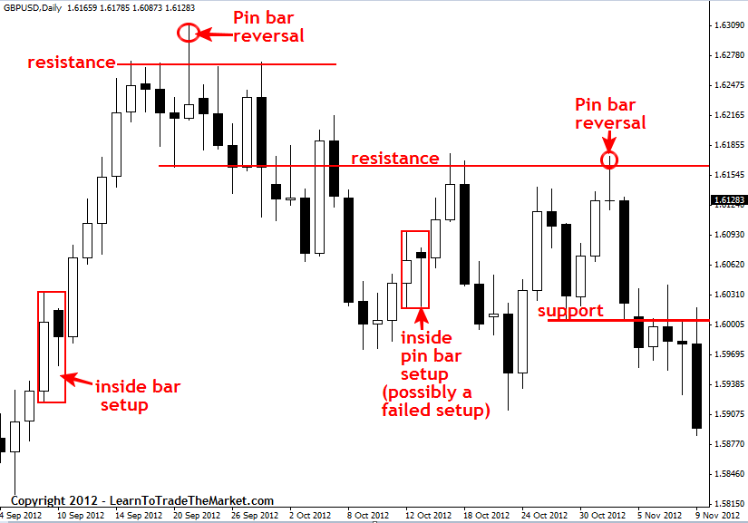

## Table of Contents

## What is trade price response?

Trade price response is how the price of something changes when people buy or sell it. When lots of people want to buy something, the price usually goes up. If many people want to sell something, the price usually goes down. This happens because of supply and demand. Supply is how much of something is available, and demand is how much people want it.

This idea is important in trading and markets. Traders watch price changes closely to decide when to buy or sell. If they think the price will go up, they might buy now to sell later for more money. If they think the price will go down, they might sell now to avoid losing money later. Understanding trade price response helps traders make better choices.

## Why is understanding trade price response important for businesses?

Understanding trade price response is important for businesses because it helps them set the right prices for their products or services. If a business knows how the price changes when people buy or sell, they can decide if they should raise or lower their prices. For example, if they see that demand is high and the price is going up, they might increase their prices to make more money. On the other hand, if they see that demand is low and the price is going down, they might lower their prices to sell more.

This knowledge also helps businesses plan better. They can predict how their prices might change in the future and make plans accordingly. For instance, if they think the price of their raw materials will go up, they might buy more now while the price is still low. Or, if they expect the price of their product to go down, they might try to sell more of it now before the price drops. By understanding trade price response, businesses can make smarter decisions and be more successful.

## How does trade price response affect demand?

Trade price response affects demand because when the price of something goes up, people might not want to buy it as much. This is because they might think it's too expensive or they might wait for the price to go down. On the other hand, if the price goes down, more people might want to buy it because it seems like a good deal. So, the price can make people change their minds about buying something.

Businesses need to watch how the price affects demand. If they see that raising the price makes fewer people want to buy, they might decide to lower it to sell more. If lowering the price makes more people want to buy, they might keep the price low to keep demand high. Understanding this helps businesses set the right price to sell as much as they can.

## What are the basic factors that influence trade price response?

Trade price response is influenced by several basic factors. One key factor is supply and demand. If there is a lot of something available (high supply) and not many people want it (low demand), the price usually goes down. On the other hand, if there is not much of something available (low supply) and many people want it (high demand), the price usually goes up. This is because people are willing to pay more when something is hard to get.

Another factor is competition. If there are many businesses selling the same thing, they might lower their prices to attract more customers. This can make the price go down. Also, external factors like economic conditions can affect trade price response. For example, if people have less money to spend because of a bad economy, they might buy less, which can lower the price. On the other hand, if the economy is doing well and people have more money, they might buy more, which can raise the price.

## Can you explain the concept of price elasticity in relation to trade price response?

Price elasticity is a way to understand how much the demand for something changes when its price changes. It's important for figuring out trade price response because it tells us if people will buy more or less of something if the price goes up or down. If a product is elastic, that means a small change in price can make a big change in how much people want to buy it. For example, if the price of a certain candy goes up just a little, people might stop buying it and choose a cheaper candy instead. But if a product is inelastic, the price can change a lot and people will still buy about the same amount. This often happens with things like medicine, where people need it no matter the price.

Understanding price elasticity helps businesses predict how their sales might change if they change their prices. If they know their product is elastic, they might be careful not to raise the price too much, because it could make a lot of people stop buying. But if their product is inelastic, they might feel okay raising the price, because people will keep buying it even if it costs more. This knowledge helps businesses set the best prices to make the most money and keep their customers happy.

## How do companies measure trade price response?

Companies measure trade price response by looking at how their sales change when they change the price of their products. They do this by watching sales data over time. If they raise the price and see that fewer people buy the product, they know that the demand went down because of the higher price. On the other hand, if they lower the price and more people start buying, they know that the demand went up because of the lower price. This helps them understand how sensitive their customers are to price changes.

Another way companies measure trade price response is by using experiments. They might change the price in one store but not in another and then compare the sales in both stores. This is called a controlled test. By doing this, they can see if the price change really made a difference in how much people bought. Sometimes, they also use surveys to ask customers how likely they are to buy something at different prices. All of these methods help companies figure out the best price to charge to make the most money.

## What are some common strategies businesses use to optimize trade price response?

Businesses often use dynamic pricing to optimize trade price response. This means they change their prices based on what's happening in the market. If they see that demand is going up, they might raise their prices to make more money. If demand is going down, they might lower their prices to sell more. They use computer programs to watch sales and prices all the time, so they can change their prices quickly. This helps them make the most money they can.

Another strategy is called price discrimination. This is when a business charges different prices to different people for the same thing. For example, they might charge more to people who really need the product and can't wait, and less to people who can wait or don't need it as much. This helps them get more money from people who are willing to pay more, while still selling to people who want a lower price. It's a way to make more money by understanding what different customers are willing to pay.

Businesses also use promotions and discounts to boost demand when they need to. If they have too much of a product and want to sell it quickly, they might offer a sale or a special deal. This can make more people want to buy the product because it seems like a good deal. By doing this at the right time, businesses can get rid of extra stock and keep their customers happy. It's all about finding the right balance between price and demand to make the most money.

## How does trade price response vary across different industries?

Trade price response can be very different from one industry to another because each industry has its own unique things that affect how people buy things. For example, in the tech industry, new gadgets like smartphones and computers can see big changes in price when a new model comes out. People might wait for the price to drop on the older model before buying, so companies have to be smart about when they lower prices. In the food industry, prices can change a lot because of things like weather, which can affect how much food is available. If there's a bad harvest, the price of certain foods might go up because there's less to go around.

In the fashion industry, trade price response can be influenced by trends and seasons. If a certain style becomes popular, the price might go up because more people want it. But if the style goes out of fashion, the price might drop quickly as stores try to sell off old stock. In the energy industry, like oil and gas, prices can change a lot because of global events and politics. If there's a problem in a country that produces a lot of oil, the price might go up everywhere because there's less oil to buy. Each industry has to watch these different factors to set the right prices and keep selling their products.

## What role does consumer behavior play in trade price response?

Consumer behavior is a big part of how prices change when people buy or sell things. When people see that a product's price goes up, they might decide not to buy it because they think it's too expensive. Or, they might buy it quickly if they think the price will keep going up. On the other hand, if the price goes down, people might buy more because they think it's a good deal. They might also wait for the price to drop even more before buying. This shows that what people do when they see price changes can make the price go up or down even more.

Businesses need to understand consumer behavior to set the right prices. If they know that people are likely to stop buying when the price goes up, they might keep the price low to sell more. If they know that people will buy more when the price goes down, they might lower the price to boost sales. By watching how people react to different prices, businesses can find the best price to make the most money and keep their customers happy.

## How can advanced analytics improve the understanding of trade price response?

Advanced analytics can help businesses understand trade price response better by looking at a lot of data quickly. They can use computers to watch how prices change and how people buy things. This helps them see patterns and predict what will happen next. For example, they can use special math to figure out how much demand will change if they change the price. This is called price elasticity. By knowing this, businesses can set the right price to sell as much as they can and make the most money.

Also, advanced analytics can help businesses try out different prices without really changing them. They can use computer models to see what would happen if they raised or lowered the price. This is like doing experiments without taking a risk. By doing this, businesses can learn a lot about how people will react to different prices. They can then use this information to make better decisions about what to charge for their products. This way, they can keep their customers happy and make more money.

## What are some case studies or examples where trade price response significantly impacted a company's strategy?

One example where trade price response significantly impacted a company's strategy is with Uber. Uber uses dynamic pricing, which means they change their prices based on how many people want rides and how many drivers are available. During busy times, like rush hour or big events, Uber might charge more because there are more people who need rides than there are drivers. This helps them make more money when demand is high. But if they charge too much, people might choose not to use Uber and find another way to travel. So, Uber has to find the right balance to keep their customers happy while still making a good profit.

Another example is Amazon. Amazon changes the prices of their products all the time based on what's happening in the market. They use computers to watch how much people are buying and what other stores are charging. If they see that a lot of people want a certain product, they might raise the price a little to make more money. But if they see that not many people are buying, they might lower the price to sell more. This helps Amazon sell a lot of products and make a lot of money. By understanding how people react to different prices, Amazon can set the best price for each product to keep their customers coming back.

## How can predictive modeling be used to forecast trade price response and adjust pricing strategies accordingly?

Predictive modeling helps businesses guess how people will react to changes in price. They use computers to look at a lot of old data about what people bought and how much they paid. This data helps them make a math model that can predict what will happen if they change the price. For example, if they think raising the price will make fewer people buy, the model can help them decide how much to raise it without losing too many customers. By using these predictions, businesses can set prices that help them sell more and make more money.

Companies can use these predictions to change their prices in smart ways. If the model says that lowering the price a little bit will make a lot more people buy, the company might do that to sell more products. Or, if the model says that raising the price won't make people stop buying, the company might raise it to make more money. This way, businesses can keep trying different prices to find the best one. Predictive modeling helps them make these decisions faster and with more confidence, so they can keep their customers happy and their business successful.

## What is the Understanding of Trade Price and its Components?

Trade price is the specific price at which a security is either bought or sold on the market. Understanding the components that determine the trade price is essential for anyone involved in trading or analyzing financial markets. 

One of the fundamental aspects of trade price is its determination through bid price, ask price, and the spread. The bid price is the highest price a buyer is willing to pay for a security, while the ask price is the lowest price at which a seller is willing to sell. The spread is the difference between the bid and ask prices and is a critical measure of market liquidity and transaction cost. In simpler terms, the spread can be expressed as:

$$
\text{Spread} = \text{Ask Price} - \text{Bid Price}
$$

For example, if a security has a bid price of $100 and an ask price of $102, the spread is $2. The size of this spread can indicate the [liquidity](/wiki/liquidity-risk-premium) of the security; tighter spreads often suggest a more liquid and competitive market.

Several factors influence the determination of the trade price. Market demand plays a significant role; higher demand typically drives prices up, while a lack of demand can lead to lower prices. Liquidity is another crucial [factor](/wiki/factor-investing)—markets with higher liquidity tend to have smaller spreads and more stable prices. Volatility, or the extent of price fluctuations over a given period, affects both the spread and the level of risk associated with trading a particular security.

News events are also pivotal in influencing trade prices. Announcements related to economic indicators, corporate earnings, or geopolitical events can cause abrupt changes in prices as traders reassess their positions based on the new information. For instance, a positive earnings report may lead to a surge in demand for a company's stock, raising its trade price, whereas negative news might result in a sell-off, decreasing its value.

Each component in the trade price mechanism works in tandem to reflect the current state of the market. The bid and ask prices encapsulate the expectations and intentions of market participants, while the spread provides insight into market efficiency and liquidity. By understanding how these elements interact, traders can gain valuable insights into market movements and make more informed trading decisions.

## What are the challenges and considerations?

Algorithmic trading, despite its numerous advantages, presents several challenges and considerations that traders must address to ensure success. One of the primary risks associated with algorithmic trading is over-optimization. This occurs when an algorithm is overly fine-tuned to the past market data, resulting in a strategy that may not perform well under future market conditions. Overfitting in the context of machine learning can be mathematically expressed as:

$$
\text{Model Error} = \text{Bias}^2 + \text{Variance} + \text{Irreducible Error}
$$

Here, a model with high variance typically captures the noise in the data, leading to overfitting. To mitigate this, regularization techniques are often employed to balance bias and variance.

There is also a continuous need to monitor algorithms to ensure they function as intended. Algorithms can malfunction due to bugs in the code, unexpected inputs, or changes in market conditions. As such, robust testing, including back-testing over a range of scenarios and conditions, is essential for reliable performance. Continuous monitoring systems can alert traders to potential issues, enabling timely intervention.

Market anomalies and unexpected events pose significant risks to algorithmic trading systems. These events, often termed 'black swan' events, can cause market conditions to deviate dramatically from historical patterns. Such disruptions require algorithms that can adapt or have pre-defined fail-safes to minimize losses. 

Traders engaged in algorithmic trading must also be cognizant of the regulatory implications. Markets around the world have implemented various guidelines and rules to govern algo trading, aiming to prevent practices that could lead to unfair advantages or financial instability. For instance, measures such as circuit breakers and restrictions on high-frequency trading practices have been introduced in numerous jurisdictions. Traders should ensure that their algorithms comply with these regulations to avoid legal and financial penalties.

Finally, continuous education and adaptation are crucial for navigating the complexities of modern trading. Algorithms must evolve with the markets, requiring traders to stay informed about technological advancements and market trends. This might involve re-training machine learning models or updating algorithm parameters to maintain their efficacy. Lifelong learning is a critical component in the domain of algorithmic trading.

In summary, while algorithmic trading holds significant potential for optimizing trade execution and efficiency, traders must carefully manage these challenges through rigorous testing, compliance with regulations, and ongoing adaptation to both technological and market changes.

## References & Further Reading

[1]: Bergstra, J., Bardenet, R., Bengio, Y., & Kégl, B. (2011). ["Algorithms for Hyper-Parameter Optimization."](https://proceedings.neurips.cc/paper/2011/file/86e8f7ab32cfd12577bc2619bc635690-Paper.pdf) Advances in Neural Information Processing Systems 24.

[2]: ["Advances in Financial Machine Learning"](https://www.amazon.com/Advances-Financial-Machine-Learning-Marcos/dp/1119482089) by Marcos Lopez de Prado

[3]: ["Evidence-Based Technical Analysis: Applying the Scientific Method and Statistical Inference to Trading Signals"](https://www.amazon.com/Evidence-Based-Technical-Analysis-Scientific-Statistical/dp/0470008741) by David Aronson

[4]: ["Machine Learning for Algorithmic Trading"](https://github.com/stefan-jansen/machine-learning-for-trading) by Stefan Jansen

[5]: ["Quantitative Trading: How to Build Your Own Algorithmic Trading Business"](https://www.amazon.com/Quantitative-Trading-Build-Algorithmic-Business/dp/1119800064) by Ernest P. Chan