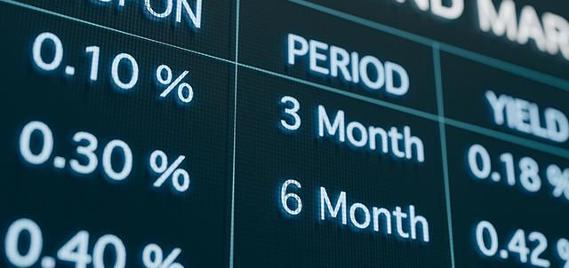

The financial markets have evolved into highly complex ecosystems, necessitating a robust framework of regulatory requirements to ensure fairness and transparency. Among these requirements, trade reporting stands out as a critical element of financial compliance. It is vital for both traditional and algorithmic trading, serving as a cornerstone for accurate market assessment and regulatory oversight.

A pivotal system in the domain of trade reporting is the Trade Reporting and Compliance Engine (TRACE), developed to standardize the reporting of transactions in eligible fixed-income securities. This article focuses on TRACE, examining its impact on algorithmic trading and its role in promoting market integrity. Understanding these components is indispensable for traders, financial firms, and regulatory bodies, given the potential of TRACE to influence trading dynamics and regulatory compliance.

Algorithmic trading, which relies heavily on data, benefits significantly from the transparency and real-time data provided by systems like TRACE. It reduces information asymmetry among participants, thereby fostering a fairer marketplace. This article aims to shed light on the ways TRACE contributes to algorithmic trading by enriching data sources and enhancing decision-making processes.

In a financial ecosystem where regulatory compliance is non-negotiable, tools like TRACE are central to sustaining market trust and integrity. They equip market participants with the necessary data for informed decision-making while ensuring adherence to regulatory standards. As the financial markets continue to grow in complexity, the importance of understanding and integrating systems like TRACE becomes increasingly prominent for all stakeholders involved.

## Table of Contents

## What is TRACE?

TRACE, which stands for the Trade Reporting and Compliance Engine, is an integral system developed by the Financial Industry Regulatory Authority (FINRA). Its primary purpose is to ensure the mandatory reporting of over-the-counter (OTC) transactions concerning eligible fixed-income securities. This system plays a pivotal role in enhancing market transparency and furnishing regulators with exhaustive trading data.

Before the establishment of TRACE in 2002, the Fixed Income Pricing System (FIPS) was in place. However, as the market expanded and the demand for more comprehensive oversight increased, TRACE was implemented to address these needs effectively. By supplanting FIPS, TRACE became more attuned to the complexities of a burgeoning market.

TRACE is crucial because it provides both real-time and historical data that support a wide array of market analyses. The real-time data offer immediate insights into trading activities, allowing market participants and regulators to make informed decisions and respond promptly to market dynamics. Meanwhile, the historical data supply essential information for conducting trend analyses, [backtesting](/wiki/backtesting) trading strategies, and comprehensively understanding long-term market patterns.

Through these aspects, TRACE ensures that the bond markets, traditionally characterized by their opacity, become more transparent. Its influence is not restricted to enhancing oversight; it also facilitates the better functioning of these markets by enabling a deeper analysis of market behaviors, contributing to more efficient price discovery, and assisting in the identification of market trends.

## The Role of TRACE in Financial Compliance

TRACE, or the Trade Reporting and Compliance Engine, is a pivotal mechanism in maintaining financial compliance specifically within the bond markets. Developed by the Financial Industry Regulatory Authority (FINRA) and regulated by the Securities and Exchange Commission (SEC), TRACE provides a structure through which over-the-counter (OTC) transactions for eligible fixed-income securities are reported. This system brings transparency to bond markets, which have traditionally been characterized by limited visibility of trading activities.

The transparency afforded by TRACE comes from its comprehensive reporting requirements, which ensure that detailed information on bond trades is available. This information includes the identities of the securities traded, the price and [volume](/wiki/volume-trading-strategy) of trades, and the time at which transactions occurred. By making such data publicly accessible, TRACE reduces information asymmetry and helps in fostering a fairer trading environment.

Compliance with TRACE is crucial for market participants, as it directly affects the integrity and trust in financial markets. The SEC mandates adherence to TRACE reporting for relevant transactions, meaning that any failures or inaccuracies in reporting can result in penalties. These penalties underscore the necessity for timely and precise reporting of trades, as they are designed to deter non-compliance and encourage adherence to regulations.

In addition to transparency and compliance enforcement, the data collected through TRACE is invaluable to regulators. This data enables them to identify and monitor market trends, enforce trading rules consistently, and conduct thorough investigations in case of potential violations or market abuses. By analyzing TRACE data, regulators can discern patterns indicative of market manipulation or irregularities, thus offering greater protection to investors and bolstering the overall stability of financial markets.

The robust reporting framework provided by TRACE ensures that any anomalies or suspicious activities can be quickly identified and addressed by the appropriate regulatory bodies. Consequently, TRACE not only assists in maintaining market integrity but also lays the groundwork for a more informed and regulated trading ecosystem.

## Implications of TRACE for Algorithmic Trading

Algorithmic trading, which automates trading decisions using mathematical models and programming, relies on data accuracy and timeliness to execute strategies effectively. TRACE, the Trade Reporting and Compliance Engine, provides a comprehensive dataset indispensable for developing and refining these trading algorithms. The wealth of information available through TRACE significantly impacts [algorithmic trading](/wiki/algorithmic-trading) in several ways.

Firstly, TRACE improves market transparency by making detailed trade data accessible to all market participants. This transparency helps in reducing informational asymmetries, where some traders might have previously had unfair access to crucial trading data. By leveling the playing field, TRACE allows algorithmic traders to build and refine strategies that are not disadvantaged by any data discrepancies. As a result, all participants have access to the same information, which can contribute to market efficiency and fairness.

For algorithmic traders, aligning with regulatory standards is crucial. TRACE data supports this by offering insight into trade compliance. Algorithms can be fine-tuned to ensure that all executed trades adhere to current regulations, minimizing the risk of non-compliance. This not only enhances the robustness of the trading strategies but also protects firms from potential legal and financial penalties associated with regulatory breaches.

Moreover, TRACE provides a robust database of historical trade information, which is essential for backtesting trading strategies. Backtesting involves running an algorithmic strategy on historical data to evaluate its performance. The rich dataset from TRACE allows traders to simulate a variety of market conditions, enhancing the reliability of the performance metrics obtained. This process is critical for identifying potential weaknesses in a strategy before deploying it in a live trading environment.

Integrating TRACE data into trading algorithms also enhances compliance monitoring and risk management. Real-time access to trade data enables continuous monitoring of trading activities, facilitating the immediate identification and rectification of any deviations from regulatory or strategic guidelines. This proactive approach to compliance helps in mitigating risks associated with erroneous trades and potential market disruptions.

The use of TRACE data in algorithmic trading is further enhanced by its role in improving risk management strategies. By providing detailed post-trade information, TRACE allows traders to analyze and adjust their risk exposure promptly. This adaptability is vital in fast-moving markets, where conditions can change rapidly, necessitating adjustments to trading strategies to maintain effective risk control.

In conclusion, TRACE enhances the efficacy of algorithmic trading by supplying accurate, timely, and comprehensive trade data, supporting both strategic development and compliance alignment. Through better backtesting, improved transparency, and enhanced risk management, algorithmic traders can optimize their operations and contribute to a more transparent and fair financial marketplace.

## Challenges and Opportunities

TRACE, a pivotal system for trade reporting in the bond market, significantly enhances transparency but presents challenges regarding data management. The substantial amount of trading data reported through TRACE requires firms to invest in robust infrastructure to store, process, and analyze this data efficiently. This investment is crucial not only for compliance but also for leveraging the data for competitive advantage.

One primary challenge involves the integration of TRACE data with existing systems. Firms need to ensure seamless data flow from TRACE into their databases, requiring sophisticated IT solutions and often a reevaluation of their current technology stack. Moreover, the data must be accurately interpreted to draw meaningful insights, necessitating advanced data analytics tools and expertise.

Despite these challenges, TRACE offers substantial opportunities by providing a wealth of data that can be harnessed to improve trading strategies. The detailed transactional data aids in developing more informed and effective trading algorithms, particularly advantageous for algorithmic traders. By analyzing past trades and current market conditions, traders can refine their strategies, optimize trade execution, and potentially enhance returns.

Furthermore, the comprehensive dataset offered by TRACE promotes better decision-making. Access to real-time and historical trade information allows market participants to make data-driven decisions, reducing reliance on speculation. This informed decision-making process is beneficial in managing risks, identifying market trends, and understanding competitor behavior.

Additionally, adherence to TRACE reporting requirements fosters a culture of transparency and integrity within firms. By committing to full compliance, firms demonstrate their dedication to ethical trading practices, which can enhance their reputation among investors and regulators. This culture of transparency not only mitigates the risk of regulatory penalties but also builds trust among market participants, contributing to overall market stability and integrity.

In conclusion, while TRACE presents data management challenges, the benefits it offers through improved trading strategies, informed decision-making, and enhanced transparency are significant. These advantages underscore the importance of investing in the necessary infrastructure and expertise to effectively manage TRACE data, ultimately leading to a more robust and transparent financial market.

## Conclusion

Financial compliance is essential for maintaining market integrity and fairness, with the Trade Reporting and Compliance Engine (TRACE) playing a significant role in this environment. TRACE is critical for both manual and algorithmic traders, as understanding and using its data are necessary for meeting regulatory standards. This system promotes transparency, reduces informational asymmetries, and enhances market fairness by making comprehensive trading data accessible.

Although implementing TRACE poses certain challenges, particularly in data management and infrastructure investment, the benefits it offers are considerable. Increased transparency through TRACE aids in better decision-making and strategy development, thereby improving market functionality. As financial markets become more complex, there is a continual need to develop and adapt systems like TRACE to effectively regulate and monitor trading activities.

Market participants who leverage TRACE can bolster their compliance efforts and refine their trading strategies. By doing so, they contribute significantly to a more transparent and trustworthy financial market. As the need for efficient and effective compliance tools grows, TRACE stands out as an indispensable system for ensuring that market activities align with regulatory requirements, ultimately fostering a culture of transparency and integrity in the financial sector.

## References & Further Reading

[1]: Financial Industry Regulatory Authority (FINRA). ["TRACE: Trade Reporting and Compliance Engine."](https://www.finra.org/filing-reporting/trace) 

[2]: Securities and Exchange Commission (SEC). ["Trade Reporting and Compliance Engine (TRACE)."](https://www.sec.gov/files/rules/sro/finra/2022/34-94365.pdf)

[3]: Lopez de Prado, M. (2018). ["Advances in Financial Machine Learning."](https://www.amazon.com/Advances-Financial-Machine-Learning-Marcos/dp/1119482089) John Wiley & Sons.

[4]: Jansen, S. (2020). ["Machine Learning for Algorithmic Trading."](https://github.com/stefan-jansen/machine-learning-for-trading) Packt Publishing.

[5]: Aronson, D. R. (2007). ["Evidence-Based Technical Analysis: Applying the Scientific Method and Statistical Inference to Trading Signals."](https://onlinelibrary.wiley.com/doi/book/10.1002/9781118268315) Wiley.