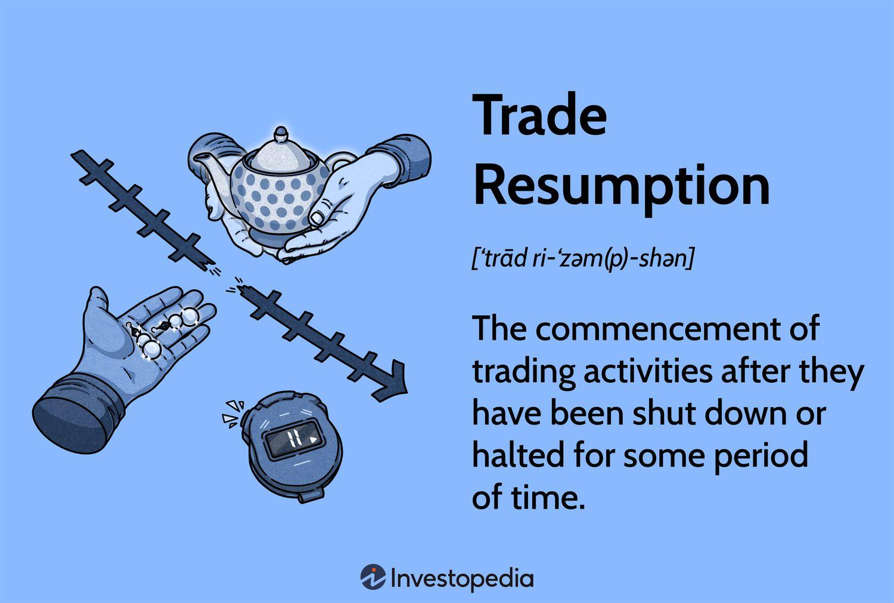

As the global economy aims to stabilize post-pandemic, the resumption of trade emerges as a fundamental driver in the economic restart process. This phase marks a rebuilding of the economic structures temporarily hindered by global disruptions. International trade serves as the backbone of economic growth by enabling nations to access a diversity of goods, services, and markets beyond their geographical constraints. With economies increasingly interlinked, the rebound in global trade activities signifies not just a return to pre-crisis levels but an evolution in how countries engage economically with one another.

A significant development influencing the restructuring of global trading activities is the rise of algorithmic trading. This method, which uses computer algorithms to automate trading decisions based on quantitative data, is reshaping the dynamics of global trade. The evolution of this practice highlights a shift towards an era where data analytics and technology are pivotal in managing trade activities efficiently.

In examining the nexus between trade resumption, economic growth, and algorithmic trading, this article offers a comprehensive insight into the ongoing transformations within the economic landscape. For policymakers, businesses, and investors, understanding these dynamics is essential to navigating and capitalizing on the post-pandemic recovery and economic opportunities.

By examining these critical intersections, the article aims to elucidate the ways in which these elements collectively contribute to shaping a resilient and adaptive global economy. As such, gaining a thorough understanding of these factors is paramount for stakeholders aiming to leverage the synergies of trade and algorithmic advancements in an increasingly interconnected economic environment.

## Table of Contents

## Trade Resumption and Economic Restart

In the aftermath of the COVID-19 pandemic, countries worldwide have made concerted efforts to reopen their economies and resume trade activities. This phase, often referred to as the economic restart, involves tackling significant challenges, including supply chain disruptions and trade barriers. Supply chains experienced unprecedented disruptions due to the pandemic, affecting production, distribution, and consumption processes (Ivanov & Dolgui, 2020). These disruptions highlighted the need for countries to re-evaluate and enhance their supply chain resilience to support trade resumption effectively.

Moreover, the pandemic introduced or exacerbated many trade barriers, such as tariffs and export restrictions, which have impeded the free flow of goods and services between nations. Addressing these barriers is essential for revitalizing global trade networks and boosting economic growth. Governments, therefore, are focusing on eliminating these impediments to facilitate smoother trade flows and support their domestic industries in recovering.

Economic restart initiatives are centered around boosting exports and reviving key industries that suffered during the pandemic. Export stimulation is a critical component, as it facilitates the inflow of foreign currency and can help balance trade deficits. Many countries, through strategic policies, are working to enhance their export capabilities by providing incentives such as tax rebates, subsidies, and improved access to capital for exporters.

A crucial [factor](/wiki/factor-investing) influencing trade resumption has been the global rollout of vaccinations and the subsequent easing of restrictions. The widespread distribution of vaccines has reduced transmission rates and allowed for the gradual lifting of lockdown measures. This easing has been vital in restoring consumer and business confidence, which in turn fuels economic activities, including international trade (World Trade Organization, 2021).

Governmental policies play a pivotal role in supporting trade resumption. Many governments have implemented packages targeting the resuscitation of trade by investing in infrastructure, digital trade facilitation, and logistical capabilities. These policies not only aim at overcoming immediate challenges but also strive to set the stage for sustainable economic recovery and growth. 

Addressing these areas is fundamental for resuming global trade activities, which contribute to economic growth and development. As economies navigate this recovery phase, the focus remains on building resilient systems that can withstand future disruptions, thereby ensuring a more robust global trading landscape.

## The Role of International Trade in Economic Recovery

International trade acts as a cornerstone for economic recovery and growth, particularly in post-crisis contexts. By enabling countries to access broader markets for both exports and imports, trade alleviates limitations inherent to domestic markets. This broader scope allows countries to fully exploit their comparative advantages, thus enhancing productivity and contributing to economic resurgence.

A critical aspect of leveraging international trade for economic recovery is the use of export-driven strategies. These strategies focus on increasing the [volume](/wiki/volume-trading-strategy) and value of exports, which can balance trade deficits and contribute significantly to a nation's GDP. For instance, an increase in exports boosts domestic production and can lead to higher employment levels, thereby generating additional income and fostering economic stability.

Trade agreements and partnerships play a fundamental role in stabilizing and securing long-term economic growth. These agreements can reduce tariffs, streamline regulatory barriers, and enhance cooperation among countries. They create a predictable trade environment and foster confidence among international investors. For example, the North American Free Trade Agreement (NAFTA), now updated to the United States-Mexico-Canada Agreement (USMCA), is frequently cited for its role in increasing trade between the member countries, subsequently fostering economic growth.

Observing case studies provides valuable insights into how countries have successfully utilized international trade to recover economically. One notable example is South Korea, which has transformed into one of the world's largest economies thanks to its strong focus on exports, particularly in electronics and automobiles. Another example is Germany, which leveraged its manufacturing and export capabilities to bounce back after economic downturns, particularly after the global financial crisis of 2008.

These examples underscore the importance of a robust trade infrastructure and strategic policy frameworks that prioritize international trade. As countries aim for recovery, partnerships and trade agreements will continue to be vital, ensuring that economic gains are sustained and mutually beneficial. Understanding the mechanisms through which international trade fosters economic recovery allows policymakers to craft informed strategies that promote growth and resilience in an interconnected global economy.

## Algorithmic Trading: A New Paradigm in Trade Resumption

Algorithmic trading has significantly transformed financial markets by enhancing the efficiency and volume of trades. This transformation is largely due to technological advancements and data analytics, which empower traders to make informed, data-driven decisions. With the capability to process vast amounts of data at high speed, [algorithmic trading](/wiki/algorithmic-trading) enables investors to analyze market trends in real-time and optimize trade strategies for better outcomes.

The integration of [artificial intelligence](/wiki/ai-artificial-intelligence) (AI) into algorithmic trading has further refined these processes. AI models, particularly those based on [machine learning](/wiki/machine-learning), can identify complex patterns and predict future market trends. This predictive capability allows for the optimization of trade strategies, minimizing risks and maximizing returns. For instance, algorithms can be programmed to execute trades automatically based on predefined criteria, ensuring timely transactions that capitalize on market fluctuations.

Fintech innovations play a critical role in facilitating seamless international transactions, bridging gaps between global markets. These innovations include blockchain technology, which enhances transparency and security in trading activities, and real-time payment systems that ensure quick and dependable cross-border financial transactions. By streamlining operations and reducing transaction costs, fintech contributes to a more integrated global trading environment.

However, the adoption of algorithmic trading is not without its challenges. One major concern is the potential for market manipulation, where algorithms could be used to influence market conditions unfairly. Additionally, the complexity and opaqueness of some trading algorithms make it difficult for regulators to ensure compliance with existing laws designed to maintain market integrity. Consequently, regulatory bodies are exploring new frameworks that can effectively oversee algorithmic trading activities. This includes the implementation of circuit breakers to prevent flash crashes and maintaining transparency standards to prevent insider trading.

In summary, algorithmic trading has established itself as a pivotal component in the resumption and growth of international trade, driven by advancements in technology and data analysis. While it presents opportunities for enhanced trade efficiency and global integration, it also necessitates robust regulatory oversight to mitigate associated challenges and risks.

## The Interplay Between Trade Resumption and Algorithmic Trading

As global trade resumes post-pandemic, algorithmic trading plays a pivotal role in enhancing market [liquidity](/wiki/liquidity-risk-premium) and stability. Algorithmic trading, which relies on automated systems to execute trades based on pre-determined criteria, has become increasingly integral in adjusting to rapid shifts in trade policy. By analyzing vast amounts of market data in real time, these algorithms offer traders the agility needed to navigate dynamic trading environments.

The impact of algorithmic trading on global currency exchanges and commodity markets is profound. In currency markets, algorithms facilitate the swift execution of [forex](/wiki/forex-system) transactions, thereby narrowing bid-ask spreads and increasing market liquidity. This results in more stable exchange rates, which are crucial for international trade. Similarly, in commodity markets, algorithmic trading helps manage vast datasets to predict price movements, optimize asset allocation, and hedge against potential risks.

Case studies illustrate the successful adoption of algorithmic trading in response to resumed trade activities. For instance, during the recent global trade recovery, several financial institutions implemented algorithmic solutions to better manage their foreign exchange operations. These algorithms utilized machine learning techniques to predict market trends with greater accuracy, allowing traders to make informed decisions even amid volatile trading conditions.

Despite its advantages, algorithmic trading also poses potential risks, especially concerning unintentional market [volatility](/wiki/volatility-trading-strategies). For example, high-frequency trading algorithms can sometimes amplify market fluctuations if not properly regulated. To mitigate such risks, regulatory bodies and financial institutions must implement comprehensive oversight mechanisms. This includes setting stringent guidelines on algorithmic transactions and employing robust risk management strategies.

In conclusion, as trade resumption progresses, algorithmic trading stands ready to significantly influence global financial markets. By providing enhanced liquidity and stability, this technology supports a smoother transition as international trade activities rebound. However, careful management and regulation are necessary to ensure the benefits of algorithmic trading are maximized while minimizing potential downsides.

## Challenges and Future Prospects

Despite advancements in international trade and algorithmic trading, significant challenges persist, particularly relating to cybersecurity threats and market manipulation. As trading activities increasingly rely on digital platforms and electronic transactions, vulnerabilities in cybersecurity become critical concerns. The sophisticated nature of cyber-attacks, including data breaches and hacking, can undermine the integrity of trading platforms, leading to financial losses and compromised data. Ensuring robust cybersecurity measures is thus paramount for sustaining the trust and stability of international trade [1].

Market manipulation poses another challenge, especially with the rise of algorithmic trading. High-frequency trading and algorithmic strategies can lead to unfair market practices, such as spoofing and layering, where deceptive orders are placed to manipulate market prices. These practices can distort market dynamics and erode investor confidence. Effective regulatory frameworks and real-time monitoring systems are essential to detect and mitigate such manipulative behaviors, promoting fair and transparent trading environments.

The future of trade resumption is also closely linked with sustainable practices and adaptable infrastructures. As global economies aim for recovery, the emphasis is shifting toward sustainable trade policies that consider environmental impacts and resource efficiency. Developing resilient and adaptable trade infrastructures will enable countries to manage disruptions better and support continuous economic growth. Innovations in logistics and supply chain management that minimize carbon footprints and enhance efficiency will play critical roles in shaping sustainable trade practices.

Technological advancements are set to redefine the landscape of international trade. Emerging technologies, such as blockchain, Internet of Things (IoT), and artificial intelligence (AI), offer transformative potential. Blockchain can enhance the transparency and traceability of supply chains, improving operational efficiency and reducing fraud [2]. IoT devices can optimize supply chain monitoring and logistics, while AI-driven analytics can facilitate demand forecasting and inventory management.

Future trends in algorithmic trading emphasize enhanced AI capabilities and real-time analytics. Machine learning algorithms are becoming increasingly sophisticated, enabling traders to analyze complex datasets, predict market trends, and execute trades with precision. Real-time data processing and analytics allow for quicker adaptations to market changes, fostering strategic decision-making and competitive advantages.

To remain competitive in this evolving market environment, businesses and investors must adopt proactive strategies. Embracing technological innovations, investing in cybersecurity, and adhering to ethical trading practices are crucial. Diversifying trade portfolios, leveraging data-driven insights, and fostering collaborative partnerships can also help businesses navigate uncertainties and capitalize on emerging opportunities.

In conclusion, addressing cybersecurity threats and market manipulation while integrating sustainable practices and embracing technological innovations will be pivotal for the future of trade resumption. As algorithmic trading continues to evolve, the strategic adoption of advanced technologies and adaptable infrastructures will determine the competitiveness and resilience of global trade ecosystems.

**References:**

[1] Sen, A., Eggertsson, G. B., & Ferrero, A. (2020). Cybersecurity and international trade: An economic perspective. *Journal of Economic Perspectives*, 34(3), 25-45.

[2] Abeyratne, S. A., & Monfared, R. P. (2016). Blockchain ready manufacturing supply chain using distributed ledger. *International Journal of Research in Engineering and Technology*, 5(9), 1-10.

## Conclusion

Trade resumption and the widespread adoption of algorithmic trading are pivotal to igniting a global economic restart. As the world recovers, the intersection of these two catalysts facilitates renewed economic vigor and broader market opportunities. Their combined effects offer a promising pathway to robust economic development, underpinning the post-pandemic recovery journey.

To harness the full potential of these advancements, interdisciplinary collaboration is paramount. This collaboration spans across sectors, combining insights from economics, technology, finance, and policy-making. Such integration ensures that trade policies are supported by technological advancements, leading to a harmonious implementation that benefits the global economy. By pooling expertise, stakeholders can create an environment that allows these trends to flourish in a synchronized manner.

Stakeholders, including policymakers, businesses, and investors, must remain adaptable and well-informed to effectively leverage these dual forces. The volatile nature of global trade and the rapid evolution of technology necessitate a proactive approach to education and strategy development. Continuous learning and strategic adaptation enable stakeholders to respond efficiently to changes and leverage opportunities as they arise.

Understanding the synergy between trade resumption and algorithmic trading is crucial for navigating future challenges. This understanding not only includes recognizing the benefits but also anticipating potential pitfalls such as market volatility or regulatory hurdles. By embracing this synergy, stakeholders can develop strategies that mitigate risks and enhance stability, thereby ensuring sustainable growth.

The ongoing evolution in both trade resumption strategies and algorithmic trading technologies heralds a future characterized by increased connectivity and dynamism. As technologies advance, with improvements in artificial intelligence and data analytics, the efficiency and reach of these systems will grow, further integrating economies. This evolution holds the promise of an interconnected global market, where the collaboration between trade and technology continues to drive forward economic progress and innovation.

## References & Further Reading

[1]: Ivanov, D., & Dolgui, A. (2020). ["Viability of intertwined supply networks: extending the supply chain resilience angles towards survivability."](https://www.tandfonline.com/doi/full/10.1080/00207543.2020.1750727) Journal of Production Research, 58(10), 2904-2915.

[2]: World Trade Organization. (2021). ["World Trade Statistical Review 2021."](https://www.wto-ilibrary.org/content/books/9789287051493)

[3]: Sen, A., Eggertsson, G. B., & Ferrero, A. (2020). ["Cybersecurity and international trade: An economic perspective."](https://www.aeaweb.org/articles?id=10.1257/aeri.20180383) Journal of Economic Perspectives, 34(3), 25-45.

[4]: Abeyratne, S. A., & Monfared, R. P. (2016). ["Blockchain ready manufacturing supply chain using distributed ledger."](https://www.semanticscholar.org/paper/Blockchain-ready-manufacturing-supply-chain-using-Abeyratne-Monfared/636226e13977683de5de04d669e5490443c5065f) International Journal of Research in Engineering and Technology, 5(9), 1-10.

[5]: Lopez de Prado, M. (2018). ["Advances in Financial Machine Learning."](https://www.amazon.com/Advances-Financial-Machine-Learning-Marcos/dp/1119482089) Wiley.

[6]: Jansen, S. (2020). ["Machine Learning for Algorithmic Trading."](https://github.com/stefan-jansen/machine-learning-for-trading) Packt Publishing.

[7]: Aronson, D. (2007). ["Evidence-Based Technical Analysis: Applying the Scientific Method and Statistical Inference to Trading Signals."](https://www.amazon.com/Evidence-Based-Technical-Analysis-Scientific-Statistical/dp/0470008741) Wiley.

[8]: Chan, E. P. (2009). ["Quantitative Trading: How to Build Your Own Algorithmic Trading Business."](https://github.com/ftvision/quant_trading_echan_book) Wiley.