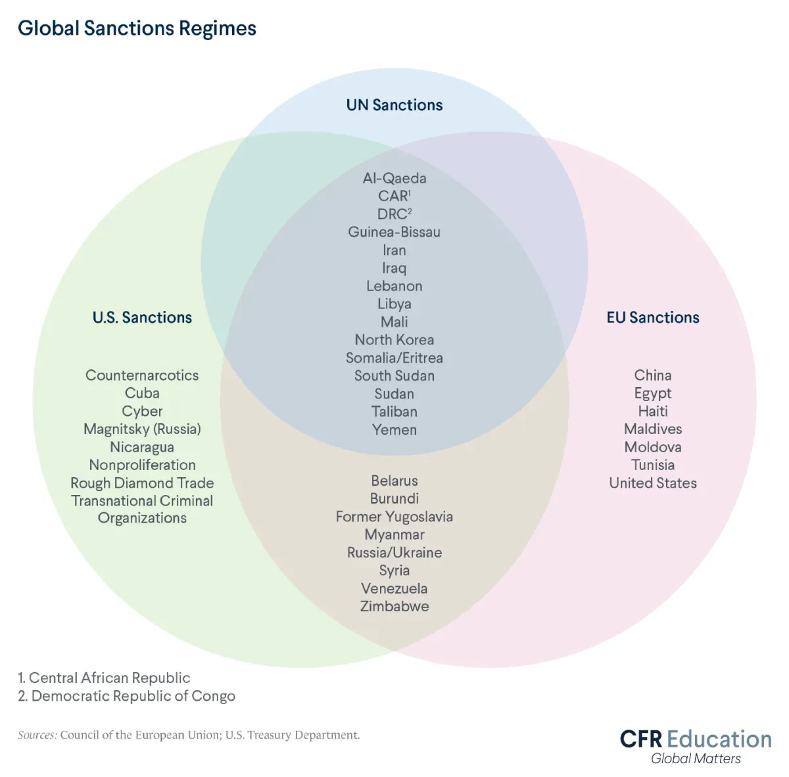

## Table of Contents

## What are trade sanctions?

Trade sanctions are restrictions that countries put on trade with other countries. They are used to punish or influence the behavior of the targeted country. For example, if one country does something that another country doesn't like, the second country might stop buying things from the first country or stop selling things to them.

Sanctions can be about specific products, like oil or weapons, or they can be more general. They can also include things like stopping money from moving between countries or limiting travel. The goal is often to make life harder for the targeted country, hoping that this will make them change their behavior. However, sanctions can also hurt the people in the targeted country, not just their leaders.

## What is the primary purpose of imposing trade sanctions?

The main reason countries use trade sanctions is to change how another country acts. If a country is doing something bad, like hurting its own people or breaking international rules, other countries might use sanctions to make them stop. By stopping trade, the country being sanctioned might find it harder to get things they need or sell their own products. This pressure can make them think about changing their behavior.

Sometimes, trade sanctions are also used to show that a country disagrees with what another country is doing. It's a way to say, "We don't like what you're doing, and we're not going to help you until you stop." Even if the sanctions don't make the other country change right away, they can still send a strong message to the world about what is right and wrong.

## What are the different types of trade sanctions?

Trade sanctions come in different forms. One type is called an embargo, which is when a country completely stops trading with another country. For example, if Country A puts an embargo on Country B, Country A won't buy anything from or sell anything to Country B. Another type is called a tariff, which is like a tax on goods coming from a specific country. If Country A puts a tariff on goods from Country B, it makes those goods more expensive, which can make people buy less of them.

There are also targeted sanctions, which focus on certain people or groups instead of the whole country. These can include freezing the bank accounts of leaders or companies that are doing bad things, or banning travel for those people. This way, the sanctions can hit the people causing problems without hurting everyone in the country. Lastly, there are sectoral sanctions, which target specific parts of a country's economy, like its oil or banking industries. By hitting these key areas, the sanctions can put a lot of pressure on the country to change its behavior.

## Can you give examples of countries that have used trade sanctions?

The United States has used trade sanctions many times. For example, the U.S. put sanctions on Iran because they didn't like Iran's nuclear program. The U.S. made it hard for Iran to sell oil and use banks around the world. Another time, the U.S. used sanctions on Cuba for many years because they didn't agree with Cuba's government. These sanctions made it hard for Cuba to trade with other countries.

The European Union has also used trade sanctions. They put sanctions on Russia because Russia took over part of Ukraine called Crimea. The EU made it harder for Russia to borrow money and sell oil and gas. Another example is when the EU put sanctions on North Korea because they were testing nuclear weapons. These sanctions made it hard for North Korea to trade with other countries and get money.

These examples show how countries use trade sanctions to try to change the behavior of other countries. Sometimes the sanctions work, and sometimes they don't, but they are a common tool in international relations.

## How do trade sanctions affect the economy of the targeted country?

Trade sanctions can hurt the economy of the targeted country a lot. When other countries stop buying things from the targeted country, the companies there can't sell their products as easily. This means they make less money, and they might have to let workers go or close down. Also, if the targeted country can't buy things they need from other countries, like medicine or technology, it can make life harder for people there. The economy can slow down because it's harder to do business and get the things needed to keep things running smoothly.

Sometimes, trade sanctions can also make prices go up in the targeted country. If they can't get things from other countries, the things they do have might become more expensive because there's less of them. This can make it harder for people to afford what they need. The government might also have less money coming in because they can't sell as much to other countries, which can make it harder for them to help their people or fix problems. Overall, trade sanctions can cause a lot of problems for the economy of the targeted country, making life harder for everyone there.

## What are the potential unintended consequences of trade sanctions?

Trade sanctions can have effects that people did not plan for. One big problem is that they can hurt regular people more than the leaders they are meant to pressure. When countries can't trade, it can be hard for people to get things they need, like food and medicine. This can make life harder for everyone, not just the people in charge. Sometimes, the leaders can find ways around the sanctions, but regular people can't, so they suffer more.

Another unintended effect is that sanctions can push countries to work with other countries that might not be friendly with the ones imposing the sanctions. For example, if one country can't trade with the U.S., they might start trading more with Russia or China. This can change the balance of power in the world and make new problems. Also, if sanctions go on for a long time, people in the targeted country might start to feel angry at the countries that put the sanctions on them. This can make it harder to solve problems and build peace in the future.

## How are trade sanctions enforced internationally?

Trade sanctions are enforced by different countries and international groups working together. Countries that agree to the sanctions will follow rules that say they can't trade with the targeted country. They might stop buying things from that country or selling things to them. Sometimes, groups like the United Nations help make sure everyone follows the rules. They can watch what countries are doing and tell them if they are breaking the sanctions. If a country doesn't follow the rules, other countries might punish them too.

Enforcing sanctions can be hard because it's not always easy to make sure everyone follows the rules. Some countries might try to cheat and trade with the targeted country anyway. They might use secret ways to move goods or money around. To stop this, countries use things like checking ships and planes, watching bank accounts, and working with other countries to share information. It's a big job, but when countries work together, they can make the sanctions stronger and more effective.

## What role do international organizations play in trade sanctions?

International organizations like the United Nations play a big role in trade sanctions. They help countries agree on when to use sanctions and how to use them. The United Nations can vote to put sanctions on a country if many countries think it's needed. They make rules that say what countries can and can't do when trading with the targeted country. This helps make sure everyone follows the same rules and works together to make the sanctions strong.

These organizations also help watch to make sure countries are following the sanctions. They can check if countries are secretly trading with the targeted country and tell everyone if someone is breaking the rules. By doing this, they help keep the sanctions fair and effective. Sometimes, they also help talk to the targeted country to try to solve problems without using sanctions, which can be better for everyone.

## How do trade sanctions impact global trade dynamics?

Trade sanctions can change how countries trade with each other a lot. When one country puts sanctions on another, it can make other countries think twice about trading with the targeted country too. They might worry about getting in trouble or losing business with the country that put the sanctions in place. This can lead to less trading overall and make the targeted country look for new trading partners. Sometimes, this can shift the balance of power in the world, making some countries stronger and others weaker.

Sanctions can also affect the prices of things around the world. If a country that makes a lot of a certain product, like oil, gets sanctioned, it can make that product harder to get and more expensive for everyone. This can cause problems for countries that need that product but can't get it as easily. Also, if sanctions make some countries trade more with others, it can create new trade routes and relationships that weren't there before. Overall, trade sanctions can shake up the way countries trade and do business with each other, leading to big changes in the global economy.

## What are the legal frameworks governing the imposition of trade sanctions?

The legal frameworks for trade sanctions come from international laws and agreements. The United Nations is a big part of this. They have a group called the Security Council that can vote to put sanctions on a country if they think it's needed. If the vote passes, all countries that are part of the UN are supposed to follow the rules. There are also other groups like the World Trade Organization that can help make sure countries follow the rules about trade and sanctions. These groups work together to make sure sanctions are used fairly and legally.

Countries can also have their own laws about sanctions. For example, the United States has laws that let them put sanctions on other countries. These laws say what the U.S. can and can't do when trading with other countries. Other countries have similar laws. When countries work together, they try to make sure their laws fit with the international rules. This helps make the sanctions stronger and more effective. It also helps keep things fair and stops countries from breaking the rules.

## How can a country mitigate the effects of trade sanctions?

A country can try to lessen the effects of trade sanctions by finding new trading partners. If one country stops trading with them, they might look for other countries that are willing to buy their goods or sell them what they need. For example, if the United States puts sanctions on a country, that country might start trading more with Russia or China. By doing this, they can keep their economy going and make up for the loss of trade with the sanctioning country.

Another way to mitigate the effects of trade sanctions is by trying to become more self-sufficient. This means the country tries to make more of what it needs on its own, instead of relying on other countries. They might start new businesses or farms to produce things like food, medicine, or technology. By doing this, they can reduce how much they need to trade with other countries, which can help them deal with the sanctions better. It's not always easy, but it can make a big difference in how well they handle the pressure from sanctions.

## What are some case studies of successful and unsuccessful trade sanctions?

One successful case of trade sanctions was when the United Nations put sanctions on South Africa in the 1980s. They wanted to stop apartheid, which was a system that treated black people unfairly. The sanctions made it hard for South Africa to trade with other countries. This put a lot of pressure on the government there. After a few years, South Africa ended apartheid and started treating everyone more fairly. The sanctions helped make this change happen.

An example of trade sanctions that didn't work well was when the United States put sanctions on Cuba starting in the 1960s. The U.S. wanted Cuba to change its government, but the sanctions didn't make that happen. Instead, they made life harder for people in Cuba. The Cuban government stayed the same, and the country had to find new ways to get what it needed. The sanctions lasted for many years, but they didn't reach their goal of changing the government.

Another case where trade sanctions had mixed results was when the European Union and the United States put sanctions on Iran because of its nuclear program. The sanctions made it hard for Iran to sell oil and use banks around the world. This put a lot of pressure on Iran, and eventually, they agreed to limit their nuclear program. But the sanctions also made life harder for people in Iran, and some people think they didn't go far enough to change Iran's behavior completely. So, the sanctions had some success, but they also had some problems.

## References & Further Reading

[1]: Loevinger, J. (2019). ["Economic Sanctions, Algorithmic Trading, and Market Volatility."](https://www.jstor.org/stable/27192407) ILSA Journal of International & Comparative Law.

[2]: Portela, C., & Morgan, R. (2012). ["The EU and Russia: A Study in Failed Economic Sanctions."](https://www.taylorfrancis.com/books/mono/10.4324/9780203847510/european-union-sanctions-foreign-policy-clara-portela) European Security.

[3]: ["Advances in Financial Machine Learning"](https://www.amazon.com/Advances-Financial-Machine-Learning-Marcos/dp/1119482089) by Marcos Lopez de Prado.

[4]: ["Quantitative Trading: How to Build Your Own Algorithmic Trading Business"](https://www.amazon.com/Quantitative-Trading-Build-Algorithmic-Business/dp/1119800064) by Ernest P. Chan.

[5]: Bazzi, S., & Staiger, R. W. (2003). ["Does Trade Cause Growth?"](https://www.jstor.org/stable/117025) American Economic Review.

[6]: Baldwin, R. E. (1985). ["The Political Economy of U.S. Import Policy."](https://mitpress.mit.edu/9780262022323/the-political-economy-of-u-s-import-policy/) MIT Press.

[7]: Hufbauer, G. C., Schott, J. J., Elliott, K. A., & Oegg, B. (2007). ["Economic Sanctions Reconsidered."](https://www.sciencedirect.com/science/article/abs/pii/S0022199608000597) Peterson Institute for International Economics.

[8]: Korinek, A., & Stiglitz, J. E. (2009). ["Liquidity Crises: Understanding Sources and Limiting Consequences."](https://www.nber.org/papers/w28453) The World Bank Research Observer.