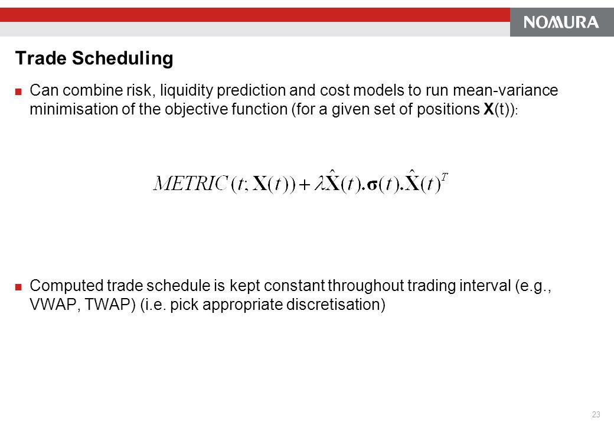

Trade scheduling in algorithmic trading is a fundamental mechanism designed to handle the execution of large orders efficiently by segmenting them into smaller, more manageable trades over a designated timeframe. This approach boosts trading efficiency and efficacy by minimizing market impact and lowering execution costs. Algorithmic trading, or algo trading, has transformed the financial industry by using computer algorithms to automate trading decisions, leading to faster and more precise transactions.

The increasing complexity of financial markets heightens the importance of trade scheduling, ensuring optimal order execution. Effectively managing how and when trades are placed can significantly reduce the potential for unfavorable market movements, commonly referred to as market impact, and can help optimize execution price. For any large-scale trade, the timing and sequence of order execution are critical, as they can influence both the traded price and the eventual cost incurred.



Trade scheduling takes into account numerous factors, including market volatility, liquidity, and price movements, to strategically place portions of larger orders in the market. This often involves sophisticated algorithms that can anticipate market trends and dynamically adapt their strategies according to real-time data. As financial markets have matured and grown more interconnected, the role of such scheduling has become increasingly prominent. It is an essential aspect of modern trading strategies, providing structure and predictability in the inherently unpredictable landscape of financial trading.

This article aims to explore the intricacies of trade scheduling in algo trading, examining the parameters and benefits that come with its implementation, as well as its impact on the burgeoning future of trading practices.

## Table of Contents

## Understanding Trade Scheduling in Algo Trading

Trade scheduling in algorithmic trading refers to the methodical breakdown of a large parent order into smaller, more manageable child orders. This process is essential for mitigating market disruption, as executing a large order all at once can lead to significant market impact. By distributing the order into smaller segments, traders can better align their actions with current market conditions, thereby optimizing execution and reducing slippage.

Large institutional orders necessitate breaking down into smaller trades to ensure they integrate seamlessly with the existing market landscape. Slippage, the difference between the expected price of a trade and the actual price, can be minimized by aligning the executed trades with prevailing market liquidity and price trends. The algorithms tasked with this scheduling must weigh various market elements, including price fluctuations, market volatility, and liquidity levels, to decide the optimal timing and size for each child order.

Mathematically, this optimization process can involve a variety of models and techniques. For example, one might use stochastic processes or optimization algorithms to determine the sequence of trades that maximizes expected utility or minimizes cost. The central objective of trade scheduling is to enhance the trade's value by completing it at prices close to the theoretical optimal, while having a minimal effect on the market price.

The decision-making process for trade scheduling algorithms might involve predicting price impacts or evaluating market depth. For instance, the algorithm could deploy a time-weighted average price (TWAP) strategy, which involves executing equal portions of the order at consistent intervals, regardless of market conditions. Alternatively, a [volume](/wiki/volume-trading-strategy)-weighted average price (VWAP) strategy could be used, which executes trades proportionally to market volume over the scheduling period, thus minimizing impact.

Python, widely used for implementing such strategies, offers libraries such as `pandas` and `numpy` for data analysis, and [machine learning](/wiki/machine-learning) libraries like `scikit-learn` for predictive modeling. Here's a simple Python snippet demonstrating a basic VWAP calculation:

```python
import pandas as pd

# Assuming df is a DataFrame containing trade data with columns 'price' and 'volume'
def calculate_vwap(df):
    return (df['price'] * df['volume']).sum() / df['volume'].sum()

trade_data = pd.DataFrame({
    'price': [100, 102, 101, 103],
    'volume': [200, 150, 200, 100]
})

vwap = calculate_vwap(trade_data)
print(f"The VWAP is: {vwap}")
```

In summary, trade scheduling serves the critical purpose of optimizing large order executions by strategically managing the potential market impact and cost, informed by advanced algorithmic calculations. The strategic structuring of these algorithms is vital to achieving the desired outcomes without disrupting market equilibrium.

## Key Parameters of Trade Scheduling Algorithms

Trade scheduling algorithms are critical in optimizing the execution of large orders within the domain of [algorithmic trading](/wiki/algorithmic-trading). They are designed to analyze and respond to various market conditions, ensuring efficient and cost-effective trade executions. The effectiveness of these algorithms is determined by several key parameters:

**Price Evolution Model**

Price evolution models are essential for understanding market trends and predicting future price movements. These models incorporate methodologies such as the random walk, short-term [momentum](/wiki/momentum), and mean-reversion. The random walk hypothesis suggests that stock prices evolve according to a random walk process, implying that future price movements are independent of past movements. This can be mathematically represented as:
$$
P(t) = P(t-1) + \epsilon(t)
$$
where $P(t)$ is the stock price at time $t$ and $\epsilon(t)$ is a random shock at time $t$.

Short-term momentum strategies exploit the tendency of assets to exhibit continuation in their returns over short periods, whereas mean-reversion models capitalize on the tendency of asset prices to revert to their historical averages. These models guide the timing and sizing of orders by identifying profitable trade opportunities through analyzing past price data and trends.

**Market Impact Model**

Market impact refers to the effect that executing a large order has on the market price of an asset. Trade scheduling algorithms employ market impact models to forecast and mitigate this impact. By using historical market data, these algorithms can predict how the market will react to a trade. They can make decisions about the trade size and timing to minimize adverse market impact. A classic market impact model might follow this form:
$$
I = \alpha \cdot V^\beta
$$
where $I$ denotes the market impact, $V$ represents the volume of the trade, and $\alpha$ and $\beta$ are coefficients derived from market data.

**Performance Criteria**

The success of a trade scheduling algorithm is heavily reliant on its performance criteria. These criteria are benchmarks against which the algorithm's effectiveness is evaluated. Key performance metrics include minimizing slippage, which is the difference between the expected and actual trade price, and achieving cost efficiency. The algorithm should also aim to meet pre-defined benchmarks, such as tracking a specific index or maintaining a target portfolio composition.

**Trading Style**

The trading style of an algorithm is determined by its approach to executing trades in terms of speed and frequency. Algorithms are designed to adapt their trading styles to minimize opportunity costs and market impact. In low-[liquidity](/wiki/liquidity-risk-premium) markets, a more conservative trading style might be adopted to avoid moving the market price significantly, while in high-liquidity environments, a more aggressive style may be feasible. The adaptability of these algorithms ensures they can respond dynamically to changing market conditions and maintain optimal execution performance.

## Benefits of Trade Scheduling in Algo Trading

Trade scheduling in algorithmic trading brings several notable benefits that enhance the overall trading process. 

Enhanced Efficiency is a significant advantage realized through automation. By automating the execution process, trade scheduling algorithms ensure that trades are faster and more precise compared to manual trading. The algorithms systematically handle the division of large orders into smaller trades, promoting timely execution without the delays inherent in human-intensive processes. Automation also reduces errors caused by manual interventions, thereby increasing the overall reliability of the trading system.

Reduced Market Impact is achieved by the strategic execution of smaller, more manageable trades. Large orders, if executed all at once, can significantly affect market prices, leading to slippage and unfavorable trading outcomes. By breaking down these large orders, trade scheduling minimizes their market footprint, ensuring that each trade has minimal impact on price dynamics. This is particularly crucial in volatile markets where prices can be sensitive to large volume trades.

Cost-Effectiveness is another benefit of trade scheduling, primarily through the optimization of trade timing and size. By intelligently scheduling trades, algorithms exploit optimal market conditions, thereby reducing transaction costs. The choice of when and how much to trade can significantly impact the total cost, and algorithms are designed to identify those parameters that minimize expenses. The cost savings from reduced slippage and better timing contribute to improved overall financial performance.

Data-Driven Decisions are central to the success of trade scheduling, facilitated by sophisticated algorithms that analyze real-time data. These algorithms utilize various data sources to make informed decisions, evaluating multiple market factors such as price trends, liquidity, and [volatility](/wiki/volatility-trading-strategies). The ability to process and analyze vast amounts of data in real-time allows traders to respond promptly to market changes, ensuring trades are executed based on the most current and relevant information.

In conclusion, trade scheduling within algorithmic trading introduces a robust framework that advances the trading process through enhanced efficiency, minimized market impact, cost-effectiveness, and data-driven decision making. These benefits underscore the significance of employing advanced scheduling algorithms to optimize trading strategies and outcomes.

## The Role of Technology in Trade Scheduling

Technology plays an indispensable role in trade scheduling within algorithmic trading, primarily by enhancing data processing and analysis capabilities. The advent of machine learning and [artificial intelligence](/wiki/ai-artificial-intelligence) has notably increased the accuracy and efficiency of trade scheduling algorithms. These technologies allow for the development of sophisticated models capable of learning from historical and real-time data, identifying patterns, and predicting future market trends. This predictive capability is instrumental in optimizing the timing and size of child orders, ultimately reducing market disruption and improving trade execution.

Cloud computing and high-performance computing (HPC) systems provide the necessary computational power to manage complex trade execution strategies. Cloud platforms offer scalable resources that can quickly adapt to the demands of high-frequency trading, enabling the rapid processing of data and execution of trades. HPC systems, on the other hand, facilitate the execution of sophisticated algorithms with lower latency and higher throughput, which are critical in environments where milliseconds can make the difference between profit and loss.

Moreover, a robust technological infrastructure is crucial to ensure the resilience and scalability of algorithmic trading systems. This infrastructure incorporates advanced data storage solutions, high-speed networking, and reliable hardware systems that collectively support the seamless operation of trade scheduling algorithms. It also includes the integration of real-time data feeds and APIs, which provide traders with immediate access to market data and trading venues, allowing for swift decision-making processes.

Technological advances in these areas continue to shape the development of trade scheduling strategies, enabling traders to execute large orders more efficiently and with minimal market impact. As technology progresses, the incorporation of more advanced algorithms and artificial intelligence tools will likely further refine trade scheduling processes, making them more adaptive and responsive to ever-changing market conditions.

## Challenges and Future Prospects

Trade scheduling in algorithmic trading, while beneficial, is not without its challenges. A significant issue is algorithmic risk, which arises from flaws or bugs in the algorithms themselves, potentially leading to undesirable trading outcomes. These risks can be exacerbated by market volatility, where unpredictable price movements can disrupt the execution of scheduled trades, impacting their effectiveness and leading to potential financial losses.

Moreover, regulatory compliance presents a continuous challenge in trade scheduling. As regulations evolve, trading algorithms must be designed and updated to comply with new rules and guidelines to avoid penalties and ensure market integrity. This requires ongoing efforts in monitoring regulatory changes and implementing necessary adjustments to trading systems.

The dynamic nature of financial markets necessitates the constant development of advanced algorithms. These algorithms must possess the ability to adapt to rapidly changing market conditions, embodying attributes such as flexibility and resilience. Incorporating machine learning techniques can enhance algorithm adaptability, as these models can learn from vast amounts of data and improve over time. Python, with its robust libraries such as TensorFlow and PyTorch, is widely used for developing such adaptive algorithms:

```python
import tensorflow as tf

# Example of a basic neural network model for trade prediction
model = tf.keras.Sequential([
    tf.keras.layers.Dense(64, activation='relu', input_shape=(input_shape,)),
    tf.keras.layers.Dense(32, activation='relu'),
    tf.keras.layers.Dense(1, activation='linear')
])

model.compile(optimizer='adam', loss='mean_squared_error')
```

The future of trade scheduling is poised for transformation through the integration of sophisticated analytics and AI-powered tools, driving smarter trading strategies. By leveraging AI, trading algorithms can incorporate predictive analytics to forecast market trends, enhancing decision-making processes significantly. As these tools become more advanced, they offer the potential for even greater precision and adaptability in trade scheduling strategies.

To maintain a competitive edge as markets evolve, continuous innovation in trade scheduling algorithms is essential. This involves not only improving existing algorithms but also exploring new computational techniques and methodologies. High-performance computing and cloud-based solutions can provide the necessary resources for complex data analysis and real-time trade execution, ensuring that trading strategies remain effective and efficient.

In conclusion, with the continuous advancements in technology and analytics, the field of trade scheduling in algorithmic trading is expected to undergo significant refinement. These improvements will likely render trade scheduling methods more dynamic and adaptive, catering to the ever-changing landscape of financial markets.

## Conclusion

Trade scheduling constitutes a vital aspect of algorithmic trading strategies, focusing on the efficient execution of substantial orders. By leveraging technological advancements and data analytics, trade scheduling algorithms are designed to reduce market impact, thereby enhancing the efficiency and cost-effectiveness of trades. These algorithms dissect large orders into smaller segments, executing them at opportune moments based on real-time data analysis, which helps in mitigating disruptions in the market.

As financial markets grow more complex, there is an ongoing need for the development and refinement of trade scheduling strategies. The continuous evolution of these markets necessitates algorithms that are not only advanced but also agile enough to adapt to changing market dynamics promptly. The focus on developing dynamic and adaptive methodologies is pivotal to maintaining a competitive edge in algorithmic trading.

Future prospects for trade scheduling in algo trading are promising, with advancements in artificial intelligence and machine learning expected to play a significant role. These technologies will facilitate the creation of smarter, more sophisticated trade scheduling algorithms capable of tackling the challenges of modern financial environments. As a result, traders can look forward to methodologies that provide even greater precision and adaptability, thereby reinforcing the importance of trade scheduling as an indispensable tool in the algorithmic trading arsenal.

## References & Further Reading

[1]: Kissell, R. (2013). ["The Science of Algorithmic Trading and Portfolio Management."](https://www.sciencedirect.com/book/9780124016897/the-science-of-algorithmic-trading-and-portfolio-management) Academic Press.

[2]: Lopez de Prado, M. (2018). ["Advances in Financial Machine Learning."](https://www.amazon.com/Advances-Financial-Machine-Learning-Marcos/dp/1119482089) Wiley.

[3]: Aldridge, I. (2013). ["High-Frequency Trading: A Practical Guide to Algorithmic Strategies and Trading Systems."](https://www.ahmetbeyefendi.com/wp-content/uploads/2020/07/High-Frequency-Trading-Irene-Aldridge.pdf) Wiley.

[4]: Engle, R. F., & Russell, J. R. (1998). ["Autoregressive Conditional Duration: A New Model for Irregularly Spaced Transaction Data."](https://www.semanticscholar.org/paper/Autoregressive-Conditional-Duration%3A-A-New-Model-Engle-Russell/8025c69bcea22b062cd8fc589ce41f44e4c33fad) Econometrica.

[5]: Kissell, R., & Glantz, M. (2003). ["Optimal Trading Strategies: Quantitative Approaches for Managing Market Impact and Trading Risk."](https://archive.org/details/optimaltradingst0000kiss) AMACOM.

[6]: Jansen, S. (2020). ["Machine Learning for Algorithmic Trading."](https://github.com/stefan-jansen/machine-learning-for-trading) Packt Publishing.

[7]: Chan, E. P. (2009). ["Quantitative Trading: How to Build Your Own Algorithmic Trading Business."](https://github.com/egorpe/EPChan-QuantitativeTrading/blob/master/example7_6.m) Wiley Trading.