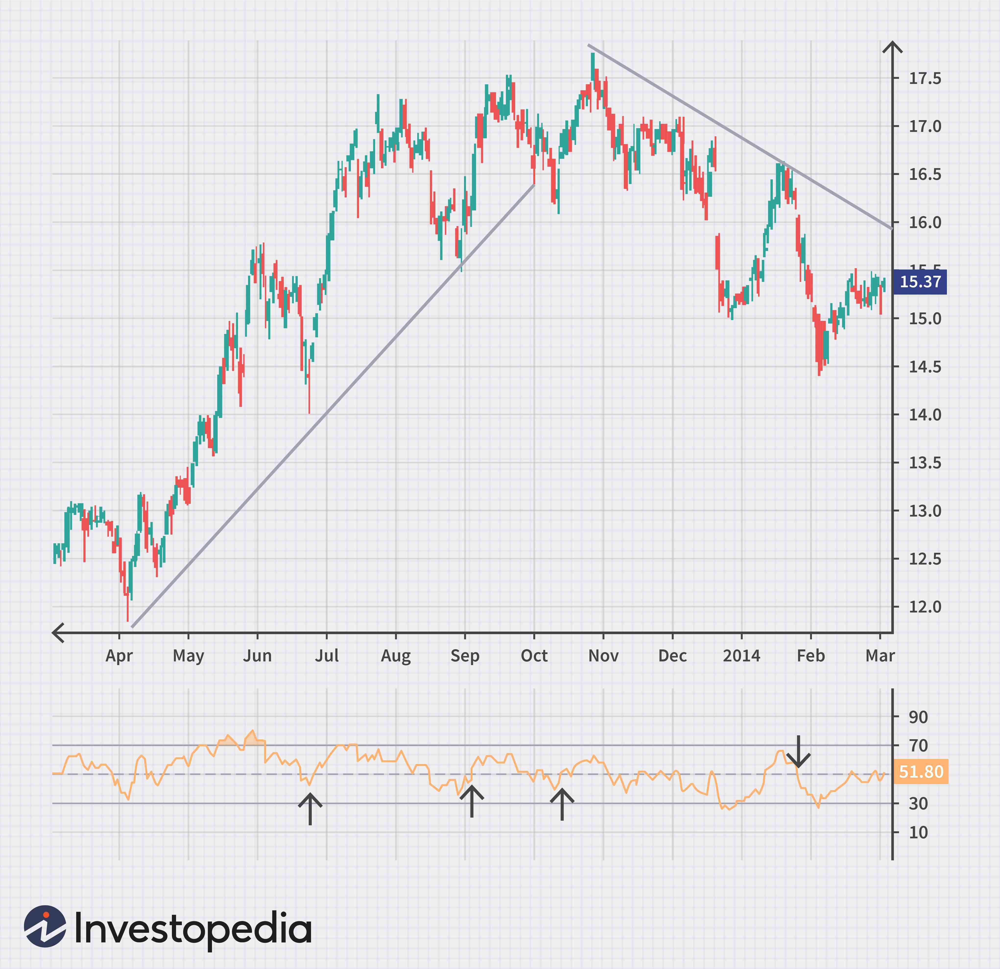

In the rapidly evolving financial markets, trading strategies have experienced significant advancements, increasingly incorporating complex data analysis and cutting-edge technology. Algorithmic trading represents one of these pivotal advancements, employing trade signals and financial indicators to enhance and streamline trading activities. By automating decision-making processes, algorithmic trading reduces human error, speeds up execution times, and provides traders with systematic strategies grounded in quantitative analysis.

Trade signals are essential components of algorithmic trading, functioning as triggers for executing transactions in various asset classes. Generated through technical indicators, market sentiment, or algorithmic models, these signals help traders make objective decisions by analyzing vast amounts of data for actionable insights. Financial indicators, usually based on price, volume, and historical data, play a crucial role in generating these signals, enabling traders to identify market trends and potential entry or exit points with greater precision.



This article aims to provide a comprehensive overview of trade signals, financial indicators, and their integration into algorithmic trading strategies. By understanding these elements, traders can optimize their strategies, leading to improved trading outcomes. The focus will be on defining and analyzing trade signals, exploring some of the key technical indicators like Moving Averages and Relative Strength Index (RSI), and discussing strategies to effectively utilize these tools within algorithmic trading frameworks. This knowledge empowers traders to adapt to dynamic market conditions, ultimately achieving better performance and risk management in their trading endeavors.

## Table of Contents

## Understanding Trade Signals

A trade signal represents a crucial component in financial trading, serving as a prompt for either the purchase or sale of an asset. These signals are derived from diverse analytical methods, including technical indicators and algorithm-based analysis. The primary objective of trade signals is to provide traders with objective and quantifiable criteria for executing trades. This objectivity aids in minimizing emotional bias, which can often lead to suboptimal trading decisions.

Trade signals can vary significantly in complexity. Simple trade signals may rely solely on basic price movements. For example, a common rudimentary signal is generated when an asset's price crosses a moving average line, indicating a potential change in trend. In contrast, more intricate trade signals might incorporate a multitude of factors, including volume data, volatility measures, and macroeconomic indicators, to generate a comprehensive view of market conditions.

In addition to guiding individual trades, trade signals are invaluable in portfolio management. They assist in optimizing asset allocation, suggesting when to shift focus from one sector to another or diversify asset classes. For instance, sector rotation strategies often use signals to identify undervalued sectors that are poised for growth, allocating resources accordingly.

The automation of the decision-making process is a central goal of utilizing trade signals. By relying on predefined criteria to trigger trades, it ensures that executions occur without delay or error, aligning closely with predetermined strategies. This automation is particularly beneficial in fast-paced markets, where timely decisions are essential to capitalize on fleeting opportunities.

Automated trading systems built on trade signals deliver enhanced efficiency by allowing precise and timely trade execution. These systems analyze real-time data and, upon meeting specific conditions, automatically execute trades, mitigating risks associated with manual trading, such as delays and human errors. Furthermore, automated trade signals help streamline operational processes and continuously monitor market conditions, adjusting strategies to market dynamics without constant human intervention.

## Key Technical Indicators for Algorithmic Trading

Technical indicators are integral to [algorithmic trading](/wiki/algorithmic-trading) as they provide mathematical computations that transform price and [volume](/wiki/volume-trading-strategy) data into actionable insights. These indicators are pivotal for identifying market trends, determining entry and [exit](/wiki/exit-strategy) points, and guiding overall trading strategy. Below are some of the most widely used technical indicators in algorithmic trading:

1. **Moving Averages (MA)**:
   - Moving averages are used to smooth price data by creating a constantly updated average price. The two most common types are the Simple Moving Average (SMA) and the Exponential Moving Average (EMA). The SMA is calculated by taking the average of prices over a specific number of periods, while the EMA gives more weight to recent prices, making it more responsive to new information. Algorithmically, the EMA can be implemented in Python as follows:

     ```python
     def ema(prices, period):
         alpha = 2 / (period + 1)
         ema_values = [sum(prices[:period]) / period]
         for price in prices[period:]:
             ema_values.append((price - ema_values[-1]) * alpha + ema_values[-1])
         return ema_values
     ```

2. **Relative Strength Index (RSI)**:
   - The RSI is a momentum oscillator that measures the speed and change of price movements. It ranges from 0 to 100, typically indicating overbought conditions above 70 and oversold conditions below 30. RSI is calculated using the average gains and losses over a period, usually 14 days. The formula is:
$$
     \text{RSI} = 100 - \left(\frac{100}{1 + \frac{\text{Average Gain}}{\text{Average Loss}}}\right)

$$

3. **Moving Average Convergence Divergence (MACD)**:
   - MACD is a trend-following indicator that reveals the relationship between two moving averages of a security’s price. It is calculated by subtracting the 26-period EMA from the 12-period EMA. The result is the MACD line, with the 9-day EMA of the MACD called the Signal line, which can indicate buy/sell signals. In Python, it can be calculated as:

     ```python
     def macd(prices, short_period=12, long_period=26, signal_period=9):
         ema_short = ema(prices, short_period)
         ema_long = ema(prices, long_period)
         macd_line = [short - long for short, long in zip(ema_short[long_period - short_period:], ema_long)]
         signal_line = ema(macd_line, signal_period)
         return macd_line, signal_line
     ```

4. **Bollinger Bands**:
   - Bollinger Bands consist of a middle band (SMA) and two outer bands which are standard deviations away from the SMA. The bands expand and contract based on market volatility. They are used to identify overbought or oversold conditions. Typically, a 20-day SMA and 2 standard deviations are used:
$$
     \begin{align*}
     \text{Upper Band} &= \text{SMA}(20) + 2 \cdot \sigma \\
     \text{Lower Band} &= \text{SMA}(20) - 2 \cdot \sigma
     \end{align*}

$$

5. **Stochastic Oscillator**:
   - This momentum indicator compares a specific closing price of a security to a range of its prices over a certain period. It is used to generate overbought and oversold trading signals, typically with values between 0 and 100. A value above 80 is considered overbought, while below 20 is considered oversold.

These indicators provide quantifiable metrics for pattern recognition and trend analysis, laying the groundwork for objective decision-making in algorithmic trading by generating explicit buy and sell signals. Understanding and leveraging these indicators enable traders to refine their strategies and improve trading outcomes through enhanced precision and efficiency.

## Effective Trading Strategies Using Financial Indicators

Trading strategies using financial indicators are essential tools for traders seeking to capitalize on market movements while minimizing risk. These strategies range from simple [momentum](/wiki/momentum)-based approaches to more complex systems focusing on [volatility](/wiki/volatility-trading-strategies) and price action. Key to these strategies' success is the integration of technical indicators such as Moving Average Convergence Divergence (MACD), Relative Strength Index (RSI), and Bollinger Bands, which enhance the ability to identify trends and improve signal accuracy.

One of the primary advantages of using technical indicators is their ability to provide clear, quantifiable metrics for decision-making. For instance, MACD helps in identifying trend reversals by analyzing the convergence or divergence of two moving averages. The RSI offers insights into market momentum and potential overbought or oversold conditions by comparing recent gains and losses. Bollinger Bands, on the other hand, assess market volatility by plotting price bands above and below a moving average. By using these indicators concurrently, traders can develop robust strategies that not only confirm buy and sell signals but also adapt seamlessly to changing market conditions.

Automation plays a crucial role in modern trading strategies. By automating the decision-making process, traders can create systems that adjust automatically to market dynamics, reducing the need for constant oversight. For example, traders can program a system to trigger a buy order when the RSI crosses a certain threshold, simultaneously checking the MACD and Bollinger Bands for confirmation. This multi-layered approach reduces the reliance on a single indicator and improves the reliability of trading signals.

Backtesting and optimization are vital components of trading strategy development. Backtesting allows traders to evaluate how their strategies would have performed in the past using historical data. This process involves running the strategy under various market scenarios to identify potential weaknesses and areas for improvement. Optimization, in turn, helps fine-tune the parameters of the strategy to maximize performance. Both processes require rigorous testing to ensure that the logic and indicators employed are effective and reliable.

Successful trading strategies are inherently adaptable, designed to function across various market conditions and to manage risks efficiently. Combining multiple indicators in a strategy not only helps validate signals but also provides a comprehensive approach to risk management. For example, setting stop-loss orders based on volatility indicators like Bollinger Bands can help mitigate potential losses in high-volatility markets.

Python provides a versatile platform for implementing and testing trading strategies due to its extensive range of libraries and tools. For example, the `pandas` library is commonly used for data manipulation, while libraries such as `ta-lib` offer technical analysis functions for calculating various indicators. A simple Python script might automate a strategy based on RSI and MACD thresholds, allowing traders to backtest and optimize their system:

```python
import pandas as pd
import talib

# Load historical price data into a DataFrame
data = pd.read_csv('historical_prices.csv')

# Calculate RSI and MACD
rsi = talib.RSI(data['Close'], timeperiod=14)
macd, macdsignal, macdhist = talib.MACD(data['Close'])

# Define trading signals
data['Signal'] = 0
data['Signal'][(rsi < 30) & (macd > macdsignal)] = 1  # Buy signal
data['Signal'][(rsi > 70) & (macd < macdsignal)] = -1 # Sell signal

# Backtest strategy
data['Position'] = data['Signal'].shift()
data['Strategy_Returns'] = data['Position'] * data['Close'].pct_change()

# Evaluate performance
total_returns = data['Strategy_Returns'].sum()
print(f"Total Strategy Returns: {total_returns:.2f}%")
```

This structured approach to developing trading strategies enables traders to not only identify opportunities but also effectively manage market risks. By continuously refining their strategies through [backtesting](/wiki/backtesting) and leveraging multiple indicators, traders can enhance their trading performance and maintain resilience in the face of market volatility.

## The Role of Algorithms in Modern Trading

Algorithms have significantly transformed modern trading by enabling rapid trade execution and reducing human errors. Algorithmic trading, commonly known as algo trading, involves the use of computer programs to follow a set of predefined criteria for executing trade orders. These criteria typically include variables such as timing, price, and quantity, allowing the automation of the trading process.

One of the major benefits of employing algorithms is the ability to leverage trade signals and financial indicators to process vast amounts of data swiftly and accurately. This capacity enables the optimization of trading strategies. Algorithms can identify profitable opportunities by analyzing complex datasets that would be impossible for a human trader to evaluate quickly, thus giving traders a competitive edge in the market.

Automation through algorithms not only accelerates trade execution but also assists in managing and rebalancing large investment portfolios. This rebalancing is based on real-time market data, ensuring that the portfolio's risk and return are optimized continuously without the need for constant manual intervention. Algorithms can adjust positions dynamically, maintaining alignment with investment goals and market conditions.

This predictability and precision make algorithms indispensable tools for both retail and institutional traders. They provide systematic trading approaches that mitigate the influence of emotional decision-making, offering consistent performance by adhering to tested and refined strategies.

In essence, the advent of algorithms in trading has ushered in an era of efficiency and scalability that manual trading cannot match. Their ability to process and react to market conditions in milliseconds opens new possibilities and enhances the potential for profitability in financial markets. As such, algorithmic trading has become a cornerstone of modern financial strategies.

## Challenges and Considerations in Algorithmic Trading

Algorithmic trading, while offering substantial advantages such as speed and efficiency, also presents several challenges that traders must navigate to optimize performance effectively. One of the primary challenges is the potential over-reliance on automated systems. Traders may become too dependent on algorithms, neglecting the importance of human judgment, especially in rapidly changing market conditions. 

Market volatility further complicates algorithmic trading. Sudden and unpredictable market movements can lead to false signals, where algorithms misinterpret data due to noise. Such scenarios can result in execution errors or unanticipated trading losses. Traders must develop strategies to filter out noise and focus on reliable signals, perhaps by setting stringent thresholds or combining multiple indicators.

Risk management is another critical consideration in algorithmic trading. Given the automated nature of executing trades, it is essential for traders to continuously reassess their strategies to ensure they remain relevant to current market conditions. This might involve regularly backtesting strategies on historical data to confirm their robustness and making necessary adjustments.

Technical issues pose a persistent threat in algorithmic systems. Software bugs, glitches, or connectivity issues can disrupt trading operations, leading to significant financial losses. Implementing rigorous testing procedures and maintaining redundant systems can mitigate these risks. Regular updates and system checks are crucial to ensure smooth and reliable operations.

Lastly, successful algorithmic trading requires a balanced approach that incorporates both technical and [fundamental analysis](/wiki/fundamental-analysis). While technical indicators provide quantitative data, understanding the underlying market fundamentals is necessary for a comprehensive trading strategy. By integrating insights from company financials, economic reports, and market news, traders can supplement technical signals with a contextual understanding of market movements.

In summary, tackling the challenges of algorithmic trading necessitates a multifaceted approach. By combining robust risk management, technical diligence, and a blend of analysis methodologies, traders can effectively enhance their algorithmic trading strategies, minimizing risks while capitalizing on opportunities in dynamic markets.

## Conclusion

Trade signals, financial indicators, and algorithmic trading have significantly transformed the financial markets, creating structured and data-driven methodologies for enhancing trading strategies. These tools enable traders to increase their operational efficiency, minimize potential risks, and make informed decisions in the intricate and volatile environment of financial markets.

Algorithmic trading, powered by precise and faster execution mechanisms, offers remarkable advantages by leveraging data analytics and automation. However, to gain a comprehensive understanding and evaluation of market conditions, it is essential to maintain a balance between algorithmic strategies and traditional analysis methods. This holistic approach ensures that traders are not only acting on quantitative data but also incorporating qualitative insights which might not be captured by algorithms alone.

The necessity of continual learning and adaptation cannot be overstressed, as both trading technologies and market dynamics are constantly evolving. Such an approach ensures that traders remain well-equipped to handle emerging challenges and capitalize on new opportunities. Engaging with the latest developments in trading technology and market trends is crucial for sustaining a competitive edge.

Ultimately, with the right combination of strategies and tools, traders are better positioned to navigate the complexities of modern financial markets. By optimizing their performance through strategic integration of trade signals, financial indicators, and algorithmic trading, they can effectively achieve their investment goals and respond adeptly to changing market environments. This comprehensive approach empowers traders to not only meet but exceed their objectives in an ever-evolving financial landscape.

## References & Further Reading

[1]: ["Advances in Financial Machine Learning"](https://www.amazon.com/Advances-Financial-Machine-Learning-Marcos/dp/1119482089) by Marcos Lopez de Prado

[2]: ["Evidence-Based Technical Analysis: Applying the Scientific Method and Statistical Inference to Trading Signals"](https://www.amazon.com/Evidence-Based-Technical-Analysis-Scientific-Statistical/dp/0470008741) by David Aronson

[3]: ["Machine Learning for Algorithmic Trading"](https://github.com/stefan-jansen/machine-learning-for-trading) by Stefan Jansen

[4]: ["Quantitative Trading: How to Build Your Own Algorithmic Trading Business"](https://www.amazon.com/Quantitative-Trading-Build-Algorithmic-Business/dp/1119800064) by Ernest P. Chan

[5]: Bergstra, J., Bardenet, R., Bengio, Y., & Kégl, B. (2011). ["Algorithms for Hyper-Parameter Optimization."](https://dl.acm.org/doi/10.5555/2986459.2986743) Advances in Neural Information Processing Systems 24.