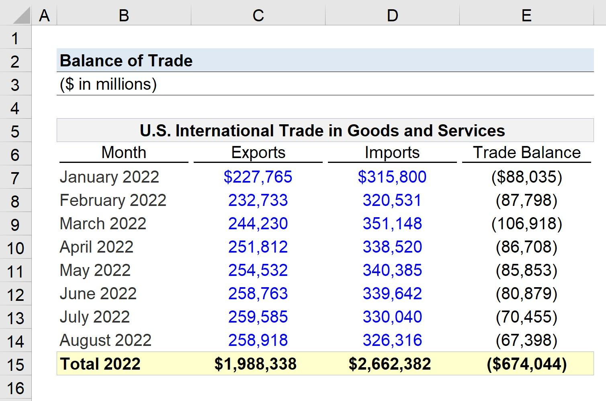

## Table of Contents

## What is a trade surplus?

A trade surplus happens when a country sells more stuff to other countries than it buys from them. Imagine you have a lemonade stand and you sell more lemonade to your friends than you buy from them. That's like having a trade surplus. It means your country is making more money from exports than it is spending on imports.

Having a trade surplus can be good for a country's economy. It can make the country's currency stronger because other countries need to buy that currency to pay for the goods. This can also lead to more jobs and growth in industries that make things for export. However, it's not always perfect. If a country focuses too much on exports, it might not pay enough attention to what its own people need.

## How is a trade surplus calculated?

To figure out a trade surplus, you need to look at two main things: how much a country exports and how much it imports. Exports are the goods and services a country sells to other countries. Imports are the goods and services a country buys from other countries. If the value of exports is more than the value of imports, then the country has a trade surplus.

You calculate it by subtracting the total value of imports from the total value of exports. For example, if a country exports goods worth $100 billion and imports goods worth $80 billion, the trade surplus would be $20 billion. This number shows how much more money the country made from selling things abroad than it spent on buying things from abroad.

## Why is a trade surplus important for a country's economy?

A trade surplus is important for a country's economy because it means the country is [earning](/wiki/earning-announcement) more from selling things to other countries than it is spending on buying things from them. This extra money can help make the country's currency stronger. When the currency is strong, it can buy more things from other countries, and it makes people from other countries want to invest in the country. This can lead to more jobs and growth in the industries that make things for export, which is good for the economy.

However, a trade surplus isn't always perfect. If a country focuses too much on selling things to other countries, it might not pay enough attention to what its own people need. This can lead to problems like not having enough goods for people at home or too much focus on certain industries, which can make the economy less balanced. So, while a trade surplus can be good, it's important for a country to make sure it's also taking care of its own people's needs.

## Can you provide examples of countries with a trade surplus?

Germany is a country that often has a big trade surplus. They make a lot of cars, machines, and other things that other countries want to buy. Because Germany sells more stuff than it buys, it has more money coming in from other countries. This helps their economy grow and makes their currency strong.

Another country with a trade surplus is China. China makes a lot of electronics, clothes, and toys that people all over the world buy. They export more than they import, which means they earn more money from selling things than they spend on buying things from other countries. This helps China's economy and makes their currency stronger too.

These are just two examples, but there are other countries like Japan and South Korea that also often have trade surpluses. They focus on making things that other countries want to buy, and this helps their economies grow.

## What are the main factors that contribute to a trade surplus?

One main [factor](/wiki/factor-investing) that helps a country have a trade surplus is making things that other countries want to buy. If a country can make good cars, machines, or electronics, other countries will want to buy them. This means the country will export more than it imports, which leads to a trade surplus. For example, Germany makes a lot of cars and machines that other countries want, so they have a big trade surplus.

Another factor is having a strong currency. When a country's currency is strong, it can buy more things from other countries. But if the currency is too strong, it can make the country's exports more expensive, which might hurt the trade surplus. Countries need to find a balance so their currency is strong enough to help the economy but not so strong that it makes their exports too expensive.

Lastly, government policies can also help create a trade surplus. If a government gives money or support to industries that make things for export, those industries can grow and sell more to other countries. For example, if the government helps farmers grow more crops that can be sold to other countries, this can increase exports and lead to a trade surplus.

## How does a trade surplus affect a country's currency?

A trade surplus can make a country's currency stronger. When a country sells more things to other countries than it buys, it earns more money from those sales. Other countries need to buy the currency of the country with the trade surplus to pay for the goods they are importing. This increased demand for the currency makes it stronger compared to other currencies.

A stronger currency can help the country's economy in some ways. It can make imports cheaper, which means people in the country can buy things from other countries for less money. But, a very strong currency can also make the country's exports more expensive for other countries to buy. This might hurt the trade surplus if other countries start buying less because the goods are too pricey. So, while a trade surplus can help make a country's currency stronger, it's important to keep a balance so that the currency doesn't become too strong and hurt exports.

## What are the potential downsides of a trade surplus?

A trade surplus can have some downsides. If a country focuses too much on selling things to other countries, it might not pay enough attention to what its own people need. This can lead to problems like not having enough goods for people at home. For example, if a country is busy making cars to sell to other countries, it might not make enough food or clothes for its own people. This can make life harder for people living in the country.

Another downside is that a very strong trade surplus can make the country's currency too strong. When the currency gets too strong, it can make the country's exports more expensive for other countries to buy. This might hurt the trade surplus because other countries might start buying less. It can also make it harder for the country to sell its goods abroad, which can lead to fewer jobs in the industries that make things for export. So, while a trade surplus can be good, it's important for a country to keep a balance.

## How do trade policies influence a country's trade surplus?

Trade policies can really change how much a country sells to other countries compared to what it buys. If a government makes rules that help businesses sell more things abroad, like giving them money or making it easier for them to export, this can lead to a bigger trade surplus. For example, if the government helps farmers grow more crops that can be sold to other countries, this can increase exports and make the trade surplus bigger. On the other hand, if the government puts up barriers that make it hard for other countries to sell things to them, like taxes on imports, this can also help create a trade surplus by making imports more expensive and less attractive.

But trade policies can also have downsides. If a country focuses too much on selling things to other countries, it might not pay enough attention to what its own people need. This can lead to problems like not having enough goods for people at home. Also, if the government makes it too hard for other countries to sell things to them, it might make other countries mad and they might put up their own barriers. This can lead to less trade overall, which can hurt the economy. So, while trade policies can help create a trade surplus, it's important for a country to think about the bigger picture and make sure its policies help everyone, not just the businesses that sell things abroad.

## What is the difference between a trade surplus and a current account surplus?

A trade surplus and a current account surplus are similar but not the same. A trade surplus happens when a country sells more stuff to other countries than it buys from them. It's just about the money made from selling things like cars, clothes, and food to other countries minus the money spent on buying those things from other countries. If a country sells more than it buys, it has a trade surplus.

A current account surplus is a bigger picture. It includes the trade surplus but also adds in other things like money made from services, like tourism or banking, and money that comes into the country from people working abroad sending money home. It also looks at money paid for things like interest on loans or dividends from investments. So, a current account surplus is about all the money coming into a country from different sources minus all the money going out. If the total money coming in is more than the money going out, the country has a current account surplus.

## How have trade surpluses evolved historically in major economies?

Over the years, trade surpluses in major economies have changed a lot. In the past, countries like the United Kingdom had big trade surpluses because they were at the center of world trade during the time of the British Empire. They sold a lot of things to other countries and bought less from them. After World War II, the United States had a big trade surplus because it was making a lot of things that other countries needed to rebuild. But over time, as other countries like Japan and Germany started making more things themselves, the U.S. trade surplus got smaller and turned into a trade deficit.

In recent years, countries like China and Germany have had big trade surpluses. China started making a lot of things that people all over the world wanted to buy, like electronics and clothes. This made their trade surplus grow a lot. Germany also kept making good cars and machines that other countries wanted, so they had a big trade surplus too. But trade surpluses can change because of things like new trade rules, changes in what people want to buy, or big events like economic crises. So, even though some countries have had big trade surpluses in the past, it's always changing.

## What role do trade agreements play in maintaining or increasing a trade surplus?

Trade agreements can help a country have a bigger trade surplus by making it easier for them to sell things to other countries. These agreements often lower taxes on things that are sold between the countries that made the agreement. This makes the things cheaper for people in other countries to buy, so they buy more. For example, if a country makes cars and there's a trade agreement that lowers the taxes on those cars in another country, more people might buy them. This means the country selling the cars can export more and have a bigger trade surplus.

But trade agreements can also make a country's trade surplus smaller if they help other countries sell more things to them. If a country agrees to lower taxes on things it buys from another country, those things might become cheaper and more people might buy them. This means the country might import more, which can make its trade surplus smaller. So, when countries make trade agreements, they have to think about how it will change what they sell and buy, and how that will affect their trade surplus.

## How can a country with a trade surplus manage it to benefit its economy long-term?

A country with a trade surplus can manage it to help its economy grow in the long run by making smart choices about where to spend the extra money. One good way is to invest in things like schools and roads. This can make the country a better place to live and work, which can help the economy grow even more. Another way is to use the extra money to help new businesses start up or to help existing businesses grow. This can lead to more jobs and more things being made in the country, which can help keep the trade surplus going strong.

But it's also important for the country to make sure it's not just focusing on selling things to other countries. It needs to make sure there are enough things for its own people too. If the country is too focused on exports, it might not have enough food, clothes, or other things for people at home. So, while a trade surplus can be good, the country needs to use it in a way that helps everyone, not just the businesses that sell things abroad. By balancing these things, a country can use its trade surplus to make its economy strong and healthy for a long time.

## What is Understanding Economic Surplus?

Economic surplus is a fundamental concept in economics that represents the total benefits accrued by consumers and producers through participation in market transactions. This surplus arises from the difference between what consumers are willing to pay for a good or service and the actual price they pay, as well as what producers receive from a sale and their minimum acceptable price. 

### Consumer Surplus

Consumer surplus is defined as the difference between the highest price a consumer is willing to pay for a product and the actual price they pay. It is a measure of consumer welfare and represents the added utility gained from purchasing goods at market prices less than or equal to their willingness to pay. Mathematically, consumer surplus can be represented as:

$$
CS = \int_0^Q (P_{max} - P) \, dQ
$$

where $CS$ is the consumer surplus, $P_{max}$ is the maximum price consumers are willing to pay, $P$ is the market price, and $Q$ is the quantity consumed.

### Producer Surplus

Producer surplus is the benefit producers receive when they sell goods at market prices higher than the minimum price at which they would be willing to sell. It quantifies producer benefit over and above their costs of production. The producer surplus can be calculated as:

$$
PS = \int_0^Q (P - P_{min}) \, dQ
$$

where $PS$ is the producer surplus, $P_{min}$ is the minimum price producers accept, and $P$ is the selling price.

Together, consumer and producer surplus form the economic surplus, which is a key indicator of market efficiency. In efficient markets, the sum of consumer and producer surplus is maximized, signifying optimal allocation of resources.

### Implications on Economic Policies and Market Changes

Economic surplus provides insight into how policy decisions and market fluctuations influence overall economic well-being. Policies that alter prices, such as taxes or subsidies, can shift consumer and producer surplus, affecting total economic welfare. For example, a tax on a good typically reduces consumer surplus by raising prices and decreases producer surplus by lowering demand. Understanding these changes is essential for evaluating the consequences of economic policies.

### Economic Surplus and International Trade

The concept of economic surplus is critical for evaluating the impact of international trade. In international trade, consumer and producer surplus can shift due to changes in comparative advantages, trade tariffs, and global supply and demand dynamics. Nations may experience changes in surplus distribution based on trade agreements that affect domestic prices and market accessibility. The ability to assess these shifts allows policymakers to craft strategies that maximize national welfare through advantageous trade practices.

Thus, understanding economic surplus provides a comprehensive framework to evaluate the effectiveness of economic structures and the influence of international trade on domestic markets, highlighting its role in shaping economic policies globally.

## References & Further Reading

[1]: Krugman, P. R., Obstfeld, M., & Melitz, M. J. (2015). ["International Economics: Theory and Policy"](https://www.pearson.com/se/Nordics-Higher-Education/subject-catalogue/economics/International-Economics-Theory-and-Policy-Krugman.html). Pearson. 

[2]: Brogaard, J., Hendershott, T., & Riordan, R. (2014). ["High frequency trading and price discovery"](https://academic.oup.com/rfs/article-abstract/27/8/2267/1582754). The Review of Financial Studies, 27(8), 2267-2306.

[3]: Gomber, P., Arndt, B., Lutat, M., & Uhle, T. (2011). ["High-frequency trading"](https://papers.ssrn.com/sol3/papers.cfm?abstract_id=1858626). In Z. Papacharissi (Ed.), Handelsblatt Journal.

[4]: Dornbusch, R., Fischer, S., & Startz, R. (2013). ["Macroeconomics"](https://books.google.com/books/about/EBOOK_Macroeconomics.html?id=KoZvEAAAQBAJ). McGraw-Hill Education.

[5]: Baker, S. R., Bloom, N., & Davis, S. J. (2016). ["Measuring economic policy uncertainty"](https://www.nber.org/papers/w21633). The Quarterly Journal of Economics, 131(4), 1593-1636.

[6]: Lo, A. W. (2005). ["Reconciling efficient markets with behavioral finance: The adaptive markets hypothesis"](https://papers.ssrn.com/sol3/papers.cfm?abstract_id=1702447). Journal of Investment Consulting, 7(2), 21-44.

[7]: Clark, E., Hoti, S., & McAleer, M. (2004). ["The relationship between national economic indicators and international financial markets: An investigation of stock index returns"](https://www.tandfonline.com/doi/abs/10.1080/0960310042000262216). Applied Financial Economics, 14(2), 111-121.