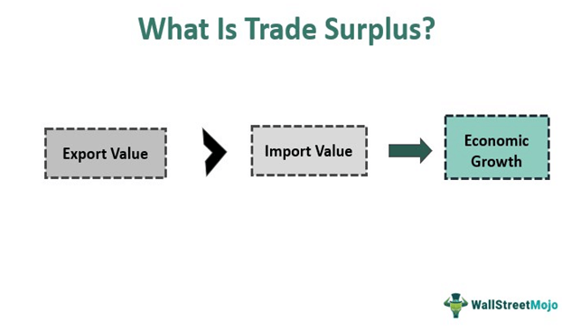

The global economy today is characterized by a complex web of trade and commerce that connects nations in unprecedented ways. This intricate network facilitates the exchange of goods, services, and capital across borders, forming the backbone of international economic relations. A crucial aspect of comprehending the global market is understanding concepts like economic surplus, trade surplus, international trade, and the increasingly prominent role of algorithmic trading.

Economic surplus represents the benefits gleaned by consumers and producers from engaging in market transactions, which can be further dissected into consumer and producer surplus. These elements play a pivotal role in evaluating how market changes and economic policies affect overall welfare, especially in a globalized context. Trade surplus, on the other hand, occurs when a nation's exports exceed its imports over a specific period, leading to a positive trade balance. This condition often signals a competitive edge in global markets and can significantly drive a nation's economic expansion.

The dynamics of international trade extend beyond mere exchanges of goods and services, influencing employment, production, and economic growth within participating countries. The interplay between these elements defines relationships among trading partners and affects currency valuations and macroeconomic stability.

Algorithmic trading, or algo trading, signifies a transformative trend in financial markets where trades are executed using sophisticated computer programs based on predefined criteria. This method of trading not only enhances market efficiency and liquidity but also introduces new challenges related to market dynamics and regulatory compliance.

In this article, we aim to provide a comprehensive exploration of how these elements—economic surplus, trade surplus, international trade, and algorithmic trading—interconnect and shape the global market landscape. We will examine the implications these factors have on economies worldwide, shedding light on their potential to influence future economic and trading policies. Understanding these complex interactions is essential for economists, policymakers, and traders seeking to navigate the multifaceted dimensions of modern economic systems.

## Table of Contents

## Understanding Economic Surplus

Economic surplus is a fundamental concept in economics that represents the total benefits accrued by consumers and producers through participation in market transactions. This surplus arises from the difference between what consumers are willing to pay for a good or service and the actual price they pay, as well as what producers receive from a sale and their minimum acceptable price. 

### Consumer Surplus

Consumer surplus is defined as the difference between the highest price a consumer is willing to pay for a product and the actual price they pay. It is a measure of consumer welfare and represents the added utility gained from purchasing goods at market prices less than or equal to their willingness to pay. Mathematically, consumer surplus can be represented as:

$$
CS = \int_0^Q (P_{max} - P) \, dQ
$$

where $CS$ is the consumer surplus, $P_{max}$ is the maximum price consumers are willing to pay, $P$ is the market price, and $Q$ is the quantity consumed.

### Producer Surplus

Producer surplus is the benefit producers receive when they sell goods at market prices higher than the minimum price at which they would be willing to sell. It quantifies producer benefit over and above their costs of production. The producer surplus can be calculated as:

$$
PS = \int_0^Q (P - P_{min}) \, dQ
$$

where $PS$ is the producer surplus, $P_{min}$ is the minimum price producers accept, and $P$ is the selling price.

Together, consumer and producer surplus form the economic surplus, which is a key indicator of market efficiency. In efficient markets, the sum of consumer and producer surplus is maximized, signifying optimal allocation of resources.

### Implications on Economic Policies and Market Changes

Economic surplus provides insight into how policy decisions and market fluctuations influence overall economic well-being. Policies that alter prices, such as taxes or subsidies, can shift consumer and producer surplus, affecting total economic welfare. For example, a tax on a good typically reduces consumer surplus by raising prices and decreases producer surplus by lowering demand. Understanding these changes is essential for evaluating the consequences of economic policies.

### Economic Surplus and International Trade

The concept of economic surplus is critical for evaluating the impact of international trade. In international trade, consumer and producer surplus can shift due to changes in comparative advantages, trade tariffs, and global supply and demand dynamics. Nations may experience changes in surplus distribution based on trade agreements that affect domestic prices and market accessibility. The ability to assess these shifts allows policymakers to craft strategies that maximize national welfare through advantageous trade practices.

Thus, understanding economic surplus provides a comprehensive framework to evaluate the effectiveness of economic structures and the influence of international trade on domestic markets, highlighting its role in shaping economic policies globally.

## What is Trade Surplus?

A trade surplus occurs when the value of a country's exports surpasses the value of its imports over a defined period, resulting in a positive trade balance. This phenomenon is a critical indicator of a country's prowess in international markets and its productive capacity. Typically, a trade surplus is perceived as a sign of economic vitality because it suggests that a nation is producing goods and services that are in high demand globally. This is often seen as a favorable economic condition.

The positive balance of trade that arises from a trade surplus can significantly benefit a country's economy. It may contribute to higher levels of employment, as industries engaged in export activities often require more labor to meet international demand. Additionally, trade surpluses can lead to an increase in a nation's foreign currency reserves, providing a buffer against external economic shocks and enhancing financial stability.

An understanding of trade surplus is essential for grasping the complexities of global trade dynamics. One of the fundamental aspects is its effect on currency valuation. A persistent trade surplus can lead to an appreciation of the country's currency. As demand for the exporting country's currency rises due to increased foreign buyers purchasing its goods, the currency value tends to strengthen. This appreciation can make exports more expensive and imports cheaper, potentially leading to a self-correcting mechanism over time.

Furthermore, trade surpluses influence a country's geopolitical and economic negotiations. Nations with trade surpluses may wield enhanced bargaining power in setting international trade agreements and policies. While a trade surplus is often seen as beneficial, it may also lead to trade tensions with other countries, particularly those experiencing trade deficits, as they may perceive the trade surplus nation as having an unfair competitive advantage. Understanding these nuances is essential for policymakers and economists when formulating strategies to manage a country's trade balance effectively.

## Trade Surplus vs. Trade Deficit

A trade surplus and a trade deficit are fundamental concepts in international economics that represent two opposite conditions of a country's trade balance. A trade surplus occurs when the value of a country's exports exceeds the value of its imports over a specific period. This condition often signals a competitive advantage in the global marketplace, potentially leading to economic growth, as foreign currency revenues increase. Nations experiencing a trade surplus may witness currency appreciation due to higher demand for their exports, subsequently impacting the exchange rates and domestic employment positively.

Conversely, a trade deficit arises when a country's imports surpass its exports, indicating a negative trade balance. While often perceived as unfavorable, a trade deficit is not inherently detrimental and can indicate strong domestic demand and consumption capacity. However, prolonged trade deficits might lead to increased foreign debt, currency depreciation, and potential challenges in sustaining economic stability.

The contrasting conditions of a trade surplus and deficit are crucial for understanding macroeconomic policies. These positions influence monetary policies, fiscal measures, and regulatory frameworks aimed at balancing trade activities. For instance, a trade surplus might prompt a country to appreciate its currency to decrease export competitiveness moderately or leverage trade agreements for strategic gain. A trade deficit, on the other hand, might lead to efforts to devalue the currency to boost export competitiveness or incentivize domestic production through subsidies and tariffs.

Analyzing trade balances involves understanding their impact on currency exchange rates and employment levels. A trade surplus might lead to currency appreciation, making exports more expensive and imports cheaper, ultimately affecting domestic production and employment. On the contrary, a trade deficit might result in currency depreciation, driving up export volumes and potentially boosting employment in export-oriented industries.

The analysis of trade surplus and deficit is essential for a comprehensive view of a nation's economic standing. As global economies continue to evolve, understanding these dynamics helps policymakers craft strategies to enhance economic resilience and growth.

## Impact of International Trade on Economies

International trade plays a pivotal role in shaping national economies by directly influencing employment levels, production capacities, and overall economic growth. The interaction between nations through trade enables countries to access resources, goods, and services that may be unavailable or more costly to produce domestically. This interaction fosters a more efficient allocation of global resources, promotes economic diversification, and drives technological advancement.

A trade surplus, where a country's exports exceed its imports, can significantly impact currency valuation. Typically, a trade surplus leads to an appreciation of the exporting country's currency. This appreciation occurs because the demand for the country's currency increases as foreign purchasers need its currency to pay for the exported goods. Currency appreciation can have several effects on the economy; it may make exports more expensive and imports cheaper, potentially reducing the competitive advantage that led to the surplus initially. However, it also increases the purchasing power of the country's consumers and can help curb inflationary pressures.

Changes in trading partner relationships are also a critical consequence of international trade dynamics. Countries with consistent trade surpluses may find themselves in a strengthened bargaining position when negotiating international trade agreements. These agreements, such as free trade agreements (FTAs) or regional trade agreements (RTAs), can further shape economic landscapes by reducing trade barriers, altering tariffs, and influencing regulatory standards across borders. For instance, agreements like the North American Free Trade Agreement (NAFTA) or the European Union's single market have significantly affected member countries by fostering closer economic ties and streamlining the movement of goods and services.

International trade policies also play an essential role in shaping economic landscapes. Governments may use these policies to protect domestic industries, promote exports, or address trade imbalances. Protectionist measures, such as tariffs and quotas, are designed to shield domestic industries from foreign competition. However, they can lead to retaliation from trading partners, potentially escalating into trade wars that can disrupt global economic stability.

Moreover, international trade can affect employment levels within an economy. Export-driven growth can lead to job creation as industries expand to meet foreign demand. Conversely, increased imports may challenge domestic industries, potentially resulting in job losses if these industries cannot compete effectively.

International trade has transformed global production networks through the rise of global value chains (GVCs), where different stages of production are located across various countries. This fragmentation of production processes enables countries to specialize in specific manufacturing or service tasks, enhancing efficiency and competitiveness.

In summary, international trade is a cornerstone of economic development and growth. It influences currency dynamics, alters relationships with trading partners, and molds employment and production profiles within national economies. By understanding and strategically navigating trade agreements and policies, countries can leverage the benefits of international trade to enhance their economic prosperity and competitiveness in the global market.

## The Rise of Algorithmic Trading

Algorithmic trading, often referred to as algo trading, leverages computer algorithms to execute trades based on a set of predetermined conditions. These algorithms can process data at high speeds and volumes, executing trades more efficiently and effectively than human traders. This technological advancement has introduced a transformative shift in trading strategies globally.

One of the key implications of algo trading is its impact on market [liquidity](/wiki/liquidity-risk-premium). By enabling rapid transaction processing and reducing the manual intervention in trading, [algorithmic trading](/wiki/algorithmic-trading) enhances liquidity. This improvement allows for tighter bid-ask spreads and reduces the cost of trading, making markets more efficient. However, the increased liquidity is also accompanied by heightened market [volatility](/wiki/volatility-trading-strategies), as large volumes of trade can be executed in a fraction of a second, leading to significant price swings.

Moreover, the rise of algo trading has altered the dynamics of financial markets. Traditional buy-and-hold strategies are increasingly being supplemented by high-frequency trading activities that exploit small price discrepancies for profit. These advanced trading practices have reshaped how traders approach the market, shifting the focus towards technology-driven strategies.

Algorithmic trading's interaction with economic phenomena like trade surplus is nuanced. While it's primarily a financial market tool, the efficiencies introduced by algo trading can influence broader economic metrics. For instance, enhanced liquidity and cost reduction in currency markets can impact exchange rates, indirectly affecting trade balances. Countries with significant trade surpluses might experience currency appreciation due to the efficiencies in [forex](/wiki/forex-system) markets induced by algorithmic trading, potentially impacting export competitiveness.

In conclusion, algorithmic trading has revolutionized the financial trading landscape by automating and accelerating trade executions. Its influence extends beyond just market practices, subtly affecting broader economic factors, including those related to international trade and economic surplus. As technology continues to advance, the role of algorithmic trading in shaping market behaviors and economic outcomes is poised for further expansion.

## Challenges and Opportunities

The interplay between trade surplus and algorithmic trading presents significant challenges and opportunities for economic growth. A trade surplus can bolster a nation's economic standing by strengthening its currency and enhancing its global market influence. However, it can also lead to trade tensions with countries experiencing trade deficits, prompting potential retaliatory measures that cause market instability. Moreover, excessive reliance on exports for economic growth might render economies vulnerable to fluctuations in global demand.

Simultaneously, algorithmic trading, known for its ability to enhance market liquidity and efficiency, brings challenges related to market volatility. Rapid, automated trades can exacerbate market swings, resulting in financial instability. Algorithmic trading strategies are not infallible; bugs or unforeseen scenarios can trigger unintended market consequences.

To adapt to these dynamics, countries are continuously developing regulatory frameworks to manage the risks associated with these economic phenomena. Regulatory measures aim to mitigate excessive market volatility by limiting the speed and [volume](/wiki/volume-trading-strategy) of algorithmic trades. For trade surplus issues, multilateral trade agreements and diplomacy play crucial roles in easing international tensions and facilitating balanced trade relations.

Despite these challenges, the opportunities are substantial. A trade surplus can provide a buffer against economic downturns, creating reserves that support domestic investment and consumption. Algorithmic trading, on the other hand, has the potential to democratize financial markets, offering more participants access to trading and investment opportunities. These advancements can lead to new financial products and market innovations.

Strategizing effectively within this context involves leveraging the beneficial aspects of trade surplus and algorithmic trading while implementing safeguards against their inherent risks. Policymakers and economists must work collaboratively to ensure these mechanisms contribute positively to sustainable economic growth. Through careful regulation and adaptive economic policies, the potential of trade surplus and algorithmic trading can be harnessed, driving progress in today's interconnected global economy.

## Conclusion

Economic surplus, trade surplus, international trade, and algorithmic trading are interconnected facets that collectively influence the global economy's framework. Economic surplus, subdivided into consumer and producer surplus, provides insight into the welfare benefits accrued from trade, serving as an indicator of market efficiency and policy impact. Trade surplus, on the other hand, reflects a nation's competitive strength in international markets, often associated with economic growth and currency fluctuations.

International trade serves as the bedrock of global economic interactions, significantly affecting national economies through shifts in employment, production, and growth trajectories. It remains pivotal in shaping the relationships among trading nations, influenced by trade agreements and policy decisions.

Algorithmic trading represents a modern evolution in financial markets, leveraging technology to execute trades with high precision and speed. By influencing market liquidity and dynamics, algorithmic trading impacts financial markets' structure and has implications for phenomena like trade surplus.

A comprehensive understanding of these concepts is vital for policymakers, economists, and traders striving to navigate the complexities of contemporary economies. As global economic policies evolve and technological advancements continue to transform the landscape, future prospects in international trade and finance will be increasingly shaped by these developments. Embracing these changes offers substantial opportunities for strategic planning and economic growth, while also posing challenges that require adaptive regulatory frameworks and innovative trading approaches.

## References & Further Reading

[1]: Krugman, P. R., Obstfeld, M., & Melitz, M. J. (2015). ["International Economics: Theory and Policy"](https://www.pearson.com/se/Nordics-Higher-Education/subject-catalogue/economics/International-Economics-Theory-and-Policy-Krugman.html). Pearson. 

[2]: Brogaard, J., Hendershott, T., & Riordan, R. (2014). ["High frequency trading and price discovery"](https://academic.oup.com/rfs/article-abstract/27/8/2267/1582754). The Review of Financial Studies, 27(8), 2267-2306.

[3]: Gomber, P., Arndt, B., Lutat, M., & Uhle, T. (2011). ["High-frequency trading"](https://papers.ssrn.com/sol3/papers.cfm?abstract_id=1858626). In Z. Papacharissi (Ed.), Handelsblatt Journal.

[4]: Dornbusch, R., Fischer, S., & Startz, R. (2013). ["Macroeconomics"](https://books.google.com/books/about/EBOOK_Macroeconomics.html?id=KoZvEAAAQBAJ). McGraw-Hill Education.

[5]: Baker, S. R., Bloom, N., & Davis, S. J. (2016). ["Measuring economic policy uncertainty"](https://www.nber.org/papers/w21633). The Quarterly Journal of Economics, 131(4), 1593-1636.

[6]: Lo, A. W. (2005). ["Reconciling efficient markets with behavioral finance: The adaptive markets hypothesis"](https://papers.ssrn.com/sol3/papers.cfm?abstract_id=1702447). Journal of Investment Consulting, 7(2), 21-44.

[7]: Clark, E., Hoti, S., & McAleer, M. (2004). ["The relationship between national economic indicators and international financial markets: An investigation of stock index returns"](https://www.tandfonline.com/doi/abs/10.1080/0960310042000262216). Applied Financial Economics, 14(2), 111-121.