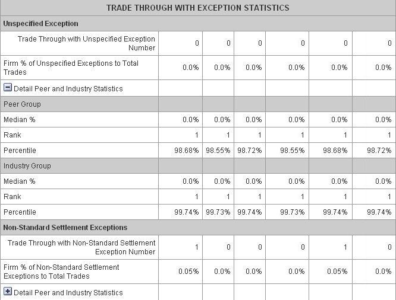

## Table of Contents

## What is a trade-through in the context of financial markets?

A trade-through happens in financial markets when an order to buy or sell a stock is filled at a price that is worse than the best available price at that moment. This can occur across different trading platforms or exchanges. For example, if the best price to buy a stock is $10 on one exchange, but your order gets filled at $10.05 on another exchange, that's a trade-through.

Trade-throughs are important because they can affect the fairness and efficiency of the market. To prevent them, rules like the Order Protection Rule in the U.S. were created. This rule requires that trades be executed at the best available price across all markets, helping to ensure that investors get the best possible deal when they trade.

## How does a trade-through occur?

A trade-through happens when someone tries to buy or sell a stock, but the trade gets completed at a price that's not the best one available at that time. Imagine you want to buy a stock, and the best price you can find is $50 on one exchange. But, your order goes through on another exchange at $50.10. That's a trade-through because you didn't get the best price.

Trade-throughs can happen because of how fast things move in the stock market. There are many exchanges, and the best price can change quickly. Sometimes, the system that's supposed to find the best price might be a bit slow or might not check all the places where the stock is being traded. This can lead to your order being filled at a price that's not the best one out there.

## What are the potential impacts of trade-throughs on investors?

Trade-throughs can hurt investors by making them pay more than they need to when they buy stocks, or get less money than they could when they sell. If an investor wants to buy a stock and the best price is $10, but their order goes through at $10.10, they're spending an extra 10 cents per share. Over many shares, this can add up to a lot of money. On the flip side, if they're selling and the best price is $10 but they get $9.90, they're losing out on potential earnings.

These small differences might not seem like much, but they can really affect how much money investors make or lose over time. It's especially tough for people who trade a lot or who invest big amounts of money. Trade-throughs can also make investors feel like the market isn't fair, which might make them less likely to keep investing or trading. That's why rules like the Order Protection Rule were made, to help make sure everyone gets the best price possible and to keep the market fair for everyone.

## What regulations have been implemented to prevent trade-throughs?

In the United States, the main rule to stop trade-throughs is called the Order Protection Rule. This rule is part of something called Regulation NMS, which stands for National Market System. The Order Protection Rule says that if there's a better price for a stock on one exchange, other exchanges have to send the order to that exchange to get the best price. This helps make sure that when people buy or sell stocks, they always get the best price available.

Even with this rule, trade-throughs can still happen sometimes. This is because the stock market is very fast and complicated, with lots of different places where stocks are traded. If the systems that check for the best prices are a bit slow or if they miss checking some places, a trade-through might still happen. But the Order Protection Rule helps a lot in making the market fairer for everyone by trying to stop these trade-throughs from happening as often.

## Can you explain the National Market System (NMS) and its role in addressing trade-throughs?

The National Market System, or NMS, is a set of rules that helps make the stock market in the United States work better and be fairer for everyone. It's like a big plan that connects all the different places where stocks are traded, so that people can buy and sell stocks more easily and at the best prices. One big part of NMS is the Order Protection Rule, which is all about stopping trade-throughs. A trade-through happens when someone buys or sells a stock at a price that's not the best one available at that moment.

The Order Protection Rule says that if there's a better price for a stock on one exchange, other exchanges have to send the order to that exchange to get the best price. This helps make sure that when people buy or sell stocks, they always get the best price possible. Even though the stock market is very fast and complicated, and trade-throughs can still happen sometimes, the NMS and its rules work hard to keep the market fair and make sure everyone gets a good deal.

## What are the exceptions to the trade-through rule?

There are a few times when the trade-through rule doesn't have to be followed. One big exception is when a stock is traded in a special way called "intermarket sweep orders." These orders let traders buy or sell a stock at different prices on different exchanges all at once. This can be useful when someone wants to buy or sell a lot of stock quickly and doesn't mind not getting the best price everywhere.

Another exception is when the trade happens on what's called a "manual execution." This means that a person, not a computer, is making the trade. Manual executions are slower and less common these days, but they can still happen. In these cases, the rule about getting the best price might not apply because it's harder to check all the different places where the stock is traded in time. These exceptions help keep the market working smoothly, even if they mean that sometimes people don't get the very best price.

## How do exchanges handle trade-throughs under current regulations?

Exchanges work hard to stop trade-throughs by following rules like the Order Protection Rule, which is part of the National Market System (NMS). This rule says that if there's a better price for a stock on one exchange, other exchanges have to send the order to that exchange to get the best price. This helps make sure that when people buy or sell stocks, they always get the best price available. Exchanges use fast computers and systems to check the prices on all the different places where stocks are traded, trying to make sure that trade-throughs don't happen.

Even with all these rules and systems, trade-throughs can still happen sometimes. This is because the stock market is very fast and complicated, with lots of different places where stocks are traded. If the systems that check for the best prices are a bit slow or if they miss checking some places, a trade-through might still happen. But the rules help a lot in making the market fairer for everyone by trying to stop these trade-throughs from happening as often.

## What is the Order Protection Rule and how does it relate to trade-throughs?

The Order Protection Rule is a special rule in the United States that helps make sure people get the best price when they buy or sell stocks. It's part of something called the National Market System (NMS), which is like a big plan to make the stock market work better. The rule says that if there's a better price for a stock on one place where stocks are traded, called an exchange, other exchanges have to send the order to that exchange to get the best price. This helps stop something called a trade-through, which happens when someone buys or sells a stock at a price that's not the best one available at that moment.

Even though the Order Protection Rule is there to help, trade-throughs can still happen sometimes. The stock market is very fast and complicated, with lots of different places where stocks are traded. If the computers that check for the best prices are a bit slow or if they miss checking some places, a trade-through might still happen. But the Order Protection Rule helps a lot in making the market fairer for everyone by trying to stop these trade-throughs from happening as often.

## Can you provide examples of trade-throughs that have occurred in the market?

Imagine you want to buy 100 shares of a company called ABC. The best price you can find is $20 per share on Exchange A. But, your order goes through on Exchange B at $20.05 per share. That's a trade-through because you didn't get the best price. You ended up paying an extra $5 for those 100 shares, which might not seem like a lot, but it can add up over time.

Another example is if you're selling 50 shares of a company called XYZ. The best price you can get is $30 per share on Exchange C. But, your order gets filled on Exchange D at $29.90 per share. That's a trade-through too because you didn't get the best price. You lost out on $0.10 per share, which means you got $5 less than you could have. These small differences can really affect how much money you make or lose over time.

## How do different trading platforms implement rules to avoid trade-throughs?

Trading platforms use special computer systems to check the prices of stocks on different exchanges. They do this really fast, trying to find the best price for every order. If they see a better price on another exchange, they send the order there to make sure it gets filled at the best price. This helps stop trade-throughs, which is when someone buys or sells a stock at a price that's not the best one available.

Even with these systems, trade-throughs can still happen sometimes. The stock market is very fast and complicated, with lots of different places where stocks are traded. If the computers are a bit slow or if they miss checking some places, a trade-through might still happen. But the rules and systems that trading platforms use help a lot in making the market fairer for everyone by trying to stop these trade-throughs from happening as often.

## What technological solutions are used to monitor and prevent trade-throughs?

Trading platforms use fast computers and special software to keep an eye on the prices of stocks on different exchanges. These systems work quickly to find the best price for every order. If they see a better price on another exchange, they send the order there to make sure it gets filled at the best price. This helps stop trade-throughs, which happen when someone buys or sells a stock at a price that's not the best one available.

Even with these high-tech systems, trade-throughs can still happen sometimes. The stock market is very fast and complicated, with lots of different places where stocks are traded. If the computers are a bit slow or if they miss checking some places, a trade-through might still happen. But the technology and rules that trading platforms use help a lot in making the market fairer for everyone by trying to stop these trade-throughs from happening as often.

## How do regulatory bodies enforce trade-through rules and what are the penalties for violations?

Regulatory bodies like the Securities and Exchange Commission (SEC) in the United States make sure that trade-through rules are followed. They do this by keeping an eye on the trading platforms and the exchanges. If they find that a trade-through happened, they look into why it happened and if the rules were broken. They can ask for reports and check the computer systems that are supposed to stop trade-throughs. This helps them figure out if the trade-through was a mistake or if someone did something wrong on purpose.

If a trading platform or an exchange breaks the trade-through rules, they can get in trouble. The penalties can be pretty serious. They might have to pay big fines, which are like punishments in the form of money. Sometimes, they might also have to change how they do things to make sure it doesn't happen again. The goal is to make sure everyone follows the rules so that the stock market stays fair for all investors.

## References & Further Reading

[1]: Harris, L. (2003). ["Trading and Exchanges: Market Microstructure for Practitioners"](https://www.amazon.com/Trading-Exchanges-Market-Microstructure-Practitioners/dp/0195144708). Oxford University Press.

[2]: O'Hara, M. (1995). ["Market Microstructure Theory"](https://www.wiley.com/en-us/Market+Microstructure+Theory-p-9780631207610). Wiley Finance.

[3]: Hendershott, T., Jones, C. M., & Menkveld, A. J. (2011). ["Does Algorithmic Trading Improve Liquidity?"](https://onlinelibrary.wiley.com/doi/full/10.1111/j.1540-6261.2010.01624.x) Review of Financial Studies, 24(3), 346-385.

[4]: Domowitz, I., & Wang, J. (1994). ["Auctions as Algorithms"](https://www.sciencedirect.com/science/article/pii/016518899490068X). Journal of Economic Dynamics and Control, 18(1), 29-60.

[5]: U.S. Securities and Exchange Commission. (2005). [Regulation NMS](https://www.sec.gov/rules-regulations/2005/06/regulation-nms).