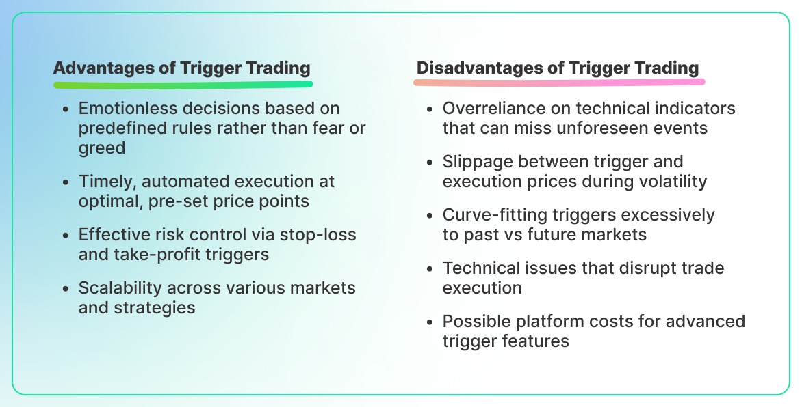

## Table of Contents

## What is a trade trigger?

A trade trigger is a specific event or condition that tells a trader when to buy or sell a financial asset. It's like a signal that helps traders decide the right time to make a move in the market. For example, a trader might set a trade trigger to buy a stock if its price goes above a certain level, or to sell if the price drops below another level.

Trade triggers can be based on many different things, like price movements, technical indicators, or even news events. They help traders stick to their trading plans and avoid making decisions based on emotions. By using trade triggers, traders can be more disciplined and consistent in their approach to the market.

## How does a trade trigger work in trading?

A trade trigger works like a signal that tells a trader when it's time to buy or sell something in the market. Imagine you're watching a stock's price, and you've decided you'll buy it if the price goes above $50. That $50 price is your trade trigger. When the stock hits $51, your trigger goes off, and you know it's time to buy. This helps you make decisions based on a plan rather than guessing or feeling pressured.

Trade triggers can be set up in different ways. Some traders use charts and patterns, looking for specific shapes or movements in the price. Others might use technical indicators, like moving averages or the relative strength index (RSI), to set their triggers. News events can also be triggers; for example, if a company announces better-than-expected earnings, that could be a signal to buy its stock. By using trade triggers, traders can stay disciplined and make more consistent decisions, which is important in the often unpredictable world of trading.

## What are the common types of trade triggers?

Trade triggers can be based on different things, like price levels, technical indicators, or news events. A price level trigger happens when a stock or asset reaches a certain price. For example, if you want to buy a stock when it goes above $50, that $50 is your trigger. Technical indicators are another common type of trigger. These are tools like moving averages or the Relative Strength Index (RSI) that traders use to spot trends or signals in the market. When these indicators reach certain levels, they can tell a trader it's time to buy or sell.

News events can also act as trade triggers. If a company reports better-than-expected earnings or there's a big announcement that affects the market, that news can be a signal to make a trade. Traders often set up alerts or watch for these events closely. By using these different types of triggers, traders can make decisions based on clear signals instead of guessing or acting on emotions. This helps them stay disciplined and stick to their trading plans.

## What are the basic advantages of using trade triggers?

Using trade triggers helps traders make decisions based on clear signals instead of emotions or guesses. When you set a specific price or event as a trigger, it tells you exactly when to buy or sell. This makes trading more disciplined because you're following a plan. It's like having a roadmap that guides you through the ups and downs of the market.

Another big advantage is that trade triggers can help you be more consistent. If you always buy when the price hits a certain level or when a technical indicator signals a good time, you'll make the same kind of decisions over and over. This consistency can lead to better results over time. Plus, using triggers can save you from making hasty decisions during stressful market moments, helping you stick to your strategy no matter what's happening around you.

## Can trade triggers help in managing risk?

Trade triggers can definitely help in managing risk. When you set a trade trigger, you're making a plan for when to buy or sell. This means you're not just reacting to what's happening in the market at the moment. Instead, you're following a set rule. For example, if you decide to sell a stock when it drops to a certain price, that's your trigger. This way, you can limit your losses and avoid holding onto a losing investment for too long.

Using trade triggers also helps you stay disciplined. The market can be full of ups and downs, and it's easy to get caught up in the excitement or panic. But if you have a trigger set, you know exactly what to do, no matter what's happening around you. This can stop you from making quick, risky decisions based on emotions. By sticking to your triggers, you manage your risk better and keep your trading strategy on track.

## What are the potential disadvantages of relying on trade triggers?

Relying on trade triggers can sometimes lead to missed opportunities. If the market moves quickly, your trigger might not catch the best moment to buy or sell. For example, if you set a trigger to buy a stock when it reaches $50, but the price jumps from $49 to $51 in a flash, you might miss out on the best price. Also, trade triggers are based on past data or set conditions, so they might not always work well in unexpected market situations.

Another disadvantage is that trade triggers can make you too dependent on them. If you always follow your triggers without thinking, you might not notice important changes in the market. For instance, if there's big news that affects the market, sticking only to your triggers might cause you to miss out on reacting to that news. It's important to use trade triggers as part of a bigger plan, not the whole plan, so you can still think for yourself and adapt to new situations.

## How do trade triggers integrate with trading platforms?

Trade triggers can be set up on trading platforms to help traders make decisions automatically. Most trading platforms let you set specific conditions for buying or selling, like a certain price level or a technical indicator reaching a certain point. When these conditions are met, the platform can send you an alert or even make the trade for you if you've set it up that way. This makes it easier to stick to your trading plan without having to watch the market all the time.

However, setting up trade triggers on a platform can take some time to learn. You need to know how to use the platform's tools and understand how to set the triggers correctly. Once you get the hang of it, though, it can save you a lot of time and help you trade more consistently. Just remember that while trade triggers are helpful, they're not perfect, and you should still keep an eye on the market to make sure you're not missing out on important changes.

## What technical analysis tools are often used in conjunction with trade triggers?

Traders often use moving averages with trade triggers to spot trends. A moving average smooths out price data to show the general direction of a stock's price over time. For example, if a short-term moving average crosses above a long-term one, it might be a signal to buy. This can be set as a trade trigger on a trading platform, telling the trader when to make a move.

Another popular tool is the Relative Strength Index (RSI), which measures how fast a stock's price is moving and if it's overbought or oversold. If the RSI goes above 70, it might mean the stock is overbought and could be time to sell. If it drops below 30, it might be oversold, signaling a good time to buy. Traders often set these RSI levels as trade triggers to help them decide when to enter or exit a trade.

Chart patterns like support and resistance levels are also commonly used with trade triggers. Support is a price level where a stock tends to stop falling, and resistance is where it stops rising. Traders might set a trigger to buy when the price breaks above resistance or sell when it drops below support. These patterns help traders see key price points and make decisions based on clear signals, making their trading more disciplined and consistent.

## How can one optimize the settings of trade triggers for better performance?

To optimize the settings of trade triggers for better performance, you need to test different conditions and see what works best for you. Start by looking at past data to see how your triggers would have worked before. This is called backtesting. You might find that certain price levels or technical indicators give you better results. For example, if you notice that a stock often bounces back when it hits a certain support level, you could set a trigger to buy near that level. Keep adjusting your triggers based on what you learn from backtesting until you find settings that help you make good trades more often.

It's also important to keep an eye on how well your triggers are working over time. The market changes, so what worked last month might not work this month. Regularly check your trades and see if your triggers are still helping you make money. If they're not, it might be time to change them. Also, think about combining different types of triggers, like using both price levels and technical indicators. This can make your trading strategy stronger and more flexible. By staying flexible and always looking to improve, you can keep your trade triggers working well for you.

## What are the psychological impacts of using trade triggers on traders?

Using trade triggers can help traders feel more confident and less stressed. When you set a trigger, you know exactly when to buy or sell, so you don't have to worry about making quick decisions during tense market moments. This can take away a lot of the pressure and help you stick to your plan. Instead of feeling overwhelmed by the ups and downs of the market, you can relax a bit more, knowing that your triggers will guide you.

On the other hand, relying too much on trade triggers can make you feel like you're not in control. If you always follow your triggers without thinking, you might start to feel like a robot, just reacting to signals instead of making your own choices. This can lead to a sense of helplessness or frustration, especially if the market does something unexpected and your triggers don't work as well as you hoped. It's important to use trade triggers as a tool, not a crutch, so you can still use your own judgment and adapt to new situations.

## How do trade triggers affect the overall market dynamics?

Trade triggers can make the market move in certain ways because a lot of traders use them. When many people set their triggers at the same price levels or technical indicators, it can cause a lot of buying or selling at those points. For example, if a lot of traders have a trigger to buy a stock when it goes above $50, the price might jump quickly once it hits that level. This can create big swings in the market, making prices go up and down more than they would without so many triggers.

At the same time, trade triggers can help make the market more predictable. When traders follow their triggers, they're making decisions based on clear rules instead of guessing or acting on emotions. This can lead to more stable trading patterns over time. But if too many people use the same triggers, it might also lead to false signals, where everyone buys or sells at the same time and then the market quickly changes direction. So, while trade triggers can help individual traders, they can also affect how the whole market behaves.

## What are the advanced strategies for using trade triggers in algorithmic trading?

In algorithmic trading, advanced strategies for using trade triggers involve combining multiple triggers to create more sophisticated trading systems. Traders might use a mix of price-based triggers, like support and resistance levels, along with technical indicators such as moving averages or the RSI. For example, a trader could set a trigger to buy a stock when it breaks above a resistance level and the RSI is below 70, signaling that the stock isn't overbought. This multi-trigger approach helps to filter out false signals and increase the chances of making profitable trades. By testing different combinations of triggers through backtesting, traders can find the best settings for their algorithms.

Another advanced strategy is to use adaptive trade triggers that change based on market conditions. Instead of setting fixed triggers, an algorithm might adjust its triggers in real-time, responding to volatility or other market indicators. For instance, if the market becomes more volatile, the algorithm might widen the price range for its triggers to avoid getting caught in short-term fluctuations. This kind of adaptability can help the trading system perform better in different market environments. By continuously learning and adjusting, these algorithms can stay effective even as market dynamics shift.

## References & Further Reading

[1]: Bergstra, J., Bardenet, R., Bengio, Y., & Kégl, B. (2011). ["Algorithms for Hyper-Parameter Optimization."](https://dl.acm.org/doi/10.5555/2986459.2986743) Advances in Neural Information Processing Systems 24.

[2]: ["Advances in Financial Machine Learning"](https://www.amazon.com/Advances-Financial-Machine-Learning-Marcos/dp/1119482089) by Marcos Lopez de Prado

[3]: ["Evidence-Based Technical Analysis: Applying the Scientific Method and Statistical Inference to Trading Signals"](https://www.amazon.com/Evidence-Based-Technical-Analysis-Scientific-Statistical/dp/0470008741) by David Aronson

[4]: ["Machine Learning for Algorithmic Trading"](https://github.com/stefan-jansen/machine-learning-for-trading) by Stefan Jansen

[5]: ["Quantitative Trading: How to Build Your Own Algorithmic Trading Business"](https://www.amazon.com/Quantitative-Trading-Build-Algorithmic-Business/dp/1119800064) by Ernest P. Chan