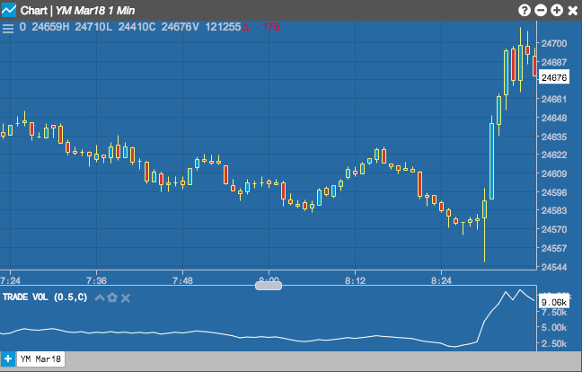

## Table of Contents

## What is the Trade Volume Index (TVI)?

The Trade Volume Index (TVI) is a technical indicator used by traders to understand the flow of money into and out of a security. It focuses on the volume of trades rather than the price, helping traders see if money is moving into or out of a stock. The TVI increases when the price of a security goes up and the volume is higher than the previous period. If the price goes down and the volume is higher, the TVI decreases. This helps traders spot trends and possible changes in the market.

TVI is useful because it can show when big investors, often called "smart money," are buying or selling. If the TVI is going up while the price is going down, it might mean that smart money is buying the security, expecting the price to go up later. On the other hand, if the TVI is going down while the price is going up, it could mean that smart money is selling, expecting the price to drop. By watching the TVI, traders can make better decisions about when to buy or sell a security.

## Why is the Trade Volume Index important in trading?

The Trade Volume Index (TVI) is important in trading because it helps traders understand where the money is moving. It looks at the volume of trades, not just the price. This can show if big investors, called "smart money," are buying or selling a stock. If the TVI is going up, it means more money is coming into the stock. If it's going down, money is leaving the stock. This information can help traders decide if they should buy or sell.

TVI can also help traders spot trends and possible changes in the market. For example, if the TVI is going up but the price is going down, it might mean that smart money is buying the stock, expecting the price to go up later. On the other hand, if the TVI is going down but the price is going up, it could mean that smart money is selling, expecting the price to drop. By watching the TVI, traders can get a better idea of what might happen next in the market and make smarter trading choices.

## How does the Trade Volume Index differ from other volume indicators?

The Trade Volume Index (TVI) is different from other [volume](/wiki/volume-trading-strategy) indicators because it focuses on the money flow into and out of a security. Other volume indicators, like the On-Balance Volume (OBV), mainly count the number of shares traded. TVI looks at whether the price is going up or down and then adjusts the volume based on that. If the price goes up and the volume is higher than the last period, TVI goes up. If the price goes down and the volume is higher, TVI goes down. This way, TVI shows if money is coming in or going out of the stock.

Another difference is that TVI can help traders see what big investors, or "smart money," are doing. Other volume indicators might just show that a lot of trading is happening, but they don't always tell you if it's buying or selling. With TVI, if it's going up while the price is going down, it might mean smart money is buying, expecting the price to rise later. If TVI is going down while the price is going up, it could mean smart money is selling, expecting the price to fall. This makes TVI a useful tool for understanding market trends and making trading decisions.

## What is the basic formula used to calculate the Trade Volume Index?

The Trade Volume Index (TVI) is calculated by looking at the price and volume of trades. If the price of a stock goes up from the last trade and the volume is higher than the last period, you add the volume to the TVI. If the price goes down from the last trade and the volume is higher than the last period, you subtract the volume from the TVI. If the volume is the same or lower than the last period, you don't change the TVI.

This simple formula helps traders see if money is coming into or going out of a stock. If the TVI is going up, it means more money is flowing into the stock. If the TVI is going down, it means money is leaving the stock. By watching these changes, traders can get a better idea of what big investors, or "smart money," are doing and make better trading decisions.

## Can you explain the role of price movement in the calculation of TVI?

The role of price movement in calculating the Trade Volume Index (TVI) is really important. TVI looks at both the price and the volume of trades. If the price of a stock goes up from the last trade and the volume is higher than the last period, you add the volume to the TVI. This means that when the price is going up and more people are trading, the TVI goes up too. It shows that money is coming into the stock.

On the other hand, if the price goes down from the last trade and the volume is higher than the last period, you subtract the volume from the TVI. This means that when the price is going down and more people are trading, the TVI goes down. It shows that money is leaving the stock. If the volume is the same or lower than the last period, no matter if the price goes up or down, you don't change the TVI. This way, TVI helps traders see if big investors are buying or selling the stock.

## How does the TVI adjust for accumulation and distribution?

The TVI helps traders see if big investors are buying or selling a stock by looking at how the price and volume change. When the price goes up and the volume is higher than before, the TVI goes up too. This means more money is coming into the stock, showing accumulation. It's like more people want to buy the stock, so the TVI gets bigger to show that.

On the other hand, if the price goes down and the volume is higher than before, the TVI goes down. This means money is leaving the stock, showing distribution. It's like more people want to sell the stock, so the TVI gets smaller to show that. By watching these changes, traders can see if the stock is being bought up or sold off by big investors.

## What are the common time frames used when applying the TVI?

When traders use the Trade Volume Index (TVI), they often look at different time frames to see how money is moving in and out of a stock. Some traders like to use short time frames, like minutes or hours, to make quick decisions. This can be helpful for day traders who want to see what's happening right now and make fast trades.

Other traders might use longer time frames, like days or weeks, to see bigger trends. This can be useful for people who hold onto stocks for a longer time and want to understand how the stock is doing over time. By choosing the right time frame, traders can use the TVI to make better choices based on what they're looking for in the market.

## How can traders use the TVI to identify potential buy or sell signals?

Traders can use the Trade Volume Index (TVI) to spot good times to buy or sell a stock by watching how it moves with the price. If the TVI is going up while the price is going down, it might be a good time to buy. This means that even though the price is lower, more people are buying the stock, and big investors might think the price will go up soon. So, seeing the TVI go up when the price is going down can be a signal to buy the stock.

On the other hand, if the TVI is going down while the price is going up, it might be a good time to sell. This means that even though the price is higher, more people are selling the stock, and big investors might think the price will go down soon. So, seeing the TVI go down when the price is going up can be a signal to sell the stock. By keeping an eye on the TVI and comparing it to the price, traders can make smarter choices about when to buy or sell.

## What are the limitations of using the Trade Volume Index in trading?

Using the Trade Volume Index (TVI) in trading can be helpful, but it has some limitations. One big problem is that TVI can give false signals. Sometimes, the TVI might go up or down, but the price of the stock doesn't move the way you expect. This can trick traders into buying or selling at the wrong time. Also, TVI is just one tool. It doesn't tell the whole story about what's happening in the market. Traders need to use other tools and information to make good choices.

Another limitation is that TVI works best in markets with a lot of trading. If a stock doesn't have much trading, the TVI might not be very useful. It can be hard to see clear trends in the TVI when there isn't enough volume. Plus, TVI can be affected by things like news or big events that change how people trade. So, traders need to be careful and not rely only on TVI when making decisions.

## How can the TVI be combined with other technical indicators for better results?

Traders can get better results by using the TVI along with other technical indicators. One way to do this is by using the TVI with the Relative Strength Index (RSI). The RSI helps traders see if a stock is overbought or oversold. If the TVI is going up and the RSI shows the stock is oversold, it might be a good time to buy. On the other hand, if the TVI is going down and the RSI shows the stock is overbought, it might be a good time to sell. By looking at both indicators, traders can make better choices.

Another way to use the TVI is with moving averages. Moving averages help smooth out the price data and show the overall trend. If the TVI is going up and the price is above the moving average, it can be a strong signal to buy. If the TVI is going down and the price is below the moving average, it can be a strong signal to sell. Combining the TVI with moving averages can help traders see both the money flow and the price trend, making their trading decisions more accurate.

## What are some advanced techniques for optimizing the TVI calculation?

One way to make the TVI calculation better is by using different time frames. Instead of just looking at one time frame, traders can use multiple time frames like minutes, hours, days, or weeks. This helps them see short-term and long-term trends at the same time. By comparing the TVI across different time frames, traders can get a better idea of where the money is moving and make smarter decisions. For example, if the TVI is going up on both short and long time frames, it might be a very strong signal to buy.

Another advanced technique is to adjust the TVI calculation based on market conditions. Sometimes, the market can be very busy with lots of trading, and other times it can be quiet. Traders can change how they calculate the TVI to fit these different conditions. For example, they might use a shorter time frame during busy times to catch quick changes in money flow, and a longer time frame during quiet times to see bigger trends. By making these adjustments, traders can make the TVI more useful and get better results from their trading.

## Can you provide case studies or examples where the TVI was effectively used in trading decisions?

In one case, a trader named Sarah used the TVI to make a smart trading decision. She was watching a stock that had been going down in price for a few days. But when she looked at the TVI, she saw that it was starting to go up. This told her that even though the price was lower, more people were buying the stock. Sarah decided to buy the stock because the TVI suggested that big investors, or "smart money," were starting to buy it. A few days later, the price started to go up, and Sarah made a good profit from her trade.

In another example, a trader named Mike used the TVI along with the RSI to make a trading decision. He noticed that the price of a stock was going up, but the TVI was going down. At the same time, the RSI showed that the stock was overbought. This combination of signals told Mike that even though the price was high, more people were selling the stock, and it might be a good time to sell. Mike sold his shares and avoided a drop in the stock price that happened soon after. By using the TVI and RSI together, Mike was able to make a smart decision and protect his investment.

## References & Further Reading

[1]: Elder, A. (1993). ["Trading for a Living: Psychology, Trading Tactics, Money Management."](https://www.amazon.com/Trading-Living-Psychology-Tactics-Management/dp/0471592242) John Wiley & Sons.

[2]: Aronson, D. R. (2007). ["Evidence-Based Technical Analysis: Applying the Scientific Method and Statistical Inference to Trading Signals."](https://onlinelibrary.wiley.com/doi/book/10.1002/9781118268315) John Wiley & Sons.

[3]: Chan, E. (2009). ["Quantitative Trading: How to Build Your Own Algorithmic Trading Business."](https://github.com/ftvision/quant_trading_echan_book) John Wiley & Sons.

[4]: Murphy, J. J. (1999). ["Technical Analysis of the Financial Markets: A Comprehensive Guide to Trading Methods and Applications."](https://archive.org/details/technicalanalysi0000murp) New York Institute of Finance.

[5]: Pring, M. J. (2002). ["Technical Analysis Explained: The Successful Investor's Guide to Spotting Investment Trends and Turning Points."](https://www.amazon.com/Technical-Analysis-Explained-Fifth-Successful/dp/0071825177) McGraw-Hill.

[6]: Prado, M. L. de. (2018). ["Advances in Financial Machine Learning."](https://www.amazon.com/Advances-Financial-Machine-Learning-Marcos/dp/1119482089) Wiley.

[7]: Jansen, S. (2018). ["Machine Learning for Algorithmic Trading."](https://github.com/stefan-jansen/machine-learning-for-trading) Packt Publishing.