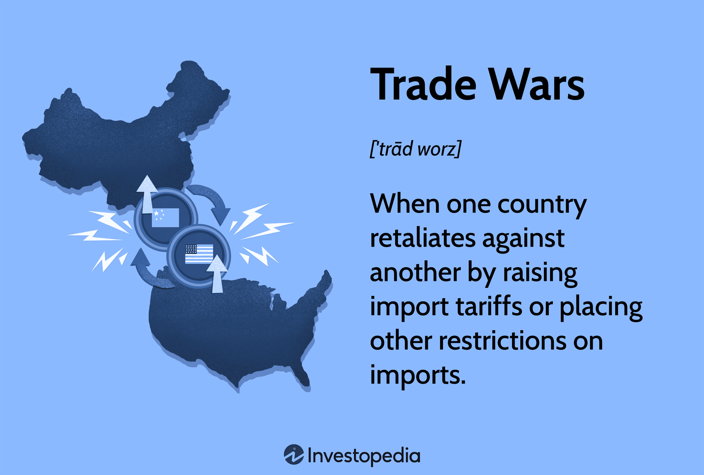

The historical context of U.S.-China relations is foundational to understanding the complex economic interactions between these two global powers. Since the normalization of diplomatic relations in 1979, initiated by President Richard Nixon's visit to China in 1972, bilateral economic ties have deepened significantly. The United States and China have evolved into two of the largest economies worldwide, with their trade relationships becoming integral to global economic stability. The bilateral trade supported by various trade agreements and investments has fostered economic growth and interdependence, contributing to significant portions of global Gross Domestic Product (GDP).

Economic ties between the U.S. and China are of paramount importance not only due to their bilateral nature but also because they influence global markets. The U.S. relies heavily on imports from China for consumer goods, while China benefits from American technologies and agricultural products. This symbiotic relationship influences global supply chains and affects international economic policies. Disruptions in this economic interplay, therefore, have widespread implications beyond national borders.

Trade wars, characterized by countries imposing tariffs or other barriers on imports from trading partners, disrupting traditional trade balances, are critical phenomena with far-reaching consequences. The U.S.-China trade war, which saw fluctuations in tariffs on billions of dollars' worth of goods, exemplifies how such conflicts exacerbate market uncertainties and contribute to economic volatility. Trade wars affect global supply chains, alter consumer prices, and can lead to shifts in global economic power dynamics. The trade war between the United States and China resulted in economic tensions that reverberated across global markets, influencing investment flows and currency valuations.

Algorithmic trading, defined as the use of computer algorithms to automate trading processes, plays a pivotal role in modern financial markets, especially during periods of economic turmoil such as trade wars. By executing trades at high speeds based on pre-set criteria, algorithmic trading can amplify market volatility as massive trades occur within fractions of a second in response to economic news or policy changes. This can lead to rapid market movements and liquidity shifts, further complicating economic conflicts like trade wars. Its influence on market efficiency and stability makes algorithmic trading a critical factor in present-day economic conflicts.

This article explores the intersecting elements of U.S.-China economic relations, trade wars, and algorithmic trading. It aims to provide insights into the historical context and evolution of bilateral economic ties, assess the economic impact of trade conflicts, and analyze how algorithmic trading influences and reacts to these disputes. By understanding these components, we can better comprehend the complexities and future trajectory of international economic strategies and relations.

## Table of Contents

## Historical Context of U.S.-China Economic Relations

The historical context of U.S.-China economic relations is characterized by a dynamic interplay of trade, politics, and policy changes over the decades. The evolution of trade relations between the two countries provides a backdrop for understanding their intricate economic engagements.

The initial economic interactions between the U.S. and China were limited and primarily centered around trade goods such as tea, silk, and porcelain, dating back to the late 18th and early 19th centuries. However, it was in the late 20th century that significant economic relationships began to take shape. The landmark in U.S.-China economic history was the opening of China under the leadership of Deng Xiaoping in 1978. This marked the beginning of economic reforms that aimed to integrate China into the global economy. The United States played a pivotal role in encouraging China's shift towards market-based policies, which later paved the way for China’s economic emergence on the global stage.

Several key events have notably shaped the bilateral economic policies between the U.S. and China. In 1979, the countries established formal diplomatic relations, marking a significant turning point that enabled trade opportunities and investment flows. Subsequently, China was granted Most Favored Nation status, which facilitated lower tariffs and boosted economic exchanges.

A major milestone in U.S.-China trade relations was China's entry into the World Trade Organization (WTO) in 2001. This allowed China to fully participate in global commerce by adhering to international trade norms. The U.S. viewed China's accession to the WTO as a means to open China's markets further and ensure a predictable trade environment. Despite the expectations, issues regarding intellectual property rights, trade imbalances, and market access have persisted, leading to tensions.

Geopolitical shifts and domestic political climates have significantly influenced economic strategies between the two nations. For example, the U.S. administrations have alternated between policies of engagement and containment, depending on their economic and strategic priorities. The Obama administration's "Pivot to Asia" strategy emphasized engagement and economic partnerships, while the Trump administration adopted a more confrontational approach, resulting in the initiation of high tariffs and trade disputes.

International organizations have played a crucial role in mediating U.S.-China economic relations. The WTO has served as a platform for dispute resolution, though its effectiveness has often been critiqued amid rising protectionism. Organizations such as the International Monetary Fund (IMF) and World Bank have facilitated financial dialogues, promoting transparency and addressing economic disparities.

The historical context sets the stage for ongoing and future economic engagements between the United States and China. As both nations navigate complex global economic landscapes, understanding their historical economic relations becomes essential in assessing current challenges and opportunities.

## The Anatomy of Trade Wars

A trade war is characterized as a situation in which countries impose tariffs or other trade barriers on each other in retaliation for economic disputes. Such conflicts arise when governments aim to protect domestic industries from foreign competition, rectify trade imbalances, or punish countries for certain economic policies. The ramifications of trade wars are extensive, affecting not only the countries directly involved but also the global economic environment.

### Causes and Triggers of Trade Wars Between Major Economies

Trade wars can be instigated by various factors: protectionist policies, geopolitical tensions, and trade deficits. Nations may resort to tariffs, quotas, or subsidies to shield local industries from foreign competition, believing this to support national economic independence. Geopolitical tensions often act as catalysts, where trade restrictions become tools of political leverage. Furthermore, persistent trade imbalances can provoke countries to impose trade barriers as a means of forcing renegotiations of trade terms.

### Case Studies of U.S.-China Trade Conflicts

The trade disputes between the United States and China serve as illustrative examples of trade wars. Beginning around 2018, the U.S. imposed tariffs on billions of dollars’ worth of Chinese goods. Initiated to address concerns over intellectual property theft and unfair trade practices, these tariffs covered products ranging from steel to consumer electronics. In response, China retaliated with its tariffs on American exports, particularly targeting agricultural products and automobiles.

### Economic and Political Consequences of Prolonged Trade Conflicts

Prolonged trade conflicts can generate significant economic disruptions. For instance, businesses reliant on international supply chains face increased costs due to tariffs, which can lead to reduced profit margins and higher prices for consumers. Additionally, trade wars create uncertainty in the markets, affecting investment decisions and potentially slowing economic growth.

Politically, trade wars can alter diplomatic relationships and exacerbate tensions, as nations may view tariffs as aggressive economic strategies. Moreover, they can foster nationalistic sentiments, affecting domestic politics and international cooperation.

### Perspectives on How Trade Wars Have Reshaped Global Trade Dynamics

Trade wars have played a role in reshaping global trade dynamics by prompting countries to reassess their trade strategies and alliances. For instance, some nations have sought to diversify their trade partnerships to mitigate reliance on historically dominant economies. New trade agreements, like the Regional Comprehensive Economic Partnership (RCEP) among Asia-Pacific nations, reflect shifting alliances and efforts to circumvent traditional trade barriers.

Moreover, trade wars have accelerated discussions on reforming trade organizations such as the World Trade Organization (WTO), pushing for more effective dispute resolution mechanisms and updated trade rules that reflect contemporary economic realities. These changes hint at a future where trade policies are increasingly governed by multilateral negotiations rather than bilateral conflicts.

In conclusion, trade wars, particularly those between economic giants like the U.S. and China, reveal the complexities and far-reaching effects of protectionist policies. These conflicts serve as reminders of the interconnected nature of global economies and the delicate balance required to maintain fair and open trade.

## Economic Impacts of U.S.-China Trade Wars

The U.S.-China trade wars have had significant economic repercussions not just on the two countries involved, but also on global markets. This section explores these impacts, analyzing various industries and sectors, supply chains, consumer prices, and long-term economic projections.

### Analysis of the Economic Toll on Both Nations and Global Markets

The trade wars have imposed substantial tariffs, which acted as a direct tax on imports, inadvertently increasing the cost of goods. For the U.S., this led to a notable rise in costs for industries relying on Chinese imports, including electronics, machinery, and clothing. Conversely, China faced barriers to its exports, making its goods less competitive in the U.S. market. This initial disruption expanded to global markets, affecting trade flows and economic stability worldwide.

### Effects on Specific Industries and Sectors

Several industries have experienced pronounced effects due to increased tariffs and trade restrictions. The agricultural sector in the U.S. has been particularly impacted, as China imposed tariffs on American soybeans, pork, and other products. Consequently, U.S. farmers experienced declining revenues and were often forced to seek alternative markets. On the other hand, Chinese technology sectors faced challenges due to restrictions on key components imported from the U.S., affecting production and technological development.

### Implications for Supply Chains and Global Commerce

The trade wars prompted companies to reevaluate their supply chains, seeking diversification to mitigate risks associated with tariff hikes. Many firms began relocating manufacturing to countries with lower tariffs, such as Vietnam and Mexico. This shift altered global commerce by reallocating trade routes and investment flows, challenging the existing world trade order. Furthermore, it heightened the need for businesses to adopt flexible, resilient supply chain strategies to maintain competitive advantage and reduce susceptibility to political tensions.

### Changes in Consumer Prices and Product Availability

The introduction of tariffs led directly to increased consumer prices for affected goods. In the U.S., consumers saw price hikes in electronics, clothing, and household goods—products often imported from China. Similarly, Chinese consumers faced higher prices for American goods like automobiles and luxury products. Product availability also suffered as companies struggled to maintain inventory levels amid changing trade policies and logistical hurdles.

### Long-term Economic Impacts and Projections for the Future

Looking ahead, the continuation of these trade conflicts could foster a more fragmented global economy. The imposition of sustained tariffs serves as a catalyst for decreased global trade efficiency. Long-term projections indicate a potential reduction in global GDP growth if trade tensions persist, as highlighted in economic modeling studies. Countries may increasingly adopt protectionist policies, which could lead to further economic isolation.

Yet, these trade wars have also incentivized innovation in international trade strategy and technology. Automation, AI, and blockchain technology are poised to enhance supply chain resilience, reduce trade costs, and increase transparency. However, the success of these solutions hinges on policymakers fostering conducive environments for technological advancements while mitigating the adversarial effects of trade wars.

In conclusion, while the U.S.-China trade wars have inflicted economic strains across multiple dimensions, they have also underscored the necessity for strategic adaptation in international commerce. The future trajectory will likely depend on the ability of nations and businesses to navigate these challenges through cooperation, technological integration, and policy reform.

## Role of Algorithmic Trading in Economic Conflicts

Algorithmic trading, a modern innovation in financial markets, leverages computer algorithms to automate trading decisions. These algorithms use quantitative models and data analysis to determine the best times to buy or sell securities, often executing trades at speeds unachievable by human traders. Algorithmic trading can be categorized into various strategies, including market-making, [arbitrage](/wiki/arbitrage), and trend-following, among others. A major subset of [algorithmic trading](/wiki/algorithmic-trading) is high-frequency trading ([HFT](/wiki/high-frequency-trading-strategies)), which involves executing a large number of orders at exceptionally rapid speeds.

High-frequency trading can significantly amplify market [volatility](/wiki/volatility-trading-strategies), particularly during periods of economic conflict such as trade wars. By aiming to exploit minor price discrepancies across assets, HFT can lead to rapid price movements as algorithms react to market news, potentially causing significant market swings. During trade wars, the influx of breaking news and policy announcements can create an environment ripe for volatility, with algorithms quickly adjusting positions based on perceived changes to the economic landscape.

The impact of algorithmic trading on market efficiency and [liquidity](/wiki/liquidity-risk-premium) is multifaceted. On one hand, it can enhance liquidity by increasing the [volume](/wiki/volume-trading-strategy) of trades, narrowing bid-ask spreads, and enabling more efficient price discovery. On the other hand, in times of heightened economic conflict, the same algorithms that improve liquidity can also contribute to liquidity crises. Flash crashes, where asset prices plummet and then rapidly recover, often involve HFT strategies withdrawing liquidity as a defensive measure.

Several case studies highlight the influence of algorithmic trading in response to trade war announcements. For instance, during major announcements in the U.S.-China trade conflict, markets have experienced sharp fluctuations as algorithms parsed statements from policymakers to adjust trading strategies. Such reactions can exacerbate market moves, leading to short-term dislocations in prices.

Regulatory challenges arise in managing the risks posed by algorithmic trading during economic conflicts. Regulators face the task of ensuring market stability without stifling innovation. Measures to mitigate the risks include implementing circuit breakers, which temporarily halt trading on excessive market moves, and enhancing transparency through reporting requirements for algorithmic strategies.

In summary, while algorithmic trading and HFT bring benefits of speed and efficiency, they also pose significant risks, especially during periods of economic uncertainty like trade wars. Balancing innovation with regulation remains crucial to maintaining orderly and efficient markets.

## Strategies for Navigating Economic Conflicts

Diplomatic and policy approaches to resolving trade tensions involve a multifaceted strategy, often combining negotiation, tariffs, and non-tariff barriers adjustment. Diplomatic efforts prioritize dialogue through bilateral meetings or multilateral forums like the World Trade Organization (WTO). Policy approaches may include revamping trade agreements to balance trade deficits and protect intellectual property, which is often a sticking point in U.S.-China relations. These efforts aim to foster a stable environment that is conducive to sustained economic growth for both nations.

Business strategies play a critical role in mitigating the impact of economic conflicts. Companies can diversify their supply chains to reduce dependence on any single country, thereby minimizing risks associated with trade wars. This can involve shifting production to other low-cost countries or increasing automation to offset increased labor costs. Additionally, businesses can hedge against currency fluctuations through financial instruments, ensuring stable pricing despite volatile international markets.

International cooperation is essential in managing global economic risks, especially given the interconnectedness of the global economy. Organizations like the International Monetary Fund (IMF) and WTO facilitate dialogue and help establish rules-based trade systems to prevent trade conflicts from escalating. These organizations can mediate disputes and offer frameworks for cooperation, ensuring that economic conflicts are resolved with minimal disruption to the global economy.

Technological solutions also enhance trade efficiency and resilience, with innovations such as blockchain providing greater transparency in supply chains. Blockchain can track goods from origin to destination, reducing fraud and improving compliance with international trade regulations. Artificial intelligence (AI) and [machine learning](/wiki/machine-learning) algorithms can forecast demand and optimize logistics, helping businesses adapt quickly to changing trade landscapes.

Future U.S.-China economic engagements are likely to focus on areas of mutual benefit, such as green technologies and digital trade. Both nations have much to gain from cooperation in reducing carbon emissions and developing sustainable energy sources. Additionally, as digital economies grow, establishing fair rules for digital trade and protecting data privacy will be critical. As these efforts unfold, they may redefine the parameters of economic cooperation, paving the way for more stable bilateral relations. 

In summary, navigating economic conflicts requires a combination of diplomatic finesse, strategic business planning, international collaboration, and technological innovation to create resilient and adaptive trading systems that can withstand the pressures of a dynamic global market.

## Conclusion

This article explored the multifaceted nature of U.S.-China economic relations, emphasizing the historical context, key events, and the associated economic impacts. Throughout history, trade has been a cornerstone of the bilateral relationship, marked by evolving policies and shifting political climates. The frequent occurrence of trade wars has not only strained bilateral ties but also influenced global trade dynamics. These conflicts have imposed significant economic tolls on both nations and the wider global markets, affecting industries, consumer prices, and supply chain operations.

Reflecting on current U.S.-China relations, challenges such as mutual distrust and economic competition persist. Nonetheless, opportunities for collaboration exist, especially in areas like technology and renewable energy. The trajectory of future economic engagements between the U.S. and China will likely depend on diplomatic efforts, policy adjustments, and the ability to balance competition with cooperation.

Technological advancements, particularly algorithmic trading, play dual roles in economic conflicts. While they can exacerbate market volatility, they also offer potential solutions for enhancing market efficiency. Properly managed, technology could be pivotal in preventing escalations in trade tensions and fostering economic stability.

This leads to a call to action for policymakers, businesses, and investors. Navigating the complexities of trade wars and harnessing the potential of algorithmic trading necessitates comprehensive strategies. Policymakers must prioritize diplomatic channels and policy frameworks that encourage stability and collaboration. Businesses should focus on adapting supply chains and leveraging technology to remain resilient. Investors are encouraged to support ventures that not only promise returns but also contribute to sustainable economic relations between the U.S. and China. Addressing these intricate challenges could pave the way for a more balanced and cooperative international trade landscape.

## References & Further Reading

[1]: Bown, C. P. (2020). ["The US-China Trade War and Phase One Agreement."](https://www.sciencedirect.com/science/article/abs/pii/S0161893821000363) Peterson Institute for International Economics.

[2]: Autor, D., Dorn, D., & Hanson, G. H. (2016). ["The China Shock: Learning from Labor Market Adjustment to Large Changes in Trade."](https://www.nber.org/papers/w21906) Annual Review of Economics, 8(1), 205-240.

[3]: Irwin, D. A. (2005). ["The Rise of US Anti-Dumping Activity in Historical Perspective."](https://onlinelibrary.wiley.com/doi/full/10.1111/j.1467-9701.2005.00698.x) National Bureau of Economic Research Working Paper No. 10582.

[4]: Lopez de Prado, M. (2018). ["Advances in Financial Machine Learning."](https://www.amazon.com/Advances-Financial-Machine-Learning-Marcos/dp/1119482089) Wiley.

[5]: Porter, M. E. (1990). ["The Competitive Advantage of Nations."](https://hbr.org/1990/03/the-competitive-advantage-of-nations) Harvard Business Review, March-April 1990.

[6]: Krugman, P. R. (1993). ["What Do Undergrads Need to Know About Trade?"](https://www.jstor.org/stable/pdf/2117633.pdf) The American Economic Review, 83(2), 23-26.

[7]: Carlyle, H. B. (Direct ed.) (2020). ["Algorithmic Trading and DMA: An Introduction to Direct Access Trading Strategies."](https://books.google.com/books/about/Algorithmic_Trading_DMA.html?id=xgRcYgEACAAJ) 4Myeloma Press. 

[8]: WTO (2019). ["World Trade Report: The Future of Global Value Chains."](https://www.worldbank.org/en/topic/trade/publication/global-value-chain-development-report-2019) World Trade Organization.