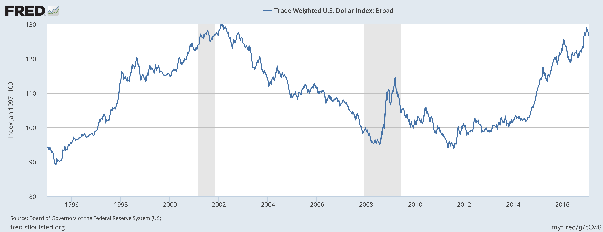

## Table of Contents

## What is the trade-weighted dollar?

The trade-weighted dollar is a way to measure the value of the U.S. dollar compared to other currencies. It takes into account how much the U.S. trades with other countries. This means that countries the U.S. trades with a lot, like China or Canada, have a bigger impact on the trade-weighted dollar than countries the U.S. trades with less.

This measure helps economists understand how strong or weak the dollar is overall. If the trade-weighted dollar goes up, it means the dollar is getting stronger compared to other currencies. This can make U.S. exports more expensive for other countries. If it goes down, the dollar is getting weaker, and U.S. exports become cheaper for other countries to buy.

## Why is the trade-weighted dollar important for international trade?

The trade-weighted dollar is important for international trade because it shows how the value of the U.S. dollar changes compared to other countries' currencies. This matters a lot because when the dollar is strong, it can make things made in the U.S. more expensive for people in other countries to buy. On the other hand, if the dollar is weak, U.S. products become cheaper for foreigners, which can help U.S. companies sell more abroad.

This measure also helps businesses and governments plan better. If they know the dollar is getting stronger or weaker, they can adjust their prices or strategies. For example, if the dollar is strong, a U.S. company might need to lower its prices to keep selling to other countries. Or, if the dollar is weak, it might be a good time for the U.S. to export more because their products are cheaper for others to buy. Understanding the trade-weighted dollar helps everyone involved in international trade make smarter decisions.

## How is the trade-weighted dollar calculated?

The trade-weighted dollar is calculated by looking at how much the U.S. trades with other countries and then using that information to figure out how strong or weak the dollar is compared to other currencies. Each country's currency is given a weight based on how much the U.S. trades with that country. For example, if the U.S. trades a lot with China, the Chinese yuan will have a bigger weight than a currency from a country the U.S. doesn't trade with as much.

To calculate it, you start by choosing a group of currencies from countries that the U.S. trades with. Then, you use the weights to create an index. This index shows the average value of the dollar compared to all those other currencies, taking into account how important each country is for U.S. trade. If the index goes up, it means the dollar is getting stronger compared to those other currencies, and if it goes down, the dollar is getting weaker.

## What currencies are included in the trade-weighted dollar index?

The trade-weighted dollar index usually includes currencies from countries that the U.S. trades with the most. This can include countries like Canada, Mexico, China, Japan, the United Kingdom, and the Eurozone countries. The specific list of currencies can change over time depending on how much trade happens between the U.S. and other countries.

Each currency in the index is given a weight based on how important that country is for U.S. trade. For example, if the U.S. trades a lot with China, the Chinese yuan will have a bigger weight than a currency from a country the U.S. doesn't trade with as much. This way, the index gives a good picture of how the dollar is doing compared to the currencies of the U.S.'s biggest trading partners.

## How does the trade-weighted dollar differ from other dollar indexes?

The trade-weighted dollar index is different from other dollar indexes because it focuses on how much the U.S. trades with other countries. It gives more importance to the currencies of countries that the U.S. trades with a lot. For example, if the U.S. trades a lot with China, the Chinese yuan will have a bigger effect on the trade-weighted dollar than it would in other indexes. This makes the trade-weighted dollar a good way to see how the value of the dollar affects U.S. trade.

Other dollar indexes might not take trade into account as much. For instance, the U.S. Dollar Index (DXY) only looks at a small group of currencies like the euro, Japanese yen, and British pound, and it doesn't change the importance of these currencies based on trade. This can make the DXY less useful for understanding how the dollar's value affects U.S. trade compared to the trade-weighted dollar. So, the trade-weighted dollar is more focused on trade and gives a clearer picture of how the dollar's value impacts the U.S. economy through trade.

## What impact does a rising trade-weighted dollar have on the U.S. economy?

When the trade-weighted dollar rises, it means the U.S. dollar is getting stronger compared to other countries' currencies. This can make things made in the U.S. more expensive for people in other countries to buy. As a result, U.S. companies might sell fewer products abroad because their prices go up. This can hurt U.S. businesses that depend a lot on exports, like farmers or manufacturers. They might have to lower their prices or find new ways to sell their products to keep their business going.

On the other hand, a stronger dollar can be good for the U.S. in other ways. It makes things from other countries cheaper for Americans to buy. This can help people in the U.S. save money on imported goods like electronics or cars. It can also make it cheaper for U.S. companies to buy things they need from other countries. But overall, a rising trade-weighted dollar can make it harder for the U.S. to sell things to other countries, which can affect jobs and the economy.

## What impact does a falling trade-weighted dollar have on the U.S. economy?

When the trade-weighted dollar falls, it means the U.S. dollar is getting weaker compared to other countries' currencies. This makes things made in the U.S. cheaper for people in other countries to buy. As a result, U.S. companies can sell more products abroad because their prices go down. This can be good for U.S. businesses that depend a lot on exports, like farmers or manufacturers. They might be able to sell more and make more money, which can help the economy by creating more jobs and boosting growth.

However, a weaker dollar can also make things from other countries more expensive for Americans to buy. This means that imported goods like electronics or cars can cost more. It can also make it more expensive for U.S. companies to buy things they need from other countries. So while a falling trade-weighted dollar can help U.S. exports, it can also make life more expensive for people in the U.S. and increase costs for some businesses.

## How do changes in the trade-weighted dollar affect U.S. exporters and importers?

When the trade-weighted dollar goes up, it means the dollar is stronger. This makes things made in the U.S. more expensive for people in other countries to buy. So, U.S. exporters, like farmers or companies that sell stuff abroad, might sell less because their prices are higher. They could lose money or have to lower their prices to keep selling. On the other hand, importers in the U.S. find it cheaper to buy things from other countries. This can be good for them because they can buy more for less money, which might help their business grow.

When the trade-weighted dollar goes down, the dollar is weaker. This makes U.S. products cheaper for people in other countries to buy. So, U.S. exporters can sell more because their prices are lower. They might make more money and help the U.S. economy grow by creating jobs. But for U.S. importers, a weaker dollar means things from other countries become more expensive. They might have to pay more for the things they need, which could hurt their business if they can't pass those costs onto their customers.

## Can you explain the historical trends of the trade-weighted dollar?

The trade-weighted dollar has gone through many ups and downs over the years. In the 1980s, the dollar was very strong. This was because the U.S. economy was doing well, and other countries wanted to buy U.S. dollars. But by the late 1980s, the dollar started to get weaker. This was partly because other countries started to do better, and they didn't need as many U.S. dollars. In the 1990s, the dollar got strong again, especially in the late 1990s when the U.S. had a lot of new technology and the economy was booming.

In the early 2000s, the trade-weighted dollar started to fall again. This was because the U.S. was buying a lot more stuff from other countries than it was selling, which made the dollar less valuable. By the mid-2000s, the dollar started to get a bit stronger again, but then the financial crisis in 2008 made it fall once more. After the crisis, the dollar slowly started to get stronger again, especially in the 2010s. But it's always going up and down because many things can change how strong or weak the dollar is compared to other countries' money.

## How do policymakers use the trade-weighted dollar in economic decision-making?

Policymakers use the trade-weighted dollar to help them make decisions about the economy. They look at how strong or weak the dollar is compared to other countries' money. This helps them see if U.S. products are too expensive or too cheap for people in other countries to buy. If the dollar is strong, they might worry that U.S. companies are having a hard time selling stuff abroad. They might try to help these companies by making it easier for them to borrow money or by finding new ways to sell their products.

On the other hand, if the dollar is weak, policymakers might be happy because U.S. companies can sell more things to other countries. But they also know that a weak dollar can make things from other countries more expensive for Americans to buy. So, they have to think about how to help people and businesses deal with higher prices. They might change interest rates or make other rules to try to keep the economy balanced and help everyone.

## What are the limitations and criticisms of the trade-weighted dollar as a measure?

The trade-weighted dollar is a good way to see how the U.S. dollar is doing compared to other countries' money, but it has some problems. One big problem is that it can be hard to pick the right currencies to include in the index. The U.S. trades with a lot of countries, and which ones are most important can change over time. If the index doesn't keep up with these changes, it might not show the real value of the dollar. Also, the weights given to each currency are based on trade, but trade can change a lot from year to year. This means the index might not always be up to date.

Another criticism is that the trade-weighted dollar only looks at trade, but there are other things that can affect how strong or weak the dollar is. For example, how much people from other countries want to invest in the U.S. can make the dollar stronger or weaker. The trade-weighted dollar doesn't take these things into account, so it might not give a full picture of the dollar's value. Critics say that because of these limitations, policymakers and businesses should use other measures too when making decisions about the economy.

## How do global economic events influence the trade-weighted dollar?

Global economic events can really change how strong or weak the trade-weighted dollar is. When other countries' economies are doing well, they might not need as many U.S. dollars. This can make the dollar weaker. For example, if China's economy grows a lot, people might want to use Chinese yuan more than U.S. dollars. Also, if there's a big problem in the world, like a financial crisis, people might want to buy U.S. dollars because they think it's safer. This can make the dollar stronger.

But it's not just about other countries' economies. Things like wars, big changes in oil prices, or even pandemics can shake up the world economy and affect the trade-weighted dollar. For example, if oil prices go up a lot, countries that need to buy oil might need more U.S. dollars to pay for it. This can make the dollar stronger. Or, if there's a big war, people might not want to trade as much, which can make the dollar weaker. So, many different global events can push and pull the trade-weighted dollar in different directions.

## What is the Trade-Weighted Dollar?

The trade-weighted dollar is an integral index that serves as a barometer for the value of the U.S. dollar in relation to a basket of foreign currencies. Unlike straightforward currency pair calculations—such as the EUR/USD exchange rate—this index offers a more comprehensive approach by considering the exchange rates of multiple currencies, each weighted according to its trade significance with the United States. This weighting approach lends more insight into the real-world impact of currency fluctuations on trade and economic competitiveness.

$$
\text{Trade-Weighted Dollar Index} = \sum \left( \frac{\text{Exchange Rate}_{i}}{\text{Base Year Rate}_{i}} \times \text{Trade Weight}_{i} \right)
$$

In the formula above, each currency $i$ contributes to the index based on its trade weight, which reflects the proportion of U.S. trade conducted with that currency's corresponding country. This index is invaluable in gauging the competitiveness and purchasing power of the U.S. dollar, especially in global trade scenarios. A higher index value indicates a stronger dollar, making U.S. exports more expensive and imports cheaper. Conversely, a lower index suggests a weaker dollar, potentially enhancing the competitiveness of U.S. exports and making imports pricier.

Understanding the trade-weighted dollar aids economists and traders in assessing broader economic impacts stemming from fluctuations in currency values. These assessments can influence decisions in areas ranging from policy formulation to investment strategies. Moreover, the index is subject to regular updates, reflecting dynamic changes in trade relationships and economies worldwide. Such updates ensure its relevance in providing an accurate snapshot of the U.S. dollar's status in the ever-evolving landscape of international trade.

## References & Further Reading

[1]: ["Advances in Financial Machine Learning"](https://www.amazon.com/Advances-Financial-Machine-Learning-Marcos/dp/1119482089) by Marcos Lopez de Prado

[2]: ["Evidence-Based Technical Analysis: Applying the Scientific Method and Statistical Inference to Trading Signals"](https://www.amazon.com/Evidence-Based-Technical-Analysis-Scientific-Statistical/dp/0470008741) by David Aronson

[3]: ["Machine Learning for Algorithmic Trading"](https://github.com/stefan-jansen/machine-learning-for-trading) by Stefan Jansen

[4]: ["Quantitative Trading: How to Build Your Own Algorithmic Trading Business"](https://www.amazon.com/Quantitative-Trading-Build-Algorithmic-Business/dp/1119800064) by Ernest P. Chan

[5]: Bergstra, J., Bardenet, R., Bengio, Y., & Kégl, B. (2011). ["Algorithms for Hyper-Parameter Optimization."](https://dl.acm.org/doi/10.5555/2986459.2986743) Advances in Neural Information Processing Systems 24.

[6]: ["The U.S. Dollar Index: Currency Markets and Economic Indicators"](https://www.marketwatch.com/investing/index/dxy) by the Federal Reserveoard of Governors.

[7]: ["Algorithmic and High-Frequency Trading"](https://www.cambridge.org/us/universitypress/subjects/mathematics/mathematical-finance/algorithmic-and-high-frequency-trading) by Álvaro Cartea, Sebastián Jaimungal, and José Penalva.

[8]: ["Foreign Exchange and Money Markets"](https://www.investopedia.com/terms/forex/f/foreign-exchange-markets.asp) by the Bank for International Settlements.

[9]: Federal Reserve Bank of New York. ["Markets & Policy Implementation: Trade-Weighted Dollar."](https://www.newyorkfed.org/markets/domestic-market-operations/monetary-policy-implementation)

[10]: Golemi, S. (2020). ["Algorithmic Trading and Market Dynamics: A Review."](https://www.semanticscholar.org/paper/Algorithmic-Trading-and-AI%3A-A-Review-of-Strategies-Addy-Ajayi-Nifise/df39f3b7a0a96c268c41e11a41ee1a0c399363f3) Journal of Operations Management.