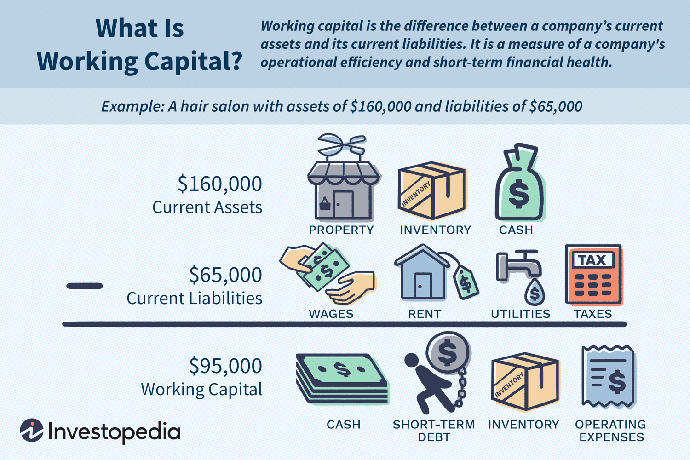

In the fast-paced world of finance, effective management and calculation of working capital are vital for the success and sustainability of any business. Working capital, fundamentally, is the difference between a company's current assets and current liabilities, representing the liquidity available for day-to-day operations. However, trade working capital narrows this focus, pinpointing the operating liquidity directly connected to routine business activities. By honing in on trade working capital, businesses can gain a more precise understanding of their immediate financial health, isolating elements that directly influence operational efficiency and short-term obligations.

This precision is not merely about accounting accuracy; it's about enabling informed financial decisions. Indeed, the capacity to meet short-term obligations without resorting to external funding sources can significantly influence a company's operational strategy and growth potential. In this context, trade working capital serves as a crucial metric for financial management, guiding businesses in optimizing their internal processes.



This article will explore various aspects of trade working capital, from its calculation methods to its broader implications for financial management. Additionally, we will examine how trade working capital intersects with algorithmic trading—a modern financial trend that relies heavily on liquidity. Understanding this connection provides companies with insights into how capital management strategies can be aligned with technological advancements in trading, thus enhancing their competitive edge in today's dynamic market environment.

## Table of Contents

## Understanding Trade Working Capital

Trade working capital, often abbreviated as TWC, is a critical financial metric that represents the difference between the current assets and current liabilities directly tied to a company's routine business operations. It provides insight into a company's operational liquidity, focusing on assets and liabilities that fluctuate due to daily business activities. Unlike general working capital, which includes all current assets and liabilities, trade working capital offers a more targeted view by excluding non-operational items. This distinction allows companies to more accurately gauge their short-term financial health related to core operational activities.

To break it down, trade working capital can be mathematically expressed as:

$$
\text{Trade Working Capital} = (\text{Trade Receivables} + \text{Inventories}) - \text{Trade Payables}
$$

This formula ensures only those items that arise from everyday operations are considered. Trade receivables refer to the amounts owed by customers for goods and services delivered, while inventories encompass raw materials, work-in-progress, and finished goods ready for sale. Trade payables represent obligations the company owes to suppliers for materials and services acquired.

Companies leverage their trade working capital to determine their capacity to meet short-term liabilities using resources generated internally rather than seeking external funding. A positive trade working capital indicates that current operational assets surpass the operational liabilities, suggesting a sound [liquidity](/wiki/liquidity-risk-premium) position. Conversely, a negative trade working capital might signal potential liquidity challenges, highlighting the need for managerial intervention.

For instance, if a company has $500,000 in trade receivables, $300,000 in inventories, and $400,000 in trade payables, its trade working capital would be:

$$
\text{TWC} = (\$500,000 + \$300,000) - \$400,000 = \$400,000
$$

This positive trade working capital suggests that the company possesses adequate liquidity to support its day-to-day operational expenses. Understanding and managing trade working capital is integral to making informed financial decisions, ensuring ongoing operational capability, and maintaining the financial stability needed to capitalize on growth opportunities.

## Importance of Working Capital Management

Working capital management is a critical aspect of financial strategy that influences a company's ability to operate efficiently and profitably. By managing working capital effectively, a business ensures it has enough liquidity to maintain daily operations, meet short-term obligations, and seize potential growth opportunities. This financial management process involves closely monitoring and adjusting components like accounts receivable, accounts payable, and inventory levels.

Positive working capital occurs when a company's current assets exceed its current liabilities, indicating sufficient resources to cover short-term debts and operational expenses. This financial cushion allows businesses to invest in opportunities that can drive growth without the interruption of cash flow issues. With positive working capital, a company is well-positioned to support new projects, expand operations, and enhance its market competitiveness.

Effective working capital management also mitigates risk by preventing financial crises that may arise from sudden cash flow shortages. Businesses can anticipate and respond to financial challenges more proactively, reducing the likelihood of borrowing at unfavorable terms. This proactive approach can lead to reduced borrowing costs, as companies with stable cash flows and manageable working capital require less external funding and are often perceived as lower risk by lenders and investors.

Moreover, efficient working capital management contributes to overall financial health by optimizing the use of resources. It allows businesses to reduce idle inventory, accelerate receivable collections, and strategically delay payable payments without harming supplier relationships. By doing so, companies can enhance their operational efficiency, ultimately leading to increased profitability and liquidity.

In conclusion, the importance of working capital management cannot be overstated. It not only underpins a company's ability to maintain smooth operations and fulfill immediate financial commitments but also supports strategic investments and growth. Effective management practices lead to robust financial health, providing a stable foundation for tackling future challenges and capitalizing on new opportunities.

## Calculating Trade Working Capital

Trade working capital is a financial metric used to assess a company's short-term liquidity position specifically related to its core operational activities. It is calculated by considering the elements directly involved in the company’s daily operations: inventories, accounts receivable (AR), and accounts payable (AP). The formula for calculating trade working capital is as follows:

$$
\text{Trade Working Capital} = \text{Inventories} + \text{Accounts Receivable} - \text{Accounts Payable}
$$

This formula provides a succinct view of the funds available for operational needs and helps identify potential areas for financial improvement.

### Formula Explanation

1. **Inventories**: These are items that a company keeps in stock to meet the demands of its customers. Managing inventory levels effectively is crucial as excessive inventories can tie up funds, whereas too little can hamper production and sales.

2. **Accounts Receivable (AR)**: This represents the money owed to the company by its customers for goods or services delivered. The speed at which these receivables are collected heavily influences the company's cash flow and liquidity.

3. **Accounts Payable (AP)**: This involves the amounts owed to suppliers and other creditors. Efficient management of accounts payable can help manage cash flow by optimizing the timing of outflows, aligning them strategically with the company’s fiscal policies.

### Practical Example

Consider a hypothetical balance sheet of a company to calculate the trade working capital:

- **Inventories**: \$150,000
- **Accounts Receivable**: \$200,000
- **Accounts Payable**: \$100,000

Substituting these values into the formula gives:

$$
\text{Trade Working Capital} = 150,000 + 200,000 - 100,000 = \$250,000
$$

This calculation shows that the company has \$250,000 available for its operational activities, indicating a healthy liquidity position.

### Python Code for Calculation

To automate the calculation of trade working capital, the following Python script can be used:

```python
def calculate_trade_working_capital(inventories, accounts_receivable, accounts_payable):
    return inventories + accounts_receivable - accounts_payable

# Example values
inventories = 150000
accounts_receivable = 200000
accounts_payable = 100000

trade_working_capital = calculate_trade_working_capital(inventories, accounts_receivable, accounts_payable)
print("Trade Working Capital: $", trade_working_capital)
```

By understanding and calculating trade working capital, businesses can effectively evaluate their financial flexibility and operational efficiency. Furthermore, regular assessment allows companies to make strategic adjustments to sustain or improve their working capital position, thus enhancing overall business health.

## Algorithmic Trading and Working Capital

Algorithmic trading is a dominant force in today's financial markets, marked by the use of sophisticated automated systems to [carry](/wiki/carry-trading) out trading activities at high speed and with precision. These systems rely on complex algorithms to make trading decisions, often executing thousands of orders per second without direct human intervention. The efficiency and efficacy of [algorithmic trading](/wiki/algorithmic-trading) are highly dependent on the availability of sufficient working capital. This is because the execution of trade algorithms requires immediate access to funds to purchase securities or settle transactions. 

Working capital, defined as the difference between current assets and current liabilities, serves as the backbone for maintaining this liquidity. In the context of algorithmic trading, companies must ensure they have enough short-term assets readily available to participate actively in the market. Insufficient working capital can lead to delays in trade execution, potentially missing profitable opportunities or failing to meet trading obligations, which would negatively impact the financial health of the organization.

To align effectively with the demands of algorithmic trading strategies, businesses need to closely monitor their working capital levels. This involves regular assessment of their liquidity position and the implementation of strategies that optimize the management of inventories, receivables, and payables. By having a robust working capital management strategy, firms can maintain the necessary liquidity to support continuous trading operations and ensure smooth execution of algorithms.

Furthermore, algorithmic trading significantly benefits from advancements in real-time data analytics and financial technologies. These tools enable businesses to forecast their working capital needs more accurately, allowing them to dynamically allocate resources as market conditions change. For instance, implementing a predictive analytics system can enhance the accuracy of cash flow projections, thereby ensuring that there is adequate working capital allocated to support ongoing trading activities.

In summary, the interplay between algorithmic trading and working capital is crucial for the successful execution of trading strategies. Businesses that actively manage and optimize their working capital are better positioned to leverage algorithmic trading technologies, thus gaining a competitive advantage in the fast-paced financial markets.

## Optimizing Trade Working Capital

Optimizing trade working capital is crucial for businesses aiming to maximize operational efficiency and profitability. Effective optimization can be achieved by targeting three main areas: inventory management, receivables collection, and payables extension.

Efficient inventory management is fundamental in reducing excess stock levels, which can tie up significant amounts of capital. By implementing just-in-time (JIT) inventory systems or leveraging demand forecasting tools, businesses can minimize holding costs and reduce potential waste. Real-time tracking technologies and inventory control software can provide precise stock-level information, helping to adjust purchasing decisions dynamically and improve turnover rates.

Quicker receivables collection is another important aspect of optimizing working capital. Businesses can accelerate cash inflows by offering early payment discounts, implementing strict credit control procedures, and utilizing electronic invoicing systems. Monitoring accounts receivable (AR) days—calculated as $\text{AR Days} = \left(\frac{\text{Accounts Receivable}}{\text{Total Credit Sales}}\right) \times 365$—enables companies to assess the efficiency of their collection strategies and make necessary adjustments.

Extending payables, without compromising supplier relationships, can further enhance liquidity. Negotiating longer payment terms while maintaining a healthy rapport with suppliers allows businesses to retain cash for longer periods, which can be reinvested into growth opportunities or used to cover short-term liabilities. The accounts payable (AP) days metric—$\text{AP Days} = \left(\frac{\text{Accounts Payable}}{\text{Cost of Goods Sold}}\right) \times 365$—can help businesses monitor payment cycles and optimize their cash conversion cycle.

The application of real-time data analytics and financial modeling is essential in identifying patterns and forecasting cash flow needs. Advanced analytics tools can facilitate scenario analysis and stress testing, providing insights into potential cash shortfalls and helping to devise strategies that align with overall corporate objectives.

In conclusion, optimizing trade working capital involves strategic adjustments across inventory, receivables, and payables. By focusing on these areas and employing sophisticated data analytics, businesses can not only enhance their cash flow but also allocate resources toward profitable investments, securing a competitive advantage in their industry.

## Conclusion

Trade working capital is a crucial component of financial management, significantly impacting a company's liquidity and operational capability. Understanding and calculating trade working capital, particularly in the context of algorithmic trading, enables businesses to develop more robust and effective financial strategies. By maintaining an optimal level of working capital, firms ensure they have the necessary liquidity to support various operations without over-relying on external funding.

Algorithmic trading, characterized by fast-paced transactions executed through automated platforms, demands a keen eye on liquidity levels to prevent execution delays and financial bottlenecks. Integrating the principles of trade working capital into algorithmic trading allows businesses to align their financial management practices seamlessly with advanced trading strategies. This not only ensures smoother operations but also enhances the predictability and reliability of financial outcomes.

Companies that prioritize the active management and optimization of trade working capital are better positioned to capitalize on growth opportunities and withstand financial pressures. Through strategic management of inventories, receivables, and payables, businesses can boost their cash flow and channel resources toward profitable investments. Ultimately, this proactive approach grants organizations a competitive edge in today's dynamic market environment, fostering resilience and long-term sustainability.

## References & Further Reading

[1]: ["Working Capital Management: Applications and Case Studies"](https://books.google.com/books/about/Working_Capital_Management.html?id=hJstBAAAQBAJ) by James S. Sagner

[2]: Brealey, R. A., Myers, S. C., & Allen, F. (2014). ["Principles of Corporate Finance"](https://www.mheducation.com/highered/product/Principles-of-Corporate-Finance-Brealey.html). McGraw-Hill Education.

[3]: ["Algorithmic Trading: Winning Strategies and Their Rationale"](https://books.google.com/books/about/Algorithmic_Trading.html?id=WAlFDwAAQBAJ) by Ernest P. Chan

[4]: Petersen, C., & Rajan, R. G. (1997). ["Trade Credit: Theories and Evidence."](https://academic.oup.com/rfs/article-abstract/10/3/661/1635350) Review of Financial Studies, 10(3), 661-691.

[5]: ["Financial Management and Analysis"](https://www.semanticscholar.org/paper/Financial-Management-and-Analysis-Peterson/d4b61e8481c59421bddc7d4fef2898f11ef48225) by Frank J. Fabozzi and Pamela Peterson Drake