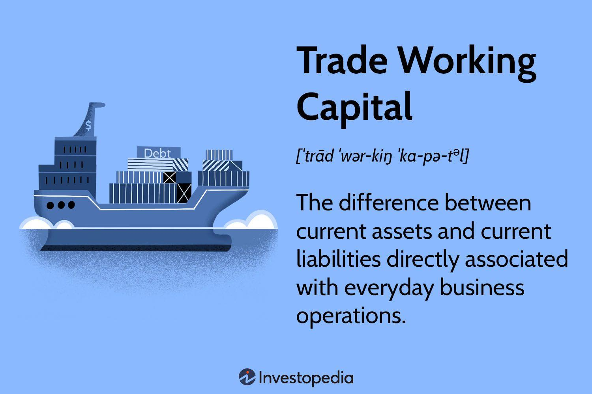

## Table of Contents

## What is trade working capital?

Trade working capital is the money a business uses to run its day-to-day operations. It includes things like inventory, money customers owe the business, and money the business owes to suppliers. It's important because it helps a business make sure it has enough cash to buy more products, pay bills, and keep everything running smoothly.

If a business has good trade working capital, it can buy more inventory when needed and pay its bills on time. This helps the business grow and stay healthy. But if the trade working capital is low, the business might struggle to buy new products or pay its bills, which can cause problems and even lead to the business failing.

## Why is trade working capital important for businesses?

Trade working capital is really important for businesses because it helps them keep going day to day. It's like the money they need to buy things to sell, pay for stuff they need to run their business, and make sure they can keep their doors open. Without enough trade working capital, a business might not be able to buy new products to sell, which means they could run out of things to sell to customers.

Having good trade working capital also means a business can pay its bills on time, like what they owe to suppliers. This helps the business keep good relationships with the people they buy from, and it can help them get better deals in the future. If a business doesn't have enough trade working capital, it might have to borrow money, which can be expensive and risky. So, having the right amount of trade working capital is key to making sure a business can grow and stay healthy.

## How is trade working capital calculated?

Trade working capital is calculated by taking the money that customers owe the business (accounts receivable) and adding the value of the products the business has in stock (inventory). Then, you subtract the money the business owes to its suppliers (accounts payable). The formula is simple: Trade Working Capital = Accounts Receivable + Inventory - Accounts Payable.

This calculation helps businesses see if they have enough money to keep running smoothly. If the number is positive, it means the business has more money coming in than going out, which is good. But if the number is negative, it might mean the business needs to find more money or change how it manages its cash to keep going.

## What are the components of trade working capital?

Trade working capital has three main parts: accounts receivable, inventory, and accounts payable. Accounts receivable is the money that customers owe the business for products or services they've bought but haven't paid for yet. Inventory is the value of all the products the business has in stock, ready to sell to customers. Accounts payable is the money the business owes to its suppliers for the products or services it has bought but hasn't paid for yet.

These three parts work together to show if a business has enough money to keep running day to day. When you add up the accounts receivable and the inventory, and then subtract the accounts payable, you get the trade working capital. A positive number means the business has more money coming in than going out, which is good. A negative number might mean the business needs to find more money or change how it manages its cash to keep going.

## How does trade working capital differ from working capital?

Trade working capital and working capital are similar but they focus on different parts of a business. Trade working capital is all about the money a business uses for its daily trading activities. It includes the money customers owe the business (accounts receivable), the value of the products the business has in stock (inventory), and the money the business owes to its suppliers (accounts payable). It's a specific measure that helps businesses see if they have enough money to buy new products, pay their suppliers, and keep selling to customers.

Working capital, on the other hand, is a broader measure. It looks at the overall health of a business's short-term financial situation. Working capital is calculated by subtracting all the short-term debts (like accounts payable, short-term loans, and other immediate liabilities) from all the short-term assets (like cash, accounts receivable, inventory, and other assets that can be turned into cash quickly). So, while trade working capital focuses on the trading part of the business, working capital gives a bigger picture of the business's ability to meet its short-term financial obligations.

## What are the common strategies to optimize trade working capital?

One way to optimize trade working capital is by managing inventory better. Businesses can do this by keeping just the right amount of products in stock. They don't want too much, because that ties up money that could be used for other things. But they also don't want too little, because then they might not have enough to sell to customers. Using tools like inventory management software can help businesses figure out how much they need to keep on hand.

Another strategy is to improve how quickly customers pay. Businesses can offer discounts for early payments or use stricter credit terms to make sure they get their money faster. This means more cash coming in sooner, which can be used to buy more products or pay bills. At the same time, businesses can also try to stretch out the time they take to pay their own suppliers. This means they can hold onto their money longer, which helps with cash flow.

Combining these strategies helps businesses keep their trade working capital in a good spot. They can buy what they need, pay their bills on time, and keep selling to customers without running into money problems. It's all about finding the right balance to keep the business running smoothly.

## How does trade working capital impact cash flow?

Trade working capital directly affects a business's cash flow because it includes the money tied up in accounts receivable, inventory, and accounts payable. When a business has a lot of money owed by customers (accounts receivable), it means they are waiting to get paid. This can slow down their cash flow because they don't have that money to use right away. On the other hand, if a business has a lot of products sitting in inventory, that money is also tied up and not available for other uses. So, having too much money in accounts receivable or inventory can make it harder for a business to have enough cash on hand to pay its bills or buy new products.

On the flip side, if a business can take longer to pay its suppliers (accounts payable), it helps their cash flow because they can keep their money longer. This means they can use that money for other things before they have to pay their bills. By managing these three parts of trade working capital well, a business can make sure it has enough cash coming in to cover its day-to-day needs. Good management of trade working capital helps a business keep its cash flow smooth, which is really important for staying healthy and growing.

## What are the risks associated with insufficient trade working capital?

Not having enough trade working capital can cause big problems for a business. If a business doesn't have enough money to buy new products, it might run out of things to sell to customers. This means the business could lose sales and customers might go somewhere else to buy what they need. Also, if the business can't pay its bills on time, like what it owes to suppliers, it might have a hard time getting more products in the future. Suppliers might not want to work with a business that doesn't pay on time, which can make the problem even worse.

Another risk is that the business might need to borrow money to keep going. Borrowing money can be expensive because of interest and fees, and it can make the business's money problems even bigger. If the business keeps borrowing and can't pay back the loans, it might go bankrupt. So, not having enough trade working capital can make it really hard for a business to keep running smoothly and can even lead to the business failing.

## How can trade working capital be improved through inventory management?

One way to improve trade working capital through inventory management is by making sure the business has just the right amount of products in stock. If a business keeps too much inventory, it ties up money that could be used for other things. This can make it hard to pay bills or buy new products. But if the business uses tools like inventory management software, it can figure out how much inventory it really needs. This helps the business keep enough products to sell to customers without having too much sitting around.

Another way to manage inventory better is by selling off old or slow-moving products. If a business has products that aren't selling well, it can offer discounts or special deals to get rid of them. This frees up money that was tied up in those products, which can then be used to buy new, more popular items. By keeping inventory moving and not letting it sit too long, a business can improve its trade working capital and make sure it has enough cash to keep running smoothly.

## What role does trade credit play in managing trade working capital?

Trade credit is when a business buys products from suppliers and pays for them later. This can help a business manage its trade working capital because it lets the business hold onto its money longer. Instead of paying right away, the business can use that money to buy more products, pay other bills, or keep running its day-to-day operations. By using trade credit, a business can improve its cash flow and make sure it has enough money to keep going.

But trade credit also comes with some risks. If a business uses too much trade credit, it might end up owing a lot of money to its suppliers. This can make it hard to pay those bills on time, which might hurt the business's relationship with its suppliers. If suppliers start asking for payment sooner or stop giving the business credit, it could cause big problems with the business's trade working capital. So, it's important for a business to use trade credit carefully and make sure it can pay its bills on time to keep its trade working capital in good shape.

## How do seasonal fluctuations affect trade working capital management?

Seasonal fluctuations can make managing trade working capital tricky for businesses. During busy times of the year, like holidays or peak seasons, a business might need more money to buy extra inventory and hire more help. This means they need more trade working capital to keep up with demand. But if they don't plan well, they might run out of money and struggle to buy what they need or pay their bills on time.

On the other hand, during slow times, a business might not sell as much and have less money coming in. This can lead to too much inventory sitting around, which ties up money that could be used for other things. To manage trade working capital well, businesses need to plan ahead for these ups and downs. They can do things like saving money during busy times to use during slow times, or working with suppliers to get better payment terms during off-peak seasons. By understanding and preparing for seasonal changes, businesses can keep their trade working capital in good shape all year round.

## What advanced metrics and analytics can be used to monitor and enhance trade working capital performance?

Businesses can use advanced metrics and analytics to keep an eye on their trade working capital and make it better. One useful metric is the cash conversion cycle (CCC), which measures how long it takes for a business to turn its inventory and other resources into cash. By looking at the CCC, a business can see if it's taking too long to sell products or if customers are taking too long to pay. Another important metric is the inventory turnover ratio, which shows how quickly a business sells and replaces its stock. A high turnover ratio means the business is managing its inventory well, which can help improve trade working capital.

Analytics can also help businesses predict future needs and make smarter decisions. For example, using predictive analytics, a business can forecast how much inventory it will need during different times of the year, like during busy seasons or slow periods. This helps the business avoid having too much or too little stock, which can tie up money or lead to missed sales. Additionally, data analytics can help businesses understand customer payment patterns and adjust their credit terms to get paid faster. By using these advanced tools, businesses can keep their trade working capital in good shape and make sure they always have enough money to keep running smoothly.

## What is Understanding Trade Working Capital?

Trade working capital, often abbreviated as TWC, is a critical financial metric that represents the difference between the current assets and current liabilities directly tied to a company's routine business operations. It provides insight into a company's operational liquidity, focusing on assets and liabilities that fluctuate due to daily business activities. Unlike general working capital, which includes all current assets and liabilities, trade working capital offers a more targeted view by excluding non-operational items. This distinction allows companies to more accurately gauge their short-term financial health related to core operational activities.

To break it down, trade working capital can be mathematically expressed as:

$$
\text{Trade Working Capital} = (\text{Trade Receivables} + \text{Inventories}) - \text{Trade Payables}
$$

This formula ensures only those items that arise from everyday operations are considered. Trade receivables refer to the amounts owed by customers for goods and services delivered, while inventories encompass raw materials, work-in-progress, and finished goods ready for sale. Trade payables represent obligations the company owes to suppliers for materials and services acquired.

Companies leverage their trade working capital to determine their capacity to meet short-term liabilities using resources generated internally rather than seeking external funding. A positive trade working capital indicates that current operational assets surpass the operational liabilities, suggesting a sound [liquidity](/wiki/liquidity-risk-premium) position. Conversely, a negative trade working capital might signal potential liquidity challenges, highlighting the need for managerial intervention.

For instance, if a company has $500,000 in trade receivables, $300,000 in inventories, and $400,000 in trade payables, its trade working capital would be:

$$
\text{TWC} = (\$500,000 + \$300,000) - \$400,000 = \$400,000
$$

This positive trade working capital suggests that the company possesses adequate liquidity to support its day-to-day operational expenses. Understanding and managing trade working capital is integral to making informed financial decisions, ensuring ongoing operational capability, and maintaining the financial stability needed to capitalize on growth opportunities.

## How do you calculate trade working capital?

Trade working capital is a financial metric used to assess a company's short-term liquidity position specifically related to its core operational activities. It is calculated by considering the elements directly involved in the company’s daily operations: inventories, accounts receivable (AR), and accounts payable (AP). The formula for calculating trade working capital is as follows:

$$
\text{Trade Working Capital} = \text{Inventories} + \text{Accounts Receivable} - \text{Accounts Payable}
$$

This formula provides a succinct view of the funds available for operational needs and helps identify potential areas for financial improvement.

### Formula Explanation

1. **Inventories**: These are items that a company keeps in stock to meet the demands of its customers. Managing inventory levels effectively is crucial as excessive inventories can tie up funds, whereas too little can hamper production and sales.

2. **Accounts Receivable (AR)**: This represents the money owed to the company by its customers for goods or services delivered. The speed at which these receivables are collected heavily influences the company's cash flow and liquidity.

3. **Accounts Payable (AP)**: This involves the amounts owed to suppliers and other creditors. Efficient management of accounts payable can help manage cash flow by optimizing the timing of outflows, aligning them strategically with the company’s fiscal policies.

### Practical Example

Consider a hypothetical balance sheet of a company to calculate the trade working capital:

- **Inventories**: \$150,000
- **Accounts Receivable**: \$200,000
- **Accounts Payable**: \$100,000

Substituting these values into the formula gives:

$$
\text{Trade Working Capital} = 150,000 + 200,000 - 100,000 = \$250,000
$$

This calculation shows that the company has \$250,000 available for its operational activities, indicating a healthy liquidity position.

### Python Code for Calculation

To automate the calculation of trade working capital, the following Python script can be used:

```python
def calculate_trade_working_capital(inventories, accounts_receivable, accounts_payable):
    return inventories + accounts_receivable - accounts_payable

# Example values
inventories = 150000
accounts_receivable = 200000
accounts_payable = 100000

trade_working_capital = calculate_trade_working_capital(inventories, accounts_receivable, accounts_payable)
print("Trade Working Capital: $", trade_working_capital)
```

By understanding and calculating trade working capital, businesses can effectively evaluate their financial flexibility and operational efficiency. Furthermore, regular assessment allows companies to make strategic adjustments to sustain or improve their working capital position, thus enhancing overall business health.

## References & Further Reading

[1]: ["Working Capital Management: Applications and Case Studies"](https://books.google.com/books/about/Working_Capital_Management.html?id=hJstBAAAQBAJ) by James S. Sagner

[2]: Brealey, R. A., Myers, S. C., & Allen, F. (2014). ["Principles of Corporate Finance"](https://www.mheducation.com/highered/product/Principles-of-Corporate-Finance-Brealey.html). McGraw-Hill Education.

[3]: ["Algorithmic Trading: Winning Strategies and Their Rationale"](https://books.google.com/books/about/Algorithmic_Trading.html?id=WAlFDwAAQBAJ) by Ernest P. Chan

[4]: Petersen, C., & Rajan, R. G. (1997). ["Trade Credit: Theories and Evidence."](https://academic.oup.com/rfs/article-abstract/10/3/661/1635350) Review of Financial Studies, 10(3), 661-691.

[5]: ["Financial Management and Analysis"](https://www.semanticscholar.org/paper/Financial-Management-and-Analysis-Peterson/d4b61e8481c59421bddc7d4fef2898f11ef48225) by Frank J. Fabozzi and Pamela Peterson Drake