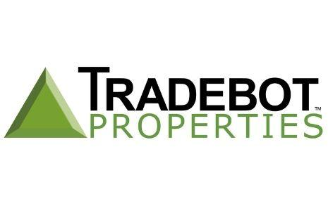

## Table of Contents

## What is a Tradebot?

A Tradebot is a computer program that automatically buys and sells things like stocks, cryptocurrencies, or other financial items. It uses special rules and math to decide when to trade. People use tradebots because they can work all the time without getting tired and can make decisions much faster than humans.

Tradebots can be helpful because they take away some of the emotions that can make trading hard for people. They stick to the rules they are given, which can lead to more steady results. However, tradebots are not perfect. They can make mistakes if the rules they follow are not good, or if the market changes in ways the bot does not expect. So, it's important for people to keep an eye on their tradebots and make changes when needed.

## How does a Tradebot work?

A Tradebot works by using a set of rules, called an algorithm, to decide when to buy or sell things like stocks or cryptocurrencies. These rules can be based on many things, like the price of the item, how much it has gone up or down recently, or even news and events. When the Tradebot sees that the rules are met, it will automatically make a trade without needing a person to do it. This means the Tradebot can work all the time, even when people are sleeping or busy.

Tradebots are good at following rules exactly and making decisions quickly. They don't get tired or let emotions like fear or excitement affect their choices. This can help them make more steady trades over time. But, if the rules the Tradebot follows are not good or if the market changes in a way the Tradebot does not expect, it can make mistakes. That's why people who use Tradebots need to watch them and sometimes change the rules to make sure they keep working well.

## What are the basic components of a Tradebot?

A Tradebot has a few key parts that help it work well. The first part is the algorithm, which is like a set of instructions that tells the Tradebot when to buy or sell. This algorithm can look at things like the price of the item, how it has changed over time, and even news or events. The second part is the data feed, which gives the Tradebot all the information it needs to make decisions. This can include real-time prices, market trends, and other important data.

The third part is the trading platform, which is where the Tradebot actually makes the trades. This platform connects to the markets and lets the Tradebot buy and sell things like stocks or cryptocurrencies. The last part is the risk management system, which helps keep the Tradebot from making too many risky trades. This system can set limits on how much the Tradebot can buy or sell and can stop it from making trades if things get too risky.

Together, these parts help the Tradebot work smoothly and make good trading decisions. The algorithm decides when to trade, the data feed gives it the information it needs, the trading platform does the actual buying and selling, and the risk management system keeps things safe. By working together, these components make the Tradebot a useful tool for trading.

## What programming languages are commonly used to develop Tradebots?

When people make Tradebots, they often use programming languages like Python, JavaScript, and C++. Python is very popular because it is easy to learn and has many tools that help with trading, like libraries for data analysis and [machine learning](/wiki/machine-learning). These tools make it easier to write the rules that the Tradebot follows. JavaScript is also used a lot, especially for Tradebots that work on websites or need to connect to online trading platforms. It is good for making things happen quickly on the internet.

C++ is another language that people use for Tradebots, especially when they need the bot to work very fast. C++ can handle a lot of data and make decisions quickly, which is important in trading where every second counts. Some people also use other languages like Java or R, depending on what they need the Tradebot to do. Each language has its own strengths, so the choice often depends on what the Tradebot needs to do and how fast it needs to do it.

## What are the different types of Tradebots?

There are different types of Tradebots, and each one works a bit differently. One type is the trend-following Tradebot. This kind of bot looks at how prices are moving and tries to buy when prices are going up and sell when they are going down. Another type is the mean-reversion Tradebot. This bot thinks that prices will go back to their average after they move a lot, so it buys when prices are low and sells when they are high. There are also [arbitrage](/wiki/arbitrage) Tradebots, which look for small differences in prices between different places and try to make money by buying low in one place and selling high in another.

Another type of Tradebot is the [statistical arbitrage](/wiki/statistical-arbitrage) bot. This one uses math to find patterns in how prices move and tries to make trades based on those patterns. Then there are machine learning Tradebots, which use special computer programs to learn from past trades and get better over time. These bots can change their rules as they learn more about the market. Each type of Tradebot has its own way of trying to make money, and people choose the one that fits best with what they want to do in the market.

## How can a beginner start using a Tradebot?

To start using a Tradebot, a beginner should first learn about how trading works. This means understanding basic things like stocks, cryptocurrencies, and how markets move. Once you have a good grasp of these ideas, you can look for a Tradebot that fits your needs. There are many Tradebots out there, and some are easier to use than others. You might want to start with a simple one that has clear instructions and a friendly interface. Some platforms even let you try out trading with fake money, which is a great way to practice without risking real money.

After choosing a Tradebot, you need to set it up. This usually means putting in some rules for the bot to follow, like when to buy or sell. These rules can be based on things like price changes or market trends. It's important to start with simple rules and learn how the bot works. As you get more comfortable, you can try more complex rules. Always keep an eye on how your Tradebot is doing, and be ready to change the rules if the market changes or if the bot is not working well. Starting with a Tradebot can be exciting, but remember to take it slow and keep learning.

## What are the risks associated with using Tradebots?

Using Tradebots can be risky. One big risk is that the rules the bot follows might not work well in all situations. The market can change in ways that the bot does not expect, and this can lead to bad trades. For example, if the bot is set up to buy when prices go up, but then the market suddenly crashes, the bot might keep buying at higher and higher prices, losing money. This is why it's important to keep watching the bot and be ready to change the rules if needed.

Another risk is technical problems. Tradebots rely on computers and the internet, and if something goes wrong, like a power outage or a slow internet connection, the bot might not be able to make trades at the right time. This can lead to missed opportunities or trades that happen at the wrong price. Also, there is always the risk of the bot being hacked or having security issues, which could lead to losing money or personal information. So, it's important to use strong security measures and keep the bot's software up to date.

## How can Tradebots be optimized for better performance?

To make Tradebots work better, you can start by looking at the rules they follow. If the rules are too simple, the bot might miss good chances to trade. If they are too complex, it might make too many trades and lose money. You can try different rules and see which ones work best. This is called testing. You can use past data to see how the bot would have done with different rules. This helps you find the best rules without losing real money. Also, you can use things like machine learning to help the bot learn from its trades and get better over time.

Another way to make Tradebots work better is by keeping an eye on how they are doing. Markets change, and what worked yesterday might not work today. So, you need to check the bot's trades and see if it is making money or losing it. If it's losing money, you might need to change the rules. It's also important to make sure the bot's computer and internet are working well. If they are slow or have problems, the bot might miss good trades. By watching the bot and making changes when needed, you can help it do a better job.

## What are the legal and ethical considerations when using Tradebots?

When using Tradebots, it's important to think about the rules and what is right and wrong. In many places, there are laws about trading, and using a Tradebot does not mean you can ignore these laws. For example, some places have rules about how much you can trade or what information you can use to make trades. If your Tradebot breaks these rules, you could get in trouble. It's a good idea to learn about the laws in your area and make sure your Tradebot follows them.

There are also ethical things to think about. Just because a Tradebot can make quick trades does not mean it should do things that are not fair. For example, some people worry that Tradebots can make markets less fair by making prices move too fast or by taking advantage of small mistakes in the market. It's important to use Tradebots in a way that is honest and fair to everyone. This means not trying to trick the market or other traders, and always thinking about how your trades might affect others.

## How do advanced Tradebots utilize machine learning and AI?

Advanced Tradebots use machine learning and AI to get better at trading over time. Machine learning lets the bot learn from past trades and find patterns in the market. For example, it can look at a lot of old data to see what worked and what did not. Then, it can use this information to make better decisions in the future. The bot can also learn from new data as it comes in, so it keeps getting smarter. This means it can change its rules to fit the market better, even if the market changes a lot.

AI helps Tradebots do more than just follow simple rules. It can help the bot understand more complex things, like news stories or social media posts, and use this information to make trades. For example, if there is good news about a company, the AI might decide to buy its stock. AI can also help the bot predict what might happen next in the market by looking at many different signs and clues. This makes the bot more flexible and able to handle different situations, which can lead to better results.

## What are some case studies of successful Tradebot implementations?

One successful case of a Tradebot was used by Renaissance Technologies. They made a Tradebot called Medallion Fund. This bot used a lot of math and computer power to find small chances to make money in the market. It looked at things like price changes and market trends. The Medallion Fund did very well, making a lot of money for the people who invested in it. This showed that Tradebots can work well if they use smart rules and have good data to work with.

Another example is the Tradebot used by Two Sigma. They made a bot that used machine learning to get better over time. The bot could learn from its trades and change its rules to fit the market better. This helped it make more money as time went on. Two Sigma's Tradebot was good at finding patterns in the market that other people might miss. This case showed that using machine learning can help Tradebots do a better job and make more money for their users.

## What future trends are expected in the development of Tradebots?

In the future, Tradebots are expected to get even smarter and better at trading. One big trend is that they will use more machine learning and AI. This means they will be able to learn from the market and change their rules to fit new situations. They will also be able to understand more complex things, like news and social media, and use this information to make better trades. This will make Tradebots more flexible and able to handle different market conditions, which can lead to better results for people who use them.

Another trend is that Tradebots will become easier to use. Right now, setting up a Tradebot can be hard for people who are new to trading. In the future, there will be more user-friendly Tradebots that anyone can use. These bots will have simple interfaces and clear instructions, so more people can start using them. This will make trading more accessible to everyone, not just people who know a lot about computers and trading. As Tradebots get smarter and easier to use, more and more people will start using them to trade.

## References & Further Reading

[1]: Aldridge, I. (2013). ["High-Frequency Trading: A Practical Guide to Algorithmic Strategies and Trading Systems."](https://www.wiley.com/en-us/High+Frequency+Trading%3A+A+Practical+Guide+to+Algorithmic+Strategies+and+Trading+Systems%2C+2nd+Edition-p-9781118343500) Wiley.

[2]: Narang, R. K. (2009). ["Inside the Black Box: A Simple Guide to Quantitative and High-Frequency Trading."](https://onlinelibrary.wiley.com/doi/book/10.1002/9781118267738) Wiley.

[3]: Kissell, R. (2013). ["The Science of Algorithmic Trading and Portfolio Management."](https://www.sciencedirect.com/book/9780124016897/the-science-of-algorithmic-trading-and-portfolio-management) Academic Press.

[4]: Patterson, S. (2012). ["Dark Pools: The Rise of the Machine Traders and the Rigging of the U.S. Stock Market."](https://www.amazon.com/Dark-Pools-Machine-Traders-Rigging/dp/0307887189) Crown Business.

[5]: De Prado, M. L. (2018). ["Advances in Financial Machine Learning."](https://www.amazon.com/Advances-Financial-Machine-Learning-Marcos/dp/1119482089) Wiley.

[6]: Chan, E. (2009). ["Quantitative Trading: How to Build Your Own Algorithmic Trading Business."](https://github.com/ftvision/quant_trading_echan_book) Wiley.

[7]: Aronson, D. R. (2006). ["Evidence-Based Technical Analysis: Applying the Scientific Method and Statistical Inference to Trading Signals."](https://www.amazon.com/Evidence-Based-Technical-Analysis-Scientific-Statistical/dp/0470008741) Wiley.

[8]: Johnson, B. (2010). ["Algorithmic Trading & DMA: An Introduction to Direct Access Trading Strategies."](https://archive.org/details/algorithmictradi0000john) 4Myeloma Press.