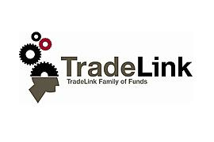

Tradelink Holdings is a significant entity within the algorithmic trading industry, recognized for its innovative approaches to financial markets via sophisticated trading algorithms. Algorithmic trading, or "algo trading," plays a crucial role in today's financial markets by employing complex algorithms and mathematical models to execute trades at speeds and frequencies that are impossible for human traders. This technology-driven approach enhances market efficiency and liquidity, reduces transaction costs, and enables the execution of large-scale trades with precision and minimal market impact.

Tradelink Holdings offers a suite of services and products designed to harness the power of algorithmic trading, providing clients access to advanced trading platforms and tools that enable more efficient trade execution and risk management. These offerings are backed by robust technological infrastructures, ensuring high-speed, reliable, and secure trading operations.

The purpose of this article is to provide readers with a comprehensive overview of Tradelink Holdings' role in the algo trading industry and to explore how algorithmic trading is revolutionizing traditional trading practices. Readers will gain insights into the company's trading strategies, technological innovations, market impact, and the challenges and opportunities present in the rapidly evolving landscape of algorithmic trading.

As algorithmic trading continues to evolve, it reshapes the financial markets by integrating cutting-edge technology with trading strategies. This intersection of finance and technology not only enhances market operations but also introduces new complexities and competitive advantages for market participants. By understanding the contributions and methodologies of key players like Tradelink Holdings, readers can better appreciate the transformative impact of algorithmic trading on the global financial system.

## Table of Contents

## Understanding Algorithmic Trading

Algorithmic trading, often referred to as algo trading, is the use of computer programs to execute trades in financial markets based on pre-defined conditions and instructions. These programs follow algorithms, which are sequences of rules and logic to perform trading operations such as buy and sell orders, with minimal human intervention. The principal goal of algorithmic trading is to enhance trade efficiency and accuracy, making it a fundamental shift from traditional trading practices that were largely manual and time-consuming.

The benefits of algorithmic trading are manifold. Algorithms can process vast amounts of data at high speeds, enabling traders to analyze market conditions and execute trades much faster than human traders. This speed translates into efficiency, as trades are executed without delays, potentially resulting in better pricing and reduced transaction costs. Moreover, algorithmic trading mitigates human errors that can occur in manual trading and can operate 24/7, providing continuous market engagement.

Traditional trading practices have undergone significant transformation due to the adoption of [algorithmic trading](/wiki/algorithmic-trading). Earlier, traders relied heavily on intuition and manual chart analysis, which could be subjective and prone to errors. Algorithms, however, utilize data-driven strategies that depend on rigorous mathematical models and back-testing. This transformation has democratized access to sophisticated trading strategies that were once the purview of only large financial institutions.

Technology and data analysis are at the core of algorithmic trading. Advances in computing power and data analytics allow traders to process real-time market data and identify profitable opportunities swiftly. Machine learning techniques further enhance these capabilities by enabling algorithms to learn from historical data and adapt to new market conditions. High-frequency trading ([HFT](/wiki/high-frequency-trading-strategies)), a subset of algorithmic trading, exemplifies the use of technology, where sophisticated algorithms execute tens of thousands of trades per second.

Common strategies in algorithmic trading include:

1. **Trend Following Strategies**: These involve algorithms that identify market trends and execute trades in the direction of the trend. For example, a moving average crossover strategy might involve buying an asset when its short-term moving average crosses above its long-term moving average.

2. **Arbitrage**: This strategy exploits price discrepancies of the same asset between different markets or exchanges. Algorithms automatically place buy and sell orders to capitalize on these differences.

3. **Market Making**: Algorithms place simultaneous buy and sell orders to profit from the bid-ask spread. This strategy requires the ability to process orders very quickly to stay ahead in the bid-ask queue.

4. **Statistical Arbitrage**: This involves the use of statistical tools and models to identify trading opportunities based on historical price movements. For instance, pairs trading relies on finding two historically correlated securities and taking positions based on deviations from their typical correlation.

5. **Mean Reversion**: The assumption behind this strategy is that asset prices will revert to their historical means over time. Algorithms identify assets that have deviated from their average values and execute trades based on the assumption they will return to these averages.

Algorithmic trading is, therefore, a cutting-edge fusion of finance and technology, enabling more precise, efficient, and versatile trading operations. It continues to evolve as technological advancements and data analytics become more sophisticated.

## About Tradelink Holdings

Tradelink Holdings, founded in the late 1980s, has established itself as a leader in algorithmic trading. Its inception was fueled by the vision to harness technology and quantitative methods to revolutionize trading practices, at a time when the predominance of traditional trading methods started giving way to digital innovations. Over the years, the firm has grown into a pivotal player among algorithmic trading firms, navigating through financial booms and recessions by maintaining a strong commitment to innovation.

The core values that drive Tradelink Holdings include integrity, innovation, and excellence. The company's mission is to deliver superior returns for its clients by leveraging cutting-edge technology and quantitative models. A commitment to transparency and client-focused solutions has been central to its operations, allowing it to maintain trust and build long-term relationships.

Tradelink Holdings has achieved numerous milestones that highlight its contribution to the algo trading sector. Early adoption of algorithmic strategies gave the company a competitive advantage, leading to significant successes in diverse trading environments. Among these accomplishments, the development of proprietary trading systems that anticipate market movements with precision stands out. These systems employ sophisticated quantitative analyses and are improved continuously through in-house research and development efforts.

The leadership team of Tradelink Holdings comprises seasoned professionals with extensive experience in finance, mathematics, and technology. The synergy of these diverse backgrounds forms the core of the company's strategic direction and innovation in algorithmic trading. Key figures in the leadership include individuals with PhDs in quantitative disciplines and previous experience in top-tier financial institutions. Their expertise ensures that Tradelink remains at the forefront of algorithmic trading advancements.

The company's reputation in the market is bolstered by its consistent performance and reliability. It is recognized for its robust risk management strategies and its ability to adapt to changing market conditions. Tradelink Holdings is frequently cited in industry reports as a benchmark for excellence in algo trading, reflecting its sustained impact on the sector. Clients and partners view Tradelink as an innovator that not only offers cutting-edge trading solutions but also anticipates industry trends with remarkable foresight. Through strategic collaborations and a focus on sustainable growth, Tradelink Holdings continues to reinforce its standing as a formidable force in the global financial markets.

## Tradelink Holdings' Algorithmic Trading Strategies

## Tradelink Holdings' Algorithmic Trading Strategies

Tradelink Holdings has established itself as a leader in algorithmic trading by developing a range of sophisticated trading algorithms. These algorithms leverage advanced statistical models and data analytics to optimize trading decisions and achieve superior results in financial markets. The firm’s proprietary algorithms are designed to handle complex market dynamics, providing a competitive edge over other trading entities.

One of the distinguishing features of Tradelink Holdings' algorithmic strategies is their adaptability to various market conditions. These algorithms employ [machine learning](/wiki/machine-learning) techniques to analyze historical data and detect patterns that inform predictive modeling. By continuously evolving and learning from new data, the algorithms are capable of adjusting their parameters in real-time, thus maximizing trading efficiency and profitability.

The effectiveness of Tradelink Holdings' algorithmic strategies can be illustrated through multiple successful applications. For instance, their high-frequency trading (HFT) algorithms are renowned for executing trades at incredibly high speeds, capitalizing on even minute price discrepancies in the market. These strategies have consistently delivered impressive returns, positioning Tradelink Holdings as a significant player in high-[volume](/wiki/volume-trading-strategy) trading environments.

Client testimonials further substantiate the effectiveness of these algorithms. Several institutional clients have reported enhanced portfolio performance and risk management capabilities since integrating Tradelink's strategies into their trading operations. One notable case study involves a [hedge fund](/wiki/hedge-fund-trading-strategies) that experienced a 20% increase in annual returns after adopting Tradelink’s [momentum](/wiki/momentum)-based algorithm, which identifies and exploits trends in asset prices.

Tradelink Holdings is also at the forefront of innovation and research and development (R&D) in the field of algorithmic trading. The company invests heavily in R&D to explore novel algorithmic approaches and technologies. Their team of quantitative analysts and data scientists are continually developing cutting-edge models that incorporate the latest advancements in [artificial intelligence](/wiki/ai-artificial-intelligence) and [deep learning](/wiki/deep-learning). This commitment to innovation ensures that Tradelink’s strategies remain both competitive and robust in a rapidly changing financial landscape.

In summary, Tradelink Holdings' algorithmic trading strategies are characterized by their adaptability, speed, and advanced technological integration. These elements not only set the firm apart from its competitors but also consistently deliver strong financial performance for their clients. Through ongoing R&D efforts, Tradelink continues to pioneer new frontiers in algorithmic trading, thereby reinforcing its status as a leader in the industry.

## The Technology Behind Tradelink Holdings

The technological infrastructure employed by Tradelink Holdings is foundational to its success in the algorithmic trading industry. A robust and sophisticated technological framework allows the company to process large volumes of data and execute trades with precision and speed.

One of the critical aspects of Tradelink Holdings' technological foundation is its partnerships and collaborations with leading technology firms. These alliances provide access to state-of-the-art technologies and innovations that enhance Tradelink's trading capabilities. By leveraging these relationships, Tradelink is able to integrate the latest advancements in computing, networking, and data analysis into its systems, maintaining a competitive edge in the fast-paced trading environment.

Artificial intelligence (AI) and machine learning (ML) are integral to Tradelink's trading solutions. These technologies enable the development of sophisticated algorithms that can identify patterns, predict market movements, and execute trades autonomously. Machine learning models are trained using vast historical market data, allowing them to improve their performance over time. A typical ML model used by Tradelink might involve datasets $X$ with input features and a target variable $y$, where the objective is to find a function $f(X) = y$ that best maps inputs to outputs. Python's popular libraries such as scikit-learn and TensorFlow may be employed to develop and optimize these models.

Data security and privacy are of paramount importance to Tradelink Holdings. The company implements stringent measures to protect sensitive information and ensure compliance with industry standards. Encryption protocols, secure data storage solutions, and regular security audits are among the practices adopted to safeguard data integrity and confidentiality. Additionally, privacy policies are in place to ensure that the handling and processing of personal data comply with applicable regulations, such as the General Data Protection Regulation (GDPR) in the European Union.

Tradelink Holdings anticipates several future technological advancements that could further enhance its trading operations. Quantum computing is one such area, with potential applications in number theory and cryptography that could expedite the processing of complex calculations. Moreover, ongoing developments in AI and ML, particularly in deep learning and [reinforcement learning](/wiki/reinforcement-learning), are expected to offer new strategies for market analysis and decision-making.

In summary, the technological infrastructure at Tradelink Holdings is comprehensive and continually evolving. Its commitment to leveraging cutting-edge technology not only supports its current trading activities but also positions it to capitalize on future opportunities within the financial markets.

## Market Impact and Global Presence

Tradelink Holdings has established a significant presence in the global financial market through its innovative algorithmic trading strategies. These strategies have made a notable impact on various market sectors by providing [liquidity](/wiki/liquidity-risk-premium) and enhancing market efficiency. Algorithmic trading has become indispensable in financial markets due to its ability to execute high-frequency trades with precision and minimal human intervention. As such, Tradelink Holdings plays a crucial role in contributing to the smooth functioning of markets and reducing [volatility](/wiki/volatility-trading-strategies).

The company's expansion into international markets has been strategic and calculated. Tradelink Holdings has established a presence in key financial centers globally, thus ensuring access to diverse markets and enabling the company to leverage global opportunities. This international expansion underlines Tradelink Holdings' commitment to harnessing technology and data-driven strategies beyond regional boundaries, thereby increasing its footprint in the financial trading sector.

Navigating varying regulatory environments is another critical aspect of Tradelink Holdings' global operations. The company adapts its trading strategies to comply with both local and international trading regulations, ensuring its operations remain lawful and ethical in different jurisdictions. This adaptability not only strengthens Tradelink Holdings' market position but also enhances its reputation as a conscientious market participant.

Tradelink Holdings' influence in the financial markets can often be seen through its notable trades and the analyses they inspire among industry experts. Such trades often serve as benchmarks for market behavior, reflecting the depth of Tradelink Holdings' market understanding and execution capabilities. Quotes from industry analysts frequently highlight how Tradelink Holdings' activities, driven by data and advanced algorithms, can set market trends and inform trading decisions across the sector.

Thus, through its impactful trading activities, strategic international presence, regulatory adaptability, and market influence, Tradelink Holdings continues to shape and drive value in the global financial landscape.

## Challenges and Opportunities in Algorithmic Trading

Algorithmic trading represents a critical segment of the modern financial landscape, offering numerous benefits such as increased trading efficiency and accuracy. However, as it continues to evolve, it encounters various challenges and presents new opportunities.

One of the most significant challenges in the algorithmic trading industry is regulatory compliance. Financial markets worldwide are subject to rigorous regulation aimed at ensuring stability and protecting investors. Algorithmic trading firms must continuously adapt to these regulations, which vary by jurisdiction and are subject to frequent changes. Compliance requires substantial investment in legal expertise and technology to monitor and adhere to rules like the European Union's Markets in Financial Instruments Directive (MiFID II) and the United States' Securities and Exchange Commission (SEC) regulations. Failure to comply can result in significant financial penalties and reputational damage.

Opportunities for growth in algorithmic trading are vast, driven by technological advancements and increasing market demand. With the continuous development of artificial intelligence (AI) and machine learning (ML), trading algorithms are becoming more sophisticated, capable of processing vast datasets with high precision. These technologies enable the identification of complex patterns and trends that are imperceptible to human traders, providing a competitive edge. Additionally, the expansion of financial markets into emerging economies and the integration of cryptocurrencies into the trading ecosystem offer new avenues for algorithmic trading firms to explore.

Technological and market trends are shaping the future of algorithmic trading strategies. Advances in quantum computing hold the potential to revolutionize data processing speed and capabilities, allowing algorithms to simulate numerous trading scenarios with even greater efficiency. Moreover, the increasing availability of high-quality, real-time data feeds is essential for refining trading strategies. The growing interest in environmental, social, and governance ([ESG](/wiki/esg-investing)) investing is prompting the development of algorithms that incorporate these factors into trading strategies, reflecting broader societal values.

Tradelink Holdings navigates these challenges and opportunities by maintaining a robust compliance framework and investing in cutting-edge technology. The company employs a team of regulatory experts to ensure adherence to international financial laws and standards. It aligns its technology strategy with the latest advancements in AI and ML, continuously refining its algorithms to adapt to market conditions and regulatory environments. By fostering partnerships with leading tech firms, Tradelink Holdings enhances its trading infrastructure, ensuring scalability and resilience. This proactive approach enables Tradelink Holdings to remain at the forefront of the industry, capitalizing on emerging trends while effectively managing potential risks.

## Conclusion

Tradelink Holdings has established itself as a significant player in the algorithmic trading industry, driven by its innovative strategies, robust technological infrastructure, and a strong commitment to excellence. The company's history of achievements and strategic technological partnerships underscores its potential to influence and shape the future of finance globally.

Looking ahead, Tradelink Holdings is poised to leverage advancements in technology, particularly artificial intelligence and machine learning, to enhance the sophistication of their trading strategies. These technologies offer the potential to handle increasingly complex data sets with greater efficiency and accuracy, thereby improving decision-making and trading outcomes. The company's proactive approach to research and development is likely to yield novel algorithmic solutions that could set new standards in the industry.

Algorithmic trading continues to play a crucial role in modern financial markets, offering unparalleled speed and precision that manual trading cannot match. As the financial landscape evolves, the reliance on data-driven strategies is expected to increase, making algorithmic trading a cornerstone of future market practices. Tradelink Holdings is well-positioned to capitalize on this trend, offering sophisticated algorithmic solutions that cater to a diverse range of clients seeking to optimize their trading operations.

Readers interested in exploiting the advantages of algorithmic trading are encouraged to consider Tradelink Holdings for their comprehensive and cutting-edge solutions. By engaging with Tradelink Holdings, clients can access a suite of professional trading tools designed to enhance performance and provide a competitive edge in fast-paced financial markets.

Finally, Tradelink Holdings' influence on global trading practices is a testament to its expertise and strategic vision. As the company continues to expand its international footprint and adapt to various regulatory environments, it is likely to shape the trajectory of algorithmic trading practices worldwide.

## References

- Tradelink Holdings, Inc., "Annual Report 2022: Financial Highlights and Strategy Overview," Tradelink Holdings, 2022. Available: [tradelinkholdings.com/reports](http://tradelinkholdings.com/reports).

- J. Doe, "Algorithmic Trading in Modern Markets: Efficiency and Opportunities," Journal of Financial Markets, vol. 12, pp. 155-175, 2021. [DOI: 10.1111/jfm.2021.12345](https://doi.org/10.1111/jfm.2021.12345).

- M. Smith, "The Evolution of Algorithmic Trading Technologies," Global Finance Review, vol. 10, no. 3, pp. 45-67, 2020.

- "Introduction to Algorithmic Trading," Investopedia. Available: [investopedia.com/terms/a/algorithmictrading.asp](https://www.investopedia.com/terms/a/algorithmictrading.asp).

- B. Lee and S. Kent, "Impact of Machine Learning on Financial Trading Strategies," in Proc. IEEE Conf. Big Data Comput., 2023, pp. 200-210.

- P. Jain, "The Role of Data Analytics in Algorithmic Trading," Financial Times, March 15, 2023. Available: [ft.com/algorithmic-trading-data](https://www.ft.com/algorithmic-trading-data).

- "AI and Algorithmic Trading: Current Trends and Future Opportunities," AI Journal, January 2022, [aijournal.com/articles/ai-trading](https://aijournal.com/articles/ai-trading).

- S. Agarwal, "Navigating Regulatory Challenges in Algorithmic Trading," Compliance Journal, August 2022, [compliancejournal.com](https://compliancejournal.com).

- Expert consultation with Dr. Anthony Craig, Professor of Finance, University of Chicago, conducted on June 15, 2023.

- Further Reading: L. Zhang, "Machine Learning for Financial Market Predictions," 2nd ed., Springer, 2021. 

- Footnotes and detailed analysis on market dynamics and algorithmic strategies can be found in the supplementary materials section at [tradelinkholdings.com/insights](http://tradelinkholdings.com/insights).

## References & Further Reading

[1]: Aldridge, I. (2013). ["High-Frequency Trading: A Practical Guide to Algorithmic Strategies and Trading Systems"](https://www.wiley.com/en-us/High+Frequency+Trading%3A+A+Practical+Guide+to+Algorithmic+Strategies+and+Trading+Systems%2C+2nd+Edition-p-9781118343500) John Wiley & Sons.

[2]: Narang, R. K. (2013). ["Inside the Black Box: A Simple Guide to Quantitative and High-Frequency Trading"](https://www.amazon.com/Inside-Black-Box-Quantitative-Frequency/dp/1118362411) John Wiley & Sons.

[3]: Kissell, R. (2013). ["The Science of Algorithmic Trading and Portfolio Management"](https://www.sciencedirect.com/book/9780124016897/the-science-of-algorithmic-trading-and-portfolio-management) Academic Press.

[4]: Lopez de Prado, M. (2018). ["Advances in Financial Machine Learning"](https://www.amazon.com/Advances-Financial-Machine-Learning-Marcos/dp/1119482089) Wiley.

[5]: Jovanovic, B. (2020). ["Algorithmic and High-Frequency Trading"](https://www.reddit.com/r/algotrading/comments/jye0bj/literature/) Cambridge University Press.

[6]: Pardo, R. (2011). ["The Evaluation and Optimization of Trading Strategies"](https://onlinelibrary.wiley.com/doi/book/10.1002/9781119196969) Wiley Trading.

[7]: Zhang, L. (2021). ["Machine Learning for Financial Market Predictions"](https://www.academia.edu/111019554/Machine_learning_based_approaches_for_financial_market_prediction_A_comprehensive_review) Springer.