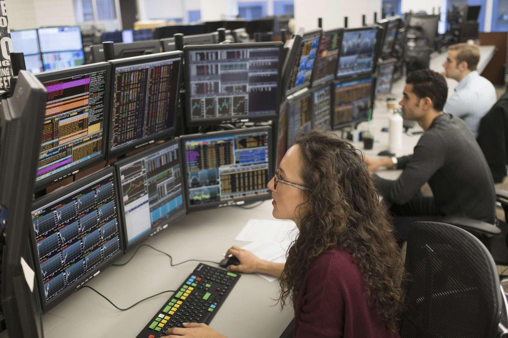

The world of financial markets trading is a dynamic and intricate ecosystem where commercial traders employ both traditional strategies and modern technological advancements to navigate the complexities of global markets. Traditional methods, rooted in fundamental and technical analysis, have long been a staple for traders seeking to interpret market trends and patterns. However, the advent of technology and, more specifically, algorithmic trading has redefined how trading is conducted.

Algorithmic trading, or algo trading, utilizes complex mathematical models and automated systems to execute trades at speeds and frequencies that far exceed human capabilities. This technological innovation has democratized trading by reducing costs and enhancing precision, making it a crucial tool for both institutional and commercial traders. By using algorithms, traders can exploit market inefficiencies and capitalize on arbitrage opportunities in a fraction of a second, executing strategies like trend following and market-making with unprecedented efficiency.



Professional traders today face a unique set of challenges and opportunities. Market volatility and unpredictability demand robust risk management strategies and strategic planning, while regulatory changes add layers of compliance requirements. Conversely, the increasing sophistication of trading technologies presents opportunities for traders to enhance their strategies and improve outcomes. The integration of artificial intelligence and machine learning into trading systems further opens doors to predictive analytics and pattern recognition, providing a competitive edge.

This article aims to explore the evolution of trading practices, emphasizing the skills and strategies that are essential for success in the ever-evolving trading landscape. From understanding the distinctions between traditional and algorithmic trading to recognizing the essential qualifications and skills for a prosperous trading career, we delve into the facets that make up the modern trading profession. With dedication, strategic thinking, and continuous learning, traders can optimize their approach and reap substantial financial and professional rewards in this fast-paced industry.

## Table of Contents

## Understanding the Trading Profession

Understanding the trading profession involves distinguishing between traders and investors, examining the various types of traders, identifying the essential skills and disciplines for trading success, and understanding the crucial role of risk management and strategic planning.

### Differences Between Traders and Investors

Traders and investors both engage in the financial markets but differ significantly in their goals and timeframes. Traders actively buy and sell financial instruments like stocks, commodities, or derivatives, aiming to profit from short-term market movements. Their objectives are often to capitalize on small price fluctuations, which require quick decision-making and an active approach. Timeframes for traders can range from seconds to weeks.

Investors, on the other hand, focus on achieving long-term growth or income. They often purchase assets with the intention of holding them for extended periods, sometimes years or even decades. Investors typically emphasize [fundamental analysis](/wiki/fundamental-analysis), seeking to identify undervalued companies with strong potential for growth. Their decisions are more driven by the intrinsic value of assets rather than day-to-day market [volatility](/wiki/volatility-trading-strategies).

### Types of Traders

1. **Proprietary Traders**: These traders work for financial firms that trade the firm’s own capital. They employ a variety of strategies and often have access to sophisticated tools and technology. The firm provides the trading capital, and traders aim to generate profits within predefined risk limits.

2. **Floor Traders**: Traditionally, floor traders operate on the trading floors of exchanges like the New York Stock Exchange. They execute trades on behalf of themselves or clients. Although electronic trading has reduced the number of floor traders, they remain a part of some exchanges, handling large orders that benefit from human negotiation.

3. **Market Makers**: Market makers provide liquidity to the markets by being ready to buy and sell securities at any time. They profit from the bid-ask spread, ensuring there's always a market for traders, even during volatile times. By maintaining a balance between supply and demand, they play a crucial role in the functioning of financial markets.

### Essential Skills and Disciplines

Successful trading requires a blend of technical skills and personal disciplines:

- **Technical Analysis**: Traders must interpret charts and price patterns to make informed decisions. Mastery of technical indicators such as moving averages, oscillators, and trend lines is vital for anticipating market movements.

- **Emotional Discipline**: Controlling emotions like fear and greed is crucial. Traders are expected to maintain composure, stick to their strategies, and avoid impulsive decisions during volatile market conditions.

- **Analytical Skills**: The ability to analyze vast amounts of data quickly helps traders react to market changes efficiently. 

- **Consistency and Adaptability**: Developing and adhering to a consistent trading plan while remaining adaptable to evolving market trends is necessary for sustained success.

### Importance of Risk Management and Strategic Planning

Risk management is integral to trading, aiming to minimize potential losses while optimizing gains. Traders utilize strategies such as stop-loss orders and position sizing to control their exposure to risk. For example, setting a stop-loss order allows traders to define a price point at which assets will be automatically sold to prevent further losses.

Strategic planning in trading involves developing a comprehensive trading plan that outlines goals, risk tolerance, asset allocation, and criteria for entering and exiting trades. A robust plan helps traders maintain focus and discipline, providing a roadmap for decision-making. Regular review and adjustment of the plan ensure alignment with market conditions and personal goals. 

In conclusion, the trading profession sits at the intersection of skill, technology, and human psychology. Understanding the distinctions between trader types, honing essential skills, and implementing rigorous risk management and strategic planning are foundational for any trading career.

## Algorithmic Trading: A New Era

Algorithmic trading, often referred to as algo trading, involves the use of computer programs and algorithms to execute trades according to predetermined criteria. This approach allows traders to execute orders at speeds and frequencies that would be difficult to achieve manually. Algo trading is essential in modern markets due to its efficiency and ability to minimize human error while maximizing the exploitation of market inefficiencies.

The rise of [algorithmic trading](/wiki/algorithmic-trading) can be attributed to its widespread adoption by institutional and commercial traders seeking competitive advantages. Institutional traders, like hedge funds and investment banks, leverage algo trading to process large volumes of transactions with minimal market impact. Commercial traders benefit from the precision and speed of algorithms, enabling them to trade more effectively in increasingly complex markets.

Technological infrastructure plays a crucial role in supporting algorithmic trading. High-frequency trading ([HFT](/wiki/high-frequency-trading-strategies)) systems require robust technology, including low-latency networks, powerful computing resources, and advanced data analytics platforms. The ability to process large datasets and execute decisions in milliseconds is facilitated by modern computing power and sophisticated algorithms.

Popular algorithmic trading strategies include [arbitrage](/wiki/arbitrage), [trend following](/wiki/trend-following), and [market making](/wiki/market-making). Arbitrage exploits price discrepancies across different markets or instruments, aiming for risk-free profit. Trend following strategies identify and capitalize on emerging market trends by analyzing historical data patterns. Market making involves providing [liquidity](/wiki/liquidity-risk-premium) to markets by maintaining buy and sell orders, profiting from the bid-ask spread. Each strategy employs complex mathematical models and statistical techniques to optimize trade execution and risk management.

The effective implementation of algorithmic trading requires a deep understanding of quantitative finance, programming skills, and market knowledge. As such, algo trading has become a cornerstone of modern financial markets, offering significant benefits in terms of speed, accuracy, and profitability.

## The Career Path of a Commercial Trader

Aspiring traders seeking a career path in the financial markets must consider various educational pathways and certifications. A bachelor's degree in finance, economics, mathematics, or a related field is typically the foundational step. These disciplines offer critical insights into market dynamics, quantitative methods, and economic principles. Additionally, advanced degrees such as a Master of Business Administration (MBA) or a Master's in Finance can enhance one's prospects, offering deeper exposure to financial theories and strategic management.

Certifications like the Chartered Financial Analyst (CFA) designation or the Financial Risk Manager (FRM) certification can significantly augment a trader's credentials. The CFA program is well-regarded for its comprehensive curriculum covering investment management, financial analysis, and ethical standards. Conversely, the FRM certification focuses on risk management, a crucial aspect of trading given the volatile nature of financial markets.

The career progression of a commercial trader typically begins with a role as a junior trader. In this entry-level position, individuals gain hands-on experience, learn to execute trades, and begin understanding different market instruments. As traders acquire experience and demonstrate competence, they may advance to roles such as senior trader or portfolio manager. Senior traders handle larger portfolios and have more autonomy, requiring advanced analytical skills and strategic acumen. Portfolio managers, on the other hand, are responsible for managing investment portfolios, making strategic buy and sell decisions to achieve financial objectives and client goals.

Further career advancement can lead to positions such as trading director or head of trading, where professionals oversee trading desks and implement broader strategic initiatives. These roles demand a deep understanding of market trends, leadership skills, and the ability to manage significant financial risks.

Traders often have the flexibility to switch roles within the trading sphere, reflecting the diversity in the profession. For instance, a proprietary trader may transition to become a market maker or even a risk manager, each role requiring a unique blend of skills and expertise. Such transitions allow traders to adapt to market changes and personal career aspirations.

The income potential for traders can be substantial but varies based on several factors, including experience, performance, and the financial institution's scale. Entry-level traders may earn a modest salary with performance-based bonuses, while senior traders and portfolio managers often receive significant bonuses contingent on successful trading outcomes and portfolio performance. Trading directors and heads of trading command higher compensation packages, reflecting their strategic roles and responsibilities.

Ultimately, achieving success and progressing in a trading career requires a combination of education, certifications, experience, and adaptability. Traders must continuously update their skills to navigate the ever-evolving financial markets landscape, ensuring long-term career viability and growth potential.

## Essential Skills for Trading Success

Technical analysis expertise and data interpretation skills are vital components in the arsenal of a successful trader. Technical analysis involves assessing statistical trends gathered from trading activity, such as price movement and [volume](/wiki/volume-trading-strategy). These skills enable traders to predict future market behavior based on historical data and chart patterns. The application of statistical tools and the interpretation of key indicators like moving averages, relative strength index (RSI), and Bollinger Bands enhance a trader's ability to make informed decisions.

In modern financial markets, programming knowledge, particularly for algorithmic trading, has become increasingly important. Algorithmic trading involves using automated pre-programmed trading instructions to execute trades based on various market conditions. This approach relies heavily on understanding programming languages such as Python, R, or C++, and frameworks like Pandas for data manipulation and NumPy for complex numerical computations. For instance, a simple moving average crossover strategy can be implemented in Python using libraries such as:

```python
import pandas as pd
import numpy as np

# assuming 'data' is a DataFrame with a 'close' column for closing prices
data['SMA_50'] = data['close'].rolling(window=50).mean()
data['SMA_200'] = data['close'].rolling(window=200).mean()
data['Signal'] = np.where(data['SMA_50'] > data['SMA_200'], 1, -1)
```

Risk management abilities are critical for maintaining long-term profitability. Effective risk management strategies protect traders from significant losses and ensure sustainable growth. Techniques such as position sizing, leveraging stop-loss orders, and setting risk/reward ratios are essential for controlling exposure to market volatility. Diversifying trading portfolios and adhering to stringent risk management protocols mitigate the adverse effects of unexpected market shifts.

Continuous education and adaptation are imperative in the ever-evolving trading landscape. The financial markets are influenced by a myriad of factors, including economic indicators, geopolitical events, and technological advancements. To stay competitive, traders must remain abreast of the latest market trends and continuously refine their strategies. This requires a commitment to learning and flexibility in adapting to new strategies and technologies, ultimately contributing to trading success. Exploring courses, attending seminars, and engaging with a community of traders are effective ways to foster professional development and adaptation.

## Challenges in Financial Markets Trading

Financial markets are characterized by their volatility and unpredictability, which pose significant challenges for traders. Volatility refers to the degree of variation in the price of a financial instrument over time, typically measured by the standard deviation of returns. This inherent volatility requires traders to constantly adapt to rapidly changing market conditions. The unpredictability of markets can result from geopolitical events, economic indicators, or sudden shifts in investor sentiment, making it difficult for traders to foresee outcomes accurately.

Psychological resilience is crucial in trading, as the profession often involves handling substantial financial risks and making fast-paced decisions under pressure. The stress of trading can lead to emotional responses such as fear and greed, which might cloud judgment and result in suboptimal trading decisions. Effective stress management techniques, such as mindfulness, meditation, and regular exercise, can assist traders in maintaining composure and making rational decisions. Additionally, establishing a disciplined approach with predefined entry and [exit](/wiki/exit-strategy) strategies helps mitigate emotional biases.

Regulatory challenges also demand attention from traders. The financial markets are subject to stringent regulations designed to protect investors and ensure market integrity. Traders must comply with diverse regulations and policies, such as the Dodd-Frank Act in the United States, which introduces reporting requirements and enhances transparency in trading activities. Adherence to these regulations involves adopting robust compliance measures, often necessitating dedicated teams and technology solutions to monitor and report trading activities. Failure to comply can result in legal repercussions and financial penalties, emphasizing the importance of a strong understanding of the regulatory landscape.

## Conclusion

Traditional and algorithmic trading together form the backbone of contemporary financial markets, each playing a pivotal role in their operation and efficiency. Traditional trading, grounded in manual processes and human intuition, provides a personal touch that is irreplaceable in certain market contexts. It allows for nuanced decision-making and the ability to respond to unforeseen factors with instinct and experience.

Conversely, algorithmic trading, driven by technological advancements, offers precision, speed, and the ability to process vast amounts of data far beyond human capability. This method capitalizes on patterns and statistical models, optimizing trades in a way that enhances market liquidity and minimizes transaction costs. Both methods collectively contribute to a diverse and robust trading ecosystem, benefiting from each other's strengths.

Aspiring traders are encouraged to develop a blend of these approaches, honing both their technical skills and market knowledge. Technical skills such as coding, statistical analysis, and understanding of trading platforms become increasingly crucial in harnessing algo trading effectively. Additionally, traditional skills like chart analysis, market sentiment assessment, and negotiation remain invaluable. This duality not only makes traders versatile but also equips them to adapt to various market conditions.

Continuous learning and adaptability are paramount for those aiming to thrive in this dynamic field. Market conditions and technologies evolve rapidly, requiring traders to stay updated through advanced certifications, market research, and educational resources. Adapting to these changes ensures a sustained competitive edge and long-term success in the financial markets.

With dedication and strategic thinking, a trading career presents substantial financial and professional rewards. The potential for high earnings is tied not only to an individual's technical prowess but also to their ability to navigate the complexities of the market effectively. A thoughtful approach combining traditional insights with technological tools can lead to sustained profitability and personal growth in the trading profession.

## Frequently Asked Questions

### What qualifications are needed for a career in trading?

A successful career in trading typically requires a strong foundation in finance, economics, or a related field. Many traders hold a bachelor's degree in these areas, while some pursue advanced degrees such as a Master of Business Administration (MBA) or a Master's in Finance. Professional certifications can also enhance a trader's qualifications and marketability. Notable certifications include the Chartered Financial Analyst (CFA), Financial Risk Manager (FRM), and Certified Market Technician (CMT), each providing specialized knowledge in areas crucial for trading.

### How does one earn and advance as a trader?

Earnings in trading are largely performance-based, often supplemented with a base salary. Trader compensation can vary significantly between entry-level positions and higher-level roles such as a portfolio manager or trading director. Career advancement typically involves taking on more significant responsibilities, such as managing larger portfolios or transitioning to leadership roles. Progression is often facilitated by accumulating extensive market experience, demonstrating consistent trading success, and developing a robust professional network.

### What role does technology play in today’s trading profession?

Technology is integral to modern trading, facilitating faster transactions, improved data analysis, and access to global markets. Advanced trading platforms and software enable traders to execute orders with high precision and speed. Additionally, technology supports the development and utilization of algorithmic trading, where systems automatically execute trades based on preset criteria. This minimizes human error and exploits market opportunities more efficiently.

### What are the differences between algorithmic and traditional trading?

Traditional trading relies on human judgement and decision-making, often involving a trader's analysis of market conditions and execution of trades. In contrast, algorithmic trading uses computer programs to implement orders based on mathematical models and statistical methods. The primary distinctions lie in speed, efficiency, and the ability to process vast amounts of data rapidly. Algorithmic trading can operate 24/7, tirelessly executing trades across different markets without the emotional biases that affect human traders.

### How can algorithmic trading improve trading outcomes?

Algorithmic trading can significantly enhance trading outcomes by increasing accuracy and reducing latency. By implementing well-designed algorithms, traders can seize opportunities faster than is possible manually, capitalizing on micro-movements in market prices. Algorithms can also incorporate sophisticated strategies such as arbitrage, trend following, and market making, optimizing trade execution. This adaptability allows traders to mitigate risks and achieve more consistent returns, as algorithms rigorously adhere to predefined criteria, reducing the impact of psychological factors.

## References & Further Reading

[1]: Bergstra, J., Bardenet, R., Bengio, Y., & Kégl, B. (2011). ["Algorithms for Hyper-Parameter Optimization."](https://dl.acm.org/doi/10.5555/2986459.2986743) Advances in Neural Information Processing Systems 24.

[2]: ["Advances in Financial Machine Learning"](https://www.amazon.com/Advances-Financial-Machine-Learning-Marcos/dp/1119482089) by Marcos Lopez de Prado

[3]: ["Evidence-Based Technical Analysis: Applying the Scientific Method and Statistical Inference to Trading Signals"](https://www.amazon.com/Evidence-Based-Technical-Analysis-Scientific-Statistical/dp/0470008741) by David Aronson

[4]: ["Machine Learning for Algorithmic Trading"](https://github.com/stefan-jansen/machine-learning-for-trading) by Stefan Jansen

[5]: ["Quantitative Trading: How to Build Your Own Algorithmic Trading Business"](https://www.amazon.com/Quantitative-Trading-Build-Algorithmic-Business/dp/1119800064) by Ernest P. Chan