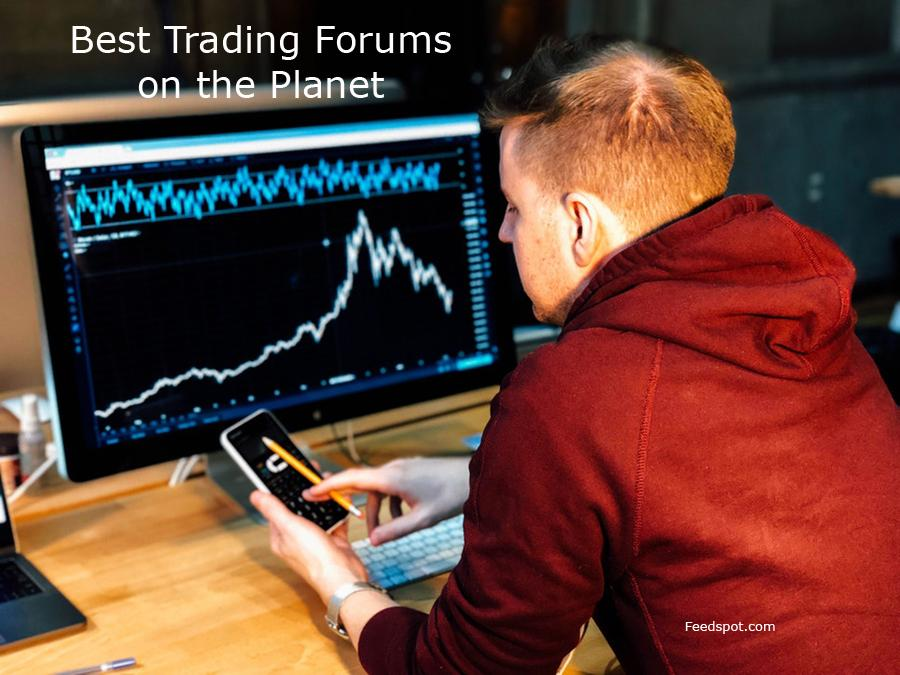

## Table of Contents

## What are trader forums and why are they important for traders?

Trader forums are online communities where people who trade stocks, forex, cryptocurrencies, and other financial instruments come together to share information and discuss trading strategies. These forums can be found on various websites and social media platforms, and they allow traders from all over the world to connect with each other. In these forums, traders can ask questions, share their experiences, and learn from others who may have more experience or different perspectives.

Trader forums are important for traders because they provide a space for learning and growth. New traders can benefit greatly from the advice and insights shared by more experienced traders. This can help them avoid common mistakes and improve their trading skills faster. Additionally, forums can offer emotional support, as trading can be stressful and it's helpful to have a community of people who understand what you're going through. By participating in trader forums, traders can stay updated on market trends, learn new strategies, and feel more connected to the trading community.

## How can a beginner find and join trader forums?

Finding and joining trader forums is easy for beginners. Start by searching online for "trader forums" or "trading communities." You'll find many websites and social media groups dedicated to trading. Some popular platforms to look at include Reddit, where you can join subreddits like r/Trading or r/Daytrading, and specialized websites like Forex Factory or Elite Trader. Once you find a forum that interests you, you usually just need to create an account to join.

After joining, take some time to read the rules and guidelines of the forum. This helps you understand what is allowed and what is not. Start by reading posts and threads to learn from others. Don't be shy to ask questions, but make sure they are clear and respectful. Engaging with the community can help you learn a lot and make new friends who share your interest in trading.

## What are the most popular trader forums for beginners?

For beginners looking to get started in trading, some of the most popular forums are Reddit's r/Trading and r/Daytrading. These are easy to join and have lots of people sharing tips and advice. You can ask questions and get help from more experienced traders. The forums are busy, so there's always something new to learn. They are great places to start because they are free and you can learn at your own pace.

Another good place for beginners is the website Forex Factory. It has a big forum where people talk about [forex](/wiki/forex-system) trading, but you can also find information on other types of trading. The forum is well-organized, so it's easy to find what you need. There are sections for beginners, so you can start with the basics and move on to more advanced topics as you learn.

Elite Trader is also popular among beginners. It has a lot of useful information and a community that is willing to help new traders. The forum covers a wide range of topics, from stocks to futures. It's a bit more advanced, but there are still plenty of resources for beginners. Joining these forums can help you learn a lot and feel more confident as you start your trading journey.

## What kind of information can traders expect to find in these forums?

In trader forums, you can find a lot of helpful information. People share tips on how to trade different markets like stocks, forex, and cryptocurrencies. They talk about trading strategies, which are plans for buying and selling. You can also read about specific trading tools and software that can make trading easier. Many traders post about their own experiences, so you can learn from their successes and mistakes. It's like having a big group of friends who are all into trading and are willing to share what they know.

There are also sections where traders discuss the latest news and trends in the market. This can help you understand what's happening and how it might affect your trades. People often ask questions and get answers from others who might know more. Sometimes, there are even live chats where traders can talk in real-time. This can be really useful if you need quick advice or want to discuss something that's happening right now in the market. Overall, trader forums are full of information that can help you become a better trader.

## How can participating in trader forums improve trading skills?

Participating in trader forums can help you get better at trading by letting you learn from other people. When you join these forums, you can read about what works and what doesn't for other traders. This can save you time and help you avoid making the same mistakes. You can also ask questions and get advice from people who have been trading for a long time. This can give you new ideas and help you understand things that you might not have known before.

Another way trader forums can improve your skills is by keeping you updated on what's happening in the market. People in these forums often talk about the latest news and trends. This can help you make better decisions when you trade. Plus, being part of a community can make trading feel less lonely. You can share your wins and losses with others who understand what you're going through. This can make you feel more confident and motivated to keep learning and improving.

## What are the etiquette and rules one should follow in trader forums?

When you join trader forums, it's important to follow the rules and be polite. Most forums have guidelines that tell you what you can and can't do. For example, you should not post spam or try to sell things to other members. It's also important to be respectful and not use bad language or insult others. If you have a question, make sure it's clear and not something that has been asked a lot before. This helps keep the forum a nice place for everyone.

Another thing to remember is to share your own experiences and knowledge. If you see someone asking for help, try to give good advice if you can. But don't pretend to know more than you do. It's okay to say you're not sure or that you're still learning. Also, don't share personal information about yourself or others. And always thank people who help you. By following these simple rules, you can make the forum a helpful and friendly place for all traders.

## How can traders contribute valuable content to forums?

Traders can contribute valuable content to forums by sharing their own experiences and lessons learned. If you've made a good trade or learned something new, write about it. Tell others what worked for you and what didn't. This can help new traders avoid common mistakes and learn faster. You can also share charts or screenshots to show what you're talking about. This makes your posts more interesting and helpful.

Another way to add value is by answering questions and giving good advice. If you see someone asking for help, try to give a clear and helpful answer. If you're not sure, it's okay to say so. You can also start new topics about things you're curious about or want to discuss. This can get other traders talking and sharing their ideas. By being active and helpful, you can make the forum a better place for everyone.

## What are the differences between various types of trader forums (e.g., stock, forex, crypto)?

Trader forums can be different depending on what they focus on, like stocks, forex, or cryptocurrencies. Stock forums are all about trading company shares. People talk about which stocks are doing well, how to pick good stocks, and what news might affect stock prices. Forex forums focus on trading different currencies. Traders share tips on how to predict currency movements and discuss economic news from around the world that can change currency values. Crypto forums are for people interested in trading digital currencies like Bitcoin. They talk about the latest trends in the crypto world, new coins, and how to use different trading platforms.

Even though these forums focus on different things, they all have some things in common. They all help traders learn from each other and stay updated on what's happening in their markets. The main difference is the kind of information and advice you'll find. In a stock forum, you might read about a company's earnings report, while in a forex forum, you might see discussions about [interest rate](/wiki/interest-rate-trading-strategies) changes. In a crypto forum, you could find people talking about a new blockchain technology. Knowing what each forum is about can help you pick the right one for your trading interests.

## How can advanced traders use forums to network and find trading opportunities?

Advanced traders can use forums to network by joining discussions and connecting with other experienced traders. They can share their own insights and learn from others, building relationships that can lead to new trading ideas and strategies. By being active and helpful, they can become known in the community, which can open doors to private groups or exclusive trading networks. These connections can be valuable for getting tips on the latest market trends or finding out about new trading opportunities before they become widely known.

Forums also allow advanced traders to find trading opportunities by staying updated on market news and trends. They can participate in real-time discussions where traders share their analyses and predictions. This can help them spot potential trades that they might not have noticed on their own. By following threads about specific stocks, currencies, or cryptocurrencies, they can get a sense of what other traders are watching and thinking, which can help them make more informed trading decisions.

## What are the potential risks and scams to watch out for in trader forums?

When you join trader forums, you need to be careful because there are some risks and scams to watch out for. Some people might try to trick you by pretending to be experts and offering to sell you their trading secrets or special software. They might promise big profits, but these are usually just ways to take your money. Also, be careful of people who try to get you to invest in certain stocks or cryptocurrencies. They might be part of a "pump and dump" scheme, where they talk up a stock to make the price go up, then sell their own shares at a profit, leaving you with losses.

Another thing to watch out for is personal information scams. Some people might try to get you to share your private details, like your email or phone number, by pretending to be friendly or helpful. They can use this information to steal your identity or money. Always be careful about what you share online. Stick to forums that have good rules and moderators who keep an eye out for bad behavior. If something sounds too good to be true, it probably is. Always do your own research before making any trading decisions based on what you read in forums.

## How can traders leverage forums for market analysis and sentiment analysis?

Traders can use forums to learn about what other people think about the market. By reading what others are saying, they can understand if most people feel good or bad about certain stocks, currencies, or cryptocurrencies. This is called sentiment analysis. For example, if a lot of people are talking about buying a certain stock, it might mean the market feels positive about it. Traders can use this information to help decide if they should buy or sell. They can also look at how people's feelings change over time to see if the market might be about to move in a new direction.

Forums are also good for market analysis. Traders can find posts where people share charts and explain why they think a stock or currency will go up or down. This can help traders learn new ways to look at the market and understand what might happen next. By joining in these discussions, traders can ask questions and get more details about why someone thinks the market will move a certain way. This can make their own analysis better and help them make smarter trading choices.

## What are some advanced strategies for using trader forums to enhance trading performance?

Advanced traders can use trader forums to get better at trading by joining special groups or chats where experienced traders share their ideas. They can learn new ways to trade and find out about market trends before most people do. By being active and helpful in these forums, they can make friends with other good traders. These friends might share secret tips or invite them to private groups where they can learn even more. This can help them make better trading decisions and find new opportunities that others might miss.

Another way advanced traders can use forums is by doing deep research and analysis. They can read lots of posts and see what many traders think about the market. This can help them understand if most people feel good or bad about certain stocks or currencies. They can also look at detailed posts where traders share charts and explain their predictions. By asking questions and discussing these ideas, advanced traders can improve their own analysis and make smarter trades. This can lead to better performance and more profits in their trading.

## References & Further Reading

[1]: ["Algorithms for Hyper-Parameter Optimization"](https://papers.nips.cc/paper/4443-algorithms-for-hyper-parameter-optimization.pdf) by Bergstra, J., Bardenet, R., Bengio, Y., & Kégl, B., Advances in Neural Information Processing Systems 24.

[2]: ["Advances in Financial Machine Learning"](https://www.amazon.com/Advances-Financial-Machine-Learning-Marcos/dp/1119482089) by Marcos Lopez de Prado

[3]: ["Evidence-Based Technical Analysis: Applying the Scientific Method and Statistical Inference to Trading Signals"](https://www.amazon.com/Evidence-Based-Technical-Analysis-Scientific-Statistical/dp/0470008741) by David Aronson

[4]: ["Machine Learning for Algorithmic Trading"](https://github.com/PacktPublishing/Machine-Learning-for-Algorithmic-Trading-Second-Edition) by Stefan Jansen

[5]: ["Quantitative Trading: How to Build Your Own Algorithmic Trading Business"](https://books.google.com/books/about/Quantitative_Trading.html?id=j70yEAAAQBAJ) by Ernest P. Chan