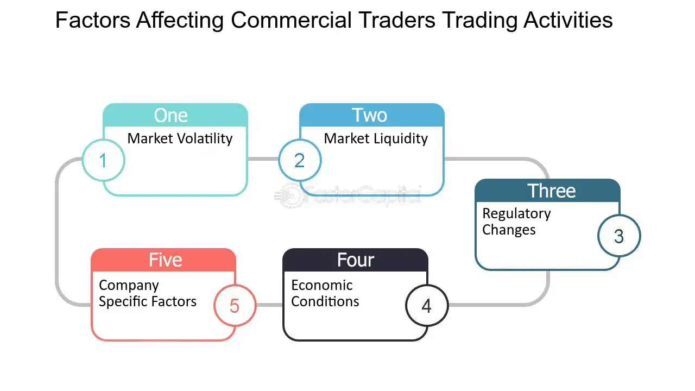

## Table of Contents

## What is a trader and what do they do?

A trader is a person who buys and sells things to make money. These things can be stocks, which are parts of companies, or other items like gold, oil, or even currencies from different countries. Traders work in many places, like big banks, special trading companies, or even from their own homes using computers.

Traders try to make money by guessing if the price of something will go up or down. If they think the price will go up, they buy it and then sell it later for more money. If they think the price will go down, they might sell it first and buy it back later for less money. This can be risky because if they guess wrong, they can lose money. Traders need to know a lot about the markets and use special tools and information to help them make good guesses.

## What are the different types of trading?

There are several types of trading, and each one is a bit different. One type is day trading. Day traders buy and sell things like stocks or currencies in one day. They don't keep them overnight. They try to make small profits many times in a day. Another type is swing trading. Swing traders hold onto their stocks or other items for a few days or weeks. They try to catch bigger price moves than day traders.

Another type of trading is position trading. Position traders keep their investments for a long time, sometimes months or years. They are not worried about small price changes every day. They focus on the big picture and long-term trends. There is also scalping, which is a very fast type of day trading. Scalpers make many trades in a day, trying to make tiny profits from small price changes. Each type of trading needs different skills and knowledge, and traders choose the type that fits their goals and how much risk they are willing to take.

## What are the basic principles of trading?

The first basic principle of trading is understanding the market. Traders need to know a lot about what they are trading, like stocks, currencies, or commodities. They need to study how prices move and why they move. This includes looking at news, economic reports, and other information that can affect prices. Traders also use charts and special tools to help them see patterns and make better guesses about where prices might go next.

Another important principle is managing risk. Trading can be risky because prices can go up or down quickly. Traders need to decide how much money they are willing to lose on each trade. They use something called a "stop-loss" to automatically sell if the price goes down too much. This helps them not lose too much money. Traders also need to be careful not to use too much money on one trade. They should spread their money around to different trades to lower the risk.

The last principle is having a trading plan and sticking to it. A good trading plan includes rules for when to buy and sell, how much money to use, and how to manage risk. Traders need to follow their plan and not let their feelings make them do something different. It's easy to get excited or scared when trading, but sticking to the plan helps traders make better decisions and be more successful in the long run.

## How does one start trading as a beginner?

To start trading as a beginner, you first need to learn about the markets. You can do this by reading books, watching videos, or taking classes about trading. It's important to understand what you want to trade, like stocks, currencies, or something else. You also need to know about the different types of trading, like day trading or swing trading, and choose the one that fits you best. Once you have some basic knowledge, you can open a trading account with a broker. A broker is a company that lets you buy and sell things. Make sure to pick a broker that is easy to use and doesn't charge too much money.

After you have your trading account set up, it's a good idea to practice before you start using real money. Many brokers offer a demo account where you can trade with fake money. This helps you get used to the trading platform and test your trading plan without risking any real money. When you feel ready, you can start trading with a small amount of real money. Remember to start slow and not risk too much at once. Keep learning and improving your skills, and always stick to your trading plan to increase your chances of success.

## What are the key financial markets a trader should know about?

A trader should know about the stock market, where people buy and sell pieces of companies called stocks. The stock market can be influenced by news about companies, the economy, and world events. Another important market is the forex market, where people trade different countries' currencies. The forex market is the biggest market in the world and it runs all the time, even on weekends. Prices in the forex market can change because of things like interest rates, inflation, and political events.

Another key market is the commodities market, where people trade things like gold, oil, and agricultural products. Commodities can be affected by supply and demand, weather, and global events. The bond market is also important, where people trade loans to governments or companies. Bonds are seen as safer than stocks but can still change in value because of interest rates and the health of the economy. Understanding these markets helps traders make better decisions and manage their risks.

## What tools and resources are essential for trading?

To trade well, you need some important tools and resources. One key tool is a trading platform, which is a computer program that lets you buy and sell things like stocks or currencies. It's important to choose a platform that is easy to use and has good features like charts and order types. Another essential tool is a charting software, which helps you see price movements and patterns. Many traders use technical analysis, which means looking at charts to guess where prices might go next. You also need a good broker, which is a company that lets you trade. A good broker has low fees, good customer service, and a reliable platform.

Another important resource is educational materials. Books, online courses, and trading videos can teach you about the markets and different trading strategies. It's a good idea to keep learning because the markets can change. You should also use news and economic reports to stay updated on what's happening in the world, as this can affect prices. Some traders use special software called trading algorithms or bots to help them make trades automatically. These tools can be helpful but they also need to be used carefully. Overall, having the right tools and resources can make a big difference in your trading success.

## How do traders manage risk and what strategies do they use?

Traders manage risk by setting rules for themselves about how much money they are willing to lose on each trade. They use something called a "stop-loss" order, which is like a safety net. If the price of what they are trading goes down too much, the stop-loss order will automatically sell it, so they don't lose more money than they planned. Traders also spread their money around to different trades instead of putting it all in one place. This is called diversification, and it helps them not lose everything if one trade goes bad.

Another way traders manage risk is by not using too much money to make trades. They might use something called leverage, which lets them trade with more money than they have, but this can be very risky. So, they use it carefully and make sure they can handle the risk. Traders also have a plan for how much they want to make on each trade and stick to it. They don't let their feelings make them change their plan, because feeling excited or scared can lead to bad decisions. By following these rules, traders can keep their losses small and give themselves a better chance to make money over time.

## What is technical analysis and how is it used in trading?

Technical analysis is a way traders look at charts to guess where the price of something might go next. They use these charts to see patterns and trends in the past prices of stocks, currencies, or other things they are trading. Traders believe that these patterns can help them predict what will happen in the future. They use different tools like moving averages, which smooth out price data to show the general direction, and indicators like the Relative Strength Index (RSI) to see if something is overbought or oversold.

Traders use technical analysis to make decisions about when to buy and sell. For example, if they see a pattern that usually means the price will go up, they might buy. If they see a pattern that usually means the price will go down, they might sell. Technical analysis helps traders make these decisions based on what they see in the charts, not just on news or their feelings. By using technical analysis, traders try to make better guesses and manage their risks in the markets.

## What is fundamental analysis and how does it differ from technical analysis?

Fundamental analysis is a way traders look at the real value of a company or other things they are trading. They do this by looking at things like the company's earnings, how much money it makes, its debts, and other financial details. They also look at bigger things like the economy, interest rates, and what's happening in the world. The idea is to figure out if the price of what they are trading is too high or too low compared to its real value. If they think it's too low, they might buy it, hoping the price will go up when other people see its real value. If they think it's too high, they might sell it, expecting the price to go down.

Fundamental analysis is different from technical analysis. While fundamental analysis looks at the real value and financial health of what is being traded, technical analysis just looks at charts and past prices. Technical analysis tries to find patterns and trends in these charts to guess where the price might go next. It doesn't care about the company's earnings or the economy; it only cares about what the charts show. Both types of analysis can be useful, and some traders use them together to make better trading decisions.

## How do global economic events influence trading decisions?

Global economic events can really change what traders do. Things like changes in interest rates, new laws, or big news stories can make prices go up or down fast. For example, if a country's central bank decides to raise interest rates, the currency of that country might get stronger. Traders who know this might buy that currency before it goes up, or sell other currencies that might go down because of the change. Wars, elections, and natural disasters can also shake up the markets because they can change how much people want to buy or sell things.

Traders need to keep an eye on these events and think about how they might affect the markets. They use news and economic reports to stay updated. If they see that something big is happening, they might change their trading plan to take advantage of the situation or to protect their money. For example, if there's a big drop in oil prices because of a new oil discovery, traders who trade oil might sell their oil before the price goes down even more. By understanding how global events can move the markets, traders can make better decisions and manage their risks.

## What are advanced trading strategies used by expert traders?

Expert traders often use a strategy called algorithmic trading. This means they use computer programs to make trades automatically. These programs follow a set of rules that the trader has made up. The rules can be based on technical analysis, like looking for certain patterns in the charts, or fundamental analysis, like buying stocks when a company's earnings are good. Algorithmic trading can help traders make trades faster and more accurately than they could by hand. It can also help them trade in many different markets at the same time, which can be hard to do without a computer.

Another advanced strategy is called hedging. Hedging is like buying insurance for your trades. If a trader thinks the price of something they own might go down, they can make another trade that will make money if the price does go down. This way, they can protect their money from big losses. For example, if a trader owns a stock and thinks the stock market might crash, they might buy something called a put option, which will make money if the stock price falls. Hedging can be complicated, but it helps expert traders manage their risks better.

## How can traders use algorithmic trading and what are its benefits and risks?

Traders use algorithmic trading by setting up computer programs that follow a set of rules to make trades automatically. These rules can be based on things like chart patterns, company earnings, or other data that the trader thinks is important. The computer program looks at this data and makes trades without the trader having to do anything. This can be helpful because the computer can make trades faster and more accurately than a person can. It can also trade in many different markets at the same time, which can be hard for a person to do.

The benefits of algorithmic trading are that it can help traders make more money and manage their risks better. Because the computer can make trades quickly, it can take advantage of small price changes that a person might miss. It can also stick to the trading plan better than a person, who might get scared or excited and make bad decisions. But there are also risks. If the rules the trader set up are not good, the computer might make bad trades and lose money. Also, if something unexpected happens in the market, the computer might not know how to react, which can lead to big losses. So, traders need to be careful and keep an eye on their algorithmic trading programs.

## References & Further Reading

[1]: Bergstra, J., Bardenet, R., Bengio, Y., & Kégl, B. (2011). ["Algorithms for Hyper-Parameter Optimization."](https://papers.nips.cc/paper/4443-algorithms-for-hyper-parameter-optimization) Advances in Neural Information Processing Systems 24.

[2]: ["Advances in Financial Machine Learning"](https://www.amazon.com/Advances-Financial-Machine-Learning-Marcos/dp/1119482089) by Marcos Lopez de Prado

[3]: ["Evidence-Based Technical Analysis: Applying the Scientific Method and Statistical Inference to Trading Signals"](https://www.amazon.com/Evidence-Based-Technical-Analysis-Scientific-Statistical/dp/0470008741) by David Aronson

[4]: ["Machine Learning for Algorithmic Trading"](https://github.com/stefan-jansen/machine-learning-for-trading) by Stefan Jansen

[5]: ["Quantitative Trading: How to Build Your Own Algorithmic Trading Business"](https://www.amazon.com/Quantitative-Trading-Build-Algorithmic-Business-ebook/dp/B097QGPVND) by Ernest P. Chan