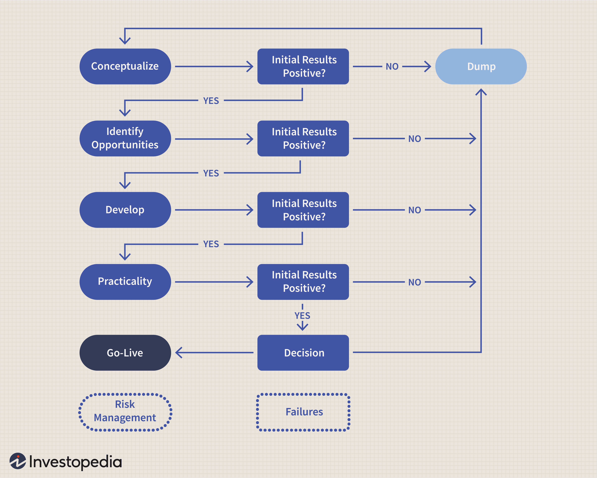

Financial markets are complex systems where assets are bought and sold, facilitating the transfer of funds between investors and institutions. These markets play a crucial role in allocating resources in an economy, determining prices for securities, and enabling companies to raise capital. There are several types of financial markets including stock markets, bond markets, forex markets, and commodities markets, each serving distinct purposes and catering to different types of assets.

Traders are an integral component of financial markets. Their primary role is to assess and interpret market conditions, making buy or sell decisions to profit from price fluctuations. Traders can be categorized into different types, such as retail traders who trade for their personal accounts, and institutional traders who work for banks or hedge funds. Their actions contribute to market liquidity and ensure efficient price discovery.



Algorithmic trading, often referred to as algo trading, has revolutionized the trading landscape by automating the execution of trading strategies. This form of trading utilizes computer algorithms to analyze market data and execute orders at optimal conditions, often faster and more efficiently than human traders can. Algorithms can follow various strategies such as trend-following, arbitrage, or market making, leveraging advanced computational techniques to gain a competitive edge.

For traders, understanding trading algorithms is pivotal. The intricacies of algorithmic trading involve knowledge of programming, data analysis, and financial markets. Mastering these elements allows traders to build, implement, and refine their strategies, potentially leading to more successful trading outcomes.

This article will explore the fundamentals of financial markets and the evolving role of traders, with a particular focus on the rise of algorithmic trading. It will discuss the key components of successful trading algorithms, how traders can leverage these techniques, and the challenges and future prospects of algo trading in today's financial environment. Adapting to technologically-driven markets is not just beneficial but necessary for traders who aim to thrive in an increasingly automated world.

## Table of Contents

## Understanding Financial Markets

Financial markets are structured systems where securities such as stocks, bonds, currencies, and commodities are traded. These markets allow individuals, companies, governments, and institutions to raise capital, transfer risk, and promote international trade.

**Types of Financial Markets**

**1. Stock Markets:** Where equity securities (stocks) are issued and traded. Stock markets are crucial for companies looking to raise capital and investors seeking equity ownership in a firm. Examples include the New York Stock Exchange (NYSE) and the Nasdaq.

**2. Bond Markets:** A platform for the issuance and trading of debt securities. Bonds enable entities to borrow money from investors with the promise of repayment plus interest. Bond markets are crucial for funding government projects and corporate expansions.

**3. Forex Markets:** The largest and most liquid market, dealing in the exchange of currencies. Forex markets are essential for international trade and investment as they facilitate currency conversion. Major currencies traded include the U.S. Dollar (USD), Euro (EUR), and Japanese Yen (JPY).

**4. Commodities Markets:** Where raw or primary products are exchanged. Commodities are classified into two categories: soft commodities (agricultural products like wheat and coffee) and hard commodities (natural resources like gold and oil).

**Global Operation of Financial Markets**

Financial markets operate on a global scale, with major financial centers in cities such as New York, London, Tokyo, and Hong Kong. These markets function through a network of buyers and sellers interacting through exchanges or over-the-counter (OTC) platforms. Technological advancements, such as electronic trading, have contributed to more efficient and rapid transactions, transcending geographical borders and creating a 24-hour financial cycle.

**Economic Importance**

Financial markets play a critical role in the economic development by facilitating capital allocation, price discovery, [liquidity](/wiki/liquidity-risk-premium) provision, and risk management. They help channel savings into productive investments, thus fostering economic growth. Moreover, these markets enable policymakers to gauge the economic outlook and make informed decisions, contributing to economic stability and resilience.

**The Role of Traders**

Historically, traders have been integral to financial markets, bridging the gap between buyers and sellers, and contributing to market liquidity and price discovery. Professional traders, whether on the trading floor or utilizing sophisticated systems, facilitate transactions, speculate based on market movements, and provide insights into market trends.

**Current Trends in Financial Markets**

The landscape of financial markets is continuously evolving, shaped by technological advancements and changing economic dynamics. Presently, there is a noticeable increase in automated trading systems and the rise of [algorithmic trading](/wiki/algorithmic-trading), which executes trades at high speeds and volumes not humanly possible. Furthermore, the development of sustainable and socially responsible investing is gaining traction, reflecting a shift in investor priorities toward ethical and sustainable business practices. Additionally, the emergence of digital assets like cryptocurrencies introduces new paradigms to financial markets, challenging traditional financial instruments and oversight.

Understanding financial markets necessitates recognizing their complexity, interconnectedness, and the critical roles they play in contemporary economic life. As these markets evolve, so must the strategies of those participating within them.

## The Role of a Trader

Traders play a crucial role in financial markets by facilitating the buying and selling of assets. Traders are typically categorized into two main types: retail and institutional. Retail traders are individuals who trade with personal funds, often through brokerage accounts, while institutional traders operate on behalf of large organizations, such as investment banks, pension funds, or hedge funds.

Successful trading demands a diverse skill set. Traders must possess strong analytical abilities to interpret market data and trends accurately. Technical skills are crucial, particularly the ability to understand and utilize trading platforms and software. Additionally, traders need excellent decision-making skills and emotional discipline to manage the psychological pressures of market fluctuations. Effective risk management is also a key skill, involving strategies to minimize potential losses.

Traditional trading methodologies predominantly relied on manual processes, where traders executed trades based on personal analysis and intuition. These methods often involved in-depth technical analysis, chart pattern recognition, and [fundamental analysis](/wiki/fundamental-analysis) of financial statements and macroeconomic indicators. In contrast, modern trading approaches have increasingly integrated technology, automating many aspects of trade execution and analysis. Algorithmic trading, a significant development in this regard, uses computer algorithms to execute trades at optimal times and prices, often at speeds beyond human capability.

Traders today face a variety of challenges. Market [volatility](/wiki/volatility-trading-strategies) and the proliferation of complex financial instruments have increased the risk and complexity of trading. Furthermore, the abundance of readily available information can lead to information overload, complicating decision-making processes. The rapid pace of technological change also requires traders to continually update their skills and adapt to new tools and platforms.

The need for technology and automation in trading has become evident as markets have evolved. Automated systems and algorithms can process vast amounts of data more efficiently than manual methods, offering the potential for higher accuracy and profitability. Moreover, algorithmic trading reduces the emotional biases that can affect human traders, providing consistency and discipline in trade execution.

Overall, the role of a trader is dynamic and requires constant adaptation to new technologies and market conditions. As the financial landscape continues to evolve, the integration of technology and the development of sophisticated algorithms are set to further transform the trading profession.

## An Introduction to Algorithmic Trading

Algorithmic trading, often abbreviated as algo trading, refers to the use of computer programs and software to execute financial trades automatically based on pre-defined criteria and mathematical models. This trading methodology has revolutionized financial markets by allowing for high-speed, accurate, and efficient execution of trades. The roots of algorithmic trading can be traced back to the early 1970s with the introduction of electronic trading systems and the subsequent advancement of computer technology. Over the decades, it has evolved significantly, transforming how trading is conducted in financial markets.

### Definition and History

Algorithmic trading involves the application of algorithms to make trading decisions. These algorithms use historical data and statistical models to predict market behavior and execute trades without human intervention. The first algorithmic trade can be linked to the New York Stock Exchange's introduction of the Designated Order Turnaround (DOT) system in 1976, which computerized trade orders.

The 1980s and 1990s saw further advancements with the advent of portfolio trading systems and the use of statistical [arbitrage](/wiki/arbitrage), enhancing the appeal of algorithmic methods to institutional investors. The increased computational power in the 21st century, alongside the expansion of electronic communication networks (ECNs), paved the way for high-frequency trading ([HFT](/wiki/high-frequency-trading-strategies)), a subset of algorithmic trading known for executing a large number of orders in fractions of a second.

### Impact on Trading Landscapes

Algorithmic trading has radically transformed trading practices by reducing transaction costs, minimizing human error, and improving market liquidity. It allows traders to execute bulk orders swiftly, which has leveled the playing field in terms of efficiency and speed. Moreover, it has broadened the accessibility to complex financial instruments, offering innovative strategies that were previously unfeasible manually.

### Types of Algorithmic Trading Strategies

Various strategies are deployed in algorithmic trading with some of the most common including:

- **Trend Following:** This strategy involves algorithms that identify and exploit trends in market prices, such as moving averages, channel breakouts, and related strategies. It relies on historical market data patterns rather than predictions.

- **Market Making:** Involves continuous buying and selling of securities to capture the spread between bid and ask prices. Market-making algorithms earn profits by executing a large volume of transactions quickly.

- **Arbitrage:** Seeks to exploit price differentials of the same asset in different markets. It generally requires sophisticated algorithms to identify and take advantage of these fleeting opportunities promptly.

- **Mean Reversion:** Assumes that asset prices will revert to their historical mean or average price over time. Algorithms identify deviations from this mean and place trades based on anticipated reversions.

### Benefits and Drawbacks

The adoption of algorithmic trading provides several advantages, including enhanced accuracy and precision in trading execution, reduced costs due to lower transaction fees, and the elimination of human emotion, which can lead to improved decision-making. Algorithmic trading also enables scalability, handling multiple accounts or assets simultaneously with ease.

However, there are drawbacks, including the dependency on technology infrastructure, which can be susceptible to glitches or cyber-attacks. The "flash crash" of 2010 is a notable example, where automated algorithms triggered a rapid, severe market downturn. Additionally, the complexity and speed of algorithmic trading can lead to a lack of transparency and increased market volatility.

### Common Misconceptions

Several myths surround algorithmic trading. One misconception is that it's exclusively used by large hedge funds or institutions; however, with the rise of retail trading platforms, individual traders are increasingly using algorithmic methods. Another fallacy is that algorithmic trading guarantees profits. While algorithms can enhance the efficiency of trades, they rely on the accuracy of their models and assumptions, which can result in losses if market conditions change unexpectedly.

Lastly, it's often believed that algorithmic trading eliminates the need for human intervention. On the contrary, the development, monitoring, and continual refinement of algorithms require in-depth human expertise and oversight to ensure their effectiveness in changing market environments.

## Key Components of a Successful Trading Algorithm

A successful trading algorithm relies on several critical components, each of which plays a vital role in its overall effectiveness and profitability. Here, we discuss the significance of these components: data, technology, market signals, risk management, and the process of [backtesting](/wiki/backtesting) and simulation.

### Importance of Data in Algorithmic Trading

Data is the backbone of any algorithmic trading strategy. It serves as the input that algorithms analyze to make informed trading decisions. High-quality data, covering various asset classes and timeframes, ensures accurate analysis and reliable outcomes. This data can be historical or real-time, including price movements, trading volumes, and economic indicators. The accessibility and accuracy of this data are crucial for developing algorithms that can accurately predict market trends and respond effectively.

### Role of Technology and Software

The development and execution of trading algorithms necessitate sophisticated technology and software. Modern platforms provide the necessary computational power and speed needed to process large datasets and execute trades rapidly. Programming languages such as Python, C++, and Java are commonly used to develop these algorithms because of their robust libraries and frameworks for data analysis and [machine learning](/wiki/machine-learning). For example, Python's libraries like Pandas for data manipulation and TensorFlow for building machine learning models are integral tools for traders.

### Understanding and Analyzing Market Signals

Market signals are indicators derived from mathematical models or machine learning techniques that suggest potential trading opportunities. The accurate interpretation of these signals can make the difference between profit and loss. Traders use various technical indicators such as moving averages, relative strength index (RSI), and Bollinger Bands to identify trends and reversals. Additionally, more advanced strategies employ machine learning models to predict price movements based on historical data patterns. Understanding these signals requires knowledge of finance, mathematics, and [statistics](/wiki/bayesian-statistics).

### Risk Management Techniques in Algo Trading

Risk management is a crucial aspect of algorithmic trading. It involves strategies to minimize potential losses and protect profits. Common techniques include setting stop-loss orders, which automatically close positions at predefined loss levels, and diversification, which involves spreading investments across different markets and asset classes to reduce exposure to any single asset. Algorithms can also incorporate position sizing models to determine the optimal amount of capital to invest based on the perceived risk of each trade.

### The Significance of Backtesting and Simulation

Backtesting is the process of testing a trading strategy on historical data to evaluate its performance. This step is essential to identify how the strategy might perform under different market conditions. Backtesting requires a robust dataset and a carefully constructed model to avoid issues such as overfitting, where a model performs well on historical data but fails on new data. Simulation extends backtesting by allowing traders to test their strategies in a virtual environment before deploying them in live markets. This process provides insights into potential challenges and allows traders to refine their algorithms accordingly.

These components form the foundation of a successful trading algorithm and contribute to its capability to function effectively in dynamic financial markets. Together, they ensure that traders can make informed decisions, manage risks, and optimize their trading strategies for maximum profitability.

## How Traders Can Leverage Algorithmic Trading

Traders looking to transition from manual trading to algorithmic trading must navigate a series of critical steps to effectively leverage technology in the financial markets. The transition, while demanding, offers significant benefits such as increased efficiency, precision, and the ability to handle vast amounts of data. Here’s how traders can embark on this journey:

### Steps to Transition from Manual Trading to Algorithmic Trading

**Choosing the Right Trading Platform and Tools**

The choice of the trading platform is foundational for successful algorithmic trading. Traders should prioritize platforms that offer robust APIs (Application Programming Interfaces), which allow for seamless integration with custom algorithms and external data sources. Popular platforms like MetaTrader, QuantConnect, and [Interactive Brokers](/wiki/interactive-brokers-api)' Trader Workstation provide extensive libraries and support for multiple programming languages, particularly Python, which is highly favored for its simplicity and powerful libraries like NumPy, pandas, and SciPy. These tools enable the development, testing, and execution of trading strategies in a streamlined manner.

**Building and Testing Your Own Trading Algorithms**

Creating effective trading algorithms requires a solid understanding of both market dynamics and programming skills. The development phase involves defining a clear trading strategy based on quantitative models. Algorithms can range from simple moving averages (SMA) to complex machine learning models. For instance, a basic moving average strategy can be implemented as:

```python
import pandas as pd

def simple_moving_average(df, window=20):
    """
    Calculates simple moving average for a given window.
    """
    return df['Close'].rolling(window=window).mean()

# Assuming 'data' is a DataFrame containing stock price data
sma = simple_moving_average(data, window=20)
```

Once developed, algorithms must undergo rigorous backtesting on historical data to ascertain their performance under different market conditions. This process helps in assessing potential risks and returns before deploying strategies in live markets.

**Collaborating with Developers and Data Scientists**

Collaboration with developers and data scientists can greatly enhance the efficiency and sophistication of trading algorithms. Developers can assist in writing optimized and scalable code, while data scientists contribute by fetching, cleaning, and analyzing large datasets to uncover patterns that might be leveraged for trading. This interdisciplinary approach ensures that the algorithms are robust and adaptable to market changes.

**Continuous Learning and Adaptation in Algorithmic Trading**

The financial markets are constantly evolving, and so must the strategies used to trade them. Continuous learning through online courses, seminars, and participation in trading communities can keep traders updated on the latest trends and tools in algorithmic trading. Moreover, iterative development and testing of trading algorithms, along with regular performance reviews, are crucial in adapting strategies to the ever-changing market landscape.

By following these steps, traders can effectively transition to algorithmic trading and harness its full potential to gain a competitive edge in the financial markets.

## Challenges and Future of Algo Trading

Algorithmic trading, while providing substantial opportunities and advantages, also presents various challenges that traders need to navigate. These challenges span regulatory, ethical, and technological domains, each requiring careful consideration to ensure successful and compliant trading operations.

### Current Challenges Faced by Traders Using Algorithmic Trading

#### Regulatory Considerations and Compliance Issues

The increasing prevalence of algorithmic trading has prompted regulators worldwide to establish guidelines to maintain market integrity and stability. Regulations often focus on aspects such as transparency, risk management, and the prevention of market manipulation. For instance, the European Union's Markets in Financial Instruments Directive II (MiFID II) mandates rigorous reporting requirements and algorithmic testing to prevent reckless trading behaviors. Traders must stay informed about these regulations and adapt their strategies accordingly to remain compliant and avoid penalties.

#### Ethical Considerations of Algorithmic Trading

Algorithmic trading raises ethical questions, particularly regarding fairness and market accessibility. High-frequency trading (HFT) strategies, which operate at speeds beyond human capability, can result in an uneven playing field, favoring the well-capitalized firms. This dynamic leads to debates on whether such advantages are ethical and how they affect market fairness. Traders and firms must consider these ethical implications and weigh the benefits of technological advancements against their potential impact on market equality and fairness.

### Innovations and Future Trends in Algorithmic Trading

Algorithmic trading continues to evolve with technological advancements, resulting in innovative strategies and tools. One significant trend is the integration of [artificial intelligence](/wiki/ai-artificial-intelligence) (AI) and machine learning (ML) into trading algorithms. These technologies enable the development of more sophisticated models capable of analyzing vast datasets, identifying patterns, and making real-time trading decisions with improved accuracy.

The adoption of AI and ML facilitates innovations such as sentiment analysis, where trading algorithms assess market sentiment from news articles, social media, and other textual data to inform trading decisions. Additionally, [reinforcement learning](/wiki/reinforcement-learning)—a subset of ML where models learn optimal strategies through trial and error—holds promise for enhancing algorithmic trading strategies by allowing models to adapt and improve autonomously.

### The Role of Artificial Intelligence and Machine Learning in the Evolution of Algo Trading

AI and ML are pivotal in shaping the future landscape of algorithmic trading. By leveraging these technologies, traders can enhance their strategies and improve performance metrics such as profitability, risk management, and market forecasting accuracy. Machine learning models, such as neural networks and decision trees, are employed to identify complex patterns and correlations that traditional methods might overlook.

A simple example of a machine learning model in trading could be a decision tree classifier predicting whether a stock's price will increase or decrease based on historical data:

```python
from sklearn.tree import DecisionTreeClassifier
from sklearn.model_selection import train_test_split

# Sample dataset of stock features and corresponding price movement
X = [[feature1, feature2], [feature3, feature4], ...]  # Input features
y = [1, 0, 1, ...]  # 1 for price increase, 0 for price decrease

# Split dataset into training and testing
X_train, X_test, y_train, y_test = train_test_split(X, y, test_size=0.2, random_state=42)

# Train decision tree classifier
clf = DecisionTreeClassifier()
clf.fit(X_train, y_train)

# Predict price movement
predictions = clf.predict(X_test)
```

This simple illustration demonstrates how machine learning techniques can be applied to develop predictive models in trading contexts.

In conclusion, navigating the challenges and embracing future trends in algorithmic trading require a balanced approach that considers regulatory compliance, ethical implications, and technological innovations. As artificial intelligence and machine learning continue to advance, their integration into trading strategies promises to redefine the future of trading, offering new opportunities and efficiencies for those adept at harnessing their potential.

## Conclusion

In conclusion, the evolving landscape of financial markets demands that traders continually adapt to new technologies. Trading no longer relies solely on traditional practices but rather on sophisticated algorithms that process massive data sets at unparalleled speeds. Understanding financial markets and the role of algorithmic trading within them has become crucial for any trader aiming to maintain a competitive edge.

Algorithmic trading represents a significant paradigm shift, offering both speed and efficiency. However, it is not without its challenges. Traders must find a balance between harnessing machine capabilities and utilizing human intuition and experience. The symbiotic relationship between humans and machines can lead to enhanced trading strategies where each complements the other's strengths.

Embracing algorithmic trading is not just an option; it's a necessity for those who want to thrive in modern financial markets. This embrace involves not only understanding the technical aspects of trading algorithms but also continually refining one's skills to keep pace with innovations. Continuous learning, collaboration with technology experts, and a keen eye on market dynamics are essential for success.

As we look to the future, there is vast potential in the integration of artificial intelligence and machine learning in trading algorithms. These technologies promise to further transform trading practices, leading to more precise and insightful decision-making. Therefore, traders are encouraged to explore, educate themselves, and push the boundaries of what is possible in algorithmic trading.

In summary, the future belongs to those who can seamlessly merge human insight with algorithmic prowess, and the journey of learning and adaptation is both an exciting and necessary endeavor for all traders.

## References & Further Reading

[1]: Bergstra, J., Bardenet, R., Bengio, Y., & Kégl, B. (2011). ["Algorithms for Hyper-Parameter Optimization."](https://papers.nips.cc/paper/4443-algorithms-for-hyper-parameter-optimization) Advances in Neural Information Processing Systems 24.

[2]: ["Advances in Financial Machine Learning"](https://www.amazon.com/Advances-Financial-Machine-Learning-Marcos/dp/1119482089) by Marcos Lopez de Prado

[3]: ["Evidence-Based Technical Analysis: Applying the Scientific Method and Statistical Inference to Trading Signals"](https://www.amazon.com/Evidence-Based-Technical-Analysis-Scientific-Statistical/dp/0470008741) by David Aronson

[4]: ["Machine Learning for Algorithmic Trading"](https://github.com/stefan-jansen/machine-learning-for-trading) by Stefan Jansen

[5]: ["Quantitative Trading: How to Build Your Own Algorithmic Trading Business"](https://www.amazon.com/Quantitative-Trading-Build-Algorithmic-Business-ebook/dp/B097QGPVND) by Ernest P. Chan