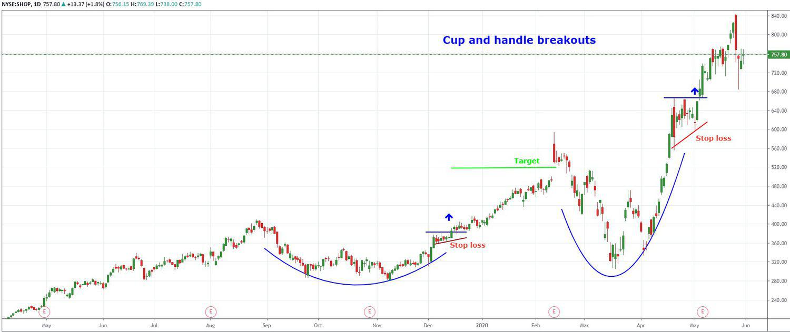

The world of financial markets is in a state of constant flux, with technology emerging as a central force in the development and improvement of trading strategies. As investors continuously strive to outperform the market, tools such as trading platforms and algorithmic trading, commonly known as algo trading, have become indispensable.

In modern finance, trading platforms are not merely interfaces for transaction execution; they are comprehensive ecosystems providing a multitude of resources crucial for market participation. Advanced platforms integrate real-time market data, technical analysis tools, risk management features, and user-friendly interfaces, which collectively enhance the investor's ability to make informed decisions quickly and accurately.



Algo trading, on the other hand, signifies a transformational approach in financial markets, employing computer algorithms to execute trading orders at speeds and frequencies far beyond human capability. Both retail and institutional investors utilize algo trading for its potential to increase efficiency, improve risk management, and optimize the execution of trading strategies.

This article aims to systematically explore the vital investor resources pertinent to financial markets today, shedding light on the evolution of trading platforms, the profound impact of algorithmic trading, and the ways they can be harnessed for successful investment outcomes. Historical perspectives will be discussed, alongside a review of leading platforms, offering insights into how algorithmic trading is reshaping market participation.

For both new and seasoned investors, navigating the complexities of financial markets requires an up-to-date understanding of the tools and strategies available. This guide is designed to equip investors with the knowledge necessary to effectively participate in today's technologically-driven trading environment.

## Table of Contents

## Essential Investor Resources for Financial Markets

In today's fast-paced trading environments, it is crucial for investors to stay informed. The complexity and immediacy of modern financial markets necessitate access to accurate data and quality education. Key platforms, such as TraderPlanet, provide an invaluable suite of resources tailored to the needs of contemporary investors. Since its establishment in 2005, TraderPlanet has evolved significantly, integrating comprehensive educational content and practical trading insights. This evolution reflects the platform’s commitment to adapting to the changing demands of investors.

TraderPlanet and similar platforms offer more than just data; they facilitate market commentary and webinars. Such curated content can be transformative, equipping investors with the knowledge to make informed decisions and respond strategically to market developments. As technology continues to integrate into financial systems, real-time data dissemination and community-driven learning become increasingly vital.

Investors can access a wide range of tools designed to enhance their proficiency in various trading strategies. Whether it’s understanding complex financial instruments or mastering trading algorithms, these resources serve as a cornerstone for personal and professional development in trading environments. Engaging with platforms like TraderPlanet allows investors to network with peers and industry professionals, gaining insights that transcend conventional learning.

To maximize success, investors are encouraged to actively engage with these resources. Comprehensive understanding and dexterity in applying trading strategies can provide significant advantages in competitive markets. The dynamic nature of financial trading requires constant adaptation and learning, which platforms like TraderPlanet adeptly support through their continued commitment to quality content and robust community engagement.

## Understanding Modern Trading Platforms

Trading platforms serve as crucial conduits for executing financial transactions, enabling participants to engage with markets efficiently and effectively. These platforms are equipped with sophisticated features that enhance the trading experience for individuals and institutions alike. Key features such as real-time data feeds, comprehensive technical analysis tools, and streamlined execution interfaces play a significant role in optimizing trading performance.

Real-time data accessibility is one of the most critical aspects of contemporary trading platforms. By providing up-to-the-minute information, traders can make swift, informed decisions in response to market fluctuations. Additionally, technical analysis tools support traders in identifying trends, patterns, and potential entry and [exit](/wiki/exit-strategy) points. These tools often include a variety of indicators and charting capabilities, allowing traders to customize their analyses based on specific strategies or preferences.

Prominent trading platforms like TradeStation, [Interactive Brokers](/wiki/interactive-brokers-api), and NinjaTrader are renowned for their diverse offerings. TradeStation, for example, is well-regarded for its robust technical analysis capabilities and customized automation features. Interactive Brokers offers a comprehensive suite of tools catering to a diverse array of asset classes, making it a popular choice for professional and institutional traders. NinjaTrader is favored for its advanced charting features and capabilities, particularly for futures and [forex](/wiki/forex-system) trading.

Algorithmic trading is increasingly integral to modern trading practices, and the ability of a platform to support such strategies can have a marked impact on trading success. Platforms that provide integration with popular programming languages enable users to develop, test, and deploy custom algorithms, facilitating automated trading processes that can operate at speeds and efficiencies unmatched by manual methods.

Choosing the right platform requires careful consideration beyond brand reputation. Investors must assess how well a platform aligns with their specific trading requirements and preferences. Factors such as user interface design, support for specific asset classes, fees and commissions, and customer service are important considerations. Furthermore, the ability to integrate third-party applications and facilitate [algorithmic trading](/wiki/algorithmic-trading) are increasingly essential for traders seeking to maintain a competitive edge.

In summary, modern trading platforms are essential tools, vital for executing trades and employing sophisticated market strategies. Their selection should be tailored to an individual trader's needs, leveraging the platform's strengths to propel trading success.

## The Role of Algorithmic Trading in Modern Markets

Algorithmic trading, a significant innovation in financial markets, fundamentally changes the landscape by automating the execution of trades using algorithms based on predetermined criteria. This approach is widely employed by both retail investors and institutional entities to improve trading outcomes through efficiency and precision.

Algorithmic trading systems function by creating a set of rules that determine trading decisions. These rules can incorporate variables like timing, price, quantity, or any mathematical model, thus reducing human intervention in market transactions. As a result, traders can execute orders at a speed and frequency impracticable for traditional human trading, capitalizing on minute price differentials at scale.

Platforms like QuantConnect and Trade Ideas have democratized access to algorithmic trading by offering robust environments for developing and testing trading strategies. These platforms facilitate users in constructing algorithms with minimal programming expertise by providing comprehensive libraries and community support. For instance, QuantConnect allows traders to employ Python-based algorithms that can be backtested on historical data, enabling them to refine their strategies before live deployment.

One of the primary advantages of algorithmic trading is heightened efficiency. By automating processes, traders can eliminate manual intervention errors and execute trades at optimal price points. Furthermore, algorithmic strategies often include advanced risk management protocols, ensuring that exposure is tightly controlled according to predefined risk thresholds.

The capability to backtest strategies against historical data is another pivotal feature of algorithmic trading. Backtesting involves applying a trading strategy to historical market data to determine how it would have performed in the past. This process allows traders to validate the effectiveness of their strategy over varied market conditions, which can drastically improve the probability of future success.

However, algorithmic trading is not without its challenges. Over-optimization, also known as curve fitting, occurs when a strategy is unduly tailored to past data, potentially rendering it ineffective in live markets. Traders must be cautious of this pitfall and ensure that their algorithms are robust and adaptable to different market environments. Additionally, an over-reliance on technology poses a risk; unexpected technical failures or latency issues can result in significant financial loss. Therefore, continuous monitoring and the implementation of fail-safes are crucial.

In summary, while the benefits of algorithmic trading are substantial, including improved efficiency, enhanced risk management, and strategy validation through [backtesting](/wiki/backtesting), investors must remain cognizant of its limitations. Addressing potential issues like over-optimization and technological reliance is essential to fully harness the potential of algorithmic trading in modern financial markets.

## Selecting the Right Trading Platform for Algo Trading

Choosing the right trading platform is crucial for the effective implementation of algorithmic trading strategies. The selection process involves careful consideration of several factors that can significantly impact trading outcomes.

**Key Features**

1. **Backtesting Capabilities**: One of the most critical features for any trading platform is its ability to support backtesting. This allows traders to evaluate their strategies against historical data, providing insights into potential performance and risk factors without committing actual capital. Platforms with robust backtesting features enable the simulation of trade execution, taking into account variables such as slippage and fees.

2. **Programming Language Integration**: The ability to integrate with popular programming languages such as Python or C++ is essential. Python, in particular, is widely favored due to its simplicity and extensive libraries like NumPy, pandas, and scikit-learn, which facilitate data analysis and the development of complex trading algorithms. For instance, the integration might allow a user to implement a Python script to calculate moving averages, execute trade signals, and optimize portfolio management.

   ```python
   import pandas as pd

   def calculate_moving_average(data, window_size):
       return data.rolling(window=window_size).mean()

   # Example usage
   price_data = pd.Series([100, 102, 104, 101, 105])
   moving_avg = calculate_moving_average(price_data, 3)
   print(moving_avg)
   ```

3. **Real-Time Data Access**: Access to real-time data is essential for making timely and informed decisions. Platforms that provide comprehensive market data enable traders to adapt to market changes swiftly, a crucial factor for strategies that rely on high-frequency trading (HFT).

**Other Considerations**

- **Cost Structure**: Understanding the cost structure of a platform is important, particularly for high-frequency traders, where transaction fees can significantly affect profitability. Transparent pricing models and competitive spreads can make a substantial difference over time.

- **User Interface**: A user-friendly interface is invaluable, especially for beginners who are navigating the complexity of algorithmic trading. Intuitive design and ease of use can reduce errors in strategy implementation and enhance the user experience.

- **Performance in High-Frequency Trading (HFT)**: For those engaging in HFT, the platform's latency and ability to execute and process trades at high speed are critical. Selection should prioritize platforms known for minimal latency and robust technical infrastructure.

**Platform Options**

Platforms such as MetaTrader and TradeStation are celebrated for their comprehensive algo trading features. MetaTrader offers a powerful combination of real-time data access, customizable indicators, and a rich library for developing automated trading strategies. Meanwhile, TradeStation provides a seamless integration with EasyLanguage, a programming language designed specifically for trading strategy development. Both cater to a wide range of users, from beginners to advanced traders seeking high customizability and sophisticated tools.

**Conclusion**

Selecting a trading platform that aligns with individual trading requirements and goals can significantly enhance the effectiveness of algorithmic strategies. By focusing on key features such as backtesting, programming integration, and real-time data access, traders can better position themselves to leverage algorithmic trading's full potential.

## TraderPlanet: A Case Study of a Resource-Rich Platform

TraderPlanet exemplifies the synergy between educational resources and potent trading tools, setting a benchmark for resource-rich platforms in the trading sector. Originally founded as TraderEducation.com, it underwent significant evolution that underscores the growing need for community-driven learning and content-rich environments. This transformation reflects a broader trend in the trading community, which increasingly values platforms that not only provide trading mechanics but enrich user knowledge through shared insights and expert guidance.

The platform's strategic acquisition of SFO Magazine is a testament to its commitment to broadening its educational portfolio. This acquisition fortified TraderPlanet’s content offerings, enabling deeper engagement with traders. By integrating diverse, high-quality educational materials, TraderPlanet empowers traders with the information necessary to refine their strategies and enhance their competitive edge in the market.

One of TraderPlanet’s distinguishing features is its functioning as a social networking site. This aspect allows it to deliver real-time trade ideas and host webinars that connect users with seasoned traders and industry experts. The platform’s community-driven approach facilitates a dynamic exchange of strategies and insights, fostering a collaborative learning environment. Such features position TraderPlanet uniquely as a hybrid of trading tools and educational resources.

Furthermore, TraderPlanet’s integrated framework foreshadows the direction in which trading platforms are headed—towards comprehensive resource ecosystems. By providing users with a suite that includes educational content, market analysis, and community interaction, TraderPlanet not only aids individual growth but also contributes to building a more informed investor cohort. This holistic approach highlights the essential role of integrated trading resources, paving the way for investors to make more informed decisions and adapt effectively to the fast-paced evolution of financial markets.

## Future Trends and Conclusion

The future of trading in financial markets is expected to be significantly shaped by technological advancements, primarily through the integration of algorithmic trading and [artificial intelligence](/wiki/ai-artificial-intelligence) (AI)-powered tools. These technologies promise increased precision, efficiency, and data-driven insights, enhancing the ability of traders to analyze market trends and execute transactions with greater accuracy.

Algorithmic trading, which relies on predefined rules and complex algorithms to automate trade executions, is poised to become even more widespread. With the advent of AI, trading systems can process large datasets at remarkable speeds, identifying patterns and making predictions that human traders would find challenging to replicate. AI algorithms can continuously learn from market data, adapting to new conditions and improving decision-making processes over time.

For traders looking to remain competitive, it is imperative to stay informed about the latest developments in trading platforms. These platforms are increasingly offering sophisticated tools that cater to the needs of modern traders. Platforms with capabilities such as real-time data analysis, high-frequency trading support, and customizable algorithms are becoming essential for success.

A disciplined approach to strategy implementation remains critical for ongoing success. While technology provides powerful tools, traders must ensure their strategies are robust and adaptable to changing market conditions. Risk management continues to be a cornerstone of successful trading, with technology augmenting the ability to monitor and mitigate risks effectively.

In conclusion, navigating the future trading landscape will rely heavily on leveraging a suite of investor resources, alongside cutting-edge trading platforms and algorithmic strategies. This combination creates a robust trading environment, equipping investors to meet the challenges and opportunities of an ever-evolving financial market. As technology progresses, the emphasis will be on harnessing these innovations to achieve strategic investment goals, ensuring sustained success and growth in the trading arena.

## References & Further Reading

[1]: Bergstra, J., Bardenet, R., Bengio, Y., & Kégl, B. (2011). ["Algorithms for Hyper-Parameter Optimization."](https://dl.acm.org/doi/10.5555/2986459.2986743) Advances in Neural Information Processing Systems 24.

[2]: ["Advances in Financial Machine Learning"](https://www.amazon.com/Advances-Financial-Machine-Learning-Marcos/dp/1119482089) by Marcos Lopez de Prado

[3]: ["Evidence-Based Technical Analysis: Applying the Scientific Method and Statistical Inference to Trading Signals"](https://www.amazon.com/Evidence-Based-Technical-Analysis-Scientific-Statistical/dp/0470008741) by David Aronson

[4]: ["Machine Learning for Algorithmic Trading"](https://github.com/stefan-jansen/machine-learning-for-trading) by Stefan Jansen

[5]: ["Quantitative Trading: How to Build Your Own Algorithmic Trading Business"](https://www.amazon.com/Quantitative-Trading-Build-Algorithmic-Business/dp/1119800064) by Ernest P. Chan