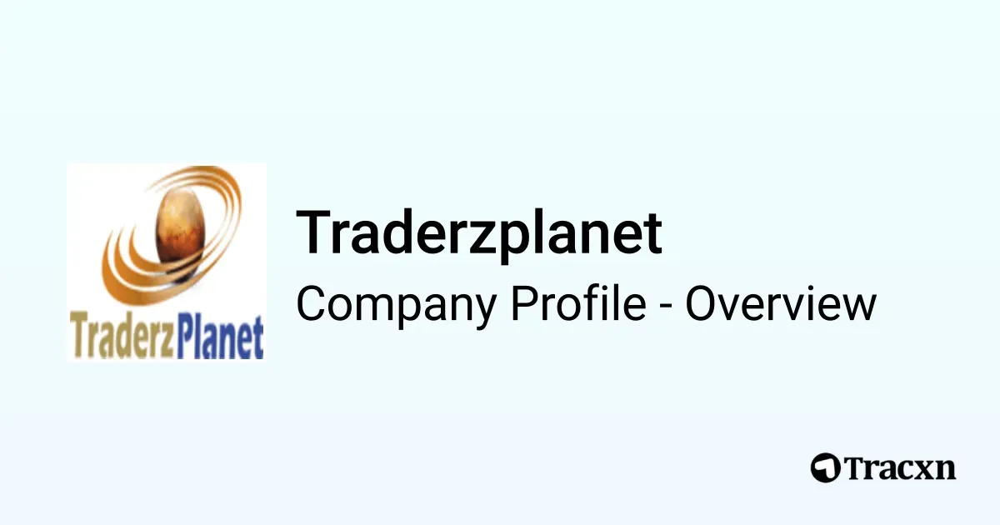

## Table of Contents

## What is TraderPlanet?

TraderPlanet is a website that helps people who trade stocks and other financial things. It's like a big community where traders can talk to each other, share ideas, and learn new things. They can join groups, read articles, and even use tools to help them make better trading decisions.

The website also has a place where traders can write about their experiences and share tips. This can be really helpful for people who are just starting out. Plus, TraderPlanet has a lot of resources, like videos and webinars, that can teach you more about trading. It's a good place for both new and experienced traders to hang out and grow their skills.

## How does TraderPlanet help beginners in trading?

TraderPlanet helps beginners in trading by giving them a friendly place to learn and ask questions. When you're new to trading, it can feel overwhelming, but TraderPlanet has a community where you can talk to other traders. They can share their experiences and give you advice on what to do. You can join groups that focus on topics you're interested in, like stock trading or forex, and learn from people who know more than you.

The website also has a lot of resources that are perfect for beginners. There are articles, videos, and webinars that explain trading in simple terms. These resources can teach you the basics and help you understand more complicated ideas as you get better. Plus, TraderPlanet has tools that can help you practice trading without risking real money, which is a great way to learn without losing anything.

Overall, TraderPlanet makes it easier for beginners to start trading by connecting them with a supportive community and providing them with easy-to-understand learning materials. It's like having a group of friends who are all into trading and want to help you succeed.

## What are the main features of TraderPlanet?

TraderPlanet is a website that helps people who want to trade stocks and other financial things. It's a big community where traders can talk to each other, share ideas, and learn new things. You can join groups that focus on different topics, like stock trading or [forex](/wiki/forex-system), and chat with other traders who have the same interests. This is a great way to get advice and learn from people who know more than you. Plus, you can read and write articles about trading, which can help you understand the market better.

The website also has a lot of resources to help you learn about trading. There are videos, webinars, and articles that explain things in simple terms, which is perfect if you're just starting out. TraderPlanet also has tools that let you practice trading without using real money. This is a safe way to try out different strategies and see what works best for you. Overall, TraderPlanet is a helpful place for both new and experienced traders to grow their skills and connect with others.

## How can one sign up for TraderPlanet?

To sign up for TraderPlanet, go to their website and look for the "Sign Up" button. It's usually at the top of the page. Click on it, and you'll see a form where you need to enter your name, email address, and choose a password. Make sure to use an email you check often because they'll send you a confirmation link. After you fill out the form, click the "Sign Up" button at the bottom.

Once you've signed up, check your email for a message from TraderPlanet. It will have a link that you need to click to confirm your account. After you click the link, you're all set! You can log in with your email and password and start exploring the website. You can join groups, read articles, and use the tools to help you with trading.

## What types of trading communities are available on TraderPlanet?

TraderPlanet has many different trading communities where people can come together to talk about their interests. There are groups for all sorts of trading, like stocks, forex, and options. If you're into stock trading, you can join a group where everyone is talking about the best stocks to buy and sell. If you're more into forex, there's a group for that too, where you can learn about different currencies and how to trade them. There are also groups for people who trade options, futures, and even cryptocurrencies.

These communities are really helpful because you can ask questions and get advice from people who know a lot about trading. For example, if you're new to trading stocks, you can join a beginner's group and ask for tips on how to get started. Or if you're interested in trading forex, you can find a group where everyone is sharing their strategies and experiences. No matter what kind of trading you're into, there's a community on TraderPlanet where you can learn and grow with other traders.

## How does TraderPlanet ensure the quality of its educational content?

TraderPlanet makes sure its educational content is good by having experts check it. They have people who know a lot about trading look at the articles, videos, and webinars before they go up on the website. This way, they can make sure the information is correct and helpful for people who want to learn about trading. If something isn't right or could be explained better, the experts will fix it.

They also listen to what their users say. TraderPlanet has a community where people can give feedback on the educational content. If a lot of people say something is hard to understand or not useful, the team at TraderPlanet will take that seriously and make changes. This helps them keep the content high quality and useful for both new and experienced traders.

## What tools does TraderPlanet offer for market analysis?

TraderPlanet offers several tools that help traders analyze the market. One of the main tools is the charting software, which lets you look at the price movements of stocks, forex, and other financial things. You can use different kinds of charts, like line charts or candlestick charts, to see how prices have changed over time. This helps you figure out if a stock is going up or down and make better trading decisions.

Another tool is the market scanner, which helps you find trading opportunities quickly. It can search through lots of stocks or other financial things and show you the ones that meet certain conditions you set. For example, you can tell it to find stocks that have gone up a lot in the last week. This saves you time and helps you focus on the best chances to make money.

## Can you explain the different subscription plans available on TraderPlanet?

TraderPlanet has different subscription plans to fit what people need. There's a free plan that lets you join the community, read some articles, and use some basic tools. It's good if you just want to try out the website and see if you like it. But if you want more, there are paid plans too. The basic paid plan gives you more articles, better tools, and access to special webinars. It costs a little bit of money every month, but it's worth it if you want to learn more about trading.

The premium plan is the best one TraderPlanet offers. It has everything from the basic plan, plus even more tools and resources. You get to use advanced charting software, join special groups, and get personal help from trading experts. This plan costs more money every month, but it's great for people who are serious about trading and want all the help they can get. No matter which plan you choose, TraderPlanet has something for everyone, from beginners to experienced traders.

## How does TraderPlanet integrate with other trading platforms?

TraderPlanet works well with other trading platforms by letting you use their tools and resources while you trade on different websites. For example, you can use TraderPlanet's charting software to look at the price movements of stocks or forex, and then use that information to make trades on another platform like E*TRADE or TD Ameritrade. This makes it easier for you to analyze the market and make better trading decisions without having to switch between different websites all the time.

The website also has a feature where you can connect your trading accounts from other platforms to TraderPlanet. This means you can see all your trades and account information in one place, which is really helpful for keeping track of everything. By working together with other trading platforms, TraderPlanet helps you get the most out of your trading experience and makes it easier to manage your investments.

## What advanced trading strategies can be learned from TraderPlanet?

TraderPlanet is a great place to learn about advanced trading strategies. One of the strategies you can learn about is called "options trading." This is when you buy and sell options, which are contracts that give you the right to buy or sell a stock at a certain price. It can be a bit tricky, but TraderPlanet has articles and webinars that explain it in simple terms. They also talk about "technical analysis," which is a way to predict what will happen to a stock's price by looking at charts and patterns. This can help you make better decisions about when to buy and sell.

Another advanced strategy you can learn on TraderPlanet is "swing trading." This is when you hold onto a stock for a few days or weeks, trying to make money from the ups and downs in its price. TraderPlanet has a community where experienced traders share their swing trading tips and strategies. They also cover "[algorithmic trading](/wiki/algorithmic-trading)," which uses computer programs to make trades automatically based on certain rules. This can be really helpful if you want to trade without having to watch the market all the time. With all these resources, TraderPlanet makes it easier for you to learn and use advanced trading strategies.

## How does TraderPlanet support professional traders?

TraderPlanet is a great place for professional traders because it has a lot of tools and resources that can help them do their job better. They can use advanced charting software to look at stock prices and find the best times to buy and sell. There are also market scanners that help them find good trading opportunities quickly. Plus, professional traders can connect their trading accounts from other platforms to TraderPlanet, so they can see all their trades in one place. This makes it easier for them to keep track of everything and make smart decisions.

The website also has a community where professional traders can talk to each other and share their experiences. They can join special groups where everyone is focused on advanced trading strategies like options trading, technical analysis, swing trading, and algorithmic trading. These groups are full of experts who can give advice and help professional traders improve their skills. With all these tools and a supportive community, TraderPlanet is a valuable resource for anyone who wants to be a successful professional trader.

## What are the future development plans for TraderPlanet?

TraderPlanet is always looking to get better and help traders even more. They are planning to add new tools that will make it easier for people to analyze the market and find good trading opportunities. They want to improve their charting software so it has more features and is easier to use. They are also thinking about adding more market scanners that can look at different kinds of financial things, like stocks, forex, and cryptocurrencies. This way, traders can find the best chances to make money no matter what they are trading.

Another thing TraderPlanet is working on is making their community even better. They want to create more special groups where traders can talk about specific topics and share their knowledge. They are also planning to have more webinars and live events where experts can teach people about advanced trading strategies. By doing all these things, TraderPlanet hopes to keep being a great place for both new and experienced traders to learn, grow, and succeed.

## References & Further Reading

[1]: Bergstra, J., Bardenet, R., Bengio, Y., & Kégl, B. (2011). ["Algorithms for Hyper-Parameter Optimization."](https://dl.acm.org/doi/10.5555/2986459.2986743) Advances in Neural Information Processing Systems 24.

[2]: ["Advances in Financial Machine Learning"](https://www.amazon.com/Advances-Financial-Machine-Learning-Marcos/dp/1119482089) by Marcos Lopez de Prado

[3]: ["Evidence-Based Technical Analysis: Applying the Scientific Method and Statistical Inference to Trading Signals"](https://www.amazon.com/Evidence-Based-Technical-Analysis-Scientific-Statistical/dp/0470008741) by David Aronson

[4]: ["Machine Learning for Algorithmic Trading"](https://github.com/stefan-jansen/machine-learning-for-trading) by Stefan Jansen

[5]: ["Quantitative Trading: How to Build Your Own Algorithmic Trading Business"](https://www.amazon.com/Quantitative-Trading-Build-Algorithmic-Business/dp/1119800064) by Ernest P. Chan