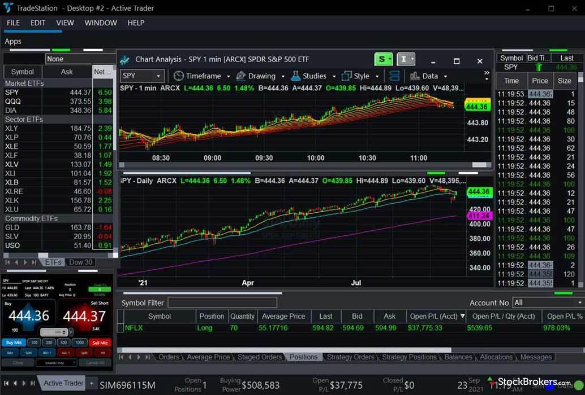

## Table of Contents

## What is TradeStation and what are its primary functions?

TradeStation is a popular online trading platform that helps people buy and sell stocks, options, futures, and other financial products. It is used by both beginner and experienced traders who want to manage their investments easily from their computers or mobile devices. The platform is known for its powerful tools and features that help users make smart trading decisions.

One of the main functions of TradeStation is to provide real-time data and advanced charting tools. This means users can see up-to-date prices and create detailed charts to analyze market trends. Another important function is the ability to use automated trading strategies. With TradeStation, users can set up their own trading rules and let the platform execute trades automatically, which can save time and help them stick to their trading plans. Overall, TradeStation makes trading easier and more efficient for its users.

## How does TradeStation cater to beginner traders?

TradeStation helps beginner traders by offering easy-to-use tools and educational resources. When you start using TradeStation, you can find a lot of tutorials and guides that explain how to trade step-by-step. They also have a practice account called a "simulated trading account" where you can try trading without using real money. This is a great way for beginners to learn without risking their savings.

Another way TradeStation helps beginners is by providing simple charts and tools that are easy to understand. You don't need to be an expert to use them. TradeStation also has customer support that can answer your questions and help you if you get stuck. This makes it easier for new traders to feel confident and learn at their own pace.

## What are the key features of TradeStation's trading platform?

TradeStation's trading platform has many key features that make it easy and powerful to use. One important feature is the advanced charting tools. These tools let you see detailed charts of stocks, options, and futures, helping you understand how prices are moving. You can also set up custom indicators on these charts to find good times to buy or sell. Another key feature is real-time data. This means you see the latest prices as they happen, which is crucial for making quick trading decisions.

Another big feature of TradeStation is its automated trading. You can create your own trading rules, called strategies, and let the platform trade for you automatically. This can save you a lot of time and help you stick to your trading plan. TradeStation also offers a simulated trading account, where you can practice trading without using real money. This is great for learning and testing your strategies before you start trading with real money.

Lastly, TradeStation provides a lot of educational resources. There are tutorials, guides, and webinars that teach you how to use the platform and understand trading better. The customer support team is also there to help you if you have any questions. All these features together make TradeStation a powerful tool for both new and experienced traders.

## How does TradeStation's pricing model work and what are the associated costs?

TradeStation has different pricing plans to fit different types of traders. For people who trade a lot, there's the TS GO plan. It's free to use, but you pay $0.60 for every stock or [ETF](/wiki/etf-trading-strategies) trade you make. If you trade options, it's $0.60 plus $0.60 for each contract. For futures, it's $1.50 per contract. This plan is good if you make a lot of trades because the more you trade, the less you pay per trade.

For people who don't trade as often, there's the TS Select plan. This one costs $99 a month, but you get lower trading fees. Stocks and ETFs cost $0 per trade, and options are just $0.60 per contract. Futures are $0.85 per contract. This plan can save you money if you don't trade every day but still want to keep costs low. Both plans include access to TradeStation's powerful tools and features, so you can choose the one that fits your trading style best.

## What types of assets can be traded on TradeStation?

TradeStation lets you trade many different types of assets. You can buy and sell stocks, which are shares in companies. You can also trade ETFs, which are funds that hold a bunch of stocks or other assets. Options are another type of asset you can trade on TradeStation. Options give you the right to buy or sell a stock at a certain price in the future. 

TradeStation also allows you to trade futures. Futures are agreements to buy or sell something like commodities or financial instruments at a set price on a future date. Besides these, you can trade mutual funds, which are pools of money from many investors used to buy a variety of securities. With all these choices, TradeStation gives you many ways to invest and trade.

## How does TradeStation support advanced trading strategies?

TradeStation supports advanced trading strategies by letting you use its powerful tools to create and automate your trading rules. You can write your own trading strategies using TradeStation's EasyLanguage, which is a simple programming language designed for traders. This means you can set up specific conditions for when to buy or sell, and the platform will follow these rules automatically. This is really helpful if you have a clear trading plan but don't want to watch the markets all the time.

Another way TradeStation supports advanced strategies is through its detailed charting and analysis tools. You can use these tools to look at market trends and patterns, helping you decide the best times to trade. TradeStation also offers [backtesting](/wiki/backtesting), where you can test your strategies using past market data to see how they would have worked. This lets you fine-tune your strategies before using them with real money. With these features, TradeStation makes it easier for you to use advanced trading techniques and improve your trading results.

## What are the mobile trading capabilities of TradeStation?

TradeStation's mobile app lets you trade on the go. You can buy and sell stocks, options, and futures right from your phone or tablet. The app is easy to use, so you can quickly check your investments and make trades whenever you need to. It also shows you real-time prices, so you always know what's happening in the market.

The mobile app has many of the same features as the desktop version. You can look at charts, set up trading strategies, and even use the practice account to try out trades without real money. This makes it easy to manage your investments no matter where you are. Plus, you can get alerts on your phone to stay updated on your trades and market changes.

## How does TradeStation integrate with third-party tools and APIs?

TradeStation makes it easy to work with other tools and apps by letting you use its API, which stands for Application Programming Interface. The API lets you connect TradeStation to other software you might use, like trading bots or custom analysis programs. This means you can pull data from TradeStation into these other tools or send trading orders from them back to TradeStation. It's like having a bridge between TradeStation and your other favorite apps, making your trading setup more powerful and flexible.

For people who like to use different tools together, TradeStation's API is really helpful. You can use it to automate your trading strategies even more or to get custom data and analysis that isn't available on TradeStation alone. Plus, TradeStation works with popular platforms like NinjaTrader and MetaTrader, so if you already use these, you can easily link them up with TradeStation. This way, you can keep using the tools you know and love while still taking advantage of what TradeStation has to offer.

## What educational resources does TradeStation offer to its users?

TradeStation has a lot of educational resources to help you learn about trading. They offer online courses and tutorials that teach you the basics of trading stocks, options, and futures. These lessons are easy to follow and cover topics like how to read charts, understand market trends, and make smart trading decisions. There are also webinars where experts talk about trading strategies and answer your questions live. This makes learning fun and interactive.

Another helpful resource is the TradeStation blog and news section. Here, you can read articles and watch videos about the latest market news and tips for trading. TradeStation also has a learning center where you can find guides and FAQs that explain how to use their platform. If you ever get stuck, you can reach out to their customer support team, who are always ready to help you understand more about trading and using TradeStation's tools.

## How does TradeStation's customer support perform, and what are the available support channels?

TradeStation's customer support is really helpful and friendly. They know a lot about trading and can answer your questions easily. You can talk to them anytime because they work 24 hours a day from Monday to Friday. They try to solve your problems quickly, so you don't have to wait long to get help.

You can reach TradeStation's support team in different ways. You can call them on the phone, which is good if you need to talk right away. Or, you can send them an email if you don't mind waiting a bit for an answer. They also have a live chat on their website, which is great if you want to type your questions and get quick replies. No matter how you choose to contact them, they're there to help you with your trading needs.

## What are the security measures implemented by TradeStation to protect user data and funds?

TradeStation takes security very seriously to keep your data and money safe. They use strong encryption to protect your information when you log in and make trades. This means your personal details and trading activities are kept private and secure. TradeStation also follows strict rules and gets checked regularly to make sure they're doing everything right to protect you.

Another way TradeStation keeps your funds safe is by using separate accounts for your money. This means your money is kept in a different place from TradeStation's own money, so it's safer. They also have insurance to protect your funds if something unexpected happens. With these measures, TradeStation works hard to make sure your trading experience is secure and worry-free.

## How does TradeStation compare to other trading platforms in terms of features and performance?

TradeStation stands out with its powerful tools and features compared to other trading platforms. It offers advanced charting and real-time data, which are essential for making smart trading decisions. Many other platforms also have these features, but TradeStation's tools are often more detailed and customizable. For example, TradeStation lets you write your own trading strategies using EasyLanguage, which not all platforms support. This makes it easier for advanced traders to automate their trades. Plus, TradeStation's simulated trading account is great for beginners to practice without risking real money, a feature that some other platforms might not offer or might charge for.

In terms of performance, TradeStation is known for being fast and reliable. It's important for traders to have a platform that works smoothly and doesn't slow down when the market is busy. TradeStation usually does well in this area, although some users might find other platforms like E*TRADE or Robinhood easier to use if they're just starting out. TradeStation's pricing can be a bit more complex with different plans, but it can be cost-effective for active traders. Overall, TradeStation is a strong choice for people who want advanced features and good performance, while other platforms might be better for those looking for simplicity and lower costs.

## References & Further Reading

[1]: Bergstra, J., Bardenet, R., Bengio, Y., & Kégl, B. (2011). ["Algorithms for Hyper-Parameter Optimization."](https://dl.acm.org/doi/10.5555/2986459.2986743) Advances in Neural Information Processing Systems 24.

[2]: ["Advances in Financial Machine Learning"](https://www.amazon.com/Advances-Financial-Machine-Learning-Marcos/dp/1119482089) by Marcos Lopez de Prado

[3]: ["Evidence-Based Technical Analysis: Applying the Scientific Method and Statistical Inference to Trading Signals"](https://www.amazon.com/Evidence-Based-Technical-Analysis-Scientific-Statistical/dp/0470008741) by David Aronson

[4]: ["Machine Learning for Algorithmic Trading"](https://github.com/stefan-jansen/machine-learning-for-trading) by Stefan Jansen

[5]: ["Quantitative Trading: How to Build Your Own Algorithmic Trading Business"](https://books.google.com/books/about/Quantitative_Trading.html?id=j70yEAAAQBAJ) by Ernest P. Chan