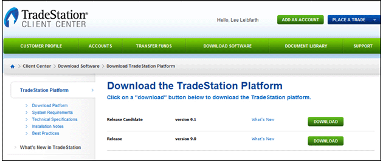

Choosing a robust trading platform is a critical decision for any trader, whether novice or experienced. The platform not only acts as a gateway to the financial markets but also provides the tools and resources necessary for effective trading. With technological advancements, the need for comprehensive platforms that support sophisticated trading strategies has become paramount. A platform that combines user-friendly interfaces with powerful trading capabilities can significantly enhance a trader's potential for success.

This article focuses on TradeStation, a popular and reputable trading platform known for its wide array of features aimed at all levels of traders. Established in the 1980s, TradeStation has consistently been at the forefront of trading technology and innovation. The platform is particularly noted for its robust suite of financial tools, which include advanced charting capabilities, a wealth of technical indicators, and a powerful analysis toolkit. Moreover, TradeStation's support for algorithmic trading is a standout feature, allowing traders to implement automated strategies, thereby optimizing their trades based on specific criteria and models.



As readers proceed through this article, they can expect to gain a comprehensive understanding of TradeStation's offerings. We will cover its historical evolution, key features that set it apart in the market, and the breadth of markets and products available to users. Additionally, the article will delve into the financial tools and technology that underpin successful trading on the platform, with a special emphasis on algorithmic trading, a technique gaining traction for its precision and efficiency.

Understanding the relevance of this review is crucial for traders aspiring to refine their trading strategies. In a market saturated with choices, identifying a platform that caters to specific trading needs and preferences can greatly impact performance. By the end of this article, traders should feel more informed about whether TradeStation aligns with their trading goals and should it become part of their strategy arsenal.

## Table of Contents

## Overview of TradeStation

TradeStation is a well-established trading platform and brokerage firm known for leveraging technology to empower traders and investors. The company was founded in 1982 by Cuban-born brothers Bill and Ralph Cruz under the name Omega Research, and since then, it has developed into a significant player in the trading industry. Originally, the company concentrated on the development of trading software. In 1991, TradeStation launched its flagship product which was designed for system testing and automated trading strategies. By 2001, the firm had transitioned into a brokerage, allowing users to execute trades directly through its platform. Over the years, TradeStation has consistently innovated to maintain its position as a go-to platform for both professional and retail traders.

TradeStation has a plethora of features designed to cater to diverse trading needs. The platform is renowned for its advanced charting capabilities, extensive analysis tools, and the ability to backtest trading strategies. Some of the main offerings include customizable charting software, high-speed order execution, and direct market access. TradeStation Mobile offers traders the flexibility to trade on the go, ensuring that they can monitor their portfolios and execute trades from anywhere. The platform also supports both web-based and desktop versions, providing versatility for different trading preferences.

Within the trading community, TradeStation enjoys a solid reputation, particularly for its robustness and the comprehensive suite of tools it provides. Many industry professionals regard it as a choice platform for serious traders focused on market analysis and strategy development. TradeStation has built its name on being an innovations leader, constantly integrating new technology and features that anticipate market needs. This has positioned it securely among the top trading platforms available.

TradeStation has evolved significantly to meet the dynamic needs of traders. The implementation of EasyLanguage, a proprietary scripting language, allows users to develop and customize their trading strategies effortlessly. This innovation made it possible for individuals without a programming background to create complex trading algorithms. Furthermore, over the years, TradeStation has expanded its capabilities to accommodate a wide range of market environments and trading styles.

The platform supports a variety of markets and products, providing opportunities in equities, options, futures, and cryptocurrencies. This diversity makes TradeStation a comprehensive trading solution for investors looking to engage in multiple asset classes. With continued technological updates and product expansion, TradeStation has shown significant adaptability in catering to the ever-evolving trading landscape, making it a versatile tool for both beginners and experienced traders seeking to optimize their trading capabilities.

## Financial Tools Offered by TradeStation

TradeStation is renowned for its comprehensive suite of financial tools tailored for both novice and seasoned traders. The platform's diverse array of tools enables users to conduct detailed market analysis, craft trading strategies, and monitor financial trends comprehensively.

One of the cornerstone offerings of TradeStation is its sophisticated charting capabilities. These tools allow traders to visualize market data through various chart types, including candlestick, bar, and line charts. The importance of such visual tools lies in their ability to help traders identify patterns, trends, and potential reversals in the market, which can significantly enhance decision-making processes.

In addition to charting, TradeStation offers a vast array of technical indicators such as moving averages, relative strength index (RSI), and Bollinger Bands. These indicators are vital as they provide insights into market [momentum](/wiki/momentum), price [volatility](/wiki/volatility-trading-strategies), and potential buy or sell signals. The platform supports over 90 pre-built indicators and allows users to customize them or create new ones through its proprietary EasyLanguage programming language.

A unique aspect of TradeStation's toolkit is the RadarScreen, which offers real-time market scanning. Unlike some competitors that might lack this feature, RadarScreen enables traders to monitor thousands of symbols simultaneously, providing a dynamic and comprehensive view of the markets. This is particularly advantageous for traders who need to track multiple assets concurrently to identify potential trading opportunities swiftly.

User experiences and reviews of TradeStation's tools generally highlight the platform's robustness and depth. Traders frequently commend TradeStation for the precision and flexibility of its tools, especially the ease with which they can tailor chart settings and indicator parameters to fit personal trading styles.

Recent updates to TradeStation have seen enhancements in their data analysis tools, focusing on speed and accuracy. The introduction of more advanced analytical models and real-time data feeds has improved the platform's responsiveness and reliability, allowing traders to make informed decisions with the most current information available.

Overall, the financial tools offered by TradeStation are designed to cater to various trader needs, providing both the breadth and depth of functionality required to compete in modern financial markets.

## Algorithmic Trading with TradeStation

Algorithmic trading, also known as algo trading, involves executing orders using automated pre-programmed trading instructions. These instructions are based on variables such as time, price, and [volume](/wiki/volume-trading-strategy), allowing for highly efficient and systematic trading. This method reduces human error, emotion-driven decision-making, and increases the speed and accuracy of trades, providing an edge in the fast-paced financial markets.

TradeStation supports [algorithmic trading](/wiki/algorithmic-trading) by offering a robust platform equipped with advanced features tailored for traders who rely on computer-based systems to execute their strategies. Central to its offering is the EasyLanguage coding environment, a proprietary programming language developed by TradeStation. EasyLanguage allows traders to design, test, and automate their unique strategies without the need for extensive programming knowledge. Here's an example of a simple moving average crossover strategy using EasyLanguage:

```plaintext
inputs: ShortLength(9), LongLength(18);

vars: ShortAverage(0), LongAverage(0);

ShortAverage = Average(Close, ShortLength);
LongAverage = Average(Close, LongLength);

if (ShortAverage crosses above LongAverage) then
    Buy("Buy") next bar at market;

if (ShortAverage crosses below LongAverage) then
    Sell("Sell") next bar at market;
```

This script buys when a short-term moving average crosses above a long-term moving average and sells when it crosses below.

Successful strategies used on TradeStation often incorporate factors like technical indicators, momentum, and risk management rules. These strategies have been effectively used in trading stocks, futures, and options markets, leveraging the capabilities of TradeStation's infrastructure.

TradeStation also provides educational resources to facilitate learning about algorithmic trading. These resources include webinars, tutorials, and comprehensive documentation on EasyLanguage. Through these learning aids, traders can enhance their coding skills and understand the nuances of developing automated strategies. The platform additionally supports [backtesting](/wiki/backtesting), allowing users to simulate their strategies against historical data to ascertain potential profitability and risk before committing capital.

By offering sophisticated tools, comprehensive support resources, and a user-friendly programming environment, TradeStation equips traders with the necessary capabilities to execute algorithmic trading strategies effectively.

## User Experience and Community

TradeStation is well-regarded for its user-friendly interface that caters to both novice and experienced traders. The platform's design is intuitive, allowing users to navigate through various features, such as charting tools, market analysis, and order execution, with relative ease. The interface's customizable nature also enables traders to tailor their workspace to fit their specific trading style, enhancing overall efficiency.

User testimonials indicate a high level of satisfaction with TradeStation's interface. Many users highlight the seamless experience and the ease with which they can execute trades and access critical data. For instance, long-time users often praise the platform's ability to handle complex trading strategies without compromising usability. A common remark in user reviews is the fluid interaction between different components of the platform, reflecting TradeStation's commitment to providing a coherent trading experience.

Community resources and forums play a crucial role in supporting TradeStation users. The platform hosts an active online community where traders can exchange ideas, discuss strategies, and troubleshoot issues. These forums are invaluable for users seeking real-world advice and mentorship from more experienced traders. Moreover, TradeStation's educational resources, including webinars and tutorials, further contribute to the user's learning curve, ensuring that all traders can maximize the platform's potential.

Customer support is a keystone of the TradeStation experience. The support team is accessible via multiple channels, including live chat, email, and telephone, providing timely assistance to users at various stages of their trading journey. This robust support system effectively addresses any technical difficulties or inquiries, thus reducing downtime and enabling traders to focus on their activities.

Commonly faced issues on TradeStation, such as occasional connectivity problems or the steep learning curve for beginners, are actively managed by the platform's support and community resources. Regular updates and a responsive support system mitigate such challenges, ensuring users can access continuous improvement without significant disruptions. The platform’s commitment to resolving these issues underscores its dedication to maintaining user satisfaction and fostering a supportive trading environment. 

In summary, TradeStation's focus on user experience and community support positions it as a distinguished platform in the trading domain. Through its intuitive interface, active community, and comprehensive support, TradeStation remains an attractive option for traders seeking a reliable and resourceful trading platform.

## Comparing TradeStation to Other Platforms

TradeStation is often compared to other prominent trading platforms like [Interactive Brokers](/wiki/interactive-brokers-api), TD Ameritrade's thinkorswim, and E*TRADE due to its comprehensive offerings for active traders and investors. Each platform has its unique strengths and limitations, which can influence the choice depending on a trader's specific needs.

**Unique Selling Points and Advantages:**

TradeStation is renowned for its advanced trading tools, particularly useful for algorithmic traders. Its proprietary EasyLanguage coding language allows users to create custom indicators and automated trading strategies with relative ease. This feature is particularly beneficial for traders who rely heavily on technical analysis and custom strategy development. Additionally, TradeStation's robust backtesting capabilities allow traders to test their strategies against historical data, providing a significant advantage in refining trading approaches.

Another strength of TradeStation is its comprehensive charting capabilities and array of technical indicators. Its platform is highly customizable, which appeals to traders who prefer a tailored trading environment. The integration of advanced order types and real-time data also positions TradeStation as a leader in functionality for active and options traders.

**Areas Where TradeStation May Fall Short:**

While TradeStation offers a powerful suite of tools, it may not be the most cost-effective choice for all traders. Unlike some competitors like Robinhood, which offers commission-free trading, TradeStation may incur higher fees, particularly when it comes to access to certain data streams or for trades conducted on its desktop platform. For novice traders or those with smaller accounts, these costs can add up.

Furthermore, while TradeStation provides excellent tools for algorithmic trading, its learning curve can be steep for beginners unfamiliar with coding or advanced trading strategies. Users new to trading platforms might find platforms like E*TRADE or TD Ameritrade's thinkorswim more user-friendly with their intuitive interfaces and simpler educational resources.

**Pricing, Tools, and Accessibility Comparisons:**

In pricing, TradeStation offers both commission-based and per-trade pricing structures, which can be more expensive than the commission-free offers from platforms like Robinhood. However, it gives advanced traders value through its powerful tools that are not available with some rivals. 

In terms of tools, while thinkorswim by TD Ameritrade also offers comprehensive charting and technical analysis tools, TradeStation edges out with its EasyLanguage and custom automation capabilities. Interactive Brokers offers broad market access and competitive pricing but might not match TradeStation’s depth in algorithmic trading tools.

Accessibility on TradeStation is primarily through its desktop application, which might limit users who prefer web-based trading platforms. In contrast, E*TRADE and thinkorswim offer both web and mobile-centric experiences, appealing to traders looking for flexibility across devices.

**Recommendations Based on Trading Needs:**

For traders who prioritize advanced algorithmic strategies, custom coding, and in-depth technical analysis, TradeStation offers substantial value despite its potential costs. Its platform is particularly suitable for experienced traders who can leverage its powerful tools to the fullest.

Conversely, for beginner traders or those with smaller budgets, exploring platforms like E*TRADE or Webull might be more suitable due to their lower costs and easier learning curve. For traders focused on mobile trading, TD Ameritrade’s thinkorswim or E*TRADE could be more aligned with their needs due to their user-friendly mobile applications.

In summary, TradeStation stands out in its technical capabilities and customizability, making it ideal for serious traders seeking advanced tools and flexibility in strategy development. However, traders should carefully consider their own trading styles and resource availability before committing to one platform over another.

## Conclusion

In conclusion, TradeStation emerges as a comprehensive trading platform that equips traders with a diverse array of tools and features essential for both novice and seasoned market participants. Its strengths lie in the robust suite of financial tools, which include advanced charts, indicators, and analysis options that facilitate informed decision-making. TradeStation's support for algorithmic trading via its EasyLanguage coding feature is another significant advantage, allowing traders to develop and implement custom strategies tailored to their specific needs and objectives.

TradeStation is particularly beneficial for traders who prioritize advanced technical analysis, seek to engage in algorithmic trading, or require a platform with a strong community and ample educational resources. Its reputation in the trading community as a reliable and innovative platform enhances its appeal, especially for users looking to evolve their trading strategies and improve performance.

However, it is crucial for individuals to assess their own trading needs and preferences when selecting a trading platform. While TradeStation offers substantial benefits, the ultimate choice should align with personal trading goals, experience level, and market focus.

For those considering TradeStation as their platform of choice, the next steps involve exploring the platform's features through a demo or trial, engaging with the community and educational resources, and identifying how its tools can best support their trading strategy. As always, thorough research and due diligence are recommended to ensure that the chosen trading platform complements one's trading ambitions effectively.

## References & Further Reading

[1]: Bergstra, J., Bardenet, R., Bengio, Y., & Kégl, B. (2011). ["Algorithms for Hyper-Parameter Optimization."](https://dl.acm.org/doi/10.5555/2986459.2986743) Advances in Neural Information Processing Systems 24.

[2]: ["Advances in Financial Machine Learning"](https://www.amazon.com/Advances-Financial-Machine-Learning-Marcos/dp/1119482089) by Marcos Lopez de Prado

[3]: ["Evidence-Based Technical Analysis: Applying the Scientific Method and Statistical Inference to Trading Signals"](https://www.amazon.com/Evidence-Based-Technical-Analysis-Scientific-Statistical/dp/0470008741) by David Aronson

[4]: ["Machine Learning for Algorithmic Trading"](https://github.com/stefan-jansen/machine-learning-for-trading) by Stefan Jansen

[5]: ["Quantitative Trading: How to Build Your Own Algorithmic Trading Business"](https://books.google.com/books/about/Quantitative_Trading.html?id=j70yEAAAQBAJ) by Ernest P. Chan