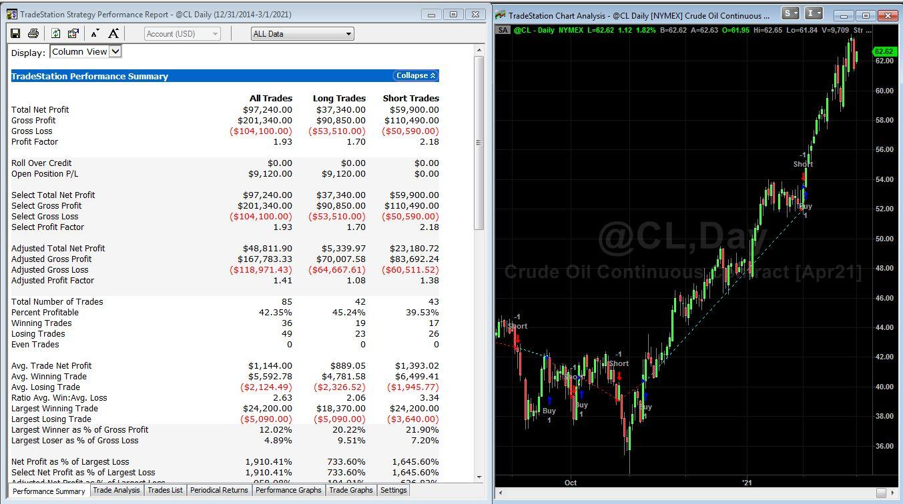

## Table of Contents

## What is TradeStation and why is it used for trading?

TradeStation is a popular online trading platform that helps people buy and sell stocks, options, futures, and other financial products. It is used by both beginner and experienced traders because it offers powerful tools and features that make trading easier and more efficient. The platform is known for its advanced charting capabilities, which allow users to analyze market trends and make informed decisions about when to buy or sell.

One of the main reasons people use TradeStation for trading is its ability to automate trading strategies. This means users can set up specific rules for buying and selling, and the platform will execute these trades automatically. This can save a lot of time and help traders take advantage of opportunities in the market without having to watch it constantly. Additionally, TradeStation provides educational resources and customer support to help users learn more about trading and improve their skills.

## How do beginners start using TradeStation for trading strategies?

Beginners can start using TradeStation for trading strategies by first opening an account on the TradeStation website. Once the account is set up, they should explore the platform's user-friendly interface and get familiar with its basic features. It's helpful to start with the educational resources provided by TradeStation, like video tutorials and guides, which explain how to use the platform and understand trading basics. This will give beginners a good foundation before they start trading with real money.

After getting comfortable with the platform, beginners can begin developing their trading strategies. TradeStation offers a feature called EasyLanguage, which is a simple programming language designed for creating automated trading strategies. Beginners can start by using pre-built strategies available on the platform or by modifying existing ones to suit their needs. It's important to practice these strategies using the platform's simulation mode, which allows users to trade with virtual money. This way, beginners can learn and refine their strategies without risking real money until they feel confident enough to start trading live.

## What are the basic trading strategies available on TradeStation?

TradeStation offers a variety of basic trading strategies that beginners can use to start trading. One common strategy is the moving average crossover, which helps traders decide when to buy or sell based on the movement of short-term and long-term moving averages. If the short-term average crosses above the long-term average, it might be a good time to buy. If it crosses below, it might be time to sell. Another basic strategy is the breakout strategy, where traders watch for a stock price to break through a certain level. If the price goes above a resistance level, it could be a signal to buy, and if it drops below a support level, it might be a signal to sell.

TradeStation also provides strategies like the Relative Strength Index (RSI) strategy, which helps traders see if a stock is overbought or oversold. If the RSI is above 70, the stock might be overbought and ready for a price drop, suggesting a time to sell. If it's below 30, the stock might be oversold and ready for a price increase, suggesting a time to buy. Lastly, the Bollinger Bands strategy is useful for spotting when a stock price is moving outside its usual range. When the price touches the upper Bollinger Band, it might be time to sell, and when it touches the lower band, it might be time to buy. These basic strategies can help beginners understand how to make trading decisions on TradeStation.

## How can one customize trading strategies in TradeStation?

Customizing trading strategies in TradeStation is easy and fun. You can use a special language called EasyLanguage to make your own rules for buying and selling. This language is simple to learn and lets you tell the computer exactly what you want it to do. For example, you might want to buy a stock when its price goes above a certain level and sell it when it drops below another level. You can write these rules in EasyLanguage and then test them to see how they work.

Once you have your basic strategy, you can make it even better by adding more rules or changing the ones you already have. TradeStation lets you play around with different ideas and see how they would have worked in the past. This is called backtesting, and it helps you see if your strategy is good before you use real money. You can also use the platform's tools to see how your strategy might do in the future. This way, you can keep making your strategy better and better until you're happy with it.

## What are the key features of TradeStation's strategy testing tools?

TradeStation's strategy testing tools are really helpful for people who want to try out their trading ideas. These tools let you test your strategies using old market data to see how they would have worked in the past. This is called backtesting. You can see if your strategy would have made money or lost money, which helps you know if it's a good idea or not. It's like playing a game where you can see what would have happened if you had used your strategy before.

Besides backtesting, TradeStation also lets you do something called forward testing. This means you can test your strategy in real-time without using real money. It's like practicing with pretend money to see how your strategy might work in the future. You can change your strategy and keep testing it until you're happy with how it performs. This way, you can make sure your strategy is ready before you start trading for real.

## How does TradeStation handle risk management in trading strategies?

TradeStation helps traders manage risk by letting them set up rules that control how much money they can lose. You can set something called a "stop-loss order," which tells the computer to sell a stock if its price drops too much. This stops you from losing too much money on one trade. TradeStation also lets you decide how much money you want to risk on each trade, so you don't bet too much on one idea.

Another way TradeStation helps with risk management is by letting you test your trading strategies before you use real money. You can see how your strategy would have worked in the past or how it might work in the future without losing any money. This helps you find out if your strategy is too risky or if it needs to be changed to be safer. By using these tools, you can make smarter choices and keep your trading safe.

## What advanced trading strategies can be implemented on TradeStation?

TradeStation lets you use advanced trading strategies like pairs trading. This means you can buy one stock and sell another at the same time if you think they will move in opposite directions. For example, if you think Coca-Cola will do better than Pepsi, you can buy Coca-Cola and sell Pepsi. This way, you can make money from the difference in their prices. TradeStation makes it easy to set up these trades and watch how they do over time.

Another advanced strategy you can use is mean reversion. This is when you think a stock's price will go back to its average after it moves a lot. If a stock's price goes way up, you might think it will come back down, so you sell it. If it goes way down, you might think it will go back up, so you buy it. TradeStation has tools that help you find these patterns and make trades based on them. You can set up rules to buy and sell automatically when you see these patterns happening.

You can also use options strategies on TradeStation, like covered calls and protective puts. A covered call means you own a stock and sell someone the right to buy it from you at a certain price. This can give you extra money while you wait for the stock to go up. A protective put means you buy an option that lets you sell a stock at a certain price if it goes down a lot. This can help you limit how much money you lose. TradeStation's platform makes it easy to set up these options strategies and manage them.

## How can users optimize their trading strategies using TradeStation's tools?

Users can optimize their trading strategies on TradeStation by using the platform's backtesting and forward testing tools. Backtesting lets you see how your strategy would have worked in the past. You can change your rules and test them again to see if they work better. This helps you find the best way to make money without losing too much. Forward testing lets you practice your strategy in real-time with pretend money. This way, you can see how your strategy might work in the future and make changes before you start trading for real.

Another way to optimize your strategies is by using TradeStation's optimization tool. This tool lets you try different settings for your strategy to see which ones work the best. For example, you can change the time you hold a stock or the price levels where you buy and sell. The tool will show you which settings make the most money. By using these tools, you can keep making your strategy better and better until you're happy with how it performs.

## What are the common pitfalls to avoid when developing strategies on TradeStation?

When developing strategies on TradeStation, one common pitfall to avoid is over-optimizing your strategy. This happens when you keep changing your rules to make them fit the past data perfectly. While this might look good in backtesting, it often doesn't work well in the real market. The market changes all the time, so a strategy that works in the past might not work in the future. It's important to keep your strategy simple and flexible, so it can handle different market conditions.

Another pitfall is ignoring risk management. It's easy to focus on making money and forget about the risks. TradeStation lets you set up stop-loss orders and decide how much money you want to risk on each trade. Not using these tools can lead to big losses. Always think about how much you could lose before you start trading. By using TradeStation's risk management features, you can protect your money and trade more safely.

## How does TradeStation integrate with other platforms or tools for enhanced trading strategies?

TradeStation makes it easy to work with other platforms and tools to help you trade better. You can connect TradeStation to other trading apps and websites using something called an API. This lets you use data and tools from other places to make your trading strategies even smarter. For example, you can get real-time news from a news website or use special analysis tools from another trading platform to help you decide when to buy and sell.

Another way TradeStation helps is by letting you use special software called add-ons. These are extra tools that you can add to TradeStation to do more things. For example, you might use an add-on to help you see what other traders are doing or to get more detailed charts. By using these add-ons, you can make your trading strategies work better and get more information to help you make good choices.

## What are the expert-level techniques for backtesting strategies on TradeStation?

When experts backtest strategies on TradeStation, they use a special way of testing called walk-forward optimization. This means they don't just look at how a strategy did in the past all at once. Instead, they break the past data into smaller parts and test the strategy step by step. They use one part of the data to make the strategy and another part to see how it works. This helps them see if the strategy can keep working well as the market changes over time. It's like practicing with different games to make sure you're good at all of them, not just one.

Another expert-level technique is using Monte Carlo simulations. This is a fancy way of saying they run the strategy many times with different random changes to see how it might do in the future. It's like playing a game over and over with different rules each time to see how you might do in all sorts of situations. By doing this, experts can see how their strategy might handle different market conditions and find out if it's strong enough to use for real trading. This helps them be more sure that their strategy will work well, even when things in the market get unpredictable.

## How can professional traders use TradeStation's API for automated trading strategies?

Professional traders can use TradeStation's API to make their trading strategies work automatically. The API lets them connect TradeStation to other tools and software they use. This means they can write special code to tell TradeStation exactly what to do, like when to buy or sell stocks, without having to do it themselves. For example, they might use the API to get real-time data from another platform and use that data to make their trading decisions faster and smarter. By using the API, professional traders can set up their strategies to run on their own, saving them time and helping them take advantage of opportunities in the market.

Using the API also helps professional traders test their strategies in a more advanced way. They can use the API to run lots of tests quickly, trying out different ideas to see what works best. This can help them find the best way to trade and make more money. They can also use the API to make sure their strategies keep working well even as the market changes. By connecting TradeStation to other powerful tools through the API, professional traders can make their trading more efficient and effective.

## References & Further Reading

[1]: Aronson, D. R. (2006). ["Evidence-Based Technical Analysis: Applying the Scientific Method and Statistical Inference to Trading Signals"](https://www.amazon.com/Evidence-Based-Technical-Analysis-Scientific-Statistical/dp/0470008741). John Wiley & Sons, Inc.

[2]: Chan, E. P. (2009). ["Quantitative Trading: How to Build Your Own Algorithmic Trading Business"](https://github.com/ftvision/quant_trading_echan_book). Wiley Trading.

[3]: Jansen, S. (2020). ["Machine Learning for Algorithmic Trading: Predictive Models to Extract Signals from Market and Alternative Data for Systematic Trading Strategies with Python, 2nd Edition"](https://www.amazon.com/Machine-Learning-Algorithmic-Trading-alternative/dp/1839217715). Packt Publishing.

[4]: Lopez de Prado, M. (2018). ["Advances in Financial Machine Learning"](https://books.google.com/books/about/Advances_in_Financial_Machine_Learning.html?id=oU9KDwAAQBAJ). Wiley.

[5]: Pardo, R. (2008). ["The Evaluation and Optimization of Trading Strategies"](https://onlinelibrary.wiley.com/doi/book/10.1002/9781119196969). Wiley Trading.

[6]: Pardo, R. (2011). ["Design, Testing, and Optimization of Trading Systems"](https://onlinelibrary.wiley.com/doi/book/10.1002/9781119196969). Wiley Trading.