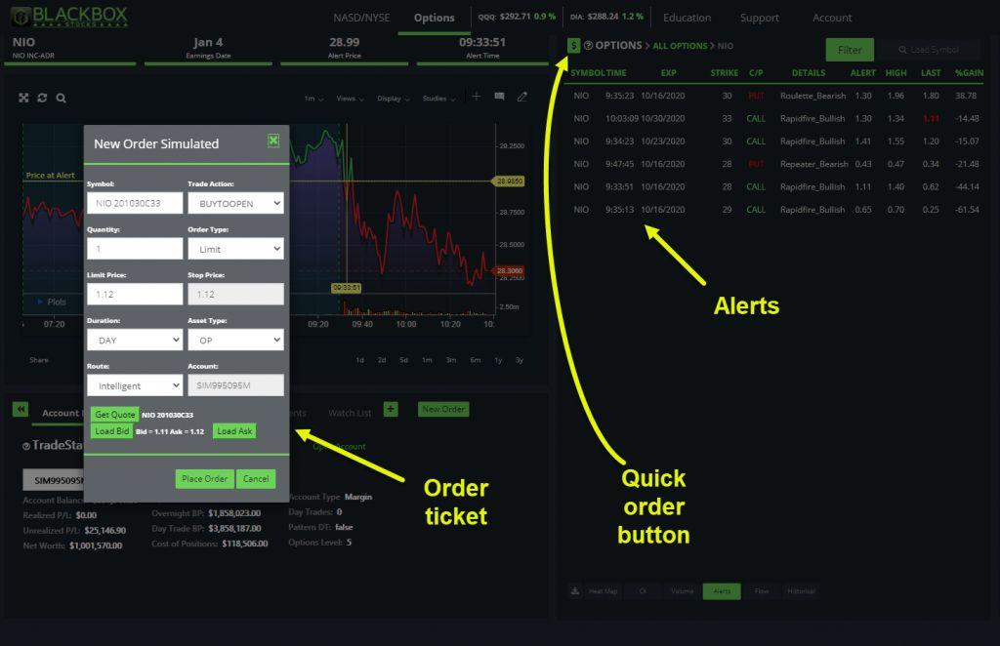

## Table of Contents

## What is TradeStation and what services does it offer?

TradeStation is a company that helps people buy and sell stocks, options, futures, and other financial products. It's like a store where you can trade different things to try to make money. They have tools and software that make it easier for you to see what's happening in the market and make smart choices about what to buy or sell.

TradeStation also offers different services to help you manage your money. They have educational resources like videos and articles that teach you about investing. They also have customer support to help you if you have questions or problems. Plus, they offer different types of accounts, so whether you're just starting out or you're an experienced trader, they have options that can fit your needs.

## How can I open an account with TradeStation?

To open an account with TradeStation, you first need to visit their website. Look for a button or link that says something like "Open an Account" or "Get Started." Click on it, and you'll be taken to a form where you'll need to fill in your personal information like your name, address, and Social Security number. Make sure all the details are correct because they'll use this information to set up your account and verify your identity.

After you submit your information, TradeStation will review it. This might take a little while, so be patient. Once they approve your application, you'll need to fund your account. You can do this by transferring money from your bank account. TradeStation will give you instructions on how to do this. Once your account is funded, you're ready to start trading! If you have any questions along the way, you can always reach out to their customer support for help.

## What are the fees associated with using TradeStation?

TradeStation charges different fees depending on what you want to do. For example, if you want to trade stocks, you might pay a fee of around $0.60 per trade if you don't trade very often. But if you trade a lot, you can get a lower fee or even no fee at all if you meet certain conditions. For options, the fee is usually $0.60 plus $0.00 per contract. Futures trading has a fee of about $1.50 per contract. These fees can change, so it's good to check their website for the most up-to-date information.

There are also other fees you might have to pay. For instance, if you want to use TradeStation's special software, there might be a monthly fee for that. And if you want to withdraw money from your account, there might be a fee for that too. It's important to read all the information carefully so you know what you might have to pay. If you're not sure about something, you can always ask their customer support team for help.

## Can you explain the TradeStation platform interface for beginners?

When you first log into the TradeStation platform, you'll see a main screen that shows you a lot of information. At the top, there's a menu bar where you can click to see different parts of the platform, like your account details or trading tools. In the middle, there's usually a big chart that shows how the stock market is doing right now. You can change this chart to look at different stocks or other things you want to trade. On the sides, you'll see lists of stocks and other things you can buy or sell, and sometimes there are news updates or alerts about the market.

The platform is set up to help you make trades easily. If you want to buy or sell something, you can click on it from the list, and a window will pop up where you can enter how much you want to buy or sell and at what price. There are also buttons and tools to help you set up orders that happen automatically, like if you want to buy a stock only if it reaches a certain price. If you're new to trading, you might want to explore the educational section, where you can find videos and guides that explain how to use the platform and learn about trading.

## What types of investment products can I trade on TradeStation?

TradeStation lets you trade many different types of investment products. You can buy and sell stocks, which are pieces of ownership in companies. You can also trade options, which are contracts that give you the right to buy or sell stocks at a certain price. Another thing you can trade is futures, which are agreements to buy or sell something at a future date. If you're interested in trading money from different countries, you can trade forex, which is short for foreign exchange. TradeStation also offers the ability to trade mutual funds and exchange-traded funds (ETFs), which are collections of different investments put together.

In addition to these, TradeStation allows you to trade bonds, which are loans you give to companies or governments that they pay back with interest. You can also trade cryptocurrencies like Bitcoin and Ethereum if you're interested in digital money. TradeStation has a wide range of products, so whether you want to invest in traditional things like stocks and bonds or newer things like crypto, you can find something that fits your interests and goals.

## How does TradeStation's trading technology and tools benefit experienced traders?

TradeStation's trading technology and tools are really helpful for experienced traders. They have a powerful software that lets you see detailed charts and graphs. These charts can show you how prices have changed over time, which can help you make smart decisions about when to buy or sell. The platform also lets you set up automatic trades, so you can tell it to buy or sell something when it reaches a certain price, even if you're not watching the screen. This can save you time and help you take advantage of opportunities in the market.

Another great thing about TradeStation is that it has lots of tools for analyzing the market. Experienced traders can use these tools to look at trends and patterns, which can help them predict what might happen next. The platform also lets you test your trading strategies using past data, so you can see how well they might work before you use real money. All these features together make TradeStation a good choice for people who know a lot about trading and want to use advanced tools to improve their results.

## What are the educational resources available on TradeStation for users at different skill levels?

TradeStation has a lot of educational resources that can help people who are just starting out with trading as well as those who have been doing it for a while. For beginners, they have videos and articles that explain the basics of trading. These resources cover things like what stocks are, how to read a stock chart, and how to place a trade. They also have a glossary that explains trading terms in simple language, which can be really helpful if you're new to all of this.

For more experienced traders, TradeStation offers advanced courses and webinars that go into more detail about different trading strategies and market analysis. These resources can help you learn about technical analysis, which is a way to predict future price movements by looking at past data. They also have tools where you can practice trading with fake money, which lets you test out your strategies without risking real money. This way, you can get better at trading before you start using your own money.

## How does TradeStation's mobile app compare to its desktop version?

TradeStation's mobile app is great for people who want to trade on the go. It has a lot of the same features as the desktop version, but everything is made to work well on a smaller screen. You can see charts and place trades easily, and there are tools to help you analyze the market. The app is user-friendly, so even if you're new to trading, you can figure out how to use it. But, the mobile app might not have all the advanced features that the desktop version has, so if you need those, you might want to use the desktop version.

The desktop version of TradeStation is more powerful and has more tools for experienced traders. It has a bigger screen, so you can see more information at once, and it's easier to set up complex trades. You can customize the layout to fit how you like to trade, and there are more options for analyzing the market. If you're someone who trades a lot or uses advanced strategies, the desktop version might be better for you. But if you need to trade while you're away from your computer, the mobile app is a good choice because it still gives you access to the most important features.

## What advanced charting and analysis tools does TradeStation offer?

TradeStation has a lot of cool tools that help you see what's happening in the market and make smart choices about buying and selling. One of the best things is the advanced charting. You can see how prices have changed over time with different types of charts like line charts, bar charts, and candlestick charts. You can also add things called indicators, which are lines or other marks on the chart that help you understand trends and patterns. For example, you can use moving averages to see if a stock is going up or down over time. These charts can be customized a lot, so you can make them look the way you want and show the information that's most important to you.

Another great feature is the analysis tools. TradeStation lets you do something called backtesting, where you can test your trading ideas using old market data. This means you can see how well your strategy might have worked in the past before you try it with real money. There are also tools for technical analysis, which help you predict what might happen next by looking at past price movements. You can use these tools to find patterns that might tell you when to buy or sell. All these tools together make TradeStation a powerful platform for people who want to do a deep dive into the market and make the best trading decisions possible.

## How can I use TradeStation's automated trading features?

TradeStation's automated trading features let you set up trades that happen automatically without you having to watch the market all the time. You can do this by creating something called a trading strategy. A strategy is like a set of rules that tells the computer when to buy or sell something. For example, you might tell it to buy a stock if the price goes above a certain level, and sell it if the price goes below another level. Once you've made your strategy, you can test it using past market data to see how well it might work. This is called backtesting. If you like how your strategy performs, you can then use it for real trading.

To use these automated features, you'll need to go to the TradeStation platform and find the section where you can create and manage your strategies. There, you can use a special language called EasyLanguage to write your rules. Don't worry if you're not good with computers; TradeStation has tools that help you build strategies without needing to know a lot about coding. Once your strategy is set up and tested, you can turn it on to start trading automatically. This way, you can let the computer do the work for you, even when you're not watching the market.

## What are some strategies for maximizing returns using TradeStation?

One good way to make more money using TradeStation is to use the platform's tools to study the market carefully. You can look at charts and use indicators to find patterns that show when a stock might go up or down. TradeStation lets you test your ideas with old data to see if they would have worked in the past. This can help you feel more sure about your choices before you use real money. Also, setting up automatic trades can help you take advantage of the market without having to watch it all the time. You can tell the computer to buy or sell at certain prices, so you don't miss out on good opportunities.

Another strategy is to use TradeStation's educational resources to keep learning. The more you know about trading, the better choices you can make. TradeStation has videos, articles, and courses that can teach you new things, even if you've been trading for a while. It's also important to manage your risks. Don't put all your money into one stock or trade. Spread it out so that if one thing doesn't go well, you still have other chances to make money. Using TradeStation's tools to set stop-loss orders can help you limit how much you might lose on a trade, which is a smart way to protect your money.

## How does TradeStation's customer support and community resources cater to both novice and expert traders?

TradeStation's customer support is really helpful for both people who are new to trading and those who have been doing it for a long time. If you're just starting out, you can call, email, or chat with their support team to ask questions about how to use the platform or understand trading basics. They have people who can explain things in a simple way so you can learn quickly. For experienced traders, the support team can help with more complicated questions about advanced features or strategies. They also have a help center with lots of articles and guides that you can read to find answers to your questions.

TradeStation also has a community where traders can talk to each other and share ideas. This is great for both beginners and experts. If you're new, you can ask other traders for advice and learn from their experiences. The community often has forums and discussion groups where you can see what others are saying about the market. For experienced traders, the community can be a place to share your own strategies and get feedback from others. TradeStation sometimes hosts events and webinars where you can learn from experts and other traders. This way, everyone can keep learning and improving their trading skills.

## References & Further Reading

[1]: ["Technical Analysis of the Financial Markets: A Comprehensive Guide to Trading Methods and Applications"](https://www.amazon.com/Technical-Analysis-Financial-Markets-Comprehensive/dp/0735200661) by John J. Murphy

[2]: ["Algorithmic Trading: Winning Strategies and Their Rationale"](https://www.wiley.com/en-us/Algorithmic+Trading%3A+Winning+Strategies+and+Their+Rationale-p-9781118460146) by Ernie Chan

[3]: ["Advances in Financial Machine Learning"](https://www.amazon.com/Advances-Financial-Machine-Learning-Marcos/dp/1119482089) by Marcos Lopez de Prado

[4]: ["Machine Learning for Algorithmic Trading"](https://github.com/stefan-jansen/machine-learning-for-trading) by Stefan Jansen

[5]: ["Quantitative Trading: How to Build Your Own Algorithmic Trading Business"](https://books.google.com/books/about/Quantitative_Trading.html?id=j70yEAAAQBAJ) by Ernest P. Chan