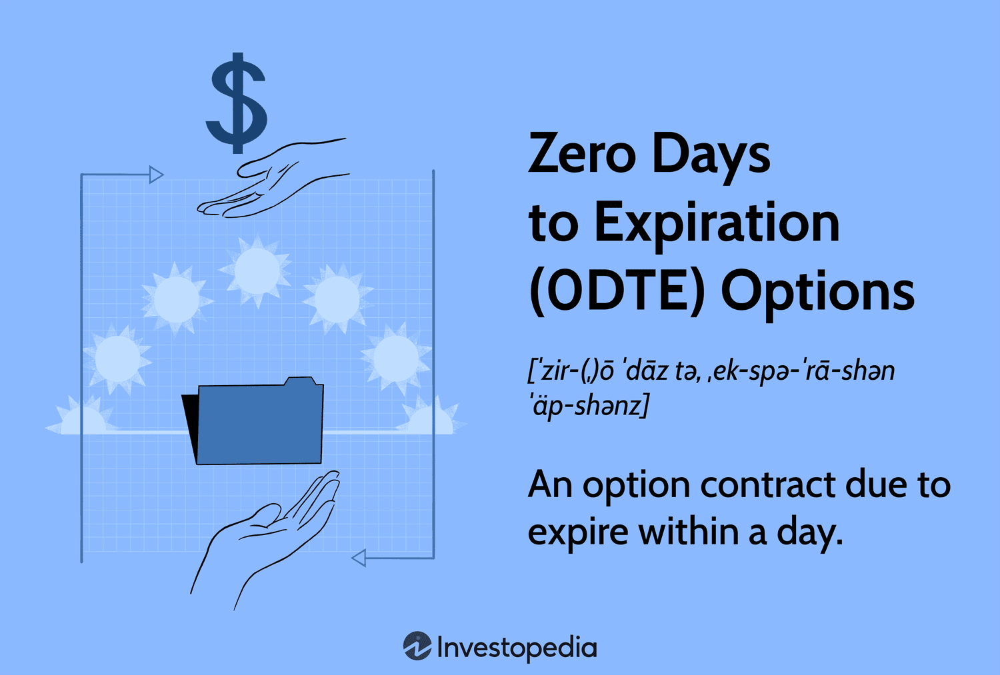

## Table of Contents

## What are 0DTE options?

0DTE options, or "zero days to expiration" options, are financial contracts that expire on the same day they are traded. They are a type of option that gives the buyer the right, but not the obligation, to buy or sell an underlying asset at a set price before the end of the trading day. Because they expire so quickly, 0DTE options are considered very risky. Traders use them to try to make quick profits from small movements in the price of the underlying asset, like a stock or an index.

These options can be exciting because they can lead to big gains in a short time, but they can also lead to big losses just as fast. The fast expiration means there's less time for the price of the asset to move in the direction the trader hopes, which increases the risk. Many traders use 0DTE options for speculation, trying to predict short-term price movements, while others might use them to hedge other investments. Because of their high risk and potential for rapid changes in value, 0DTE options are usually more suitable for experienced traders.

## How do 0DTE options differ from other options?

0DTE options are different from other options because they expire on the same day they are traded. Most other options have expiration dates that are weeks, months, or even years away. This short lifespan makes 0DTE options very risky and fast-paced. They are like trying to catch a quick-moving train, where you have to make a decision and act very quickly. Because they expire so soon, the price of 0DTE options can change a lot in a short time, making them exciting but also dangerous for traders.

Another way 0DTE options differ is in how traders use them. While longer-term options might be used for strategies that involve holding positions for a while, 0DTE options are often used for quick, short-term bets on where the price of an asset will go that day. They are popular among traders looking to make quick profits from small price movements. However, this also means that if the price doesn't move as expected, the trader can lose money very quickly. So, while other options might give you more time to be right about your prediction, 0DTE options don't offer that luxury.

## What are the risks associated with trading 0DTE options?

Trading 0DTE options is very risky because they expire the same day you buy them. This means you have very little time for the price of the stock or asset to move in the direction you want. If it doesn't move fast enough, you can lose all your money on the option very quickly. It's like trying to win a race that's only a few seconds long. Because the time is so short, even a small mistake or a small change in the market can lead to big losses.

Another risk is that 0DTE options can be very hard to predict. Since they only last for a day, they are affected a lot by what's happening in the market right at that moment. Things like news, events, or even rumors can make the price go up and down a lot. This makes it hard to guess what will happen, and if you guess wrong, you can lose money fast. It's like trying to hit a moving target that's always changing speed and direction. Because of these risks, 0DTE options are usually best for experienced traders who can handle the fast pace and unpredictability.

## What are the potential benefits of trading 0DTE options?

Trading 0DTE options can offer the chance to make quick profits. Because these options expire the same day, they can move a lot in price in a short time. If you guess right about which way the price of a stock or an asset will go that day, you can make money fast. It's like trying to catch a fast-moving train and if you do it right, you can get a big reward. This quick turnaround can be exciting for traders who like the thrill of fast-paced trading.

Another benefit is that 0DTE options can be used to hedge other investments. If you have other stocks or assets that you're worried about, you can use 0DTE options to protect against sudden drops in their value. For example, if you think a stock you own might go down that day, you can buy a 0DTE option that goes up if the stock goes down, which can help reduce your losses. This can be a useful tool for managing risk, but it does require a good understanding of how options work and how the market moves.

## How can beginners start trading 0DTE options safely?

For beginners wanting to start trading 0DTE options safely, it's important to learn as much as you can first. 0DTE options can be very risky because they expire the same day you buy them. So, before you start, read [books](/wiki/algo-trading-books), watch videos, and maybe even take a class on options trading. It's also a good idea to practice with a pretend account, called a demo account, where you can trade without using real money. This way, you can get a feel for how 0DTE options work without risking your savings.

Once you feel more confident, start small. Only use money you can afford to lose, because there's a good chance you might lose it all with 0DTE options. Also, try to trade during less busy times of the day when the market isn't moving as fast. This can give you a little more time to make decisions without feeling rushed. And remember, it's okay to take breaks and not trade every day. Trading safely means knowing when to step back and learn more before jumping back in.

## What strategies are effective for trading 0DTE options?

One effective strategy for trading 0DTE options is to focus on small, predictable price movements. Since these options expire the same day, it's important to pick stocks or assets that you think will move a little bit in a certain direction that day. You can look at things like news, earnings reports, or other events that might affect the price. If you think a stock will go up a bit because of good news, you can buy a call option. If you think it will go down a bit because of bad news, you can buy a put option. This way, you're not trying to guess big moves, just small ones that you think are more likely to happen.

Another good strategy is to use 0DTE options to hedge other investments. If you own a stock and you're worried it might drop in value that day, you can buy a 0DTE put option on that stock. This put option will go up in value if the stock goes down, which can help offset any losses you might have on the stock itself. It's like having insurance for your stock. This can be a smart way to manage risk, but it's important to understand how much it costs to buy the option and how much it might help if the stock does go down. 

It's also helpful to keep your trades small and not use too much of your money at once. Since 0DTE options can be very risky, starting with small trades can help you learn without losing too much. Also, try to trade when the market is less busy, like in the middle of the day, so you have more time to think and make decisions. Remember, it's okay to take breaks and not trade every day. Trading safely means knowing when to step back and learn more before jumping back in.

## How does market volatility affect 0DTE options?

Market [volatility](/wiki/volatility-trading-strategies) can make trading 0DTE options even riskier. When the market is moving a lot, the prices of 0DTE options can change very quickly. If you buy a 0DTE option and the market suddenly moves against you, you might lose all your money on that option in just a few hours or even minutes. Because 0DTE options only last for one day, there's no time for the market to calm down or for the price to move back in your favor. This means you need to be very careful and quick when trading 0DTE options during times of high volatility.

On the other hand, high market volatility can also create more chances to make money with 0DTE options. If you can guess right about which way the market will move that day, you might be able to make a big profit in a short time. When the market is moving a lot, the prices of 0DTE options can go up or down a lot, so if you're on the right side of the trade, you can win big. But remember, it's still very risky, and you need to be ready for the market to move against you just as quickly.

## What are the best times of day to trade 0DTE options?

The best times to trade 0DTE options are usually during the middle of the trading day, when the market is less busy. This is often between 10 AM and 2 PM Eastern Time. During these hours, the market tends to move more slowly, which gives you more time to think and make decisions. Trading when it's less busy can help you avoid the big, fast price swings that happen at the start and end of the day, which can be very risky with 0DTE options.

However, some traders like to take advantage of the high activity at the beginning and end of the trading day. The market opens at 9:30 AM and closes at 4 PM Eastern Time, and these times can be very exciting because a lot of news and events happen then. If you think you can handle the fast pace and big price moves, you might find good opportunities to trade 0DTE options during these times. But remember, it's much riskier, so you need to be ready for big changes in the market.

## How can advanced traders use 0DTE options to hedge their portfolios?

Advanced traders can use 0DTE options to hedge their portfolios by buying put options on stocks they own. If they think a stock might go down in value that day, they can buy a 0DTE put option on that stock. This put option will go up in value if the stock goes down, which can help offset any losses they might have on the stock itself. It's like having insurance for their stock. This way, if the stock does drop, the money they lose on the stock can be made up by the money they gain on the put option.

However, using 0DTE options to hedge can be tricky because they expire the same day. Traders need to be very sure about their predictions and act quickly. They also need to think about how much it costs to buy the option and how much it might help if the stock does go down. It's a balancing act, but for advanced traders who understand the market well, 0DTE options can be a powerful tool to manage risk in their portfolios.

## What are some common mistakes to avoid when trading 0DTE options?

One common mistake when trading 0DTE options is not understanding how risky they are. Because these options expire the same day, there's very little time for the price of the stock to move in the direction you want. If it doesn't move fast enough, you can lose all your money on the option very quickly. It's important to start with small trades and only use money you can afford to lose. Also, don't trade too much at once. It's better to take your time and learn as you go.

Another mistake is not paying attention to market volatility. When the market is moving a lot, the prices of 0DTE options can change very quickly. If you're not ready for this, you might lose money fast. It's a good idea to trade during less busy times of the day, like in the middle, when the market isn't moving as fast. This can give you more time to make decisions without feeling rushed. Remember, it's okay to take breaks and not trade every day. Trading safely means knowing when to step back and learn more before jumping back in.

## How do regulatory considerations impact 0DTE options trading?

Regulatory considerations can have a big impact on trading 0DTE options. Different countries have different rules about options trading, and these rules can affect how you can trade and what kind of options you can buy. For example, some places might limit the kinds of options you can trade or set rules about how much money you need to have before you can start trading. These rules are there to protect traders and make sure the market is fair, but they can also make it harder to trade 0DTE options.

Also, regulators might watch 0DTE options closely because they are very risky. They might put out warnings or change rules if they think these options are causing too many problems for traders. This can affect how you trade and what strategies you use. It's important to keep up with any changes in the rules and understand how they might affect your trading. Always check with your broker or a financial advisor to make sure you're following the rules and staying safe.

## What tools and resources are essential for expert-level 0DTE options trading?

For expert-level 0DTE options trading, having the right tools and resources is crucial. A fast and reliable trading platform is essential because 0DTE options move quickly and you need to be able to buy and sell them without delay. Real-time market data is also important, so you can see what's happening in the market right away and make quick decisions. Many expert traders use advanced charting software to help them spot trends and patterns in the market, which can give them an edge. News feeds are another important tool because they keep you updated on events that might affect the market, like earnings reports or economic news.

In addition to these tools, expert traders often use educational resources to keep learning and improving their skills. Books, online courses, and webinars on options trading can help you understand the market better and find new strategies to try. Joining trading communities or forums can also be helpful because you can learn from other traders and share ideas. Finally, having a good risk management tool is important to help you keep track of your trades and make sure you're not taking too much risk. With these tools and resources, expert traders can navigate the fast-paced world of 0DTE options trading more effectively.

## What are 0DTE Options and how can they be understood?

Zero Days to Expiration (0DTE) options are financial derivatives that expire within the same trading day they are purchased. Their primary appeal lies in their potential for high returns due to substantial leverage at a lower initial cost. However, these characteristics also contribute to their elevated risk profile.

The compressed timeframe inherent to 0DTE options makes market timing and precise decision-making vital. Traders must analyze market conditions swiftly, anticipating rapid price movements that occur between the time of purchase and expiration. This type of trading is characterized by high volatility since the remaining time value or "theta" decays rapidly as the expiration approaches, which can significantly affect the premium of the option.

The attraction to 0DTE options also comes from their leverage capability. Since these contracts require a smaller capital outlay compared to longer-dated options, they enable traders to control larger positions of the underlying securities with limited funds. This leveraging aspect allows traders to amplify potential gains, but equally, it can magnify losses if the market moves unfavorably.

For instance, if a trader believes that a particular stock will rise by the end of the trading day, they might purchase a call option with zero days to expiration. If the stock moves as predicted, the percentage return on the option can far exceed the return on owning the stock outright due to the leverage. Conversely, if the forecast is incorrect, the option could expire worthless, resulting in a 100% loss on the premium paid.

In mathematical terms, the price of 0DTE options is heavily influenced by the Black-Scholes model parameters, especially time decay (theta). The theta measures the rate at which the option's value decreases as it approaches expiration. Calculating the theta for 0DTE options involves understanding its formula:

$$
\Theta = -\frac{\partial C}{\partial t}
$$

where $C$ represents the option's price, and $t$ denotes time until expiration. As $t$ approaches zero, the impact of theta increases, leading to potential rapid changes in the option's value.

Overall, the allure of 0DTE options lies in their potential for quick profits and the strategic engagement they offer for speculators. However, it requires a thorough understanding of market mechanics, timing, and risk management to navigate the complexities associated with these high-stakes trades.

## References & Further Reading

[1]: Bergstra, J., Bardenet, R., Bengio, Y., & Kégl, B. (2011). ["Algorithms for Hyper-Parameter Optimization."](https://papers.nips.cc/paper/4443-algorithms-for-hyper-parameter-optimization) Advances in Neural Information Processing Systems 24.

[2]: ["Advances in Financial Machine Learning"](https://www.amazon.com/Advances-Financial-Machine-Learning-Marcos/dp/1119482089) by Marcos Lopez de Prado

[3]: ["Evidence-Based Technical Analysis: Applying the Scientific Method and Statistical Inference to Trading Signals"](https://www.lazada.com.ph/products/evidence-based-technical-analysis-applying-the-scientific-method-and-statistical-inference-to-trading-signals-1st-edtion-i4292535925.html) by David Aronson

[4]: ["Machine Learning for Algorithmic Trading"](https://github.com/PacktPublishing/Machine-Learning-for-Algorithmic-Trading-Second-Edition) by Stefan Jansen

[5]: ["Quantitative Trading: How to Build Your Own Algorithmic Trading Business"](https://books.google.com/books/about/Quantitative_Trading.html?id=j70yEAAAQBAJ) by Ernest P. Chan