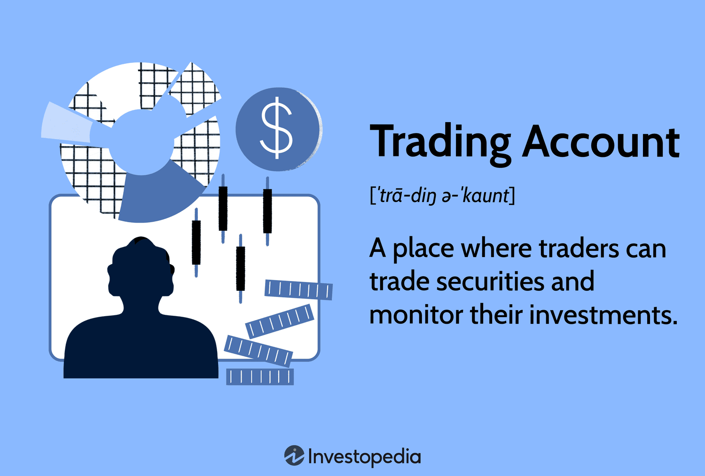

## Table of Contents

## What is a trading account and why is it important for investors?

A trading account is a special type of account that people use to buy and sell things like stocks, bonds, and other investments. It's like a tool that helps you trade in the financial markets. When you want to invest in a company, you use your trading account to buy its stocks. If you decide to sell those stocks later, you do it through the same account.

Having a trading account is important for investors because it makes trading easier and more organized. It keeps track of all your investments in one place, so you can see how they are doing. It also helps you manage risks better by letting you quickly buy or sell investments when needed. Without a trading account, it would be much harder to participate in the financial markets and grow your money.

## How do you open a trading account and what are the basic requirements?

Opening a trading account is pretty straightforward. First, you need to choose a brokerage firm or an online trading platform that suits your needs. You can do this by researching different options and comparing their fees, services, and user reviews. Once you've picked a provider, you'll need to visit their website or app and look for an option to open a new account. You'll be asked to fill out an application form with your personal details like your name, address, and contact information. Some platforms might also ask for your employment details and investment experience.

The basic requirements for opening a trading account are simple. You'll need to be at least 18 years old and have a valid government-issued ID, like a driver's license or passport. You'll also need to provide your Social Security number or another form of national identification for verification purposes. Additionally, you'll need to have a bank account so you can transfer money into and out of your trading account. Once you've submitted all the required information and it's been verified, your trading account should be ready to use, and you can start buying and selling investments.

## What types of trading accounts are available and how do they differ?

There are several types of trading accounts, and each one is designed for different kinds of investors. The most common type is a cash account, which is simple and straightforward. With a cash account, you can only trade with the money you have in the account. You deposit money, and then you can use that money to buy stocks or other investments. It's a good choice for beginners because it's easy to understand and manage.

Another type is a margin account, which lets you borrow money from your broker to buy more investments than you could with just your own money. This can increase your potential profits, but it also increases your risk because you have to pay back the borrowed money with interest. Margin accounts are more suited for experienced investors who understand the risks and rewards of using borrowed money.

There are also specialized accounts like retirement accounts (like IRAs) and education savings accounts (like 529 plans). These accounts have special tax benefits but come with rules about when and how you can use the money. For example, an IRA is meant for saving for retirement, so you can't take money out until you're a certain age without penalties. Each type of account has its own purpose and set of rules, so it's important to choose the one that fits your investment goals and needs.

## What is the role of a broker in managing a trading account?

A broker is like a helper who manages your trading account. When you want to buy or sell stocks or other investments, you tell your broker what you want to do. The broker then makes the trade happen for you. They use their special tools and connections to the stock market to buy or sell at the best possible price. Brokers also keep your account safe and make sure all the trades are done correctly.

Brokers also give you advice and information to help you make good choices about your investments. They might tell you about new stocks that could be good to buy or warn you about risks in the market. Some brokers even offer tools and research reports that you can use to learn more about investing. This can be really helpful, especially if you're new to trading and want to learn more about how to grow your money.

## How are funds deposited and withdrawn from a trading account?

To put money into your trading account, you usually start by logging into your account on the broker's website or app. You'll see an option to deposit funds, and you can choose how you want to do it. Most brokers let you use a bank transfer, which means you move money from your bank account to your trading account. Some brokers also let you use a credit or debit card, or even services like PayPal. Once you pick your method, you'll follow the steps to send the money. It might take a few days for the money to show up in your trading account, depending on the method you chose.

Taking money out of your trading account is pretty similar. You log into your account and look for the option to withdraw funds. You'll need to say how much money you want to take out and where you want it to go, usually back to your bank account. You'll follow the steps to start the withdrawal, and then you wait for the money to arrive. Just like with deposits, it can take a few days for the money to get to your bank. It's important to check with your broker to see if there are any fees for moving money in or out of your account.

## What are margin requirements and how do they affect trading?

Margin requirements are rules set by brokers that say how much money you need to have in your account before you can borrow more to trade. When you use a margin account, you're borrowing money from your broker to buy more stocks or other investments than you could with just your own money. The margin requirement is like a safety net for the broker. It makes sure you have enough money in your account to cover some of the cost of what you're buying, so if the price of your investments goes down, the broker isn't left with a big loss.

These requirements can affect your trading in a few ways. First, they limit how much you can borrow. If the margin requirement is high, you can't borrow as much money, which means you can't buy as many investments. Second, if the value of your investments goes down a lot, you might get a margin call. This means you have to put more money into your account quickly to meet the margin requirement, or the broker might sell some of your investments to cover the loan. So, margin requirements can make trading riskier because you have to manage not just your investments, but also the money you've borrowed.

## What are the risks associated with trading on margin?

Trading on margin means you're borrowing money to buy more investments than you could with just your own money. This can be risky because if the price of your investments goes down, you could lose more money than you started with. Not only do you lose the value of your investments, but you also have to pay back the money you borrowed, plus interest. If you can't pay it back, the broker might sell your investments to cover the loan, and you could end up owing even more money.

Another risk is getting a margin call. This happens if the value of your investments drops below a certain level, and you have to put more money into your account quickly to meet the margin requirement. If you can't add more money fast enough, the broker can sell your investments without asking you, which might happen at a bad time when the prices are low. This can lead to big losses and a lot of stress, especially if you're not ready for it.

## How can one manage and optimize the use of margin in a trading account?

To manage and optimize the use of margin in a trading account, it's important to keep an eye on your investments and know how much you're borrowing. You should always have a clear plan for how much risk you're willing to take. Make sure you understand the margin requirements set by your broker, so you know how much money you need to keep in your account. It's also a good idea to keep some extra money in your account as a buffer, just in case the value of your investments goes down. This way, you can avoid margin calls and the stress that comes with them.

Another way to optimize your use of margin is to use it wisely and only when you're confident in your investment choices. Don't borrow more money than you can afford to lose, and always think about how you'll pay back the loan if things don't go as planned. It can be helpful to set stop-loss orders, which automatically sell your investments if they drop to a certain price, to limit your losses. By being careful and thoughtful about how you use margin, you can make the most of it while keeping the risks under control.

## What are the regulatory requirements and compliance issues related to trading accounts?

Trading accounts are subject to rules set by government agencies like the Securities and Exchange Commission (SEC) in the United States. These rules are there to protect investors and make sure the markets are fair. When you open a trading account, you have to give your personal information and prove who you are. This is called "Know Your Customer" (KYC) rules. Brokers also have to follow "Anti-Money Laundering" (AML) rules to stop people from using trading accounts for illegal activities. If brokers don't follow these rules, they can get in big trouble, like fines or losing their license to operate.

There are also rules about how brokers handle your money and investments. They have to keep your money safe and separate from their own money. This is called "segregation of funds." Brokers also have to report any big changes in your account to the right authorities. If you're trading on margin, there are extra rules about how much you can borrow and what happens if you can't pay it back. It's important for investors to know these rules so they can make sure their broker is doing things the right way and to protect themselves from any problems.

## How does one monitor and analyze the performance of a trading account?

To keep an eye on how your trading account is doing, you can use the tools that your broker gives you. Most brokers have a dashboard or a report section where you can see all your investments and how they're doing. You can check the total value of your account, see how much money you've made or lost, and look at the prices of your stocks or other investments. It's a good idea to check this regularly, like once a week or once a month, so you know if you need to make any changes. You can also set up alerts to let you know when your investments go up or down a lot, so you don't miss anything important.

To really understand how well your trading account is doing, you need to look at some numbers. One important number is your return on investment (ROI), which tells you how much money you've made compared to what you started with. Another useful number is your risk-adjusted return, which shows how much risk you took to get your returns. You can also compare your account's performance to the overall market or to other similar investments. By looking at these numbers and comparing them, you can figure out if your trading strategy is working well or if you need to try something different.

## What advanced strategies can be employed to maximize returns in a trading account?

One advanced strategy to maximize returns in a trading account is using technical analysis. This means looking at charts and patterns to predict where stock prices might go next. You can use tools like moving averages, which help smooth out price changes over time, or indicators like the Relative Strength Index (RSI) to see if a stock is overbought or oversold. By studying these patterns and indicators, you can make smarter decisions about when to buy or sell. This can help you get in and out of trades at the best times, which can lead to bigger profits.

Another strategy is diversification, which means spreading your money across different types of investments. Instead of putting all your money into one stock or one industry, you can invest in a mix of stocks, bonds, and maybe even things like real estate or commodities. This can help lower your risk because if one investment goes down, the others might go up and balance it out. You can also use a strategy called dollar-cost averaging, where you invest a fixed amount of money at regular times, no matter what the market is doing. This can help you buy more shares when prices are low and fewer when prices are high, which can lead to better returns over time.

Lastly, you might want to try options trading, which can be a bit more complicated but can also offer bigger rewards. Options let you bet on whether a stock will go up or down without actually owning the stock. You can use options to make money from small price movements or to protect your other investments from big losses. It's important to learn a lot about options before you start, because they can be risky. But if you use them the right way, they can be a powerful tool to help you make more money in your trading account.

## How do global economic factors influence trading account strategies and performance?

Global economic factors can have a big impact on your trading account. Things like interest rates, inflation, and economic growth in different countries can change how well your investments do. For example, if the U.S. raises interest rates, it might make borrowing money more expensive, which can slow down the economy and affect stock prices. On the other hand, if a country's economy is growing fast, it might be a good time to invest in companies from that country because their stocks could go up. Keeping an eye on these global factors can help you decide when to buy or sell your investments to make the most money.

Another way global economic factors can influence your trading account is through currency exchange rates. If you're investing in stocks from other countries, the value of your investments can change based on how strong or weak the currency of that country is compared to your own. For example, if the U.S. dollar gets stronger against the euro, the value of your European stocks might go down when you convert them back to dollars. This means you need to think about not just the performance of the stocks themselves, but also how currency changes might affect your returns. By understanding these global economic factors, you can adjust your trading strategies to protect your money and maybe even make more of it.

## References & Further Reading

[1]: Bergstra, J., Bardenet, R., Bengio, Y., & Kégl, B. (2011). ["Algorithms for Hyper-Parameter Optimization."](https://dl.acm.org/doi/10.5555/2986459.2986743) Advances in Neural Information Processing Systems 24.

[2]: ["Advances in Financial Machine Learning"](https://www.amazon.com/Advances-Financial-Machine-Learning-Marcos/dp/1119482089) by Marcos Lopez de Prado

[3]: ["Evidence-Based Technical Analysis: Applying the Scientific Method and Statistical Inference to Trading Signals"](https://www.amazon.com/Evidence-Based-Technical-Analysis-Scientific-Statistical/dp/0470008741) by David Aronson

[4]: ["Machine Learning for Algorithmic Trading"](https://github.com/stefan-jansen/machine-learning-for-trading) by Stefan Jansen

[5]: ["Quantitative Trading: How to Build Your Own Algorithmic Trading Business"](https://www.amazon.com/Quantitative-Trading-Build-Algorithmic-Business/dp/1119800064) by Ernest P. Chan